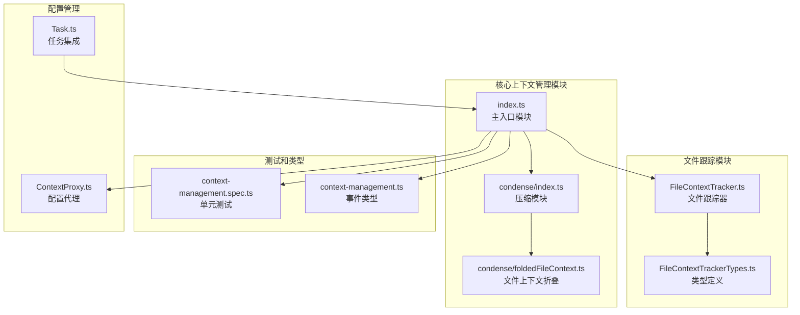
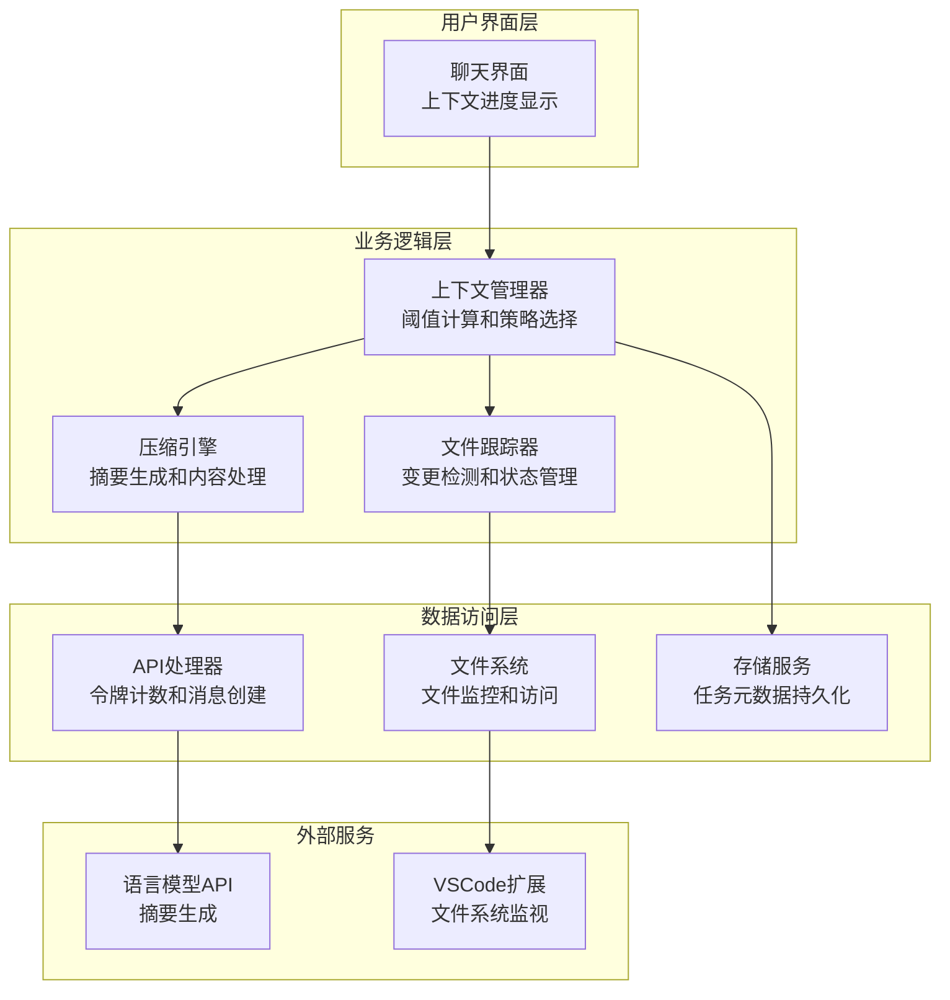
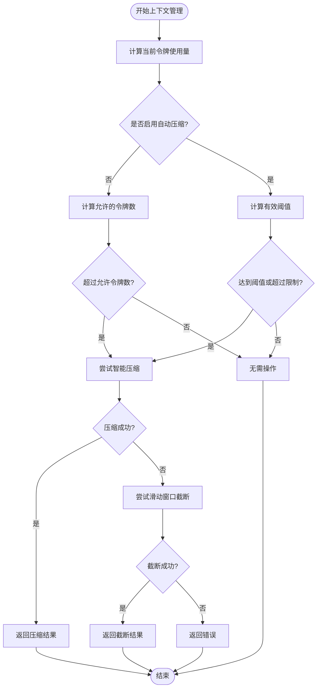
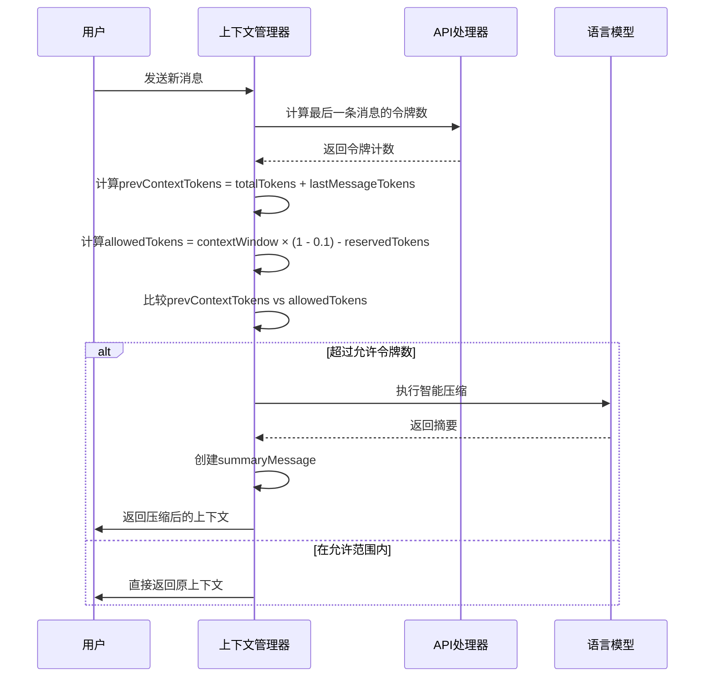
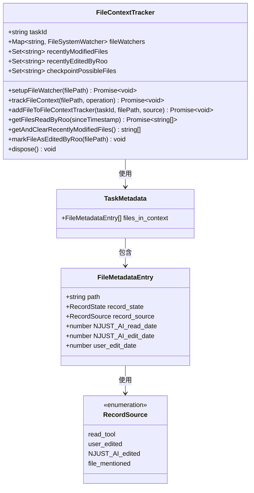
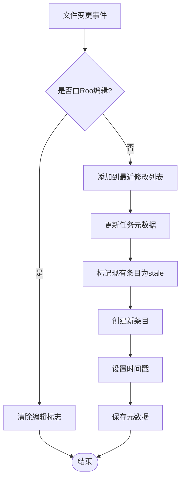
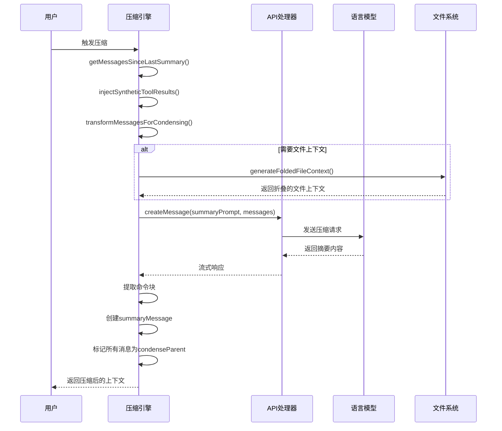
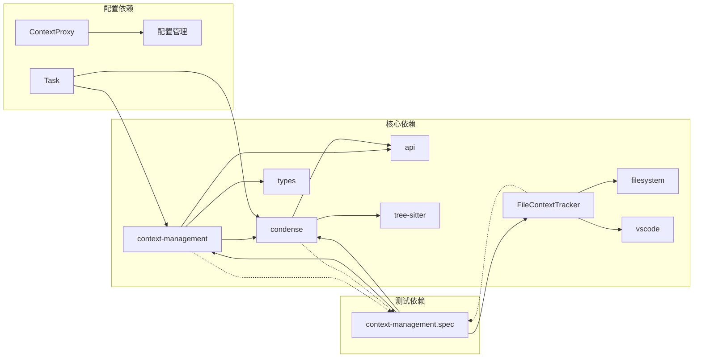
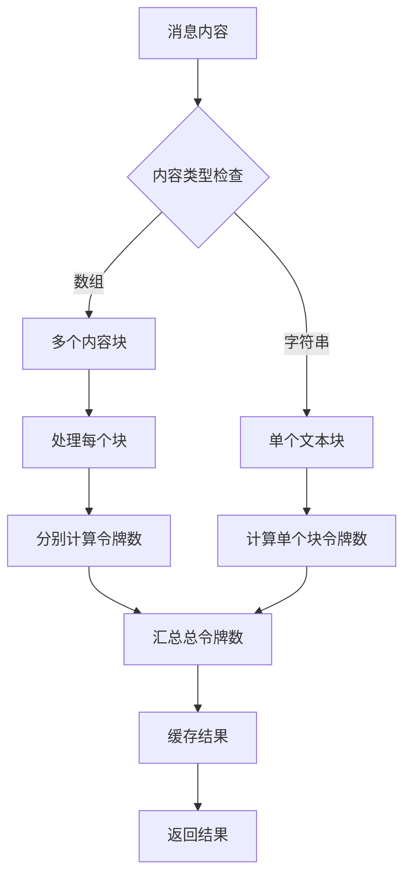
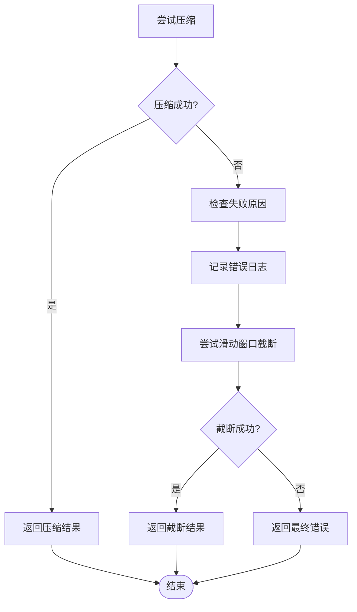

# 上下文管理

<cite>
**本文档引用的文件**
- [src/core/context-management/index.ts](file://src/core/context-management/index.ts)
- [src/core/condense/index.ts](file://src/core/condense/index.ts)
- [src/core/condense/foldedFileContext.ts](file://src/core/condense/foldedFileContext.ts)
- [src/core/context-tracking/FileContextTracker.ts](file://src/core/context-tracking/FileContextTracker.ts)
- [src/core/context-tracking/FileContextTrackerTypes.ts](file://src/core/context-tracking/FileContextTrackerTypes.ts)
- [src/core/context-management/__tests__/context-management.spec.ts](file://src/core/context-management/__tests__/context-management.spec.ts)
- [packages/types/src/context-management.ts](file://packages/types/src/context-management.ts)
- [src/core/config/ContextProxy.ts](file://src/core/config/ContextProxy.ts)
- [src/core/task/Task.ts](file://src/core/task/Task.ts)
</cite>

## 目录
1. [简介](#简介)
2. [项目结构](#项目结构)
3. [核心组件](#核心组件)
4. [架构概览](#架构概览)
5. [详细组件分析](#详细组件分析)
6. [依赖关系分析](#依赖关系分析)
7. [性能考虑](#性能考虑)
8. [故障排除指南](#故障排除指南)
9. [结论](#结论)

## 简介

上下文管理系统是Njust-AI项目中的核心功能模块，负责管理对话历史的长度限制、智能截断策略和重要信息保留算法。该系统实现了两种主要的上下文管理策略：智能压缩（基于AI摘要）和滑动窗口截断（非破坏性截断），确保在保持对话连续性的同时控制内存使用。

系统的主要特点包括：
- 智能上下文压缩：通过AI模型生成对话摘要，实现高效的上下文窗口管理
- 非破坏性滑动窗口截断：保留原始消息但标记为隐藏，支持回滚操作
- 文件上下文跟踪：监控文件变更和依赖关系，维护代码上下文的准确性
- 多层阈值控制：基于配置的触发条件和缓冲区保护机制
- 语义保留算法：在压缩过程中保持任务连续性和工作流完整性

## 项目结构

上下文管理系统主要分布在以下核心目录中：

**图表来源**
- [src/core/context-management/index.ts:1-377](file://src/core/context-management/index.ts#L1-L377)
- [src/core/condense/index.ts:1-702](file://src/core/condense/index.ts#L1-L702)
- [src/core/context-tracking/FileContextTracker.ts:1-281](file://src/core/context-tracking/FileContextTracker.ts#L1-L281)

**章节来源**
- [src/core/context-management/index.ts:1-377](file://src/core/context-management/index.ts#L1-L377)
- [src/core/condense/index.ts:1-702](file://src/core/condense/index.ts#L1-L702)
- [src/core/context-tracking/FileContextTracker.ts:1-281](file://src/core/context-tracking/FileContextTracker.ts#L1-L281)

## 核心组件

### 上下文管理器 (Context Manager)

上下文管理器是整个系统的核心协调器，负责：
- 监控上下文使用量和触发条件
- 选择合适的管理策略（压缩或截断）
- 执行智能摘要生成
- 管理阈值计算和缓冲区保护

### 压缩引擎 (Condensation Engine)

压缩引擎实现了高级的对话摘要功能：
- 工具调用块转换：将工具使用和结果转换为文本表示
- 合成工具结果注入：处理孤立的工具调用
- 命令块提取：保留活跃的工作流指令
- 文件上下文折叠：智能代码定义提取

### 文件上下文跟踪器 (File Context Tracker)

文件上下文跟踪器负责：
- 文件变更检测和监控
- 增量更新和状态管理
- 依赖关系分析和验证
- 最近读取文件的优先级排序

**章节来源**
- [src/core/context-management/index.ts:12-377](file://src/core/context-management/index.ts#L12-L377)
- [src/core/condense/index.ts:1-702](file://src/core/condense/index.ts#L1-L702)
- [src/core/context-tracking/FileContextTracker.ts:18-281](file://src/core/context-tracking/FileContextTracker.ts#L18-L281)

## 架构概览

上下文管理系统采用分层架构设计，实现了松耦合和高内聚的模块化结构：

**图表来源**
- [src/core/context-management/index.ts:247-377](file://src/core/context-management/index.ts#L247-L377)
- [src/core/condense/index.ts:256-510](file://src/core/condense/index.ts#L256-L510)
- [src/core/context-tracking/FileContextTracker.ts:48-95](file://src/core/context-tracking/FileContextTracker.ts#L48-L95)

系统的关键特性包括：

1. **智能阈值管理**：动态计算上下文使用率，避免达到模型限制
2. **多策略降级**：压缩失败时自动切换到截断策略
3. **非破坏性操作**：所有操作都是可逆的，支持回滚
4. **文件感知**：集成代码文件上下文，提高摘要质量

## 详细组件分析

### 上下文长度限制和智能截断策略

系统实现了复杂的阈值计算机制：

**图表来源**
- [src/core/context-management/index.ts:306-377](file://src/core/context-management/index.ts#L306-L377)

#### 令牌缓冲区保护机制

系统使用10%的令牌缓冲区来预防意外的令牌超限：

**图表来源**
- [src/core/context-management/index.ts:265-377](file://src/core/context-management/index.ts#L265-L377)

**章节来源**
- [src/core/context-management/index.ts:161-197](file://src/core/context-management/index.ts#L161-L197)
- [src/core/context-management/index.ts:247-377](file://src/core/context-management/index.ts#L247-L377)

### 文件上下文跟踪器实现

文件上下文跟踪器提供了完整的文件变更检测和状态管理：

**图表来源**
- [src/core/context-tracking/FileContextTracker.ts:23-281](file://src/core/context-tracking/FileContextTracker.ts#L23-L281)
- [src/core/context-tracking/FileContextTrackerTypes.ts:3-29](file://src/core/context-tracking/FileContextTrackerTypes.ts#L3-L29)

#### 文件变更检测机制

文件跟踪器实现了智能的变更检测：

**图表来源**
- [src/core/context-tracking/FileContextTracker.ts:143-200](file://src/core/context-tracking/FileContextTracker.ts#L143-L200)

**章节来源**
- [src/core/context-tracking/FileContextTracker.ts:48-95](file://src/core/context-tracking/FileContextTracker.ts#L48-L95)
- [src/core/context-tracking/FileContextTracker.ts:143-200](file://src/core/context-tracking/FileContextTracker.ts#L143-L200)

### 对话压缩和摘要生成机制

压缩引擎实现了复杂的摘要生成算法：

**图表来源**
- [src/core/condense/index.ts:256-510](file://src/core/condense/index.ts#L256-L510)

#### 智能合并和去重处理

压缩引擎实现了多种智能处理算法：

1. **工具调用块转换**：将工具使用和结果转换为文本格式
2. **合成工具结果注入**：处理孤立的工具调用，防止API拒绝
3. **命令块提取**：识别和保留活跃的工作流指令
4. **文件上下文折叠**：使用tree-sitter解析代码定义，生成结构化摘要

**章节来源**
- [src/core/condense/index.ts:102-179](file://src/core/condense/index.ts#L102-L179)
- [src/core/condense/index.ts:256-510](file://src/core/condense/index.ts#L256-L510)

### 依赖关系分析

系统各组件之间的依赖关系如下：

**图表来源**
- [src/core/context-management/index.ts:1-11](file://src/core/context-management/index.ts#L1-L11)
- [src/core/condense/index.ts:1-13](file://src/core/condense/index.ts#L1-L13)
- [src/core/context-tracking/FileContextTracker.ts:1-10](file://src/core/context-tracking/FileContextTracker.ts#L1-L10)

**章节来源**
- [src/core/context-management/index.ts:1-11](file://src/core/context-management/index.ts#L1-L11)
- [src/core/condense/index.ts:1-13](file://src/core/condense/index.ts#L1-L13)
- [src/core/context-tracking/FileContextTracker.ts:1-10](file://src/core/context-tracking/FileContextTracker.ts#L1-L10)

## 性能考虑

### 内存优化策略

系统采用了多层次的内存优化策略：

1. **非破坏性操作**：所有操作都通过标记而非删除来实现，支持回滚
2. **智能截断**：只隐藏部分消息，保留原始内容以备恢复
3. **文件上下文缓存**：使用tree-sitter解析代码定义，避免重复解析
4. **批量处理**：文件上下文生成支持批量处理，减少I/O操作

### 令牌计数优化

系统实现了高效的令牌计数机制：

**图表来源**
- [src/core/context-management/index.ts:35-41](file://src/core/context-management/index.ts#L35-L41)

### 并发处理

系统支持并发处理多个上下文操作：

1. **异步API调用**：压缩操作使用流式API，支持实时响应
2. **文件监控并发**：多个文件可以同时被监控和跟踪
3. **令牌计数并发**：多个消息可以并行计算令牌数
4. **错误隔离**：单个操作的失败不会影响其他操作

## 故障排除指南

### 常见问题和解决方案

#### 压缩失败处理

当智能压缩失败时，系统会自动降级到滑动窗口截断：

**图表来源**
- [src/core/condense/index.ts:346-386](file://src/core/condense/index.ts#L346-L386)
- [src/core/context-management/index.ts:323-330](file://src/core/context-management/index.ts#L323-L330)

#### 文件跟踪问题

文件跟踪器可能遇到的问题和解决方案：

1. **文件权限问题**：检查文件访问权限和路径有效性
2. **监控失效**：重新初始化文件系统监视器
3. **内存泄漏**：定期清理不再使用的监视器实例
4. **路径解析错误**：确保使用绝对路径进行文件操作

**章节来源**
- [src/core/condense/index.ts:346-386](file://src/core/condense/index.ts#L346-L386)
- [src/core/context-tracking/FileContextTracker.ts:92-95](file://src/core/context-tracking/FileContextTracker.ts#L92-L95)

### 调试和监控

系统提供了完善的调试和监控功能：

1. **遥测数据收集**：记录上下文管理操作的详细信息
2. **错误详情捕获**：提供详细的错误堆栈和API响应信息
3. **性能指标监控**：跟踪令牌使用量和处理时间
4. **用户反馈机制**：通过UI显示上下文使用情况和操作状态

**章节来源**
- [src/core/condense/index.ts:350-385](file://src/core/condense/index.ts#L350-L385)
- [src/core/context-management/index.ts:68-68](file://src/core/context-management/index.ts#L68-L68)

## 结论

上下文管理系统通过智能的阈值管理和多策略降级机制，实现了高效且可靠的对话历史管理。系统的核心优势包括：

1. **智能决策**：基于配置和实时令牌使用情况做出最优决策
2. **非破坏性操作**：所有操作都是可逆的，保证用户体验
3. **文件感知**：深度集成代码文件上下文，提高摘要质量
4. **性能优化**：采用多种优化策略，确保系统响应速度
5. **错误处理**：完善的错误处理和降级机制

该系统为大型对话场景提供了可靠的上下文管理解决方案，既保证了AI模型的有效输入，又维护了用户的操作体验和数据完整性。