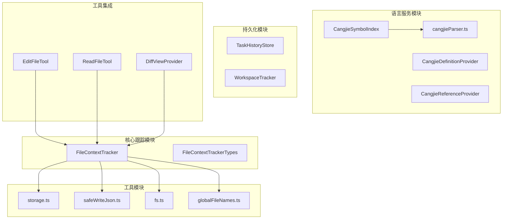
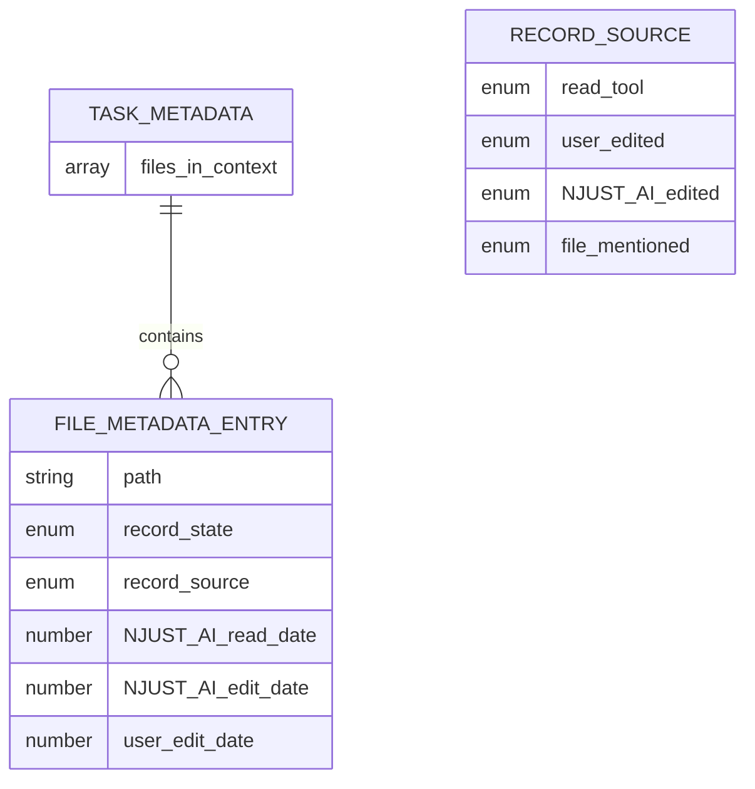
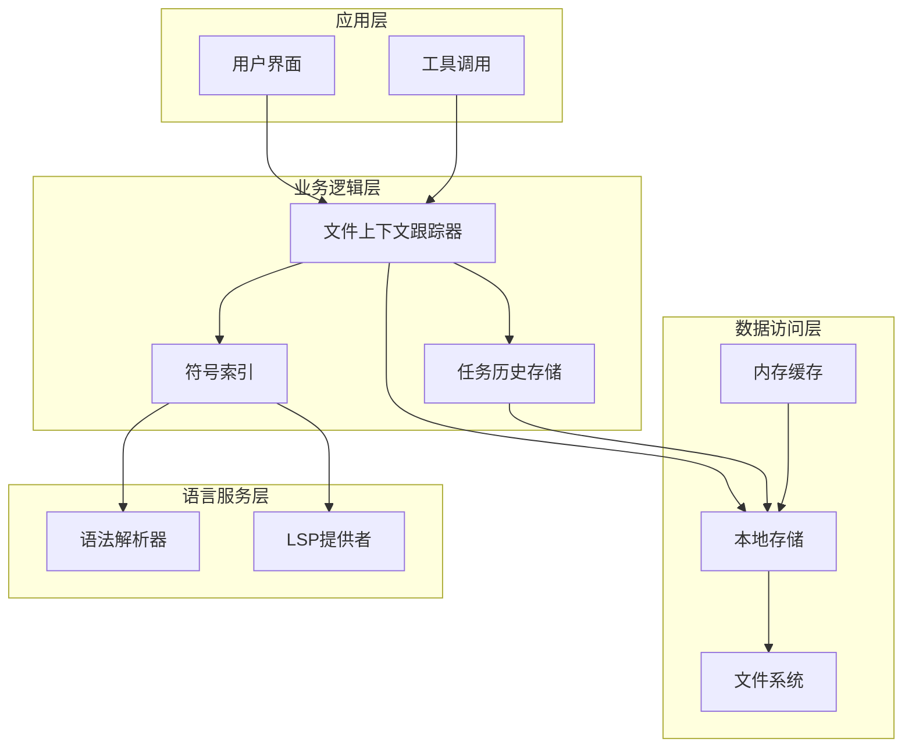
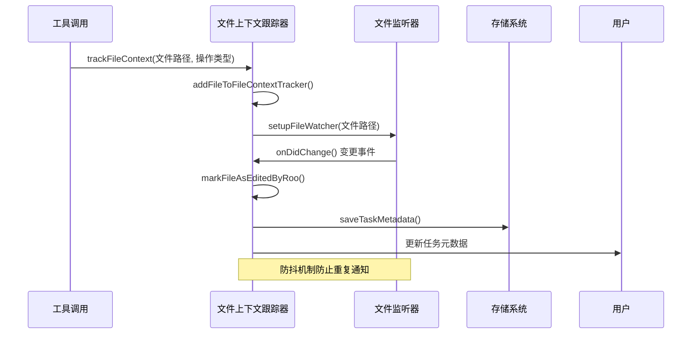
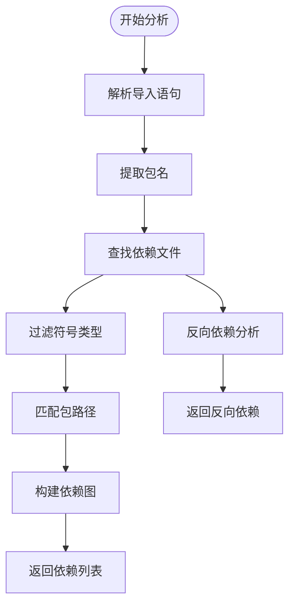
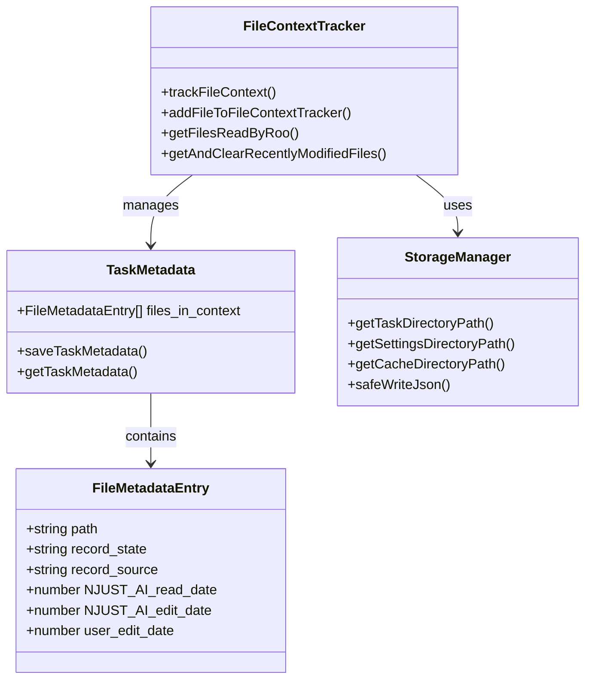
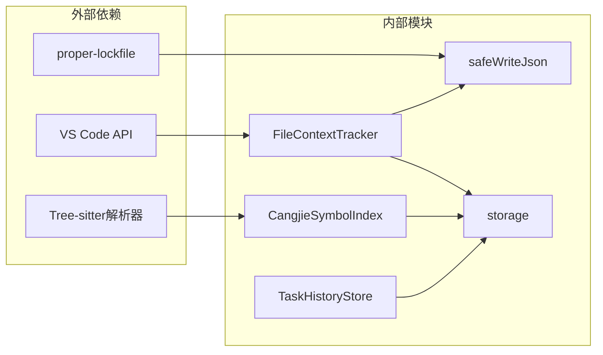

# 文件上下文跟踪

<cite>
**本文档引用的文件**
- [FileContextTracker.ts](file://src/core/context-tracking/FileContextTracker.ts)
- [FileContextTrackerTypes.ts](file://src/core/context-tracking/FileContextTrackerTypes.ts)
- [storage.ts](file://src/utils/storage.ts)
- [safeWriteJson.ts](file://src/utils/safeWriteJson.ts)
- [fs.ts](file://src/utils/fs.ts)
- [globalFileNames.ts](file://src/shared/globalFileNames.ts)
- [CangjieSymbolIndex.ts](file://src/services/cangjie-lsp/CangjieSymbolIndex.ts)
- [cangjieParser.ts](file://src/services/tree-sitter/cangjieParser.ts)
- [CangjieDefinitionProvider.ts](file://src/services/cangjie-lsp/CangjieDefinitionProvider.ts)
- [CangjieReferenceProvider.ts](file://src/services/cangjie-lsp/CangjieReferenceProvider.ts)
- [TaskHistoryStore.ts](file://src/core/task-persistence/TaskHistoryStore.ts)
- [WorkspaceTracker.ts](file://src/integrations/workspace/WorkspaceTracker.ts)
- [EditFileTool.ts](file://src/core/tools/EditFileTool.ts)
- [ReadFileTool.ts](file://src/core/tools/ReadFileTool.ts)
- [DiffViewProvider.ts](file://src/integrations/editor/DiffViewProvider.ts)
</cite>

## 目录
1. [简介](#简介)
2. [项目结构](#项目结构)
3. [核心组件](#核心组件)
4. [架构概览](#架构概览)
5. [详细组件分析](#详细组件分析)
6. [依赖分析](#依赖分析)
7. [性能考虑](#性能考虑)
8. [故障排除指南](#故障排除指南)
9. [结论](#结论)

## 简介

文件上下文跟踪系统是Njust-AI智能代码助手的核心基础设施，负责监控和管理文件变更，确保AI代理在处理代码任务时能够获得最新、准确的上下文信息。该系统实现了完整的文件变更检测机制，包括文件系统监听、增量更新、冲突解决等功能。

系统通过多种技术手段确保文件上下文的准确性：
- **实时文件监听**：基于VS Code文件系统监听器检测文件变更
- **智能状态管理**：维护文件的活动、陈旧状态，避免过期上下文
- **原子化存储**：使用安全的JSON写入机制防止数据损坏
- **依赖关系分析**：解析Cangjie语言的导入关系和符号引用
- **版本控制集成**：与Git冲突解决流程无缝集成

## 项目结构

文件上下文跟踪系统主要分布在以下模块中：

**图表来源**
- [FileContextTracker.ts:1-281](file://src/core/context-tracking/FileContextTracker.ts#L1-L281)
- [storage.ts:53-79](file://src/utils/storage.ts#L53-L79)
- [CangjieSymbolIndex.ts:1-55](file://src/services/cangjie-lsp/CangjieSymbolIndex.ts#L1-L55)

**章节来源**
- [FileContextTracker.ts:12-36](file://src/core/context-tracking/FileContextTracker.ts#L12-L36)
- [storage.ts:50-79](file://src/utils/storage.ts#L50-L79)

## 核心组件

### 文件上下文跟踪器 (FileContextTracker)

FileContextTracker是整个系统的核心组件，负责跟踪文件操作和管理文件上下文状态。

**主要职责**：
- 监控文件系统变更事件
- 维护文件元数据状态（活动/陈旧）
- 处理不同类型的文件操作记录
- 提供文件读取历史查询功能

**关键特性**：
- 使用WeakRef避免内存泄漏
- 支持多种文件操作类型：用户编辑、AI编辑、文件读取、文件提及
- 实现防抖机制防止重复通知
- 提供原子化的状态持久化

**章节来源**
- [FileContextTracker.ts:23-36](file://src/core/context-tracking/FileContextTracker.ts#L23-L36)
- [FileContextTracker.ts:143-200](file://src/core/context-tracking/FileContextTracker.ts#L143-L200)

### 文件元数据类型系统

系统使用Zod模式验证确保数据完整性，定义了完整的文件元数据结构。

**核心类型**：
- `RecordSource`: 操作来源枚举
- `FileMetadataEntry`: 单个文件的元数据条目
- `TaskMetadata`: 任务级别的文件上下文集合

**数据模型**：

**图表来源**
- [FileContextTrackerTypes.ts:10-29](file://src/core/context-tracking/FileContextTrackerTypes.ts#L10-L29)

**章节来源**
- [FileContextTrackerTypes.ts:4-29](file://src/core/context-tracking/FileContextTrackerTypes.ts#L4-L29)

### 安全存储机制

系统采用多层安全机制确保数据持久化的可靠性。

**安全特性**：
- 原子性写入：使用临时文件和重命名操作
- 并发控制：基于文件锁防止并发写入冲突
- 自动备份：目标文件存在时自动创建备份
- 错误恢复：失败时自动回滚到备份状态

**章节来源**
- [safeWriteJson.ts:35-193](file://src/utils/safeWriteJson.ts#L35-L193)
- [storage.ts:53-79](file://src/utils/storage.ts#L53-L79)

## 架构概览

文件上下文跟踪系统的整体架构采用分层设计，确保各组件职责清晰、耦合度低。

**图表来源**
- [FileContextTracker.ts:81-95](file://src/core/context-tracking/FileContextTracker.ts#L81-L95)
- [TaskHistoryStore.ts:80-100](file://src/core/task-persistence/TaskHistoryStore.ts#L80-L100)

系统通过以下关键流程实现完整的文件上下文管理：

1. **文件操作捕获**：工具调用触发文件操作记录
2. **状态更新**：更新文件元数据和状态标记
3. **变更通知**：通过文件监听器检测外部变更
4. **持久化存储**：安全地保存状态到本地存储
5. **上下文重建**：根据需要重新构建文件上下文

## 详细组件分析

### 文件变更检测机制

文件变更检测是系统的核心功能，通过多种技术手段确保及时发现和响应文件变更。

**图表来源**
- [FileContextTracker.ts:66-77](file://src/core/context-tracking/FileContextTracker.ts#L66-L77)
- [FileContextTracker.ts:143-200](file://src/core/context-tracking/FileContextTracker.ts#L143-L200)

**实现细节**：
- 使用VS Code文件系统监听器进行实时监控
- 实现防抖机制避免频繁的变更通知
- 区分用户编辑和AI编辑，防止循环通知
- 维护最近编辑文件集合，支持增量更新

**章节来源**
- [FileContextTracker.ts:48-95](file://src/core/context-tracking/FileContextTracker.ts#L48-L95)
- [FileContextTracker.ts:268-271](file://src/core/context-tracking/FileContextTracker.ts#L268-L271)

### 文件依赖关系分析算法

系统实现了完整的Cangjie语言依赖关系分析，支持复杂的导入解析和符号解析。

**图表来源**
- [CangjieSymbolIndex.ts:384-408](file://src/services/cangjie-lsp/CangjieSymbolIndex.ts#L384-L408)
- [CangjieSymbolIndex.ts:415-423](file://src/services/cangjie-lsp/CangjieSymbolIndex.ts#L415-L423)

**算法特点**：
- 支持包级导入解析
- 实现符号级别的依赖追踪
- 提供正向和反向依赖分析
- 使用路径匹配算法优化查找性能

**章节来源**
- [CangjieSymbolIndex.ts:18-42](file://src/services/cangjie-lsp/CangjieSymbolIndex.ts#L18-L42)
- [cangjieParser.ts:338-342](file://src/services/tree-sitter/cangjieParser.ts#L338-L342)

### 符号解析和作用域分析

系统使用Tree-sitter解析器进行精确的语法分析，支持复杂的作用域分析。

**解析流程**：
1. **词法分析**：识别Cangjie语言的关键字、标识符、操作符
2. **语法分析**：构建抽象语法树(AST)
3. **语义分析**：识别符号定义和引用
4. **作用域构建**：建立符号的作用域层次结构

**章节来源**
- [cangjieParser.ts:311-333](file://src/services/tree-sitter/cangjieParser.ts#L311-L333)
- [CangjieDocumentSymbolProvider.ts:76-88](file://src/services/cangjie-lsp/CangjieDocumentSymbolProvider.ts#L76-L88)

### 文件上下文存储和检索机制

系统实现了多层次的存储策略，确保文件上下文的高效存储和快速检索。

**图表来源**
- [FileContextTracker.ts:114-138](file://src/core/context-tracking/FileContextTracker.ts#L114-L138)
- [storage.ts:53-79](file://src/utils/storage.ts#L53-L79)

**存储策略**：
- **任务隔离**：每个任务拥有独立的存储空间
- **原子写入**：使用临时文件和重命名确保数据一致性
- **目录结构**：采用层级化的目录组织方式
- **缓存机制**：内存缓存提高频繁访问的性能

**章节来源**
- [FileContextTracker.ts:113-138](file://src/core/context-tracking/FileContextTracker.ts#L113-L138)
- [storage.ts:53-79](file://src/utils/storage.ts#L53-L79)

### 版本管理和一致性保证

系统通过多种机制确保文件上下文的一致性和版本控制能力。

**版本管理特性**：
- **时间戳跟踪**：精确记录每次文件操作的时间
- **状态转换**：管理文件从活动到陈旧的状态转换
- **冲突检测**：检测和处理并发编辑冲突
- **回滚机制**：支持数据损坏时的自动回滚

**章节来源**
- [FileContextTracker.ts:148-153](file://src/core/context-tracking/FileContextTracker.ts#L148-L153)
- [safeWriteJson.ts:137-182](file://src/utils/safeWriteJson.ts#L137-L182)

## 依赖分析

文件上下文跟踪系统涉及多个模块间的复杂依赖关系，以下是关键的依赖图：

**图表来源**
- [FileContextTracker.ts:1-11](file://src/core/context-tracking/FileContextTracker.ts#L1-L11)
- [CangjieSymbolIndex.ts:1-11](file://src/services/cangjie-lsp/CangjieSymbolIndex.ts#L1-L11)

**依赖关系分析**：
- FileContextTracker依赖VS Code文件系统API进行变更检测
- CangjieSymbolIndex依赖Tree-sitter解析器进行语法分析
- 所有持久化操作都通过safeWriteJson确保数据安全
- storage模块提供统一的文件系统访问接口

**章节来源**
- [FileContextTracker.ts:1-11](file://src/core/context-tracking/FileContextTracker.ts#L1-L11)
- [CangjieSymbolIndex.ts:1-11](file://src/services/cangjie-lsp/CangjieSymbolIndex.ts#L1-L11)

## 性能考虑

文件上下文跟踪系统在设计时充分考虑了性能优化，采用了多种策略确保系统的高效运行。

### 内存管理优化

**弱引用使用**：
- 使用WeakRef避免ClineProvider引用导致的内存泄漏
- 自动垃圾回收机制减少内存占用
- 避免强引用循环引用问题

**内存缓存策略**：
- 文件内容缓存减少重复读取
- 符号索引缓存提高查询性能
- 最近访问文件优先缓存

### I/O性能优化

**异步操作**：
- 所有文件操作都是异步非阻塞
- 批量写入减少磁盘I/O次数
- 流式写入处理大文件

**文件系统优化**：
- 使用相对路径减少字符串处理开销
- 合并相似的文件监听器
- 智能清理不再使用的监听器

### 并发控制

**锁机制**：
- 使用proper-lockfile防止并发写入冲突
- 基于文件的细粒度锁定
- 超时和重试机制确保锁的可靠性

**章节来源**
- [FileContextTracker.ts:25](file://src/core/context-tracking/FileContextTracker.ts#L25)
- [safeWriteJson.ts:55-79](file://src/utils/safeWriteJson.ts#L55-L79)

## 故障排除指南

### 常见问题和解决方案

**文件监听失效**：
- 检查VS Code工作区配置
- 验证文件权限设置
- 确认文件系统监听器正常初始化

**数据持久化失败**：
- 检查磁盘空间和权限
- 验证存储路径可访问性
- 查看锁文件状态

**符号解析错误**：
- 确认Tree-sitter解析器安装正确
- 检查Cangjie语言配置
- 验证语法文件完整性

### 调试支持

**日志记录**：
- 关键操作都有详细的日志记录
- 错误信息包含完整的上下文信息
- 性能指标监控和报告

**诊断工具**：
- 文件状态检查工具
- 符号索引重建工具
- 存储一致性验证工具

**章节来源**
- [FileContextTracker.ts:92-94](file://src/core/context-tracking/FileContextTracker.ts#L92-L94)
- [safeWriteJson.ts:137-182](file://src/utils/safeWriteJson.ts#L137-L182)

## 结论

文件上下文跟踪系统通过精心设计的架构和实现，成功解决了代码编辑环境中的文件上下文管理难题。系统的主要优势包括：

**技术优势**：
- 完整的文件变更检测机制
- 高效的依赖关系分析算法
- 安全可靠的存储机制
- 良好的性能和扩展性

**实用价值**：
- 支持复杂的代码编辑场景
- 提供准确的文件上下文信息
- 确保AI代理决策的准确性
- 与现有开发工具链无缝集成

该系统为Njust-AI智能代码助手提供了坚实的基础，使其能够在复杂的代码环境中为用户提供高质量的编程辅助服务。通过持续的优化和改进，系统将继续提升用户体验和开发效率。