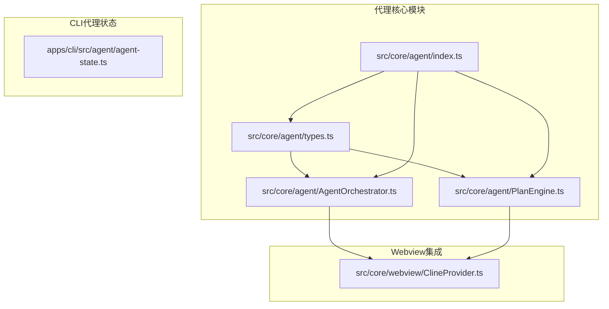
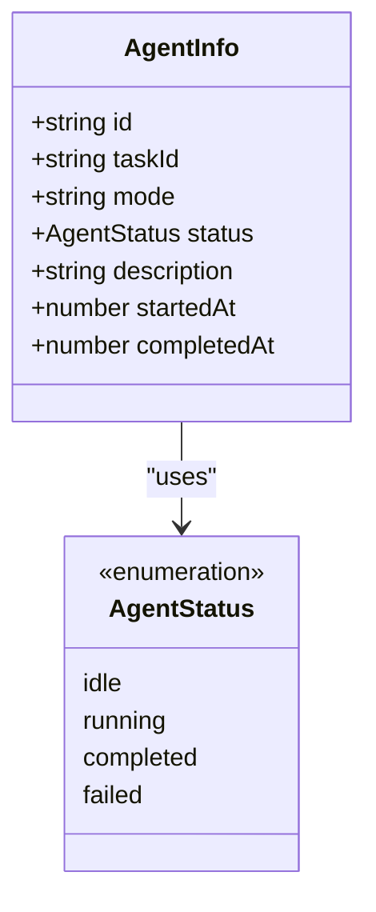
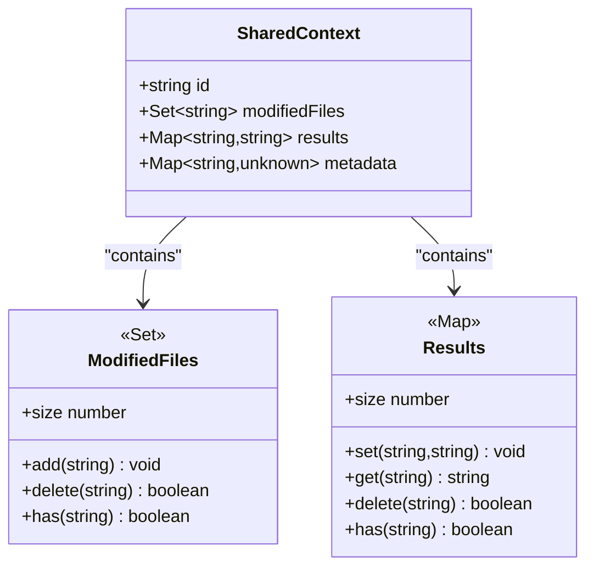
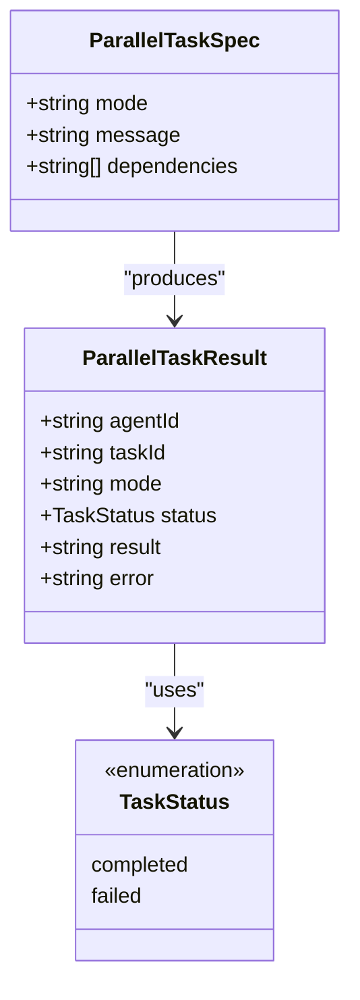
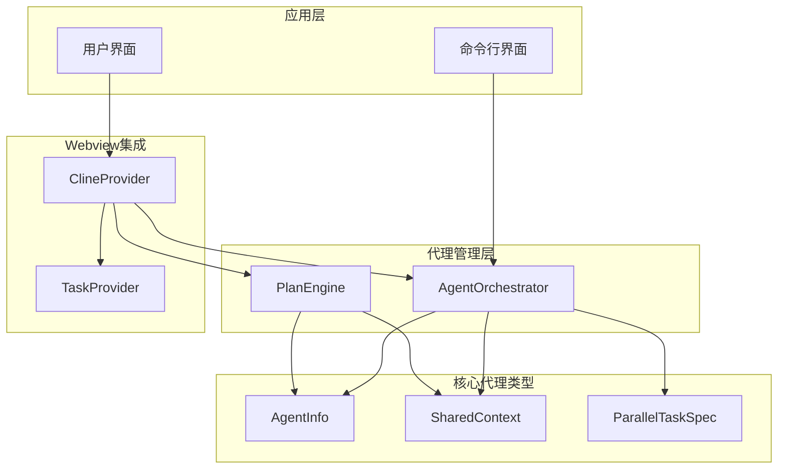
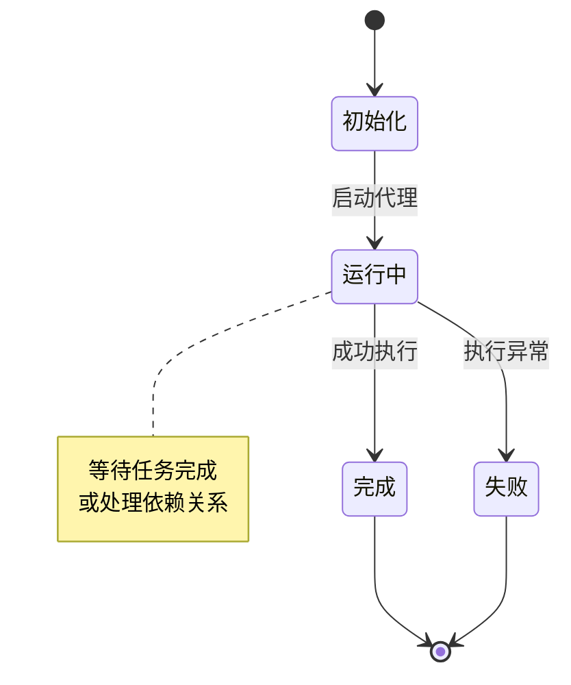
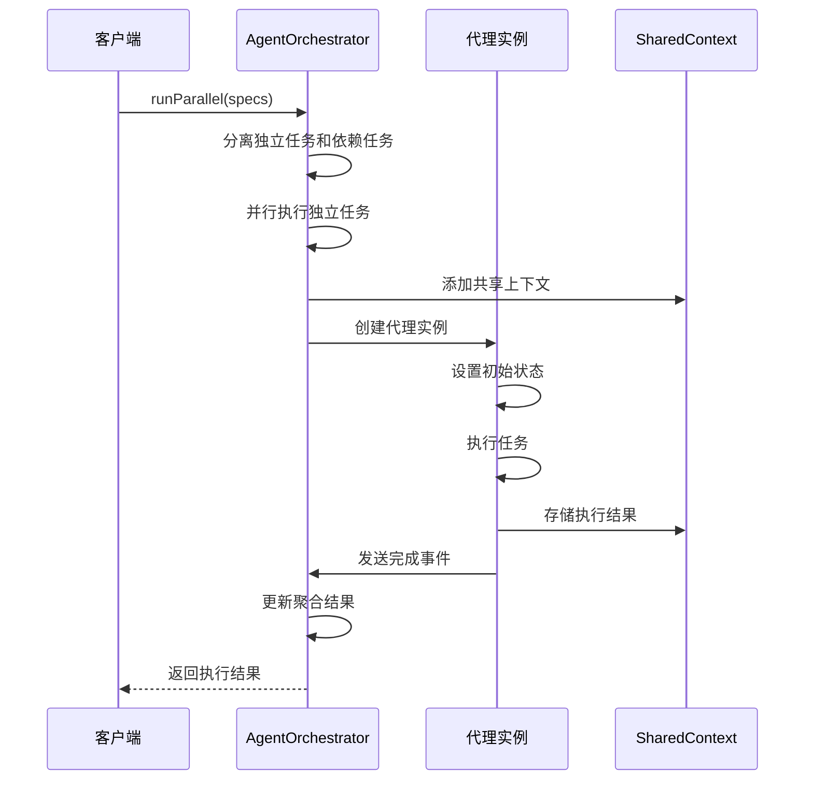
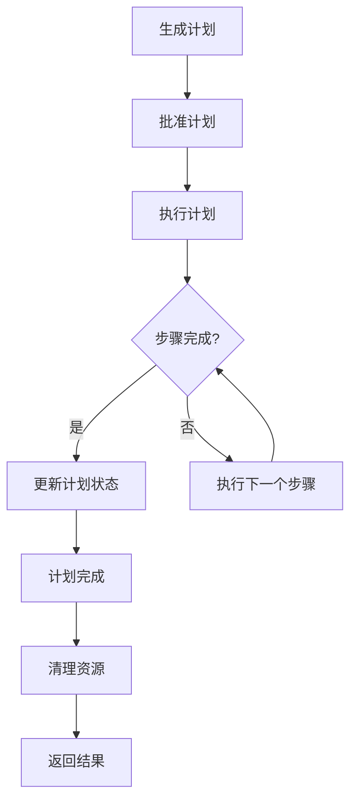
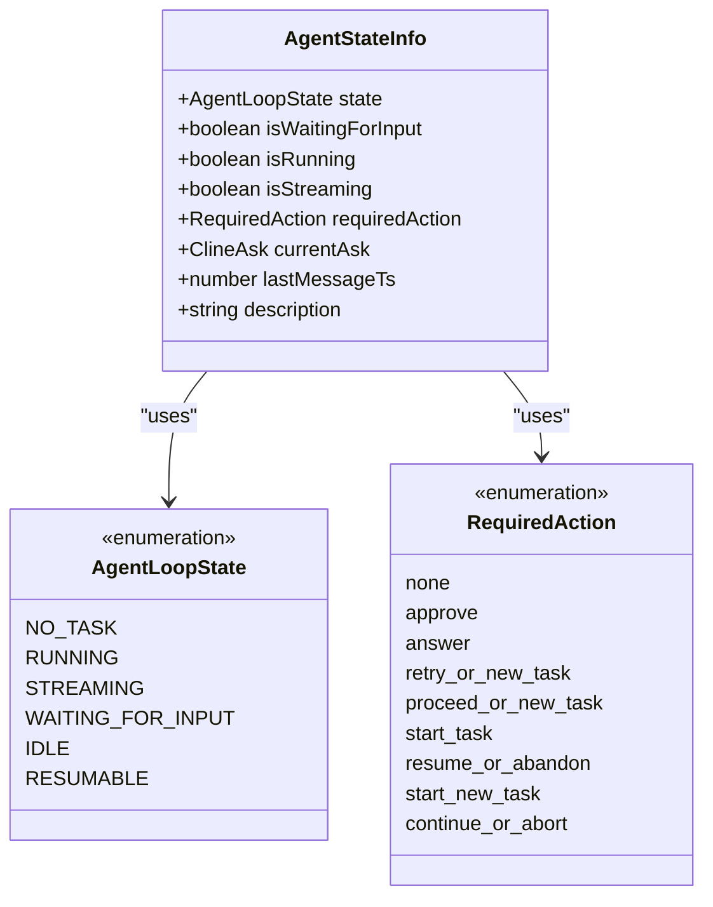
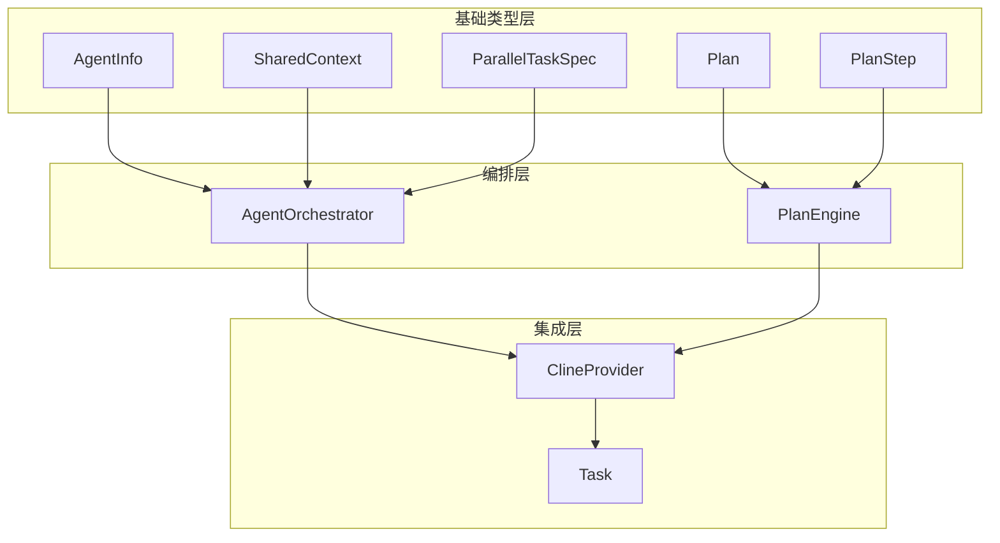

# 代理类型定义

<cite>
**本文档引用的文件**
- [types.ts](file://src/core/agent/types.ts)
- [AgentOrchestrator.ts](file://src/core/agent/AgentOrchestrator.ts)
- [PlanEngine.ts](file://src/core/agent/PlanEngine.ts)
- [agent-state.ts](file://apps/cli/src/agent/agent-state.ts)
- [index.ts](file://src/core/agent/index.ts)
- [ClineProvider.ts](file://src/core/webview/ClineProvider.ts)
</cite>

## 目录
1. [简介](#简介)
2. [项目结构](#项目结构)
3. [核心组件](#核心组件)
4. [架构概览](#架构概览)
5. [详细组件分析](#详细组件分析)
6. [依赖关系分析](#依赖关系分析)
7. [性能考虑](#性能考虑)
8. [故障排除指南](#故障排除指南)
9. [结论](#结论)

## 简介

本文档详细介绍了Njust-AI项目中代理类型定义的核心组件，包括AgentInfo、SharedContext、ParallelTaskSpec等关键类型。这些类型构成了代理系统的基础架构，支持并行任务执行、状态管理和上下文共享等功能。

代理类型定义主要位于`src/core/agent/`目录下，通过清晰的接口定义和严格的类型约束，确保了代理系统的可靠性和可维护性。

## 项目结构

代理类型定义相关的文件组织如下：

**图表来源**
- [types.ts:1-68](file://src/core/agent/types.ts#L1-L68)
- [AgentOrchestrator.ts:1-288](file://src/core/agent/AgentOrchestrator.ts#L1-L288)
- [PlanEngine.ts:1-429](file://src/core/agent/PlanEngine.ts#L1-L429)

**章节来源**
- [types.ts:1-68](file://src/core/agent/types.ts#L1-L68)
- [index.ts:1-14](file://src/core/agent/index.ts#L1-L14)

## 核心组件

### AgentInfo 类型定义

AgentInfo是代理实例的核心数据结构，用于跟踪单个代理的状态和元数据。

**图表来源**
- [types.ts:59-67](file://src/core/agent/types.ts#L59-L67)

### SharedContext 类型定义

SharedContext提供了代理间共享的上下文环境，支持文件修改跟踪、结果存储和元数据管理。

**图表来源**
- [types.ts:52-57](file://src/core/agent/types.ts#L52-L57)

### ParallelTaskSpec 类型定义

ParallelTaskSpec定义了并行任务的规格说明，支持依赖关系和模式切换。

**图表来源**
- [AgentOrchestrator.ts:9-22](file://src/core/agent/AgentOrchestrator.ts#L9-L22)

**章节来源**
- [types.ts:52-67](file://src/core/agent/types.ts#L52-L67)
- [AgentOrchestrator.ts:9-22](file://src/core/agent/AgentOrchestrator.ts#L9-L22)

## 架构概览

代理系统采用分层架构设计，通过事件驱动的方式实现代理间的协调和通信。

**图表来源**
- [AgentOrchestrator.ts:39-55](file://src/core/agent/AgentOrchestrator.ts#L39-L55)
- [PlanEngine.ts:44-52](file://src/core/agent/PlanEngine.ts#L44-L52)
- [ClineProvider.ts:218-219](file://src/core/webview/ClineProvider.ts#L218-L219)

## 详细组件分析

### AgentOrchestrator 组件

AgentOrchestrator是代理编排的核心组件，负责管理多个代理实例的并行执行。

#### 主要功能特性

1. **并行任务管理**: 支持同时运行多个代理实例
2. **依赖关系处理**: 基于依赖图的任务执行顺序控制
3. **上下文共享**: 通过SharedContext实现代理间数据共享
4. **状态监控**: 实时跟踪代理状态变化

#### 状态转换机制

**图表来源**
- [AgentOrchestrator.ts:116-176](file://src/core/agent/AgentOrchestrator.ts#L116-L176)

#### 关键方法流程

**图表来源**
- [AgentOrchestrator.ts:61-96](file://src/core/agent/AgentOrchestrator.ts#L61-L96)
- [AgentOrchestrator.ts:116-176](file://src/core/agent/AgentOrchestrator.ts#L116-L176)

**章节来源**
- [AgentOrchestrator.ts:39-287](file://src/core/agent/AgentOrchestrator.ts#L39-L287)

### PlanEngine 组件

PlanEngine实现了计划生成和执行功能，基于LLM生成结构化执行计划。

#### 计划生命周期

**图表来源**
- [PlanEngine.ts:69-111](file://src/core/agent/PlanEngine.ts#L69-L111)

#### 步骤执行策略

PlanEngine支持多种执行策略：
- **串行执行**: 逐个步骤按顺序执行
- **并行执行**: 最大并行度控制的并发执行
- **依赖管理**: 基于依赖关系的智能调度

**章节来源**
- [PlanEngine.ts:44-429](file://src/core/agent/PlanEngine.ts#L44-L429)

### 代理状态管理系统

代理状态管理通过AgentState模块实现，提供完整的状态检测和转换逻辑。

#### 状态枚举定义

**图表来源**
- [agent-state.ts:48-159](file://apps/cli/src/agent/agent-state.ts#L48-L159)

**章节来源**
- [agent-state.ts:18-464](file://apps/cli/src/agent/agent-state.ts#L18-L464)

## 依赖关系分析

代理类型定义之间的依赖关系体现了清晰的分层架构：

**图表来源**
- [types.ts:52-67](file://src/core/agent/types.ts#L52-L67)
- [AgentOrchestrator.ts:7-7](file://src/core/agent/AgentOrchestrator.ts#L7-L7)
- [PlanEngine.ts:5-12](file://src/core/agent/PlanEngine.ts#L5-L12)

### 耦合度分析

- **低耦合设计**: 各组件通过明确定义的接口进行交互
- **高内聚性**: 每个组件专注于特定的功能领域
- **事件驱动**: 通过事件机制实现松散耦合的组件通信

**章节来源**
- [index.ts:1-14](file://src/core/agent/index.ts#L1-L14)
- [ClineProvider.ts:218-219](file://src/core/webview/ClineProvider.ts#L218-L219)

## 性能考虑

### 内存管理

1. **集合类型优化**: 使用Set和Map提高查找效率
2. **对象池模式**: 重用AgentInfo和Task对象减少GC压力
3. **延迟初始化**: 按需创建和销毁代理实例

### 并发控制

1. **最大并行度限制**: 通过maxParallel参数控制并发数量
2. **超时机制**: 10分钟任务超时防止资源泄露
3. **优雅降级**: 单个任务失败不影响整体执行

### 缓存策略

1. **结果缓存**: SharedContext中的results提供跨代理结果共享
2. **上下文复用**: 通过构建共享上下文提示减少重复计算
3. **状态持久化**: 自动保存代理状态便于恢复

## 故障排除指南

### 常见问题及解决方案

#### 代理状态异常

**问题**: 代理状态卡在"running"状态
**原因**: 任务未正确完成或异常中断
**解决**: 
1. 检查任务完成信号是否正确发送
2. 验证超时机制是否正常工作
3. 查看错误日志获取具体原因

#### 并行执行失败

**问题**: 并行任务部分失败
**原因**: 依赖关系不满足或资源竞争
**解决**:
1. 验证依赖数组的正确性
2. 检查共享资源的访问权限
3. 调整最大并行度参数

#### 上下文数据丢失

**问题**: SharedContext中的数据不一致
**原因**: 并发访问冲突或内存泄漏
**解决**:
1. 使用线程安全的数据结构
2. 实施适当的同步机制
3. 定期清理过期数据

**章节来源**
- [AgentOrchestrator.ts:178-215](file://src/core/agent/AgentOrchestrator.ts#L178-L215)
- [PlanEngine.ts:201-238](file://src/core/agent/PlanEngine.ts#L201-L238)

## 结论

代理类型定义系统通过精心设计的接口和严格的类型约束，为Njust-AI项目提供了强大而灵活的代理编排能力。核心类型如AgentInfo、SharedContext、ParallelTaskSpec等构成了整个系统的基石，支持复杂的并行任务执行、智能的依赖管理和高效的上下文共享。

该系统的主要优势包括：
- **类型安全**: 通过严格类型定义防止运行时错误
- **扩展性强**: 清晰的接口设计便于功能扩展
- **性能优化**: 采用多种优化策略确保高效运行
- **可靠性高**: 完善的错误处理和恢复机制

未来可以考虑的改进方向：
- 增加更细粒度的监控指标
- 实现动态调整并行度的自适应机制
- 提供更丰富的调试工具和可视化界面