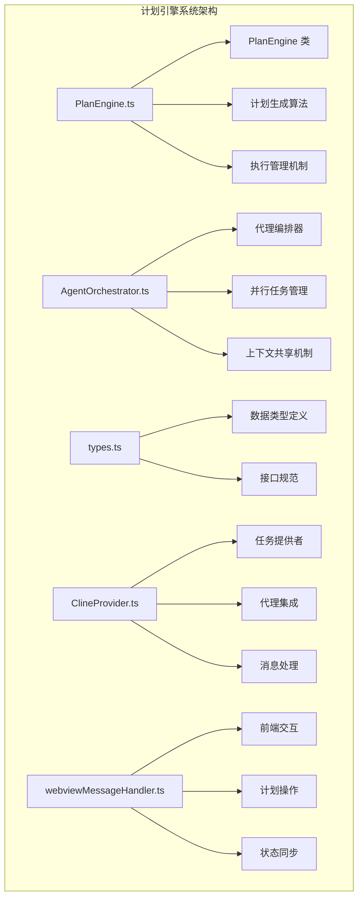
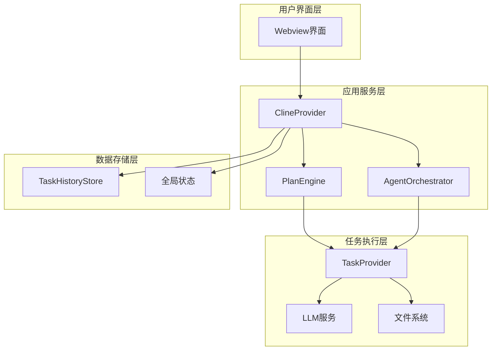
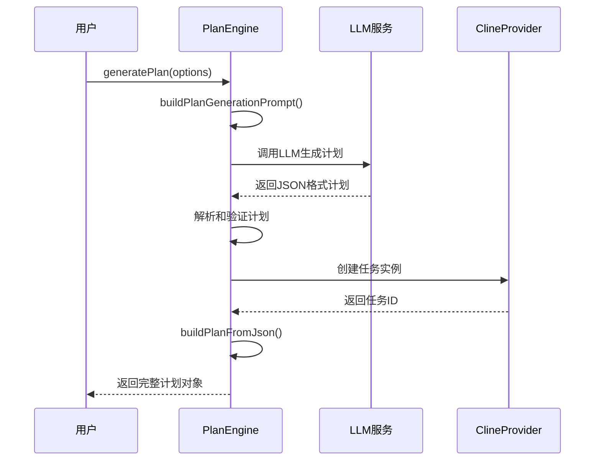
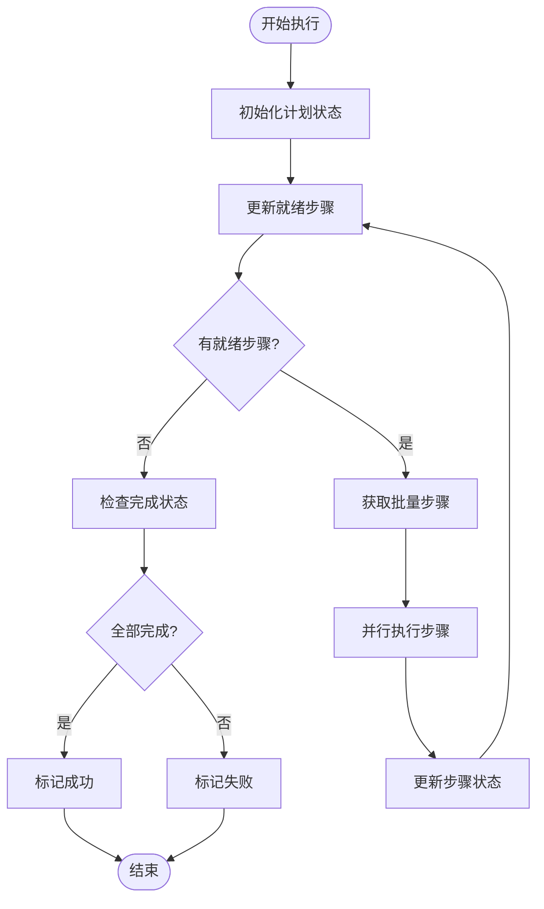
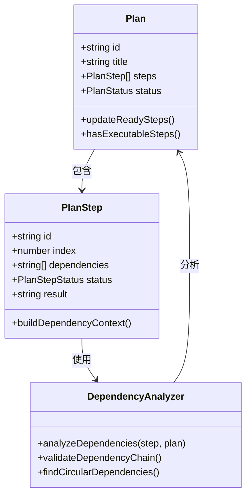
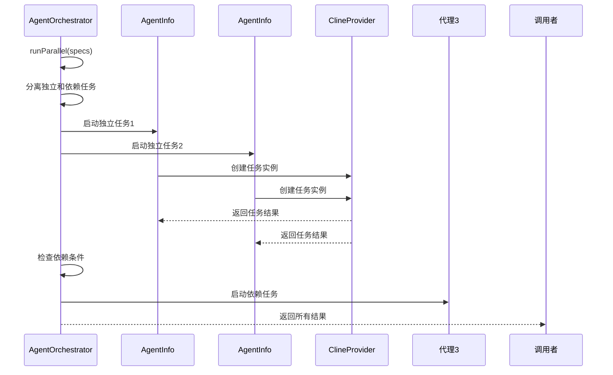
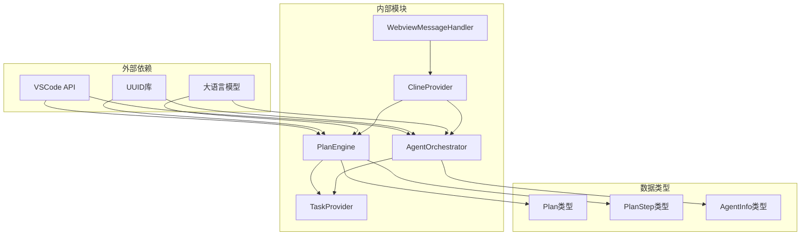

# 计划引擎系统

<cite>
**本文档引用的文件**
- [PlanEngine.ts](file://src/core/agent/PlanEngine.ts)
- [AgentOrchestrator.ts](file://src/core/agent/AgentOrchestrator.ts)
- [types.ts](file://src/core/agent/types.ts)
- [ClineProvider.ts](file://src/core/webview/ClineProvider.ts)
- [webviewMessageHandler.ts](file://src/core/webview/webviewMessageHandler.ts)
</cite>

## 目录
1. [简介](#简介)
2. [项目结构](#项目结构)
3. [核心组件](#核心组件)
4. [架构概览](#架构概览)
5. [详细组件分析](#详细组件分析)
6. [依赖关系分析](#依赖关系分析)
7. [性能考虑](#性能考虑)
8. [故障排除指南](#故障排除指南)
9. [结论](#结论)

## 简介

计划引擎系统是Njust-AI平台的核心智能代理组件，提供完整的计划生成和执行能力。该系统通过大型语言模型(LLM)生成结构化的执行计划，并通过多步骤并行执行机制实现复杂的任务自动化。

系统主要包含两个核心组件：PlanEngine（计划引擎）负责计划的生成、管理和执行，AgentOrchestrator（代理编排器）负责多代理并行任务协调。两者通过ClineProvider进行集成，形成完整的智能代理生态系统。

## 项目结构

计划引擎系统位于Njust-AI项目的`src/core/agent`目录下，采用模块化设计，包含以下关键文件：

**图表来源**
- [PlanEngine.ts:1-429](file://src/core/agent/PlanEngine.ts#L1-L429)
- [AgentOrchestrator.ts:1-288](file://src/core/agent/AgentOrchestrator.ts#L1-L288)
- [types.ts:1-68](file://src/core/agent/types.ts#L1-L68)

**章节来源**
- [PlanEngine.ts:1-52](file://src/core/agent/PlanEngine.ts#L1-L52)
- [AgentOrchestrator.ts:1-55](file://src/core/agent/AgentOrchestrator.ts#L1-L55)
- [types.ts:1-68](file://src/core/agent/types.ts#L1-L68)

## 核心组件

### PlanEngine（计划引擎）

PlanEngine是系统的核心执行组件，提供完整的计划生命周期管理：

**主要功能特性：**
- **计划生成**：基于LLM的结构化计划生成
- **依赖关系分析**：自动解析步骤间的依赖关系
- **并行执行**：支持多步骤并行处理
- **状态管理**：完整的执行状态跟踪
- **错误恢复**：自动失败处理和依赖取消

**核心数据结构：**
- `Plan`：完整计划对象，包含标题、描述、步骤列表和状态信息
- `PlanStep`：单个执行步骤，包含描述、模式、依赖关系和执行状态
- `PlanExecutionOptions`：执行配置选项，支持并发控制和回调函数

**章节来源**
- [PlanEngine.ts:44-52](file://src/core/agent/PlanEngine.ts#L44-L52)
- [types.ts:1-68](file://src/core/agent/types.ts#L1-L68)

### AgentOrchestrator（代理编排器）

AgentOrchestrator负责管理多个代理实例的并行执行，提供共享上下文和结果聚合：

**核心能力：**
- **并行任务调度**：独立和依赖性任务的智能调度
- **上下文共享**：跨代理的结果和文件修改信息共享
- **事件驱动**：完整的生命周期事件通知机制
- **资源管理**：活跃任务的统一管理和清理

**关键特性：**
- 支持依赖性任务的条件执行
- 实时共享上下文构建
- 完整的错误处理和恢复机制

**章节来源**
- [AgentOrchestrator.ts:39-55](file://src/core/agent/AgentOrchestrator.ts#L39-L55)
- [AgentOrchestrator.ts:217-238](file://src/core/agent/AgentOrchestrator.ts#L217-L238)

## 架构概览

系统采用分层架构设计，通过ClineProvider实现组件间的松耦合集成：

**图表来源**
- [ClineProvider.ts:168-219](file://src/core/webview/ClineProvider.ts#L168-L219)
- [PlanEngine.ts:49-52](file://src/core/agent/PlanEngine.ts#L49-L52)
- [AgentOrchestrator.ts:44-55](file://src/core/agent/AgentOrchestrator.ts#L44-L55)

**章节来源**
- [ClineProvider.ts:168-219](file://src/core/webview/ClineProvider.ts#L168-L219)
- [webviewMessageHandler.ts:3146-3194](file://src/core/webview/webviewMessageHandler.ts#L3146-L3194)

## 详细组件分析

### 计划生成算法

PlanEngine的计划生成算法采用两阶段设计：

**图表来源**
- [PlanEngine.ts:54-67](file://src/core/agent/PlanEngine.ts#L54-L67)
- [PlanEngine.ts:250-263](file://src/core/agent/PlanEngine.ts#L250-L263)
- [PlanEngine.ts:270-292](file://src/core/agent/PlanEngine.ts#L270-L292)

**算法特点：**
- **结构化输出**：强制LLM输出JSON格式，确保解析稳定性
- **默认回退**：解析失败时自动生成简化计划
- **依赖映射**：自动将相对索引转换为唯一ID

**章节来源**
- [PlanEngine.ts:240-268](file://src/core/agent/PlanEngine.ts#L240-L268)
- [PlanEngine.ts:294-316](file://src/core/agent/PlanEngine.ts#L294-L316)

### 执行管理机制

执行过程采用批处理和并行化策略：

**图表来源**
- [PlanEngine.ts:113-148](file://src/core/agent/PlanEngine.ts#L113-L148)
- [PlanEngine.ts:341-358](file://src/core/agent/PlanEngine.ts#L341-L358)

**执行特性：**
- **动态调度**：根据依赖关系动态确定可执行步骤
- **并发控制**：支持可配置的最大并发数
- **错误传播**：失败步骤自动取消其依赖的后续步骤

**章节来源**
- [PlanEngine.ts:113-148](file://src/core/agent/PlanEngine.ts#L113-L148)
- [PlanEngine.ts:360-367](file://src/core/agent/PlanEngine.ts#L360-L367)

### 依赖关系分析

依赖关系分析是PlanEngine的核心能力之一：

**图表来源**
- [PlanEngine.ts:341-358](file://src/core/agent/PlanEngine.ts#L341-L358)
- [PlanEngine.ts:330-339](file://src/core/agent/PlanEngine.ts#L330-L339)

**分析算法：**
- **拓扑排序**：基于依赖关系的线性排序
- **循环检测**：防止依赖环路导致的死锁
- **状态传播**：依赖完成状态的自动传播

**章节来源**
- [PlanEngine.ts:341-358](file://src/core/agent/PlanEngine.ts#L341-L358)
- [PlanEngine.ts:330-339](file://src/core/agent/PlanEngine.ts#L330-L339)

### 并行执行机制

AgentOrchestrator提供强大的并行执行能力：

**图表来源**
- [AgentOrchestrator.ts:61-96](file://src/core/agent/AgentOrchestrator.ts#L61-L96)
- [AgentOrchestrator.ts:116-176](file://src/core/agent/AgentOrchestrator.ts#L116-L176)

**并发特性：**
- **智能调度**：自动识别可并行的独立任务
- **条件执行**：依赖任务在前置任务完成后启动
- **上下文传递**：共享上下文信息在代理间传递

**章节来源**
- [AgentOrchestrator.ts:61-96](file://src/core/agent/AgentOrchestrator.ts#L61-L96)
- [AgentOrchestrator.ts:116-176](file://src/core/agent/AgentOrchestrator.ts#L116-L176)

## 依赖关系分析

系统采用清晰的依赖层次结构：

**图表来源**
- [PlanEngine.ts:1-12](file://src/core/agent/PlanEngine.ts#L1-L12)
- [AgentOrchestrator.ts:1-8](file://src/core/agent/AgentOrchestrator.ts#L1-L8)
- [ClineProvider.ts:168-170](file://src/core/webview/ClineProvider.ts#L168-L170)

**依赖特点：**
- **低耦合设计**：各组件通过接口而非具体实现依赖
- **清晰边界**：每个组件职责明确，边界清晰
- **可扩展性**：新的代理类型可通过接口扩展

**章节来源**
- [PlanEngine.ts:1-12](file://src/core/agent/PlanEngine.ts#L1-L12)
- [AgentOrchestrator.ts:1-8](file://src/core/agent/AgentOrchestrator.ts#L1-L8)

## 性能考虑

系统在设计时充分考虑了性能优化：

**内存管理：**
- 计划缓存使用Map结构，支持快速查找和删除
- 活跃任务状态通过AbortController管理，避免内存泄漏
- 及时清理已完成的计划和任务历史

**执行优化：**
- 批量执行减少任务创建开销
- 并发控制避免资源竞争
- 超时机制防止长时间阻塞

**网络优化：**
- 任务结果轮询间隔500ms，平衡响应性和资源消耗
- 10分钟超时设置，确保系统稳定性

## 故障排除指南

### 常见问题及解决方案

**计划生成失败：**
- 检查LLM连接状态和API密钥配置
- 验证输入提示词格式和长度限制
- 查看输出通道中的错误日志

**执行中断问题：**
- 检查AbortController状态
- 验证依赖关系是否正确配置
- 确认任务超时设置是否合理

**并发执行异常：**
- 检查maxParallel参数设置
- 验证代理资源是否充足
- 查看事件监听器是否正确注册

**章节来源**
- [PlanEngine.ts:93-108](file://src/core/agent/PlanEngine.ts#L93-L108)
- [AgentOrchestrator.ts:178-215](file://src/core/agent/AgentOrchestrator.ts#L178-L215)

## 结论

计划引擎系统通过精心设计的架构实现了智能任务自动化的核心能力。系统的主要优势包括：

**技术优势：**
- 完整的计划生命周期管理
- 智能的依赖关系分析和执行调度
- 强大的并行执行能力和错误恢复机制
- 清晰的模块化设计和扩展性

**应用场景：**
- 复杂软件开发任务的自动化执行
- 多步骤数据分析流程的编排
- 智能代理系统的协调管理

**未来发展：**
- 支持更复杂的任务依赖关系
- 增强学习和自适应执行能力
- 优化性能和资源利用率

该系统为Njust-AI平台提供了强大的智能代理能力，是实现复杂任务自动化的重要基础设施。