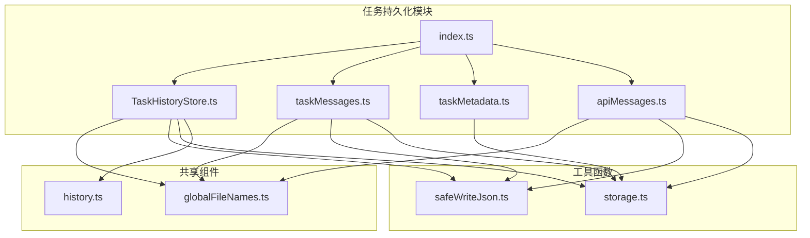
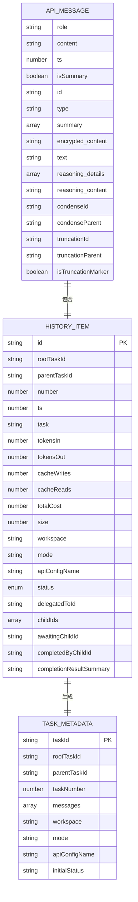
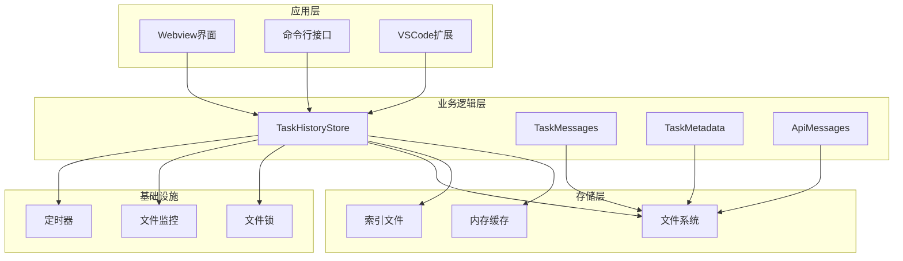
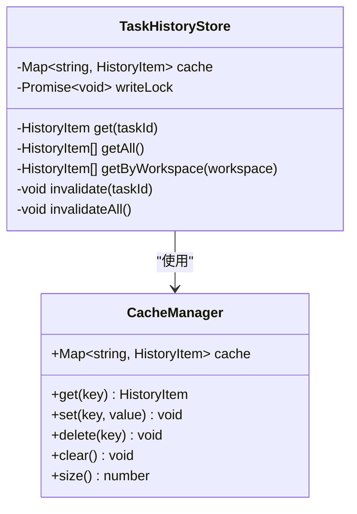
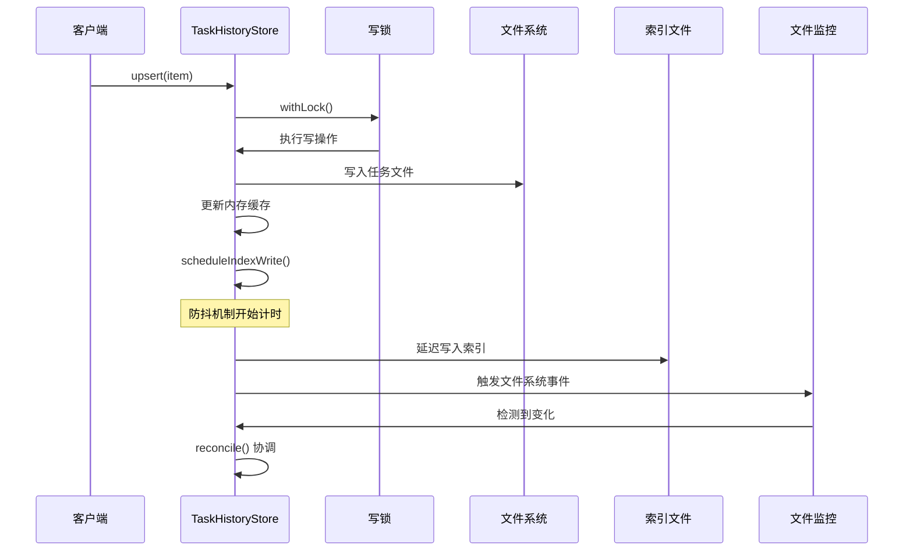
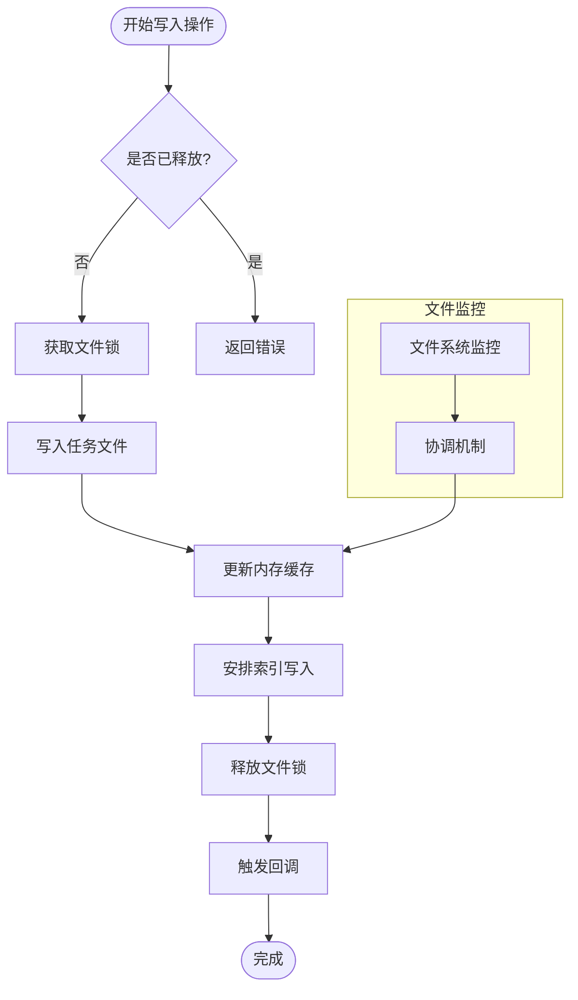

# 任务历史存储器

<cite>
**本文档引用的文件**
- [TaskHistoryStore.ts](file://src/core/task-persistence/TaskHistoryStore.ts)
- [index.ts](file://src/core/task-persistence/index.ts)
- [taskMessages.ts](file://src/core/task-persistence/taskMessages.ts)
- [taskMetadata.ts](file://src/core/task-persistence/taskMetadata.ts)
- [apiMessages.ts](file://src/core/task-persistence/apiMessages.ts)
- [globalFileNames.ts](file://src/shared/globalFileNames.ts)
- [safeWriteJson.ts](file://src/utils/safeWriteJson.ts)
- [storage.ts](file://src/utils/storage.ts)
- [history.ts](file://packages/types/src/history.ts)
</cite>

## 目录
1. [简介](#简介)
2. [项目结构](#项目结构)
3. [核心组件](#核心组件)
4. [架构概览](#架构概览)
5. [详细组件分析](#详细组件分析)
6. [依赖关系分析](#依赖关系分析)
7. [性能考虑](#性能考虑)
8. [故障排除指南](#故障排除指南)
9. [结论](#结论)

## 简介

任务历史存储器（TaskHistoryStore）是Njust-AI项目中负责管理任务历史数据的核心组件。它实现了高效的任务数据持久化、内存缓存策略和跨进程一致性保证。该存储器采用分层存储架构，将每个任务的历史项存储为独立的JSON文件，并维护一个索引文件以支持快速启动时的列表读取。

主要特性包括：
- **分层存储架构**：每个任务单独存储在独立文件中，避免单点故障
- **智能缓存系统**：基于内存Map的缓存策略，支持快速读取
- **跨进程安全**：使用文件锁确保多实例间的写入安全
- **自动恢复机制**：通过文件系统监控和定期协调保持数据一致性
- **性能优化**：防抖机制减少频繁写入操作

## 项目结构

任务历史存储器位于核心任务持久化模块中，与相关的消息管理和元数据处理组件协同工作：



**图表来源**
- [TaskHistoryStore.ts:1-573](file://src/core/task-persistence/TaskHistoryStore.ts#L1-L573)
- [index.ts:1-5](file://src/core/task-persistence/index.ts#L1-L5)

**章节来源**
- [TaskHistoryStore.ts:1-573](file://src/core/task-persistence/TaskHistoryStore.ts#L1-L573)
- [index.ts:1-5](file://src/core/task-persistence/index.ts#L1-L5)

## 核心组件

### TaskHistoryStore 类

TaskHistoryStore 是整个任务历史存储系统的核心类，提供了完整的CRUD操作和生命周期管理：

#### 主要属性
- `cache`: 内存映射缓存，存储所有历史项
- `writeLock`: Promise链式锁，确保写操作串行化
- `indexWriteTimer`: 防抖定时器，延迟索引写入
- `fsWatcher`: 文件系统监控器，检测外部变化
- `reconcileTimer`: 定期协调定时器，维护数据一致性

#### 关键方法
- `initialize()`: 初始化存储器，加载索引并启动监控
- `upsert()`: 插入或更新历史项
- `delete()`: 删除单个任务的历史
- `deleteMany()`: 批量删除任务历史
- `getAll()`: 获取所有历史项（按时间排序）
- `getByWorkspace()`: 按工作区过滤历史项

**章节来源**
- [TaskHistoryStore.ts:44-74](file://src/core/task-persistence/TaskHistoryStore.ts#L44-L74)
- [TaskHistoryStore.ts:154-234](file://src/core/task-persistence/TaskHistoryStore.ts#L154-L234)

### 数据模型定义

任务历史存储器使用标准化的数据模型来确保数据的一致性和完整性：



**图表来源**
- [history.ts:7-31](file://packages/types/src/history.ts#L7-L31)

**章节来源**
- [history.ts:1-32](file://packages/types/src/history.ts#L1-L32)

## 架构概览

任务历史存储器采用分层架构设计，确保高可用性和可扩展性：



**图表来源**
- [TaskHistoryStore.ts:20-31](file://src/core/task-persistence/TaskHistoryStore.ts#L20-L31)
- [safeWriteJson.ts:35-193](file://src/utils/safeWriteJson.ts#L35-L193)

### 存储策略

系统采用混合存储策略，平衡性能和可靠性：

1. **任务级文件存储**：每个任务单独存储在独立的JSON文件中
2. **索引文件缓存**：维护全局索引以支持快速列表读取
3. **内存缓存层**：提供最快的访问速度
4. **文件系统监控**：检测跨实例的变化

**章节来源**
- [TaskHistoryStore.ts:20-31](file://src/core/task-persistence/TaskHistoryStore.ts#L20-L31)
- [TaskHistoryStore.ts:367-433](file://src/core/task-persistence/TaskHistoryStore.ts#L367-L433)

## 详细组件分析

### 内存缓存策略

TaskHistoryStore 实现了高效的内存缓存机制，通过Map数据结构提供O(1)的查找性能：



**图表来源**
- [TaskHistoryStore.ts:47](file://src/core/task-persistence/TaskHistoryStore.ts#L47)
- [TaskHistoryStore.ts:134-150](file://src/core/task-persistence/TaskHistoryStore.ts#L134-L150)

#### 缓存失效策略

缓存系统支持多种失效策略以确保数据一致性：

1. **主动失效**：通过 `invalidate()` 方法手动刷新特定任务
2. **批量失效**：通过 `invalidateAll()` 清空整个缓存
3. **被动失效**：通过文件系统监控自动检测变化

**章节来源**
- [TaskHistoryStore.ts:297-315](file://src/core/task-persistence/TaskHistoryStore.ts#L297-L315)

### 持久化触发机制

系统实现了多层次的持久化触发机制，确保数据可靠存储：



**图表来源**
- [TaskHistoryStore.ts:160-184](file://src/core/task-persistence/TaskHistoryStore.ts#L160-L184)
- [TaskHistoryStore.ts:404-421](file://src/core/task-persistence/TaskHistoryStore.ts#L404-L421)

#### 防抖机制

系统使用防抖技术减少频繁写入操作：

- **默认延迟**：2秒防抖窗口
- **批量合并**：多个快速连续的写入被合并为一次
- **资源保护**：避免磁盘I/O过载

**章节来源**
- [TaskHistoryStore.ts:62](file://src/core/task-persistence/TaskHistoryStore.ts#L62)
- [TaskHistoryStore.ts:404-421](file://src/core/task-persistence/TaskHistoryStore.ts#L404-L421)

### 跨进程一致性

TaskHistoryStore 通过多种机制确保跨进程的一致性：



**图表来源**
- [TaskHistoryStore.ts:538-545](file://src/core/task-persistence/TaskHistoryStore.ts#L538-L545)
- [safeWriteJson.ts:54-79](file://src/utils/safeWriteJson.ts#L54-L79)

#### 文件锁机制

使用 `proper-lockfile` 实现跨进程文件锁：

- **互斥访问**：确保同一时间只有一个进程可以写入
- **死锁预防**：设置合理的超时和重试机制
- **崩溃恢复**：自动清理损坏的锁文件

**章节来源**
- [safeWriteJson.ts:54-79](file://src/utils/safeWriteJson.ts#L54-L79)
- [TaskHistoryStore.ts:538-545](file://src/core/task-persistence/TaskHistoryStore.ts#L538-L545)

### 数据压缩优化

系统实现了多种数据压缩和优化策略：

#### JSON流式写入

使用 `JsonStreamStringify` 实现流式JSON序列化：

- **内存效率**：避免将整个对象加载到内存
- **大文件处理**：支持大型历史记录的高效写入
- **格式控制**：支持缩进和紧凑两种格式

#### 目录大小缓存

使用 `node-cache` 缓存目录大小计算结果：

- **缓存策略**：30秒TTL，5分钟检查周期
- **性能提升**：避免重复计算目录大小
- **内存管理**：自动清理过期缓存

**章节来源**
- [safeWriteJson.ts:202-221](file://src/utils/safeWriteJson.ts#L202-L221)
- [taskMetadata.ts:13](file://src/core/task-persistence/taskMetadata.ts#L13)
- [taskMetadata.ts:78-89](file://src/core/task-persistence/taskMetadata.ts#L78-L89)

### 任务消息存储

系统提供了专门的消息存储组件，支持不同类型的消息：

#### UI消息存储

UI消息存储在 `ui_messages.json` 文件中：

- **消息格式**：ClineMessage 数组
- **实时同步**：支持UI界面的实时消息显示
- **错误处理**：完善的解析和验证机制

#### API消息存储

API消息存储在 `api_conversation_history.json` 文件中：

- **兼容性**：支持多种AI提供商的消息格式
- **增强字段**：支持推理内容、截断标记等高级功能
- **向后兼容**：自动迁移旧格式文件

**章节来源**
- [taskMessages.ts:17-44](file://src/core/task-persistence/taskMessages.ts#L17-L44)
- [apiMessages.ts:40-107](file://src/core/task-persistence/apiMessages.ts#L40-L107)

### 任务元数据存储

任务元数据通过 `taskMetadata` 函数生成，包含丰富的统计信息：

#### 时间戳管理

- **智能选择**：从最后相关消息中提取时间戳
- **默认值**：无消息时使用当前时间
- **一致性**：确保时间戳的单调性

#### 统计指标计算

系统自动计算以下统计指标：

- **Token使用量**：输入输出Token数量
- **缓存统计**：缓存读写次数
- **成本计算**：基于API定价的总成本
- **存储统计**：任务目录大小

**章节来源**
- [taskMetadata.ts:30-118](file://src/core/task-persistence/taskMetadata.ts#L30-L118)

## 依赖关系分析

任务历史存储器的依赖关系清晰且模块化：

```mermaid
graph TB
subgraph "核心依赖"
TYPES[@njust-ai/types]
NODE_CACHE[node-cache]
PROPER_LOCKFILE[proper-lockfile]
JSON_STREAM_STRINGIFY[json-stream-stringify]
end
subgraph "内部依赖"
SAFE_WRITE_JSON[safeWriteJson]
STORAGE[storage]
GLOBAL_FILE_NAMES[globalFileNames]
end
subgraph "系统依赖"
FS[fs/promises]
PATH[path]
FS_SYNC[fs]
end
THS[TaskHistoryStore] --> TYPES
THS --> SAFE_WRITE_JSON
THS --> STORAGE
THS --> GLOBAL_FILE_NAMES
THS --> FS
THS --> PATH
THS --> FS_SYNC
SAFE_WRITE_JSON --> PROPER_LOCKFILE
SAFE_WRITE_JSON --> JSON_STREAM_STRINGIFY
TMD[taskMetadata] --> NODE_CACHE
```

**图表来源**
- [TaskHistoryStore.ts:1-10](file://src/core/task-persistence/TaskHistoryStore.ts#L1-L10)
- [safeWriteJson.ts:1-6](file://src/utils/safeWriteJson.ts#L1-L6)

### 外部依赖分析

系统对外部依赖的使用遵循最小化原则：

- **@njust-ai/types**：仅用于类型定义，不引入运行时代码
- **node-cache**：轻量级缓存库，无额外运行时依赖
- **proper-lockfile**：可靠的文件锁解决方案
- **json-stream-stringify**：高效的JSON流式处理

**章节来源**
- [TaskHistoryStore.ts:1-10](file://src/core/task-persistence/TaskHistoryStore.ts#L1-L10)
- [safeWriteJson.ts:1-6](file://src/utils/safeWriteJson.ts#L1-L6)

## 性能考虑

### 内存使用优化

系统通过多种策略优化内存使用：

1. **惰性加载**：只在需要时加载任务文件
2. **缓存淘汰**：合理设置缓存大小和TTL
3. **增量更新**：避免全量重新加载

### I/O性能优化

- **批量写入**：合并多个写入操作
- **异步处理**：非阻塞的文件操作
- **流式处理**：大文件的流式读写

### 并发控制

- **写锁机制**：确保写操作的串行化
- **读写分离**：读操作不阻塞写操作
- **超时控制**：防止长时间阻塞

## 故障排除指南

### 常见问题及解决方案

#### 文件锁冲突

**症状**：写入操作长时间阻塞或失败

**原因**：
- 其他进程持有文件锁
- 锁文件损坏或未正确释放

**解决方案**：
1. 检查是否有其他实例正在运行
2. 手动删除 `.lock` 文件
3. 重启应用程序

#### 索引文件损坏

**症状**：历史记录无法正确加载或显示

**原因**：
- 索引文件格式错误
- 文件写入过程中断

**解决方案**：
1. 备份当前索引文件
2. 删除损坏的索引文件
3. 系统会自动重建索引

#### 目录权限问题

**症状**：无法创建或写入任务目录

**原因**：
- 目标目录没有写权限
- 自定义存储路径不可访问

**解决方案**：
1. 检查目录权限设置
2. 使用默认存储路径
3. 重新配置自定义路径

**章节来源**
- [safeWriteJson.ts:137-181](file://src/utils/safeWriteJson.ts#L137-L181)
- [TaskHistoryStore.ts:490-503](file://src/core/task-persistence/TaskHistoryStore.ts#L490-L503)

### 调试和监控

系统提供了完善的错误处理和日志记录机制：

- **详细错误信息**：每个操作都有明确的错误描述
- **异常恢复**：自动处理大部分可恢复的错误
- **状态监控**：通过日志跟踪系统状态

**章节来源**
- [TaskHistoryStore.ts:417](file://src/core/task-persistence/TaskHistoryStore.ts#L417)
- [safeWriteJson.ts:138-155](file://src/utils/safeWriteJson.ts#L138-L155)

## 结论

任务历史存储器是一个设计精良、功能完备的任务数据管理系统。它通过分层存储架构、智能缓存策略和跨进程一致性保证，为Njust-AI项目提供了可靠的任务历史管理能力。

### 主要优势

1. **高可靠性**：多重备份和恢复机制确保数据安全
2. **高性能**：内存缓存和流式处理提供优异的性能表现
3. **可扩展性**：模块化设计支持未来的功能扩展
4. **易用性**：简洁的API和完善的错误处理

### 技术亮点

- **创新的存储架构**：每个任务独立存储，避免单点故障
- **智能缓存系统**：平衡内存使用和访问性能
- **跨进程安全**：使用文件锁确保多实例一致性
- **自动恢复机制**：通过监控和协调保持数据同步

这个组件为整个Njust-AI系统的任务管理提供了坚实的基础，是项目架构中的关键一环。