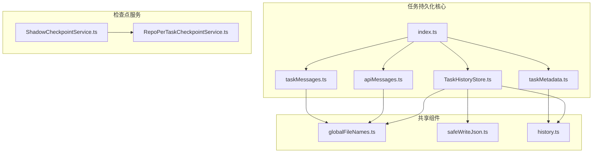
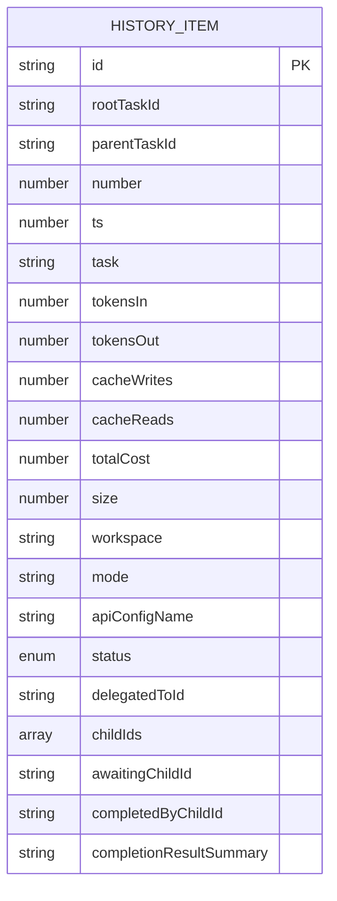
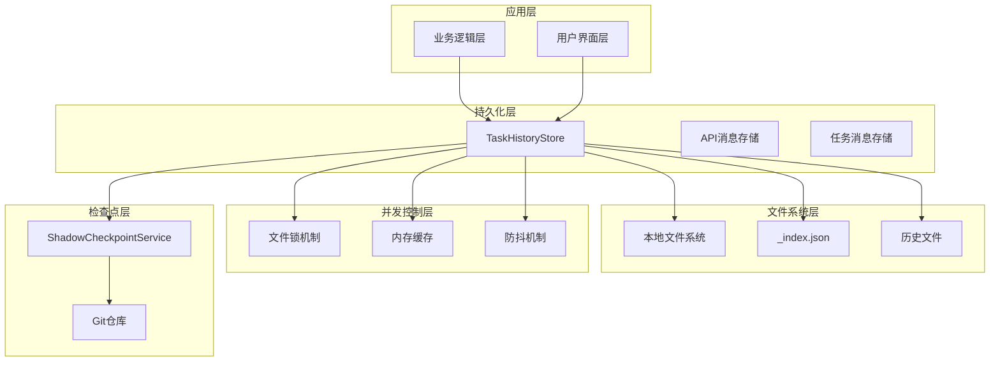
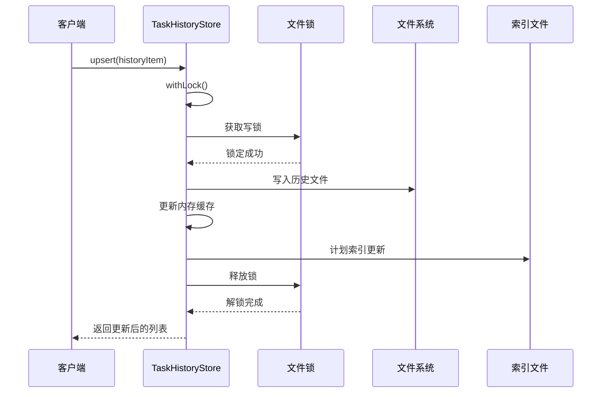
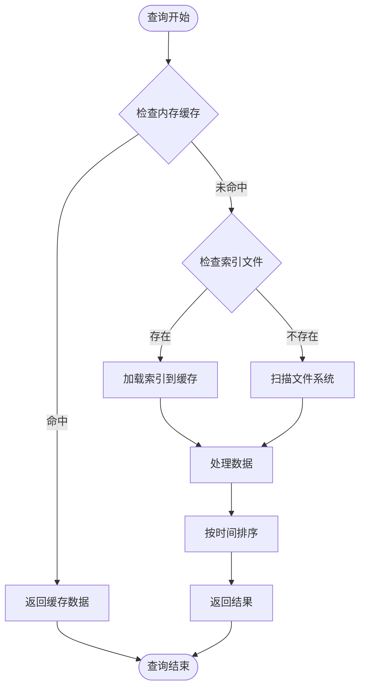
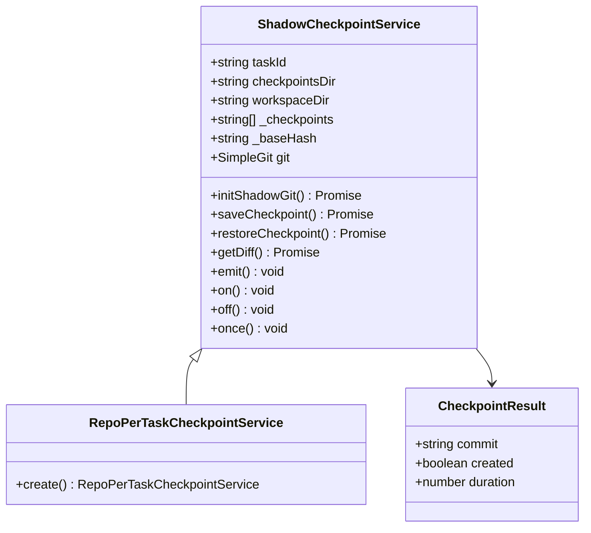
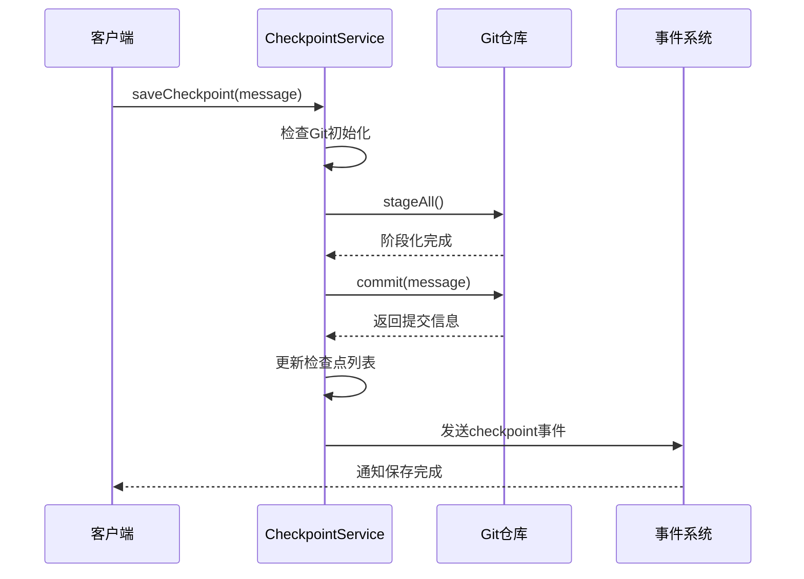
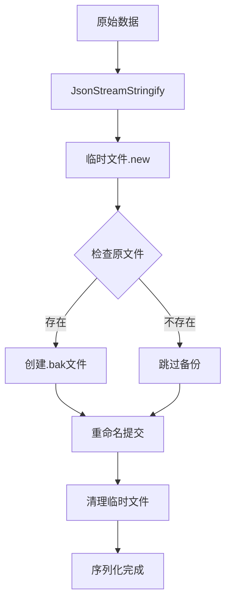
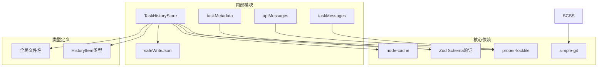

# 任务持久化系统

<cite>
**本文档引用的文件**
- [TaskHistoryStore.ts](file://src/core/task-persistence/TaskHistoryStore.ts)
- [taskMetadata.ts](file://src/core/task-persistence/taskMetadata.ts)
- [apiMessages.ts](file://src/core/task-persistence/apiMessages.ts)
- [taskMessages.ts](file://src/core/task-persistence/taskMessages.ts)
- [index.ts](file://src/core/task-persistence/index.ts)
- [history.ts](file://packages/types/src/history.ts)
- [globalFileNames.ts](file://src/shared/globalFileNames.ts)
- [safeWriteJson.ts](file://src/utils/safeWriteJson.ts)
- [ShadowCheckpointService.ts](file://src/services/checkpoints/ShadowCheckpointService.ts)
- [RepoPerTaskCheckpointService.ts](file://src/services/checkpoints/RepoPerTaskCheckpointService.ts)
</cite>

## 目录
1. [简介](#简介)
2. [项目结构](#项目结构)
3. [核心组件](#核心组件)
4. [架构概览](#架构概览)
5. [详细组件分析](#详细组件分析)
6. [依赖关系分析](#依赖关系分析)
7. [性能考虑](#性能考虑)
8. [故障排除指南](#故障排除指南)
9. [结论](#结论)

## 简介

任务持久化系统是Njust-AI平台的核心基础设施，负责存储和管理AI代理任务的完整生命周期数据。该系统采用分布式文件存储架构，将每个任务的历史记录分解为独立的JSON文件，同时维护一个索引文件以支持快速启动读取。

系统主要包含三个核心数据域：
- **任务历史数据**：存储任务元数据、状态信息和统计指标
- **API调用记录**：保存与外部AI服务的对话历史
- **UI消息历史**：记录用户界面交互消息

该系统实现了高级的并发安全机制、自动数据恢复和增量持久化功能，确保在多实例环境下的一致性和可靠性。

## 项目结构

任务持久化系统位于`src/core/task-persistence/`目录下，采用模块化设计：

**图表来源**
- [TaskHistoryStore.ts:1-573](file://src/core/task-persistence/TaskHistoryStore.ts#L1-L573)
- [index.ts:1-5](file://src/core/task-persistence/index.ts#L1-L5)

**章节来源**
- [TaskHistoryStore.ts:1-573](file://src/core/task-persistence/TaskHistoryStore.ts#L1-L573)
- [index.ts:1-5](file://src/core/task-persistence/index.ts#L1-L5)

## 核心组件

### TaskHistoryStore类

TaskHistoryStore是整个持久化系统的核心，负责管理所有任务历史数据的存储和检索。

#### 主要特性
- **分布式文件存储**：每个任务单独存储为JSON文件
- **内存缓存**：使用Map结构缓存最近访问的任务数据
- **交叉进程锁**：通过proper-lockfile确保并发安全
- **自动索引维护**：维护_index.json文件以支持快速启动

#### 关键接口
- `initialize()`：初始化存储系统
- `upsert(item)`：插入或更新任务历史项
- `delete(taskId)`：删除单个任务
- `getAll()`：获取所有任务历史
- `reconcile()`：数据一致性校验和修复

**章节来源**
- [TaskHistoryStore.ts:44-100](file://src/core/task-persistence/TaskHistoryStore.ts#L44-L100)
- [TaskHistoryStore.ts:154-234](file://src/core/task-persistence/TaskHistoryStore.ts#L154-L234)

### 数据模型设计

系统使用Zod Schema定义强类型的数据模型：

**图表来源**
- [history.ts:7-29](file://packages/types/src/history.ts#L7-L29)

**章节来源**
- [history.ts:1-32](file://packages/types/src/history.ts#L1-L32)

## 架构概览

任务持久化系统采用分层架构设计，确保高可用性和可扩展性：

**图表来源**
- [TaskHistoryStore.ts:44-73](file://src/core/task-persistence/TaskHistoryStore.ts#L44-L73)
- [ShadowCheckpointService.ts:79-127](file://src/services/checkpoints/ShadowCheckpointService.ts#L79-L127)

## 详细组件分析

### TaskHistoryStore实现原理

#### 存储策略

系统采用"每任务一文件"的分布式存储策略：

**图表来源**
- [TaskHistoryStore.ts:160-184](file://src/core/task-persistence/TaskHistoryStore.ts#L160-L184)
- [safeWriteJson.ts:35-193](file://src/utils/safeWriteJson.ts#L35-L193)

#### 查询优化机制

系统通过多重索引和缓存机制优化查询性能：

**图表来源**
- [TaskHistoryStore.ts:134-143](file://src/core/task-persistence/TaskHistoryStore.ts#L134-L143)
- [TaskHistoryStore.ts:367-384](file://src/core/task-persistence/TaskHistoryStore.ts#L367-L384)

#### 事务处理机制

系统通过写锁和文件锁实现事务一致性：

**章节来源**
- [TaskHistoryStore.ts:538-545](file://src/core/task-persistence/TaskHistoryStore.ts#L538-L545)
- [safeWriteJson.ts:55-79](file://src/utils/safeWriteJson.ts#L55-L79)

### 检查点机制实现

检查点服务基于Git实现增量备份和版本控制：

**图表来源**
- [ShadowCheckpointService.ts:79-127](file://src/services/checkpoints/ShadowCheckpointService.ts#L79-L127)
- [RepoPerTaskCheckpointService.ts:6-15](file://src/services/checkpoints/RepoPerTaskCheckpointService.ts#L6-L15)

#### 增量保存机制

检查点服务实现了智能增量保存：

**图表来源**
- [ShadowCheckpointService.ts:295-342](file://src/services/checkpoints/ShadowCheckpointService.ts#L295-L342)

**章节来源**
- [ShadowCheckpointService.ts:295-342](file://src/services/checkpoints/ShadowCheckpointService.ts#L295-L342)
- [ShadowCheckpointService.ts:344-372](file://src/services/checkpoints/ShadowCheckpointService.ts#L344-L372)

### 序列化和反序列化机制

系统采用安全的JSON序列化机制，支持大文件的流式处理：

**图表来源**
- [safeWriteJson.ts:86-136](file://src/utils/safeWriteJson.ts#L86-L136)

**章节来源**
- [safeWriteJson.ts:35-224](file://src/utils/safeWriteJson.ts#L35-L224)

## 依赖关系分析

任务持久化系统的关键依赖关系：

**图表来源**
- [TaskHistoryStore.ts:1-10](file://src/core/task-persistence/TaskHistoryStore.ts#L1-L10)
- [safeWriteJson.ts:1-6](file://src/utils/safeWriteJson.ts#L1-L6)

**章节来源**
- [TaskHistoryStore.ts:1-10](file://src/core/task-persistence/TaskHistoryStore.ts#L1-L10)
- [safeWriteJson.ts:1-6](file://src/utils/safeWriteJson.ts#L1-L6)

## 性能考虑

### 缓存策略

系统实现了多层次缓存机制：

1. **内存缓存**：使用Map结构缓存最近访问的任务数据
2. **目录大小缓存**：使用node-cache缓存任务目录大小
3. **索引缓存**：维护_inde.json文件作为启动时的快速索引

### 并发控制

- **文件级锁**：使用proper-lockfile防止跨进程竞态条件
- **写锁序列化**：通过Promise链确保写操作的顺序执行
- **防抖机制**：索引写入采用2秒防抖窗口减少磁盘I/O

### 存储优化

- **流式写入**：使用JsonStreamStringify避免大对象内存峰值
- **增量更新**：只在必要时更新索引文件
- **异步处理**：文件操作完全异步化避免阻塞

## 故障排除指南

### 常见问题及解决方案

#### 索引损坏
当_index.json文件损坏时，系统会自动重建：
1. 检测到索引解析失败
2. 清空内存缓存
3. 扫描文件系统重建索引
4. 异步写入新的索引文件

#### 文件锁冲突
当文件被其他进程占用时：
1. proper-lockfile自动重试获取锁
2. 最长等待31秒后超时
3. 提供详细的错误日志便于诊断

#### 数据不一致
系统通过以下机制保证数据一致性：
1. reconcile()方法定期扫描文件系统
2. fs.watch监听文件系统变化
3. 5分钟周期性重conciliation作为后备

**章节来源**
- [TaskHistoryStore.ts:381-384](file://src/core/task-persistence/TaskHistoryStore.ts#L381-L384)
- [TaskHistoryStore.ts:489-493](file://src/core/task-persistence/TaskHistoryStore.ts#L489-L493)
- [TaskHistoryStore.ts:519-529](file://src/core/task-persistence/TaskHistoryStore.ts#L519-L529)

## 结论

任务持久化系统通过精心设计的架构和实现，提供了可靠、高性能的任务数据管理能力。其核心优势包括：

1. **高可靠性**：通过多重锁机制和自动恢复确保数据一致性
2. **高性能**：内存缓存、流式处理和防抖机制优化性能
3. **可扩展性**：模块化设计支持功能扩展和性能优化
4. **易维护性**：清晰的代码结构和完善的错误处理机制

该系统为Njust-AI平台的AI代理任务管理提供了坚实的基础，支持复杂的多任务并发场景和长期数据持久化需求。