# 检查点系统

<cite>
**本文档引用的文件**
- [ShadowCheckpointService.ts](file://src/services/checkpoints/ShadowCheckpointService.ts)
- [RepoPerTaskCheckpointService.ts](file://src/services/checkpoints/RepoPerTaskCheckpointService.ts)
- [excludes.ts](file://src/services/checkpoints/excludes.ts)
- [types.ts](file://src/services/checkpoints/types.ts)
- [index.ts](file://src/core/checkpoints/index.ts)
- [checkpointRestoreHandler.ts](file://src/core/webview/checkpointRestoreHandler.ts)
- [CheckpointMenu.tsx](file://webview-ui/src/components/chat/checkpoints/CheckpointMenu.tsx)
- [CheckpointSaved.tsx](file://webview-ui/src/components/chat/checkpoints/CheckpointSaved.tsx)
- [schema.ts](file://webview-ui/src/components/chat/checkpoints/schema.ts)
- [ShadowCheckpointService.spec.ts](file://src/services/checkpoints/__tests__/ShadowCheckpointService.spec.ts)
</cite>

## 目录
1. [简介](#简介)
2. [项目结构](#项目结构)
3. [核心组件](#核心组件)
4. [架构概览](#架构概览)
5. [详细组件分析](#详细组件分析)
6. [依赖关系分析](#依赖关系分析)
7. [性能考虑](#性能考虑)
8. [故障排除指南](#故障排除指南)
9. [结论](#结论)

## 简介

检查点系统是Njust-AI项目中一个关键的功能模块，它基于Git技术实现了任务状态的持久化和恢复机制。该系统通过创建Git仓库来跟踪工作区文件的变更历史，支持增量检查点和完整检查点的创建，提供强大的版本控制功能。

检查点系统的核心价值在于：
- **任务状态持久化**：自动保存任务执行过程中的所有文件变更
- **版本回溯能力**：允许用户随时回到之前的任务状态
- **增量变更跟踪**：只记录发生变化的文件，提高效率
- **安全隔离**：使用独立的Git仓库避免与主项目冲突
- **智能排除**：自动忽略构建产物、缓存文件等不需要跟踪的内容

## 项目结构

检查点系统主要分布在以下目录中：

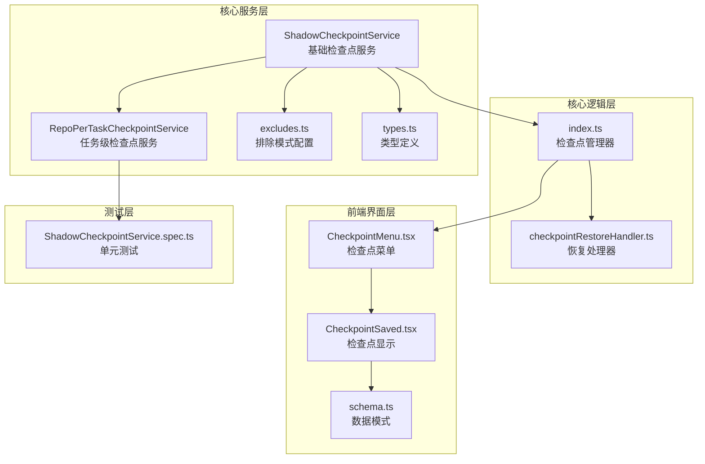

**图表来源**
- [ShadowCheckpointService.ts:79-518](file://src/services/checkpoints/ShadowCheckpointService.ts#L79-L518)
- [RepoPerTaskCheckpointService.ts:6-15](file://src/services/checkpoints/RepoPerTaskCheckpointService.ts#L6-L15)
- [index.ts:1-393](file://src/core/checkpoints/index.ts#L1-L393)

**章节来源**
- [ShadowCheckpointService.ts:1-518](file://src/services/checkpoints/ShadowCheckpointService.ts#L1-L518)
- [index.ts:1-393](file://src/core/checkpoints/index.ts#L1-L393)

## 核心组件

### 基础检查点服务 (ShadowCheckpointService)

`ShadowCheckpointService` 是整个检查点系统的核心基类，提供了所有基本的检查点操作功能：

- **Git仓库管理**：创建和维护独立的Git仓库用于检查点存储
- **文件跟踪**：监控工作区文件的变更并生成检查点
- **版本控制**：支持检查点的创建、恢复和比较
- **事件系统**：提供初始化、检查点创建、恢复和错误事件

### 任务级检查点服务 (RepoPerTaskCheckpointService)

继承自基础服务，专门为单个任务提供独立的检查点存储空间：

- **任务隔离**：每个任务拥有独立的检查点仓库
- **路径管理**：自动管理任务特定的检查点存储路径
- **生命周期管理**：支持任务开始、进行中和结束时的检查点操作

### 排除模式配置 (excludes.ts)

智能排除不需要跟踪的文件类型：

- **构建产物**：编译输出、依赖包等
- **缓存文件**：临时文件、日志文件等
- **媒体文件**：图片、视频等大文件
- **配置文件**：环境变量、本地配置等敏感文件

**章节来源**
- [ShadowCheckpointService.ts:79-518](file://src/services/checkpoints/ShadowCheckpointService.ts#L79-L518)
- [RepoPerTaskCheckpointService.ts:6-15](file://src/services/checkpoints/RepoPerTaskCheckpointService.ts#L6-L15)
- [excludes.ts:1-213](file://src/services/checkpoints/excludes.ts#L1-L213)

## 架构概览

检查点系统的整体架构采用分层设计，确保了功能的模块化和可扩展性：

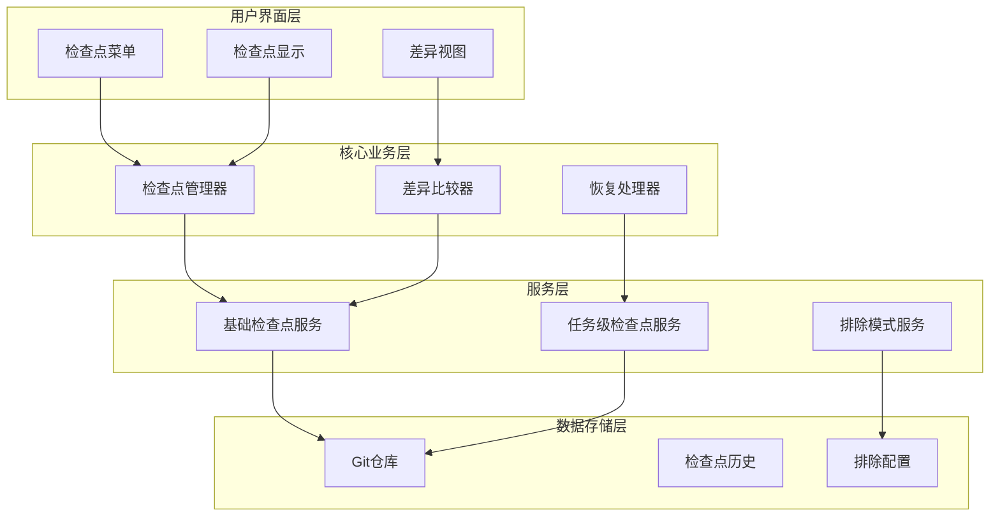

**图表来源**
- [index.ts:28-130](file://src/core/checkpoints/index.ts#L28-L130)
- [ShadowCheckpointService.ts:295-406](file://src/services/checkpoints/ShadowCheckpointService.ts#L295-L406)

### 数据流架构

检查点系统的数据流遵循严格的处理顺序：

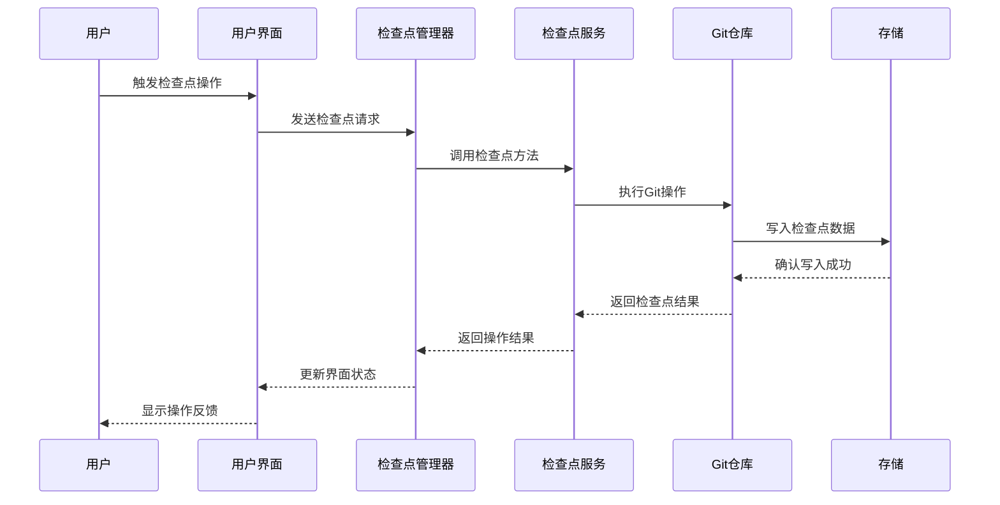

**图表来源**
- [index.ts:212-228](file://src/core/checkpoints/index.ts#L212-L228)
- [ShadowCheckpointService.ts:295-342](file://src/services/checkpoints/ShadowCheckpointService.ts#L295-L342)

## 详细组件分析

### 基础检查点服务实现

#### 初始化流程

基础检查点服务的初始化过程包含多个安全检查和配置步骤：

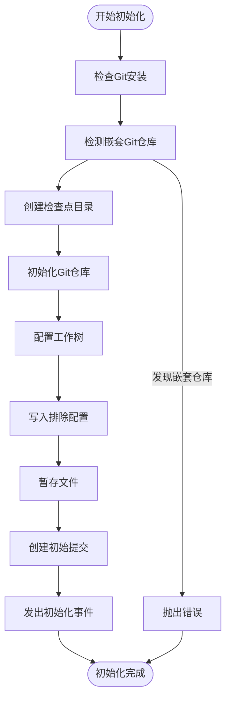

**图表来源**
- [ShadowCheckpointService.ts:129-207](file://src/services/checkpoints/ShadowCheckpointService.ts#L129-L207)

#### 检查点创建机制

检查点创建过程实现了智能的变更检测和提交策略：

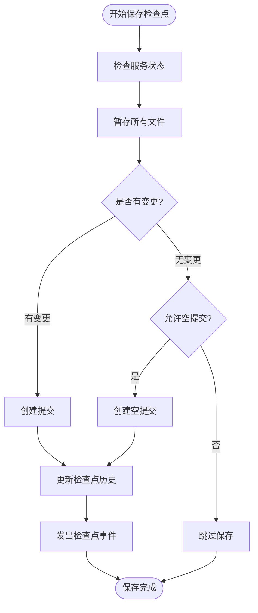

**图表来源**
- [ShadowCheckpointService.ts:295-342](file://src/services/checkpoints/ShadowCheckpointService.ts#L295-L342)

#### 恢复机制

检查点恢复过程确保了工作区状态的准确还原：

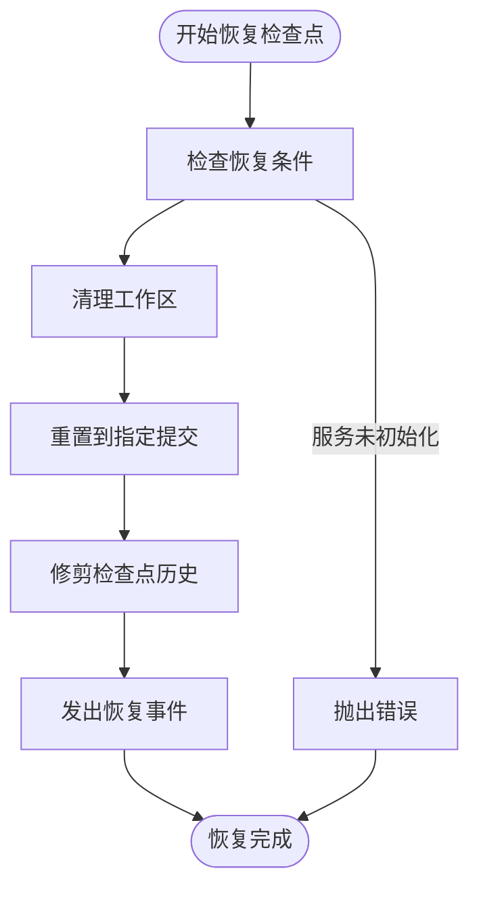

**图表来源**
- [ShadowCheckpointService.ts:344-372](file://src/services/checkpoints/ShadowCheckpointService.ts#L344-L372)

### 排除模式系统

排除模式系统通过多种文件类型过滤来优化检查点存储：

#### 排除模式分类

| 模式类别 | 文件类型示例 | 目的 |
|---------|-------------|------|
| 构建产物 | `.git/`, `node_modules/`, `build/` | 避免跟踪编译输出 |
| 缓存文件 | `*.log`, `*.cache`, `*.tmp` | 减少存储空间占用 |
| 媒体文件 | `*.jpg`, `*.png`, `*.mp4` | 避免跟踪大文件 |
| 配置文件 | `*.env*`, `*.local` | 保护敏感信息 |
| 大数据文件 | `*.zip`, `*.tar`, `*.sql` | 优化存储效率 |

#### 排除模式配置

排除模式通过动态配置实现灵活性：

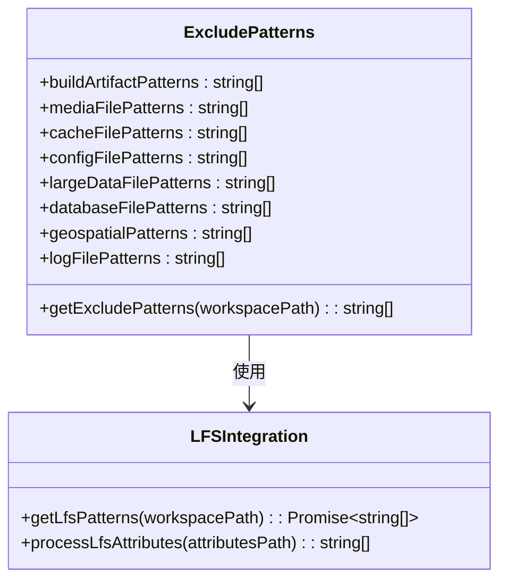

**图表来源**
- [excludes.ts:6-213](file://src/services/checkpoints/excludes.ts#L6-L213)

**章节来源**
- [ShadowCheckpointService.ts:214-228](file://src/services/checkpoints/ShadowCheckpointService.ts#L214-L228)
- [excludes.ts:1-213](file://src/services/checkpoints/excludes.ts#L1-L213)

### 前端界面组件

#### 检查点菜单组件

检查点菜单提供了丰富的交互功能：

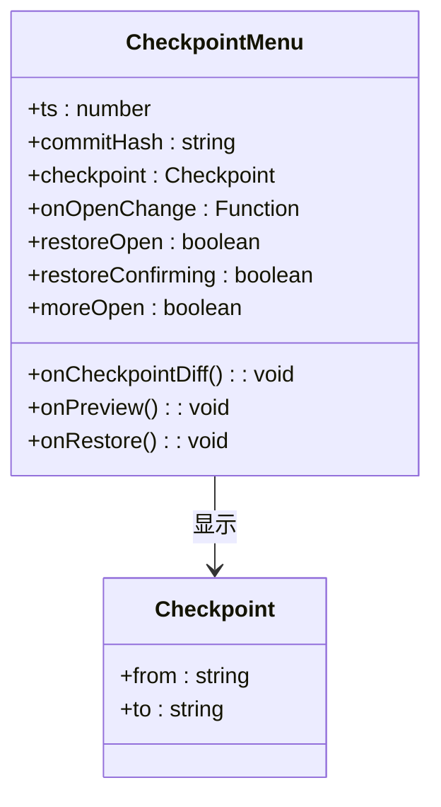

**图表来源**
- [CheckpointMenu.tsx:11-35](file://webview-ui/src/components/chat/checkpoints/CheckpointMenu.tsx#L11-L35)

#### 检查点显示组件

检查点显示组件负责在聊天界面中展示检查点信息：

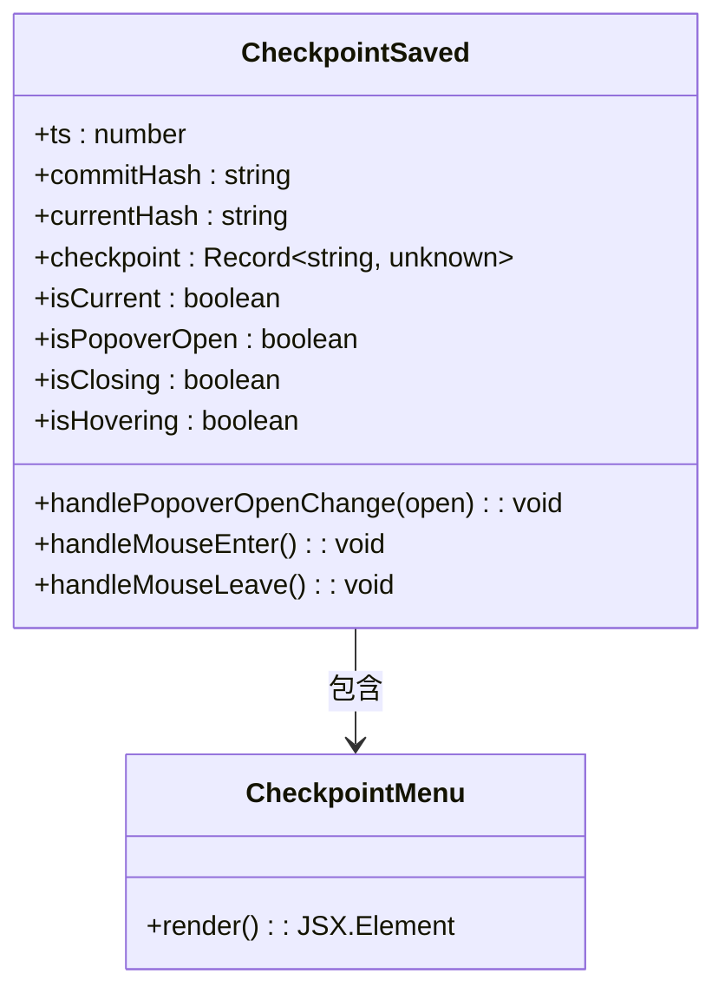

**图表来源**
- [CheckpointSaved.tsx:9-22](file://webview-ui/src/components/chat/checkpoints/CheckpointSaved.tsx#L9-L22)

**章节来源**
- [CheckpointMenu.tsx:1-156](file://webview-ui/src/components/chat/checkpoints/CheckpointMenu.tsx#L1-L156)
- [CheckpointSaved.tsx:1-108](file://webview-ui/src/components/chat/checkpoints/CheckpointSaved.tsx#L1-L108)

## 依赖关系分析

检查点系统的依赖关系体现了清晰的分层架构：

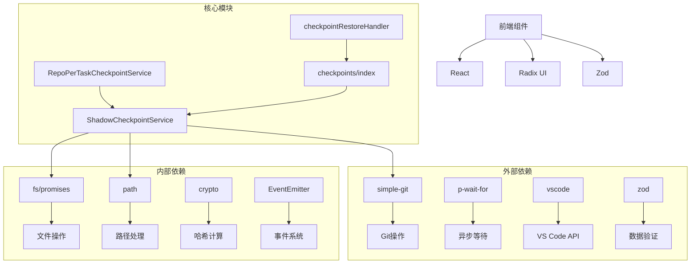

**图表来源**
- [ShadowCheckpointService.ts:1-17](file://src/services/checkpoints/ShadowCheckpointService.ts#L1-L17)
- [index.ts:1-11](file://src/core/checkpoints/index.ts#L1-L11)

### 关键依赖特性

| 依赖库 | 版本 | 用途 | 重要性 |
|-------|------|------|--------|
| simple-git | 最新版本 | Git操作 | 核心依赖 |
| p-wait-for | 最新版本 | 异步等待 | 重要依赖 |
| vscode | 内置API | VS Code集成 | 核心依赖 |
| zod | 最新版本 | 数据验证 | 重要依赖 |

**章节来源**
- [ShadowCheckpointService.ts:1-17](file://src/services/checkpoints/ShadowCheckpointService.ts#L1-L17)
- [index.ts:1-11](file://src/core/checkpoints/index.ts#L1-L11)

## 性能考虑

检查点系统在设计时充分考虑了性能优化：

### 存储优化策略

1. **增量存储**：只存储变更的文件，避免全量复制
2. **智能排除**：通过排除模式减少不必要的文件跟踪
3. **压缩存储**：Git本身提供压缩存储机制
4. **内存管理**：使用流式处理避免大文件内存溢出

### 并发处理

系统支持多任务并发检查点操作：

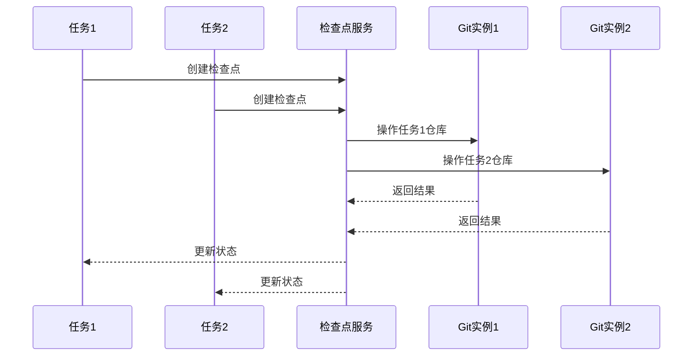

### 错误处理和恢复

系统具备完善的错误处理机制：

1. **渐进式禁用**：单个任务失败不影响其他任务
2. **状态恢复**：异常后自动恢复到稳定状态
3. **用户通知**：及时向用户报告问题
4. **日志记录**：详细记录错误信息便于调试

## 故障排除指南

### 常见问题及解决方案

#### Git环境问题

**问题**：Git未正确安装或配置
**解决方案**：
1. 检查Git安装状态
2. 验证Git命令可用性
3. 确认Git配置正确

**章节来源**
- [index.ts:132-210](file://src/core/checkpoints/index.ts#L132-L210)

#### 嵌套Git仓库冲突

**问题**：工作区内存在嵌套Git仓库
**解决方案**：
1. 检测嵌套仓库位置
2. 提示用户移除或重命名
3. 禁用检查点功能防止冲突

**章节来源**
- [ShadowCheckpointService.ts:230-279](file://src/services/checkpoints/ShadowCheckpointService.ts#L230-L279)

#### 权限问题

**问题**：检查点目录权限不足
**解决方案**：
1. 检查目录访问权限
2. 确保有足够的磁盘空间
3. 验证文件系统完整性

#### 性能问题

**问题**：检查点操作响应缓慢
**解决方案**：
1. 检查排除配置是否合理
2. 监控系统资源使用情况
3. 考虑增加系统资源

### 调试技巧

1. **启用详细日志**：查看检查点操作的详细过程
2. **监控Git仓库状态**：定期检查仓库完整性
3. **验证文件排除**：确认排除模式配置正确
4. **测试网络连接**：确保远程仓库访问正常

**章节来源**
- [ShadowCheckpointService.ts:336-341](file://src/services/checkpoints/ShadowCheckpointService.ts#L336-L341)

## 结论

Njust-AI的检查点系统是一个设计精良、功能完备的任务状态管理解决方案。通过基于Git的技术实现，系统不仅提供了可靠的版本控制功能，还具备了良好的性能表现和用户体验。

### 主要优势

1. **技术先进性**：基于Git的分布式版本控制系统
2. **功能完整性**：支持创建、保存、恢复、比较等完整功能
3. **安全性保障**：独立的Git仓库避免与主项目冲突
4. **智能化配置**：自动排除不需要跟踪的文件类型
5. **用户友好**：直观的界面和详细的错误提示

### 技术特色

1. **环境隔离**：通过清理Git环境变量确保操作隔离
2. **智能排除**：动态配置排除模式优化存储效率
3. **事件驱动**：基于事件系统实现松耦合设计
4. **错误恢复**：完善的错误处理和自动恢复机制

### 应用场景

检查点系统适用于各种需要任务状态持久化的场景：
- 长时间运行的AI任务
- 需要版本回溯的开发工作
- 多轮对话的智能助手
- 自动化脚本执行监控

通过持续的优化和改进，检查点系统将继续为Njust-AI项目提供可靠的任务状态管理能力。