# 任务持久化

<cite>
**本文档引用的文件**
- [TaskHistoryStore.ts](file://src/core/task-persistence/TaskHistoryStore.ts)
- [index.ts](file://src/core/task-persistence/index.ts)
- [taskMetadata.ts](file://src/core/task-persistence/taskMetadata.ts)
- [taskMessages.ts](file://src/core/task-persistence/taskMessages.ts)
- [apiMessages.ts](file://src/core/task-persistence/apiMessages.ts)
- [globalFileNames.ts](file://src/shared/globalFileNames.ts)
- [safeWriteJson.ts](file://src/utils/safeWriteJson.ts)
- [storage.ts](file://src/utils/storage.ts)
- [TaskHistoryStore.spec.ts](file://src/core/task-persistence/__tests__/TaskHistoryStore.spec.ts)
- [TaskHistoryStore.crossInstance.spec.ts](file://src/core/task-persistence/__tests__/TaskHistoryStore.crossInstance.spec.ts)
- [apiMessages.spec.ts](file://src/core/task-persistence/__tests__/apiMessages.spec.ts)
- [taskMessages.spec.ts](file://src/core/task-persistence/__tests__/taskMessages.spec.ts)
</cite>

## 目录
1. [简介](#简介)
2. [项目结构](#项目结构)
3. [核心组件](#核心组件)
4. [架构概览](#架构概览)
5. [详细组件分析](#详细组件分析)
6. [依赖关系分析](#依赖关系分析)
7. [性能考虑](#性能考虑)
8. [故障排除指南](#故障排除指南)
9. [结论](#结论)

## 简介

任务持久化系统是 Njust-AI 平台的核心基础设施，负责可靠地存储和管理任务执行过程中的所有数据。该系统采用分层架构设计，通过 TaskHistoryStore 提供统一的任务历史管理，同时支持任务元数据、API 消息历史和用户界面消息的独立持久化。

系统的主要目标包括：
- **可靠性**：确保数据完整性和一致性，支持跨进程安全访问
- **性能**：通过缓存和批量操作优化读写性能
- **可扩展性**：支持多种数据类型的持久化需求
- **兼容性**：提供向后兼容的数据迁移机制

## 项目结构

任务持久化功能位于 `src/core/task-persistence/` 目录下，采用模块化设计，每个功能模块负责特定的数据类型：

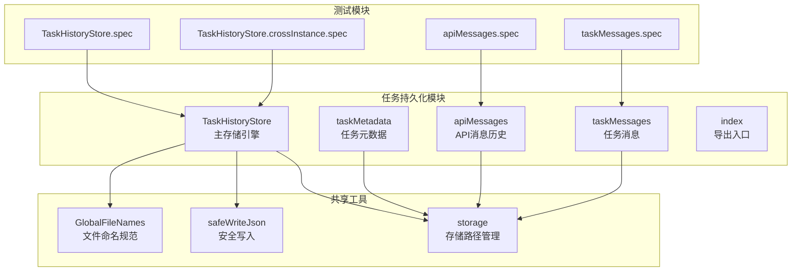

**图表来源**
- [TaskHistoryStore.ts:1-573](file://src/core/task-persistence/TaskHistoryStore.ts#L1-L573)
- [index.ts:1-5](file://src/core/task-persistence/index.ts#L1-L5)

**章节来源**
- [TaskHistoryStore.ts:1-50](file://src/core/task-persistence/TaskHistoryStore.ts#L1-L50)
- [index.ts:1-5](file://src/core/task-persistence/index.ts#L1-L5)

## 核心组件

### TaskHistoryStore 主存储引擎

TaskHistoryStore 是整个任务持久化系统的核心，负责管理所有任务历史数据的存储和检索。它采用了多项关键技术来确保数据的可靠性和性能：

#### 架构特性
- **分层存储模型**：每个任务单独存储在独立的文件中，避免单点故障
- **索引缓存机制**：维护全局索引文件用于快速启动和查询
- **跨进程安全**：使用 `proper-lockfile` 实现进程间互斥锁
- **内存缓存**：提供高性能的内存缓存层

#### 数据存储格式
系统使用标准化的 JSON 格式存储数据，主要包含以下文件类型：

| 文件类型 | 文件名 | 描述 | 存储内容 |
|---------|--------|------|----------|
| 历史项文件 | `history_item.json` | 任务核心信息 | 任务元数据、统计信息、状态信息 |
| 索引文件 | `_index.json` | 全局索引 | 所有任务历史项的汇总 |
| API消息 | `api_conversation_history.json` | API调用历史 | 完整的API对话记录 |
| UI消息 | `ui_messages.json` | 用户界面消息 | 用户交互消息记录 |

**章节来源**
- [TaskHistoryStore.ts:14-31](file://src/core/task-persistence/TaskHistoryStore.ts#L14-L31)
- [globalFileNames.ts:1-10](file://src/shared/globalFileNames.ts#L1-L10)

### 任务元数据管理

taskMetadata 模块负责计算和生成任务的元数据信息，包括：

#### 元数据计算
- **时间戳**：基于最后相关消息的时间
- **令牌使用量**：统计输入输出令牌数、缓存读写次数
- **成本统计**：计算任务总成本
- **目录大小**：任务相关文件夹的大小
- **状态信息**：任务的当前状态（活动、委托、完成）

#### 性能优化
- **缓存机制**：使用 NodeCache 缓存目录大小计算结果
- **延迟计算**：仅在需要时才计算昂贵的操作
- **预分配**：预先计算所有可能需要的值

**章节来源**
- [taskMetadata.ts:30-119](file://src/core/task-persistence/taskMetadata.ts#L30-L119)

### API消息持久化

apiMessages 模块专门处理 API 调用历史的持久化，支持多种 AI 服务提供商的消息格式：

#### 支持的消息格式
- **标准格式**：符合 Anthropic MessageParam 接口
- **推理内容**：支持 DeepSeek/Z.ai 的思维模式
- **摘要信息**：支持非破坏性压缩的摘要消息
- **截断标记**：支持非破坏性截断的标记消息

#### 版本兼容性
- **新格式**：`api_conversation_history.json`
- **旧格式**：`claude_messages.json`（向后兼容）
- **自动迁移**：检测并转换旧格式数据

**章节来源**
- [apiMessages.ts:12-38](file://src/core/task-persistence/apiMessages.ts#L12-L38)
- [apiMessages.ts:40-122](file://src/core/task-persistence/apiMessages.ts#L40-L122)

### 任务消息持久化

taskMessages 模块负责用户界面消息的持久化，保持消息的原始结构和元数据：

#### 消息特性
- **原始格式**：保持消息的完整结构不变
- **元数据保留**：保留所有自定义元数据字段
- **类型安全**：使用 TypeScript 类型定义确保数据完整性

**章节来源**
- [taskMessages.ts:17-57](file://src/core/task-persistence/taskMessages.ts#L17-L57)

## 架构概览

任务持久化系统的整体架构采用分层设计，确保各组件之间的松耦合和高内聚：

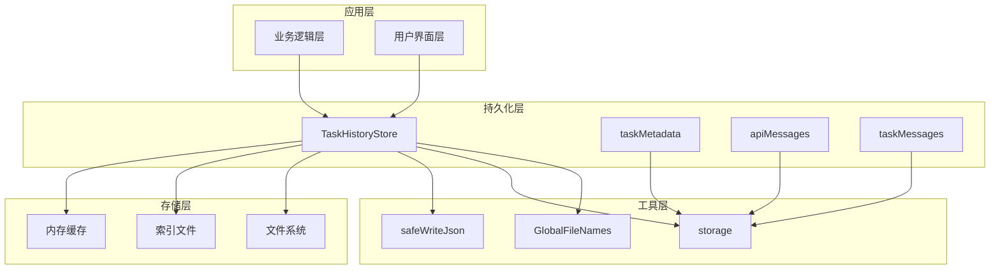

**图表来源**
- [TaskHistoryStore.ts:44-73](file://src/core/task-persistence/TaskHistoryStore.ts#L44-L73)
- [index.ts:1-5](file://src/core/task-persistence/index.ts#L1-L5)

### 数据流架构

系统采用异步数据流设计，确保数据的一致性和可靠性：

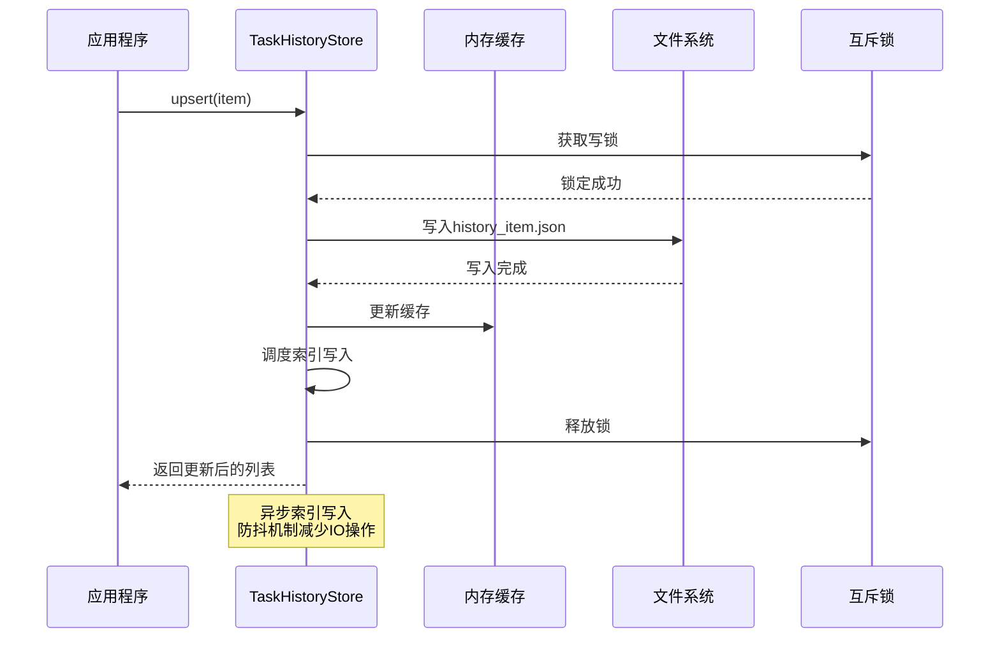

**图表来源**
- [TaskHistoryStore.ts:160-185](file://src/core/task-persistence/TaskHistoryStore.ts#L160-L185)
- [safeWriteJson.ts:35-193](file://src/utils/safeWriteJson.ts#L35-L193)

## 详细组件分析

### TaskHistoryStore 类设计

TaskHistoryStore 采用面向对象的设计模式，提供了完整的 CRUD 操作和高级功能：

#### 核心接口设计

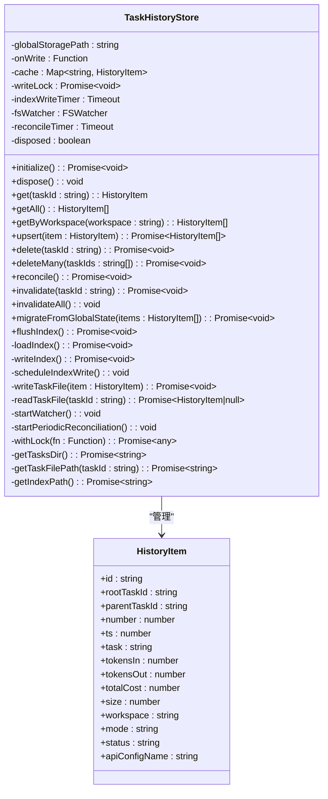

**图表来源**
- [TaskHistoryStore.ts:44-573](file://src/core/task-persistence/TaskHistoryStore.ts#L44-L573)

#### 生命周期管理

TaskHistoryStore 提供了完整的生命周期管理，确保资源的正确初始化和清理：

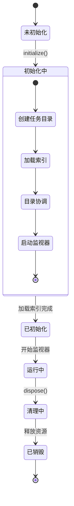

**图表来源**
- [TaskHistoryStore.ts:80-100](file://src/core/task-persistence/TaskHistoryStore.ts#L80-L100)
- [TaskHistoryStore.ts:105-127](file://src/core/task-persistence/TaskHistoryStore.ts#L105-L127)

### 数据存储策略

#### 分布式存储架构

系统采用分布式存储策略，每个任务都有独立的存储空间：

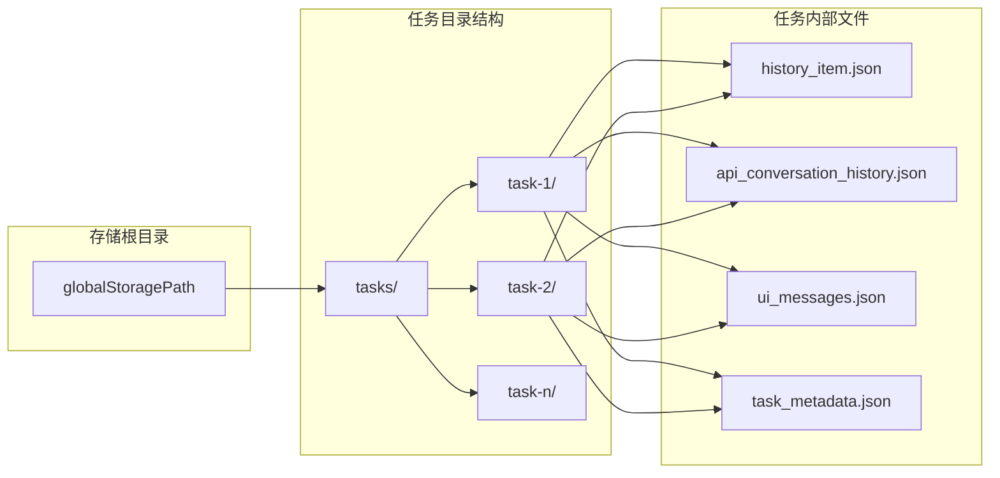

**图表来源**
- [TaskHistoryStore.ts:552-571](file://src/core/task-persistence/TaskHistoryStore.ts#L552-L571)
- [storage.ts:53-58](file://src/utils/storage.ts#L53-L58)

#### 写入安全机制

系统实现了多层安全机制来确保数据写入的安全性：

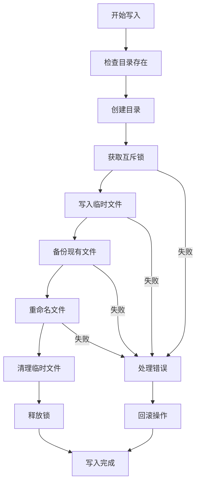

**图表来源**
- [safeWriteJson.ts:35-193](file://src/utils/safeWriteJson.ts#L35-L193)

**章节来源**
- [TaskHistoryStore.ts:435-458](file://src/core/task-persistence/TaskHistoryStore.ts#L435-L458)
- [safeWriteJson.ts:35-193](file://src/utils/safeWriteJson.ts#L35-L193)

### 数据恢复与一致性

#### 自动恢复机制

TaskHistoryStore 实现了强大的自动恢复机制，确保系统在异常情况下仍能保持数据一致性：

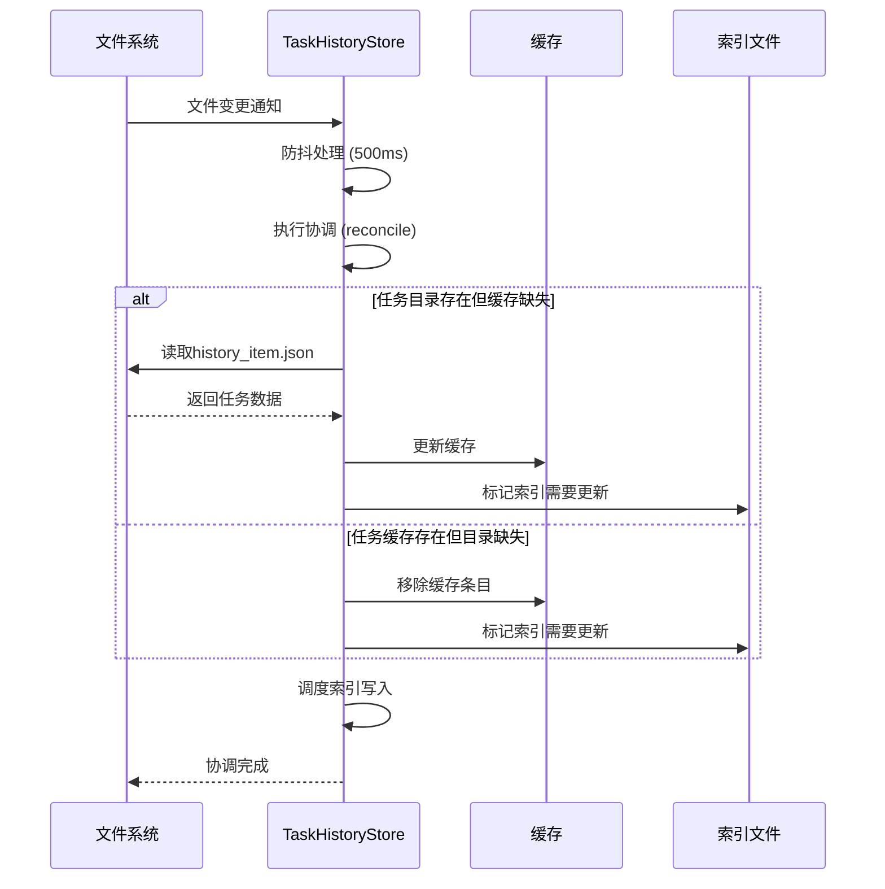

**图表来源**
- [TaskHistoryStore.ts:244-290](file://src/core/task-persistence/TaskHistoryStore.ts#L244-L290)
- [TaskHistoryStore.ts:465-508](file://src/core/task-persistence/TaskHistoryStore.ts#L465-L508)

#### 版本兼容性处理

系统提供了完善的版本兼容性处理机制：

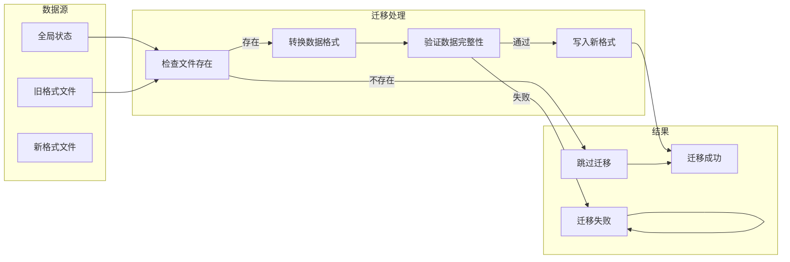

**图表来源**
- [TaskHistoryStore.ts:325-360](file://src/core/task-persistence/TaskHistoryStore.ts#L325-L360)
- [apiMessages.ts:75-99](file://src/core/task-persistence/apiMessages.ts#L75-L99)

**章节来源**
- [TaskHistoryStore.ts:238-290](file://src/core/task-persistence/TaskHistoryStore.ts#L238-L290)
- [TaskHistoryStore.ts:319-360](file://src/core/task-persistence/TaskHistoryStore.ts#L319-L360)

## 依赖关系分析

### 组件依赖图

任务持久化系统的依赖关系相对简单，主要依赖于几个核心工具模块：

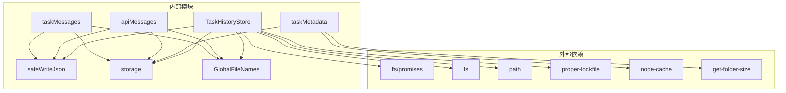

**图表来源**
- [TaskHistoryStore.ts:1-10](file://src/core/task-persistence/TaskHistoryStore.ts#L1-L10)
- [taskMetadata.ts:1-3](file://src/core/task-persistence/taskMetadata.ts#L1-L3)

### 数据依赖关系

系统中的数据依赖关系体现了清晰的层次结构：

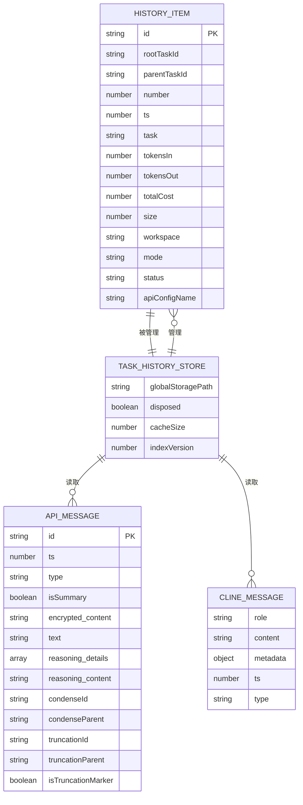

**图表来源**
- [TaskHistoryStore.ts:14-18](file://src/core/task-persistence/TaskHistoryStore.ts#L14-L18)
- [apiMessages.ts:12-38](file://src/core/task-persistence/apiMessages.ts#L12-L38)
- [taskMessages.ts:12-15](file://src/core/task-persistence/taskMessages.ts#L12-L15)

**章节来源**
- [TaskHistoryStore.ts:1-10](file://src/core/task-persistence/TaskHistoryStore.ts#L1-L10)
- [taskMetadata.ts:1-12](file://src/core/task-persistence/taskMetadata.ts#L1-L12)

## 性能考虑

### 缓存策略

系统采用了多层次的缓存策略来优化性能：

#### 内存缓存
- **历史项缓存**：使用 Map 结构缓存所有历史项，O(1) 访问时间
- **目录大小缓存**：使用 NodeCache 缓存任务目录大小，30秒TTL
- **索引缓存**：维护内存中的索引副本，避免频繁磁盘I/O

#### 防抖机制
- **索引写入防抖**：2秒防抖窗口，减少频繁的索引文件写入
- **文件系统监听防抖**：500ms防抖窗口，避免过度协调

### I/O 优化

#### 流式写入
系统使用流式JSON写入技术，避免大对象的内存峰值：

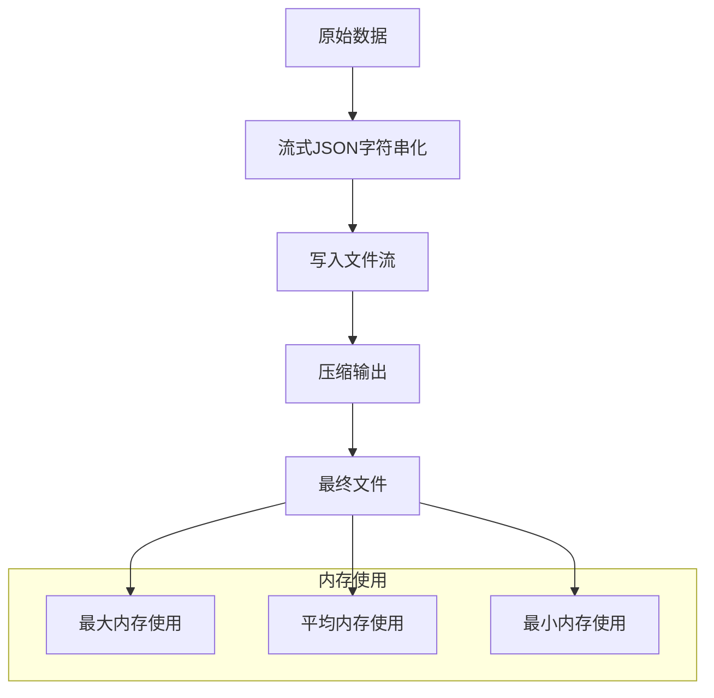

**图表来源**
- [safeWriteJson.ts:202-221](file://src/utils/safeWriteJson.ts#L202-L221)

#### 批量操作
- **批量删除**：支持一次性删除多个任务
- **批量协调**：定期执行协调操作，确保数据一致性

### 并发控制

系统实现了严格的并发控制机制：

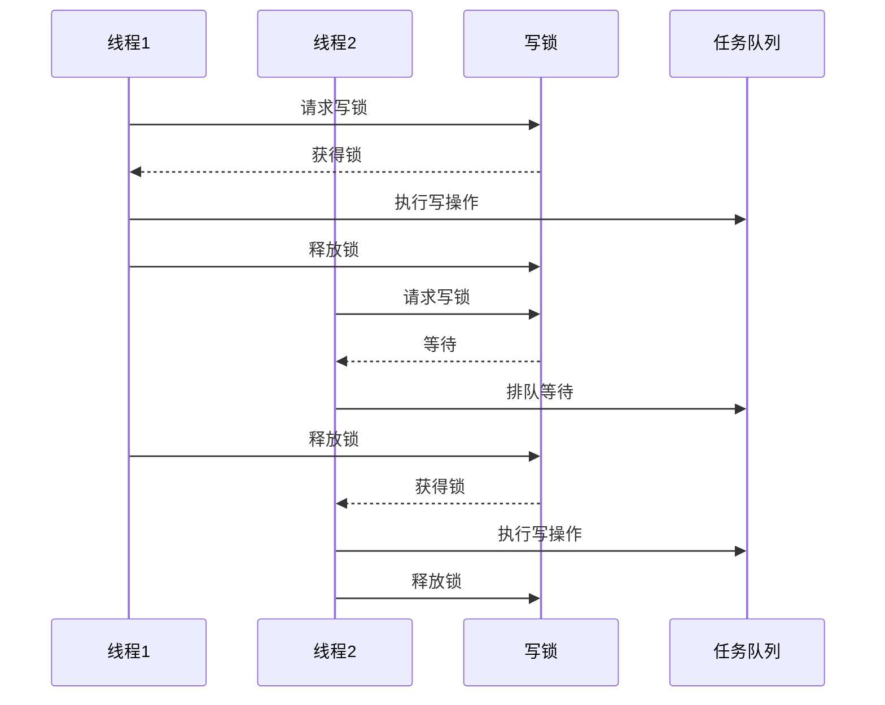

**图表来源**
- [TaskHistoryStore.ts:538-545](file://src/core/task-persistence/TaskHistoryStore.ts#L538-L545)

**章节来源**
- [TaskHistoryStore.ts:61-66](file://src/core/task-persistence/TaskHistoryStore.ts#L61-L66)
- [TaskHistoryStore.ts:538-545](file://src/core/task-persistence/TaskHistoryStore.ts#L538-L545)

## 故障排除指南

### 常见问题诊断

#### 数据不一致问题

当遇到数据不一致问题时，可以按照以下步骤进行诊断：

1. **检查索引文件**：确认 `_index.json` 文件是否存在且格式正确
2. **验证任务目录**：检查任务目录结构是否完整
3. **查看日志**：检查控制台输出的错误信息
4. **执行协调**：手动调用 `reconcile()` 方法同步数据

#### 性能问题排查

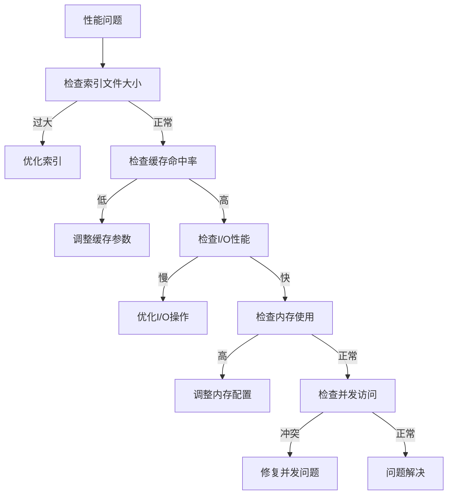

#### 数据恢复

当发生数据损坏时，系统提供了多种恢复机制：

1. **自动恢复**：系统会自动检测并尝试恢复损坏的数据
2. **手动恢复**：通过协调机制重新构建索引
3. **备份恢复**：利用备份文件恢复数据
4. **迁移恢复**：从旧格式数据迁移恢复

**章节来源**
- [TaskHistoryStore.ts:244-290](file://src/core/task-persistence/TaskHistoryStore.ts#L244-L290)
- [apiMessages.spec.ts:16-86](file://src/core/task-persistence/__tests__/apiMessages.spec.ts#L16-L86)
- [taskMessages.spec.ts:71-101](file://src/core/task-persistence/__tests__/taskMessages.spec.ts#L71-L101)

### 调试工具

系统提供了丰富的调试工具来帮助开发者诊断问题：

#### 测试覆盖
- **单元测试**：覆盖所有核心功能的单元测试
- **集成测试**：测试组件间的交互
- **跨实例测试**：验证多实例环境下的数据一致性
- **边界测试**：测试极端情况下的系统行为

#### 日志记录
- **错误日志**：详细的错误信息和堆栈跟踪
- **性能日志**：关键操作的性能指标
- **调试日志**：开发过程中的调试信息

**章节来源**
- [TaskHistoryStore.spec.ts:1-443](file://src/core/task-persistence/__tests__/TaskHistoryStore.spec.ts#L1-L443)
- [TaskHistoryStore.crossInstance.spec.ts:1-166](file://src/core/task-persistence/__tests__/TaskHistoryStore.crossInstance.spec.ts#L1-L166)

## 结论

任务持久化系统通过精心设计的架构和实现，成功地解决了复杂应用场景下的数据持久化挑战。系统的主要优势包括：

### 技术优势
- **可靠性**：多层安全机制确保数据的完整性和一致性
- **性能**：智能缓存和批量操作优化了系统性能
- **可扩展性**：模块化设计支持功能的灵活扩展
- **兼容性**：完善的版本迁移机制支持平滑升级

### 架构特点
- **分层设计**：清晰的职责分离和模块化组织
- **异步处理**：非阻塞的异步操作提升用户体验
- **容错机制**：完善的错误处理和恢复机制
- **监控能力**：全面的日志记录和性能监控

### 应用价值
该系统为 Njust-AI 平台提供了坚实的数据基础，支持复杂的任务管理和协作场景。通过标准化的数据格式和可靠的存储机制，系统能够满足企业级应用对数据持久化的需求。

未来的发展方向包括进一步优化性能、增强监控能力、扩展数据格式支持等，以适应不断增长的业务需求和技术发展。