# 任务消息处理

<cite>
**本文档引用的文件**
- [src/core/message-manager/index.ts](file://src/core/message-manager/index.ts)
- [src/core/task-persistence/apiMessages.ts](file://src/core/task-persistence/apiMessages.ts)
- [src/core/task-persistence/taskMessages.ts](file://src/core/task-persistence/taskMessages.ts)
- [src/core/task/Task.ts](file://src/core/task/Task.ts)
- [src/core/condense/index.ts](file://src/core/condense/index.ts)
- [src/core/message-queue/MessageQueueService.ts](file://src/core/message-queue/MessageQueueService.ts)
- [packages/types/src/message.ts](file://packages/types/src/message.ts)
- [packages/types/src/ipc.ts](file://packages/types/src/ipc.ts)
- [apps/cli/src/agent/message-processor.ts](file://apps/cli/src/agent/message-processor.ts)
- [packages/evals/src/cli/messageLogDeduper.ts](file://packages/evals/src/cli/messageLogDeduper.ts)
- [src/shared/__tests__/combineApiRequests.spec.ts](file://src/shared/__tests__/combineApiRequests.spec.ts)
</cite>

## 目录
1. [简介](#简介)
2. [项目结构](#项目结构)
3. [核心组件](#核心组件)
4. [架构概览](#架构概览)
5. [详细组件分析](#详细组件分析)
6. [依赖关系分析](#依赖关系分析)
7. [性能考虑](#性能考虑)
8. [故障排除指南](#故障排除指南)
9. [结论](#结论)

## 简介

本文档深入解析Njust-AI任务系统中的消息处理机制，重点涵盖以下方面：

- **消息生命周期管理**：从消息创建、存储到销毁的完整生命周期
- **ApiMessage与ClineMessage结构与用途**：两种消息类型的定义、字段含义及使用场景
- **消息历史记录存储机制**：UI消息与API消息的分离存储策略
- **消息序列化与反序列化**：JSON格式的消息数据处理
- **消息过滤与清理策略**：基于时间戳的回滚、条件压缩和滑动窗口截断
- **消息处理流程**：消息添加、查询、更新、删除的具体实现
- **状态管理与持久化**：消息在不同状态下的行为差异和持久化策略

## 项目结构

任务消息处理系统采用分层架构设计，主要包含以下几个核心层次：

```mermaid
graph TB
subgraph "应用层"
CLI[CLI应用]
Webview[Webview界面]
Extension[VS Code扩展]
end
subgraph "核心业务层"
Task[Task任务管理器]
MessageManager[消息管理器]
Condense[上下文压缩]
MessageQueue[消息队列服务]
end
subgraph "数据持久化层"
TaskMessages[UI消息存储]
ApiMessages[API消息存储]
HistoryStore[历史记录存储]
end
subgraph "类型定义层"
MessageTypes[消息类型定义]
IPC[IPC通信协议]
end
CLI --> Task
Webview --> Task
Extension --> Task
Task --> MessageManager
Task --> Condense
Task --> MessageQueue
MessageManager --> TaskMessages
MessageManager --> ApiMessages
Task --> HistoryStore
Task --> MessageTypes
Task --> IPC
```

**图表来源**
- [src/core/task/Task.ts:176-587](file://src/core/task/Task.ts#L176-L587)
- [src/core/message-manager/index.ts:37-272](file://src/core/message-manager/index.ts#L37-L272)
- [src/core/task-persistence/index.ts:1-5](file://src/core/task-persistence/index.ts#L1-L5)

**章节来源**
- [src/core/task/Task.ts:176-587](file://src/core/task/Task.ts#L176-L587)
- [src/core/message-manager/index.ts:21-36](file://src/core/message-manager/index.ts#L21-L36)

## 核心组件

### 消息类型系统

系统定义了完整的消息类型体系，确保消息处理的一致性和安全性：

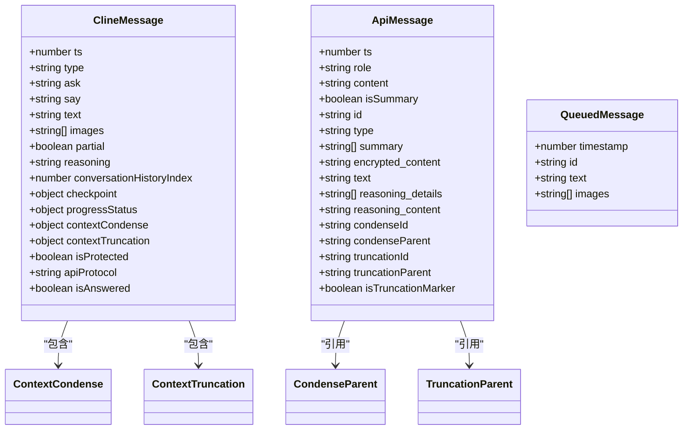

**图表来源**
- [packages/types/src/message.ts:249-276](file://packages/types/src/message.ts#L249-L276)
- [src/core/task-persistence/apiMessages.ts:12-38](file://src/core/task-persistence/apiMessages.ts#L12-L38)
- [packages/types/src/message.ts:297-302](file://packages/types/src/message.ts#L297-L302)

### 消息管理器

MessageManager是消息生命周期管理的核心组件，提供统一的回滚操作入口：

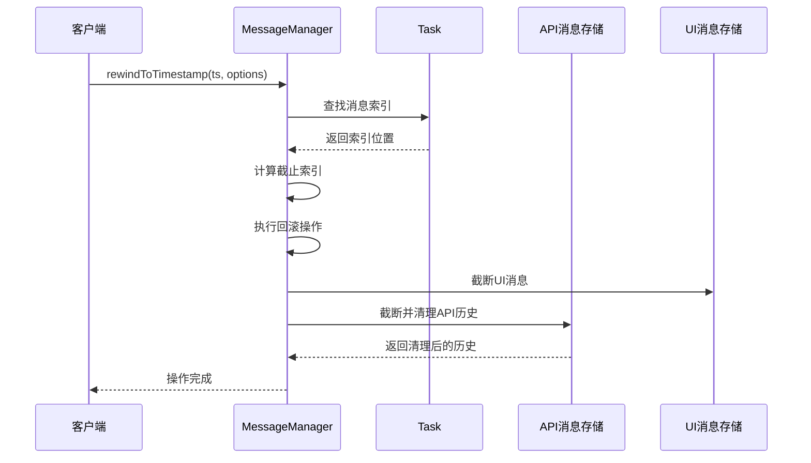

**图表来源**
- [src/core/message-manager/index.ts:48-61](file://src/core/message-manager/index.ts#L48-L61)
- [src/core/message-manager/index.ts:78-89](file://src/core/message-manager/index.ts#L78-L89)

**章节来源**
- [src/core/message-manager/index.ts:37-272](file://src/core/message-manager/index.ts#L37-L272)

## 架构概览

任务消息处理系统采用"分离存储、统一管理"的设计理念：

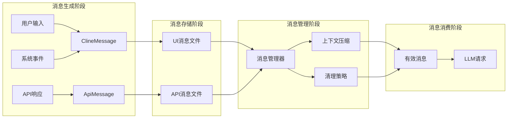

**图表来源**
- [src/core/task-persistence/taskMessages.ts:17-44](file://src/core/task-persistence/taskMessages.ts#L17-L44)
- [src/core/task-persistence/apiMessages.ts:40-107](file://src/core/task-persistence/apiMessages.ts#L40-L107)
- [src/core/condense/index.ts:546-640](file://src/core/condense/index.ts#L546-L640)

## 详细组件分析

### ApiMessage 消息模型

ApiMessage专门用于存储API调用相关的消息历史，支持复杂的上下文管理功能：

| 字段名 | 类型 | 描述 | 用途 |
|--------|------|------|------|
| ts | number | 时间戳 | 消息排序和回滚定位 |
| role | string | 角色（user/assistant/system） | API请求格式兼容 |
| content | string/array | 消息内容 | LLM对话内容 |
| isSummary | boolean | 是否为摘要消息 | 上下文压缩标记 |
| condenseId | string | 压缩标识符 | 非破坏性压缩关联 |
| condenseParent | string | 压缩父标识 | 历史追踪 |
| truncationId | string | 截断标识符 | 滑动窗口截断标记 |
| truncationParent | string | 截断父标识 | 历史追踪 |
| isTruncationMarker | boolean | 截断标记 | 截断检测 |

**章节来源**
- [src/core/task-persistence/apiMessages.ts:12-38](file://src/core/task-persistence/apiMessages.ts#L12-L38)

### ClineMessage 消息模型

ClineMessage用于UI交互和用户可见的消息，提供丰富的上下文管理信息：

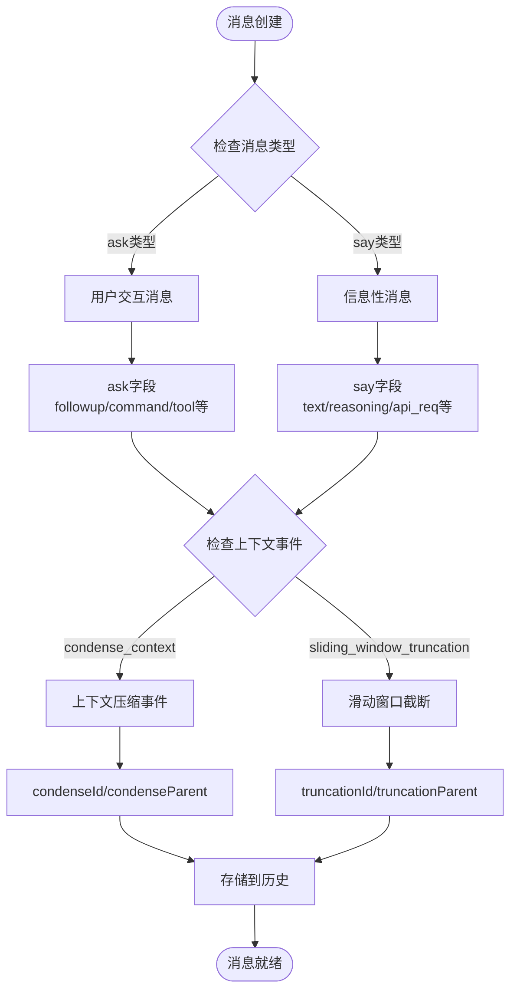

**图表来源**
- [packages/types/src/message.ts:249-276](file://packages/types/src/message.ts#L249-L276)
- [packages/types/src/message.ts:144-173](file://packages/types/src/message.ts#L144-L173)

**章节来源**
- [packages/types/src/message.ts:238-276](file://packages/types/src/message.ts#L238-L276)

### 消息历史存储机制

系统采用分离存储策略，确保不同类型消息的独立管理和高效访问：

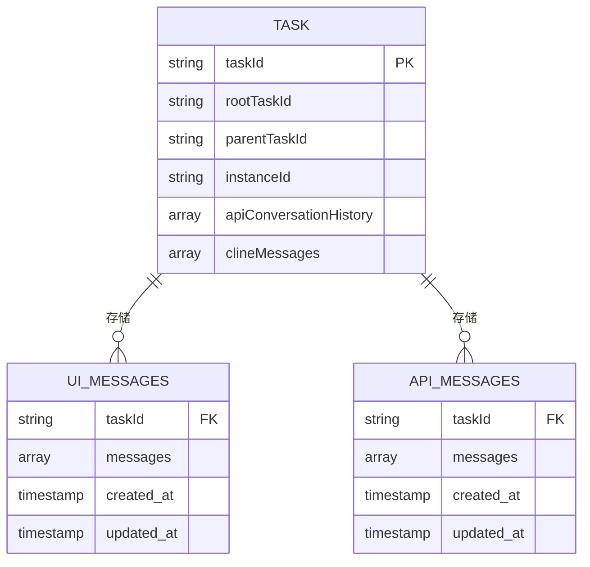

**图表来源**
- [src/core/task/Task.ts:323-324](file://src/core/task/Task.ts#L323-L324)
- [src/core/task-persistence/taskMessages.ts:17-44](file://src/core/task-persistence/taskMessages.ts#L17-L44)
- [src/core/task-persistence/apiMessages.ts:40-107](file://src/core/task-persistence/apiMessages.ts#L40-L107)

**章节来源**
- [src/core/task-persistence/taskMessages.ts:17-56](file://src/core/task-persistence/taskMessages.ts#L17-L56)
- [src/core/task-persistence/apiMessages.ts:40-121](file://src/core/task-persistence/apiMessages.ts#L40-L121)

### 消息序列化与反序列化

系统提供完整的JSON序列化支持，确保消息数据的可靠传输和存储：

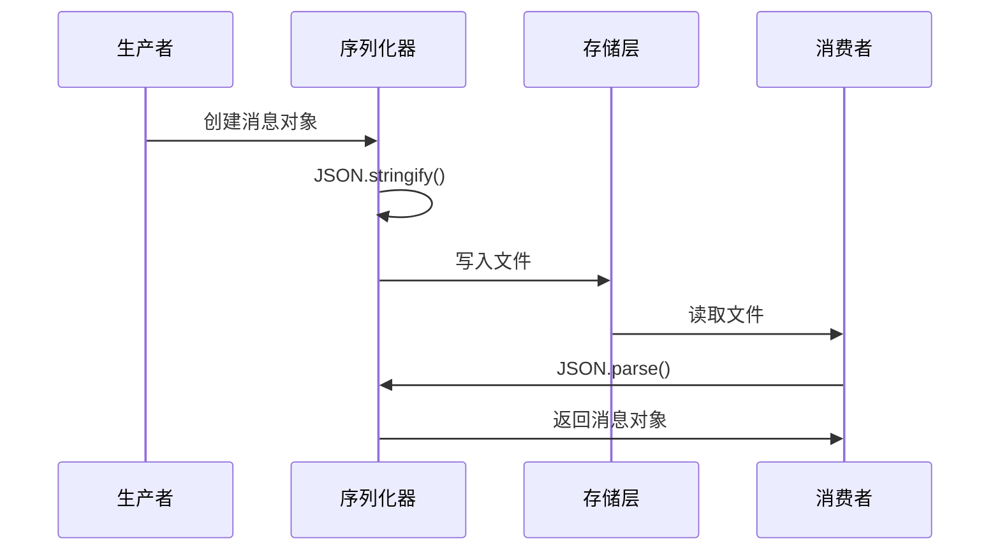

**图表来源**
- [src/core/task-persistence/taskMessages.ts:26-40](file://src/core/task-persistence/taskMessages.ts#L26-L40)
- [src/core/task-persistence/apiMessages.ts:52-71](file://src/core/task-persistence/apiMessages.ts#L52-L71)

**章节来源**
- [src/core/task-persistence/taskMessages.ts:26-40](file://src/core/task-persistence/taskMessages.ts#L26-L40)
- [src/core/task-persistence/apiMessages.ts:52-71](file://src/core/task-persistence/apiMessages.ts#L52-L71)

### 消息过滤和清理策略

系统实现了多层次的消息过滤和清理机制，确保历史记录的准确性和完整性：

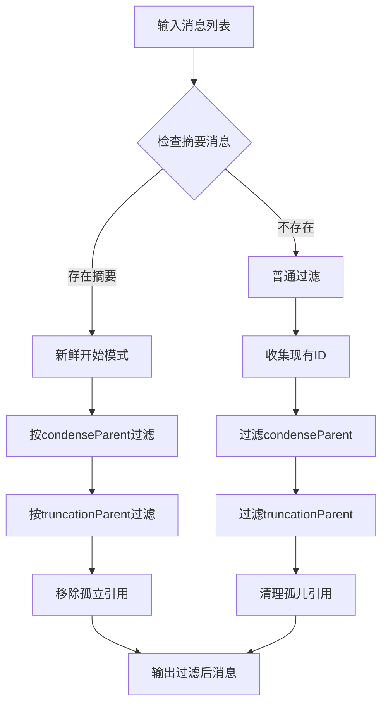

**图表来源**
- [src/core/condense/index.ts:546-640](file://src/core/condense/index.ts#L546-L640)
- [src/core/condense/index.ts:653-701](file://src/core/condense/index.ts#L653-L701)

**章节来源**
- [src/core/condense/index.ts:546-701](file://src/core/condense/index.ts#L546-L701)

### 消息处理流程

系统提供了完整的消息处理流程，支持消息的增删改查操作：

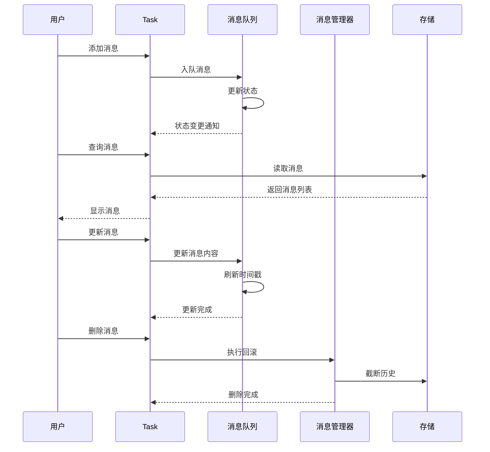

**图表来源**
- [src/core/message-queue/MessageQueueService.ts:36-78](file://src/core/message-queue/MessageQueueService.ts#L36-L78)
- [src/core/message-manager/index.ts:48-61](file://src/core/message-manager/index.ts#L48-L61)

**章节来源**
- [src/core/message-queue/MessageQueueService.ts:36-98](file://src/core/message-queue/MessageQueueService.ts#L36-L98)
- [src/core/message-manager/index.ts:48-98](file://src/core/message-manager/index.ts#L48-L98)

### 消息优先级处理

系统支持基于时间戳的消息优先级管理，确保消息处理的时序正确性：

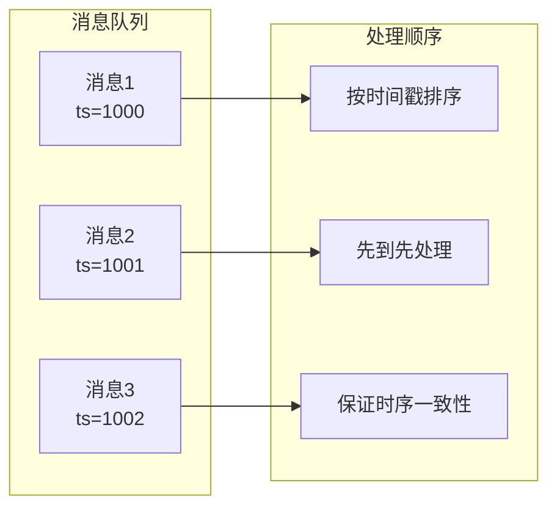

**图表来源**
- [src/core/message-queue/MessageQueueService.ts:42-46](file://src/core/message-queue/MessageQueueService.ts#L42-L46)

**章节来源**
- [src/core/message-queue/MessageQueueService.ts:42-46](file://src/core/message-queue/MessageQueueService.ts#L42-L46)

### 消息持久化策略

系统采用异步持久化策略，确保消息的可靠存储和快速访问：

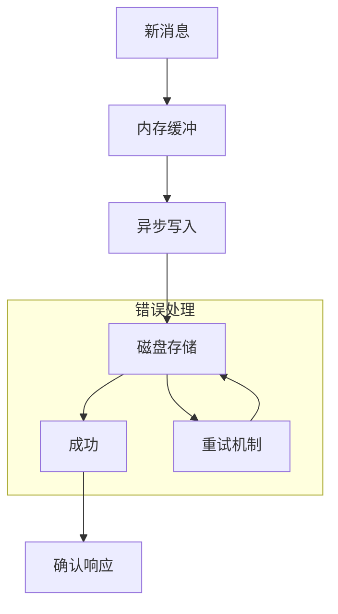

**图表来源**
- [src/core/task-persistence/taskMessages.ts:52-56](file://src/core/task-persistence/taskMessages.ts#L52-L56)
- [src/core/task-persistence/apiMessages.ts:118-121](file://src/core/task-persistence/apiMessages.ts#L118-L121)

**章节来源**
- [src/core/task-persistence/taskMessages.ts:52-56](file://src/core/task-persistence/taskMessages.ts#L52-L56)
- [src/core/task-persistence/apiMessages.ts:118-121](file://src/core/task-persistence/apiMessages.ts#L118-L121)

## 依赖关系分析

任务消息处理系统的依赖关系呈现清晰的分层结构：

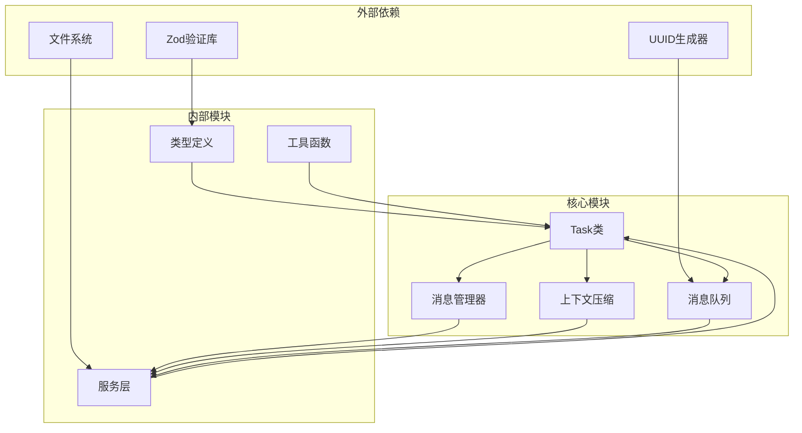

**图表来源**
- [packages/types/src/message.ts:1-3](file://packages/types/src/message.ts#L1-L3)
- [src/core/message-queue/MessageQueueService.ts:1-6](file://src/core/message-queue/MessageQueueService.ts#L1-L6)
- [src/core/task/Task.ts:1-68](file://src/core/task/Task.ts#L1-L68)

**章节来源**
- [packages/types/src/message.ts:1-3](file://packages/types/src/message.ts#L1-L3)
- [src/core/task/Task.ts:1-68](file://src/core/task/Task.ts#L1-L68)

## 性能考虑

系统在设计时充分考虑了性能优化：

### 内存管理
- 使用惰性初始化避免不必要的资源占用
- 消息队列采用事件驱动模式减少内存峰值
- 异步写入机制避免阻塞主线程

### 存储优化
- 分离存储策略减少单文件大小
- 条件压缩和滑动窗口截断控制历史长度
- 智能清理机制移除孤立引用

### 并发处理
- 消息队列支持并发消息处理
- 回滚操作原子性保证数据一致性
- 错误恢复机制确保系统稳定性

## 故障排除指南

### 常见问题及解决方案

**消息丢失问题**
- 检查消息队列状态是否正常
- 验证文件权限和存储空间
- 确认异步写入是否完成

**消息重复问题**
- 检查消息ID生成逻辑
- 验证去重机制是否正常工作
- 确认消息处理幂等性

**性能问题**
- 监控消息队列长度
- 检查磁盘I/O性能
- 优化批量处理策略

**章节来源**
- [packages/evals/src/cli/messageLogDeduper.ts:1-50](file://packages/evals/src/cli/messageLogDeduper.ts#L1-L50)

## 结论

Njust-AI的任务消息处理系统通过精心设计的架构和完善的机制，实现了高效、可靠的多类型消息管理。系统的主要优势包括：

1. **清晰的分层架构**：分离存储策略确保不同类型消息的独立管理
2. **强大的上下文管理**：非破坏性压缩和滑动窗口截断提供灵活的历史控制
3. **完善的生命周期管理**：从创建到销毁的完整跟踪和清理机制
4. **高性能的处理能力**：异步处理和智能缓存提升系统性能
5. **可靠的持久化策略**：多重备份和错误恢复确保数据安全

该系统为复杂的AI代理任务提供了坚实的消息处理基础，支持从简单对话到复杂多步骤任务的完整场景需求。