# 任务状态管理

<cite>
**本文档引用的文件**
- [Task.ts](file://src/core/task/Task.ts)
- [task.ts](file://packages/types/src/task.ts)
- [extension-client.test.ts](file://apps/cli/src/agent/__tests__/extension-client.test.ts)
</cite>

## 目录
1. [简介](#简介)
2. [项目结构](#项目结构)
3. [核心组件](#核心组件)
4. [架构概览](#架构概览)
5. [详细组件分析](#详细组件分析)
6. [依赖关系分析](#依赖关系分析)
7. [性能考虑](#性能考虑)
8. [故障排除指南](#故障排除指南)
9. [结论](#结论)

## 简介

本文档深入解析Njust-AI项目中任务状态管理系统的实现机制。该系统基于Task类实现了完整的任务生命周期管理，包括状态检查、状态转换、状态验证和状态持久化等功能。系统采用事件驱动的设计模式，通过TaskStatus枚举定义了四种核心状态：running、interactive、resumable、idle，并提供了相应的状态检查函数和状态转换逻辑。

## 项目结构

任务状态管理系统主要分布在以下文件中：

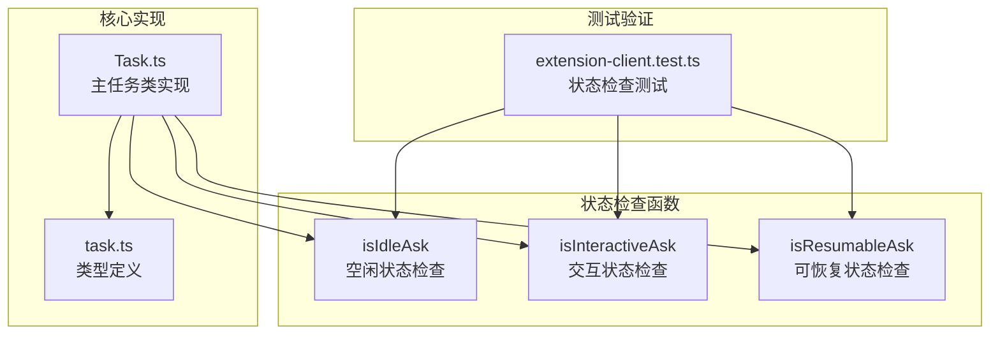

**图表来源**
- [Task.ts:5221-5236](file://src/core/task/Task.ts#L5221-L5236)
- [task.ts:99-105](file://packages/types/src/task.ts#L99-L105)

**章节来源**
- [Task.ts:1-800](file://src/core/task/Task.ts#L1-L800)
- [task.ts:1-162](file://packages/types/src/task.ts#L1-L162)

## 核心组件

### TaskStatus枚举

系统定义了四个核心状态常量：

| 状态 | 描述 | 使用场景 |
|------|------|----------|
| `Running` | 任务正在执行中 | 正常的任务执行状态 |
| `Interactive` | 需要用户交互的状态 | 工具调用、命令执行等需要确认 |
| `Resumable` | 可恢复的状态 | 任务暂停等待用户恢复 |
| `Idle` | 空闲状态 | 任务等待用户输入 |

### 状态检查函数

系统提供了三个核心的状态检查函数：

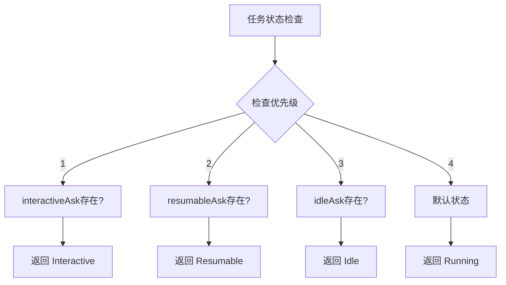

**图表来源**
- [Task.ts:5221-5236](file://src/core/task/Task.ts#L5221-L5236)

**章节来源**
- [task.ts:99-105](file://packages/types/src/task.ts#L99-L105)
- [Task.ts:5221-5236](file://src/core/task/Task.ts#L5221-L5236)

## 架构概览

任务状态管理系统采用分层架构设计：

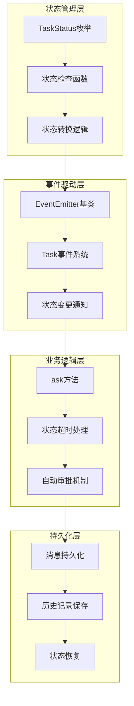

**图表来源**
- [Task.ts:1243-1478](file://src/core/task/Task.ts#L1243-L1478)
- [Task.ts:1917-2223](file://src/core/task/Task.ts#L1917-L2223)

## 详细组件分析

### 状态管理核心实现

Task类实现了完整的状态管理机制：

#### 状态获取器实现

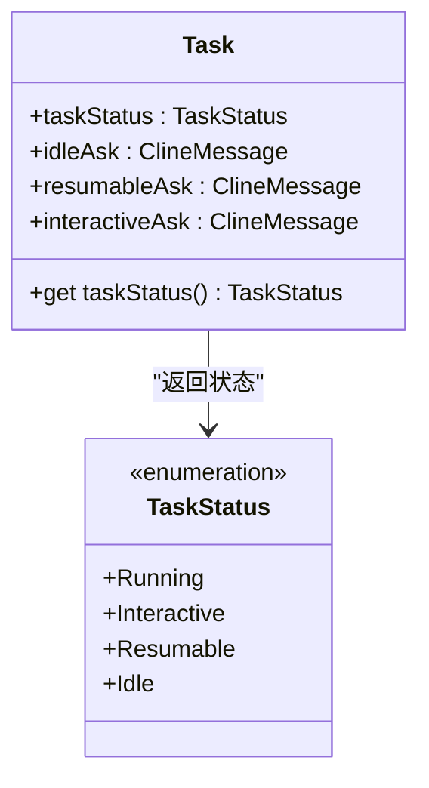

**图表来源**
- [Task.ts:5221-5236](file://src/core/task/Task.ts#L5221-L5236)
- [task.ts:99-105](file://packages/types/src/task.ts#L99-L105)

#### 状态转换流程

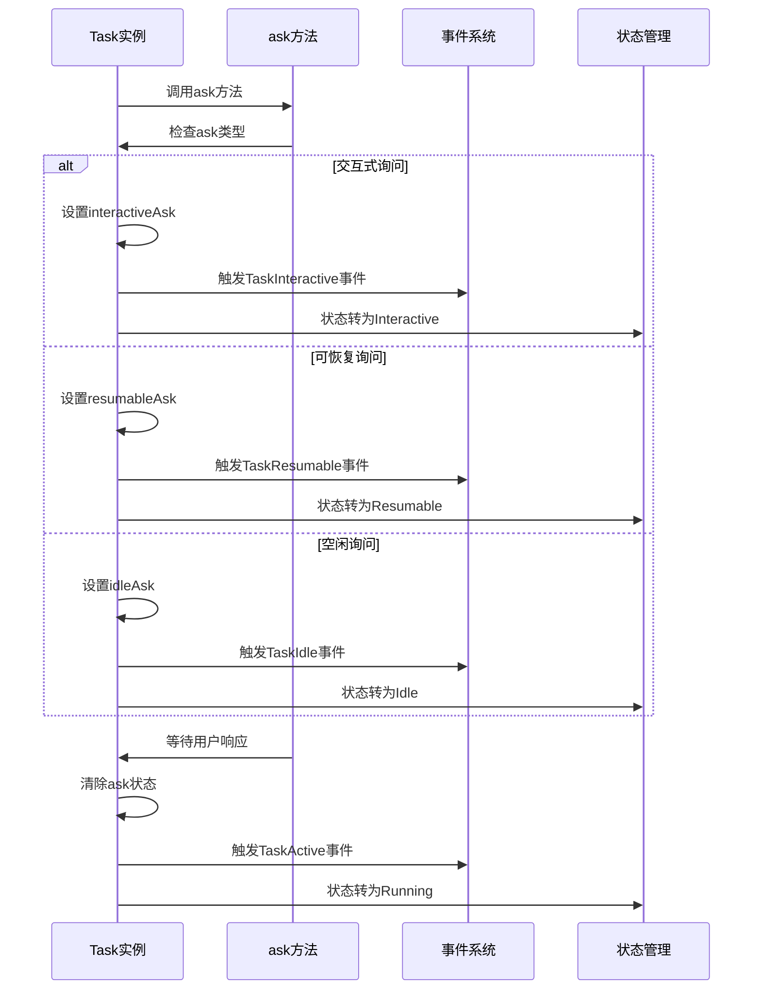

**图表来源**
- [Task.ts:1243-1478](file://src/core/task/Task.ts#L1243-L1478)
- [Task.ts:5221-5236](file://src/core/task/Task.ts#L5221-L5236)

### 状态验证逻辑

系统实现了多层次的状态验证机制：

#### 状态检查函数实现

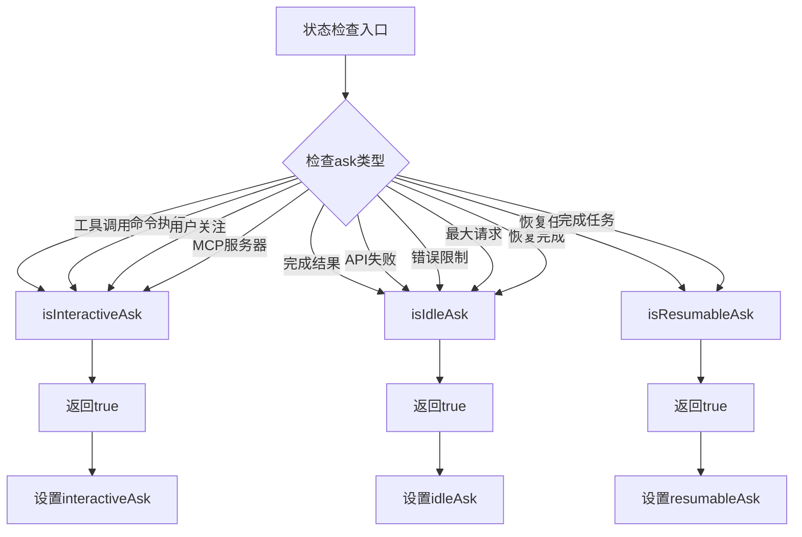

**图表来源**
- [extension-client.test.ts:176-217](file://apps/cli/src/agent/__tests__/extension-client.test.ts#L176-L217)

#### 自动审批机制

系统实现了智能的自动审批功能：

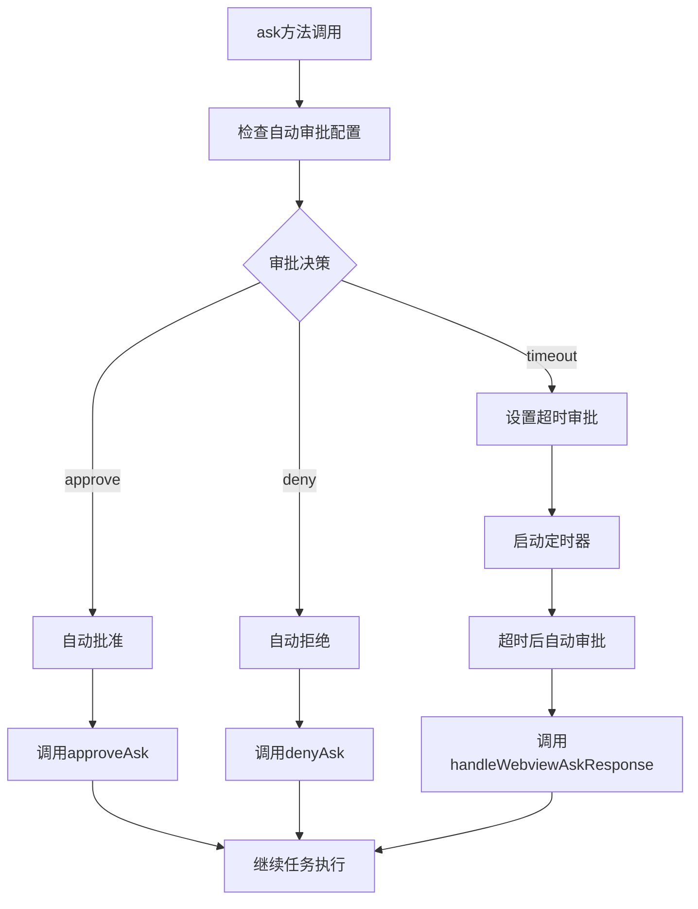

**图表来源**
- [Task.ts:1342-1359](file://src/core/task/Task.ts#L1342-L1359)

**章节来源**
- [Task.ts:1243-1478](file://src/core/task/Task.ts#L1243-L1478)
- [Task.ts:1342-1359](file://src/core/task/Task.ts#L1342-L1359)
- [extension-client.test.ts:176-217](file://apps/CLI/src/agent/__tests__/extension-client.test.ts#L176-L217)

### 状态持久化机制

系统实现了完善的状态持久化功能：

#### 消息持久化流程

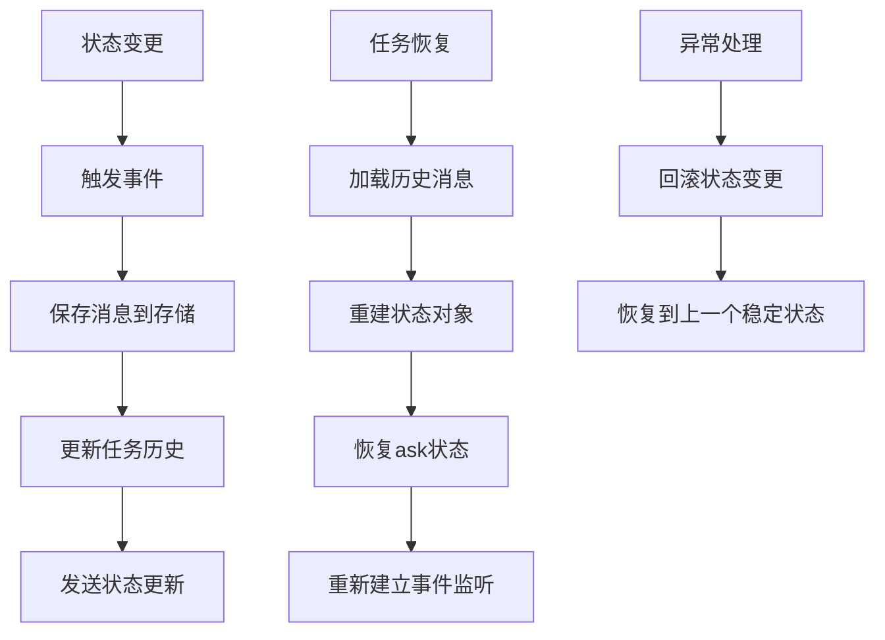

**图表来源**
- [Task.ts:1161-1228](file://src/core/task/Task.ts#L1161-L1228)
- [Task.ts:1992-2223](file://src/core/task/Task.ts#L1992-L2223)

#### 状态恢复策略

系统提供了多种状态恢复策略：

| 恢复策略 | 实现方式 | 使用场景 |
|----------|----------|----------|
| 历史恢复 | 加载保存的历史消息 | 任务中断后的恢复 |
| 状态重建 | 从历史数据重建ask状态 | 任务重启后的状态恢复 |
| 事件重放 | 重新触发相关事件 | 确保UI状态同步 |

**章节来源**
- [Task.ts:1161-1228](file://src/core/task/Task.ts#L1161-L1228)
- [Task.ts:1992-2223](file://src/core/task/Task.ts#L1992-L2223)

### 状态监听器机制

系统实现了灵活的状态监听机制：

#### 事件监听器实现

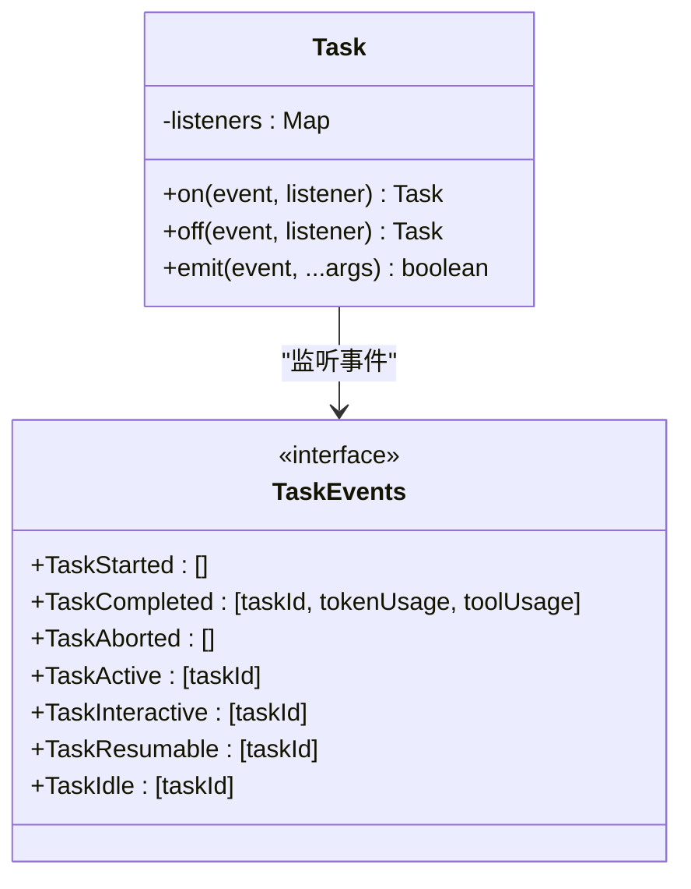

**图表来源**
- [task.ts:134-161](file://packages/types/src/task.ts#L134-L161)

#### 状态变更回调处理

系统提供了完善的回调处理机制：

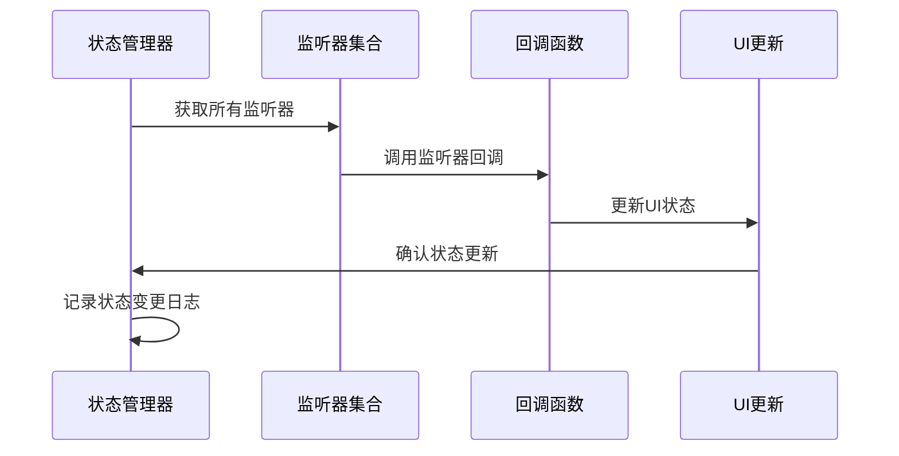

**图表来源**
- [Task.ts:5221-5236](file://src/core/task/Task.ts#L5221-L5236)

**章节来源**
- [task.ts:134-161](file://packages/types/src/task.ts#L134-L161)
- [Task.ts:5221-5236](file://src/core/task/Task.ts#L5221-L5236)

## 依赖关系分析

任务状态管理系统涉及多个模块的依赖关系：

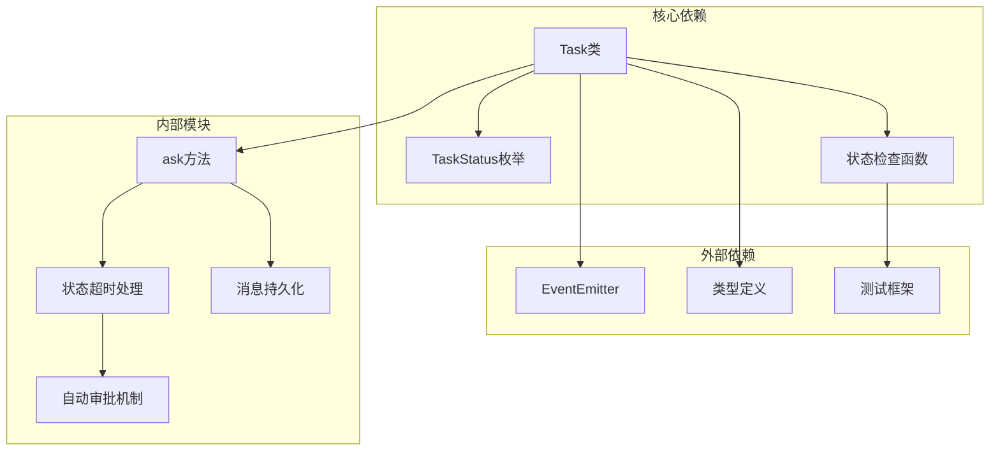

**图表来源**
- [Task.ts:1-800](file://src/core/task/Task.ts#L1-L800)
- [task.ts:1-162](file://packages/types/src/task.ts#L1-L162)

**章节来源**
- [Task.ts:1-800](file://src/core/task/Task.ts#L1-L800)
- [task.ts:1-162](file://packages/types/src/task.ts#L1-L162)

## 性能考虑

系统在设计时充分考虑了性能优化：

### 状态检查优化
- 使用优先级检查机制，避免不必要的状态检查
- 缓存状态计算结果，减少重复计算
- 异步状态检查，避免阻塞主线程

### 内存管理
- 及时清理不再使用的状态对象
- 合理使用WeakRef避免内存泄漏
- 事件监听器的及时移除

### 并发控制
- 状态变更的原子性保证
- 事件处理的顺序性维护
- 异常情况下的状态一致性

## 故障排除指南

### 常见问题及解决方案

#### 状态不一致问题
**问题描述**: 任务状态与实际行为不匹配
**解决方案**: 
1. 检查状态检查函数的优先级
2. 验证事件触发的时机
3. 确认状态清理的完整性

#### 状态丢失问题
**问题描述**: 任务恢复时状态信息丢失
**解决方案**:
1. 检查消息持久化的完整性
2. 验证历史数据的正确性
3. 确认状态重建的准确性

#### 事件监听失效问题
**问题描述**: 状态变更时UI不更新
**解决方案**:
1. 检查事件监听器的注册
2. 验证事件触发的正确性
3. 确认回调函数的执行

**章节来源**
- [Task.ts:2248-2280](file://src/core/task/Task.ts#L2248-L2280)
- [Task.ts:2282-2366](file://src/core/task/Task.ts#L2282-L2366)

## 结论

Njust-AI项目的任务状态管理系统展现了优秀的软件架构设计：

### 设计优势
- **清晰的状态模型**: 通过TaskStatus枚举定义了明确的状态边界
- **灵活的状态转换**: 支持多种状态转换场景和条件
- **完善的事件机制**: 提供了丰富的状态变更通知
- **可靠的持久化**: 确保状态信息的完整性和可恢复性

### 技术特点
- **事件驱动架构**: 基于EventEmitter实现松耦合的状态管理
- **异步处理**: 支持非阻塞的状态检查和转换
- **类型安全**: 完整的TypeScript类型定义确保类型安全
- **测试覆盖**: 全面的单元测试验证状态管理逻辑

### 扩展性
系统设计具有良好的扩展性，可以轻松添加新的状态类型和状态转换逻辑，同时保持现有功能的稳定性。