# 任务生命周期事件

<cite>
**本文档引用的文件**
- [Task.ts](file://src/core/task/Task.ts)
- [events.ts](file://packages/types/src/events.ts)
- [task.ts](file://packages/types/src/task.ts)
- [api.ts](file://src/extension/api.ts)
- [new-task-delegation.spec.ts](file://src/__tests__/new-task-delegation.spec.ts)
</cite>

## 目录
1. [简介](#简介)
2. [项目结构](#项目结构)
3. [核心组件](#核心组件)
4. [架构概览](#架构概览)
5. [详细组件分析](#详细组件分析)
6. [依赖关系分析](#依赖关系分析)
7. [性能考虑](#性能考虑)
8. [故障排除指南](#故障排除指南)
9. [结论](#结论)

## 简介

本文档深入分析了任务生命周期事件系统，重点解释了 `Task` 类中基于 EventEmitter 的事件实现机制。该系统提供了完整的任务生命周期管理，包括任务创建、启动、运行、暂停、恢复、完成、销毁等关键事件的定义和触发时机。

任务事件系统采用 TypeScript 类型安全的设计，通过 `NJUST_AIEventName` 枚举统一管理所有事件类型，并通过 `TaskEvents` 接口定义事件参数规范。系统支持异步事件处理、错误处理和事件传播机制，确保任务状态变化能够及时通知到各个监听器。

## 项目结构

任务生命周期事件系统主要分布在以下模块中：

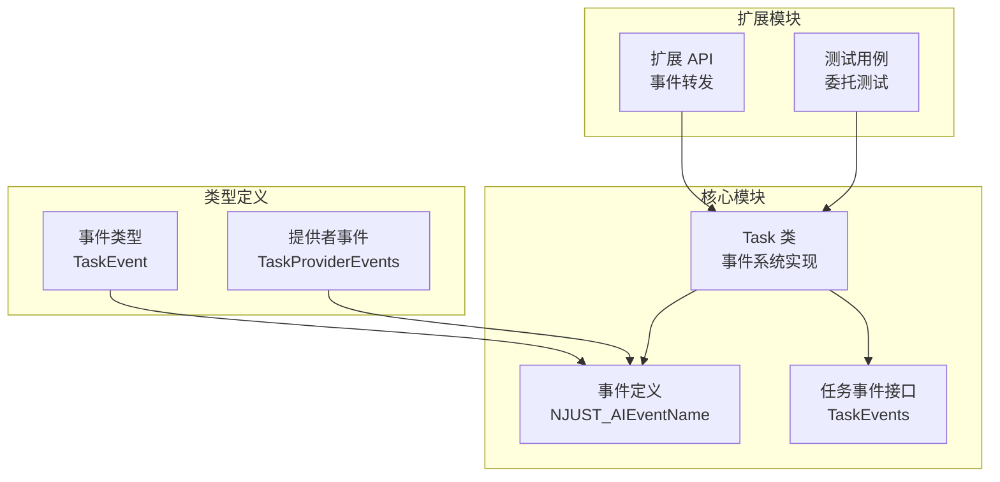

**图表来源**
- [Task.ts:176-180](file://src/core/task/Task.ts#L176-L180)
- [events.ts:11-57](file://packages/types/src/events.ts#L11-L57)
- [task.ts:134-161](file://packages/types/src/task.ts#L134-L161)

**章节来源**
- [Task.ts:1-100](file://src/core/task/Task.ts#L1-L100)
- [events.ts:1-100](file://packages/types/src/events.ts#L1-L100)
- [task.ts:1-100](file://packages/types/src/task.ts#L1-L100)

## 核心组件

### 事件系统基础架构

任务事件系统基于 Node.js 的 EventEmitter 模式构建，通过泛型类型参数确保类型安全：

```mermaid
classDiagram
class Task {
+taskId : string
+rootTaskId? : string
+parentTaskId? : string
+childTaskId? : string
+metadata : TaskMetadata
+taskStatus : TaskStatus
+on(event, listener)
+off(event, listener)
+emit(event, ...args)
+start()
+abortTask()
+dispose()
}
class EventEmitter~T~ {
<<interface>>
+on(event, listener)
+off(event, listener)
+emit(event, ...args)
+removeAllListeners()
}
class TaskEvents {
<<interface>>
+TaskStarted : []
+TaskCompleted : [taskId, tokenUsage, toolUsage]
+TaskAborted : []
+TaskActive : [taskId]
+TaskInteractive : [taskId]
+TaskResumable : [taskId]
+TaskIdle : [taskId]
+TaskPaused : [taskId]
+TaskUnpaused : [taskId]
+TaskSpawned : [taskId]
+Message : [{action, message}]
+TaskModeSwitched : [taskId, mode]
+TaskAskResponded : []
+TaskUserMessage : [taskId]
+QueuedMessagesUpdated : [taskId, messages]
+TaskToolFailed : [taskId, tool, error]
+TaskTokenUsageUpdated : [taskId, tokenUsage, toolUsage]
}
Task --|> EventEmitter~TaskEvents~
Task --> TaskEvents
```

**图表来源**
- [Task.ts:176-180](file://src/core/task/Task.ts#L176-L180)
- [task.ts:134-161](file://packages/types/src/task.ts#L134-L161)

### 事件类型定义

系统定义了完整的事件类型体系，涵盖任务生命周期的各个方面：

| 事件类别 | 事件名称 | 参数类型 | 触发时机 |
|---------|----------|----------|----------|
| 任务生命周期 | TaskStarted | [] | 任务开始执行时 |
| 任务生命周期 | TaskCompleted | [taskId, tokenUsage, toolUsage] | 任务完成时 |
| 任务生命周期 | TaskAborted | [] | 任务被中止时 |
| 任务状态 | TaskActive | [taskId] | 任务进入活跃状态时 |
| 任务状态 | TaskInteractive | [taskId] | 需要用户交互时 |
| 任务状态 | TaskResumable | [taskId] | 可以恢复时 |
| 任务状态 | TaskIdle | [taskId] | 任务空闲时 |
| 子任务生命周期 | TaskPaused | [taskId] | 子任务暂停时 |
| 子任务生命周期 | TaskUnpaused | [taskId] | 子任务恢复时 |
| 子任务生命周期 | TaskSpawned | [taskId] | 新子任务创建时 |

**章节来源**
- [events.ts:11-57](file://packages/types/src/events.ts#L11-L57)
- [task.ts:134-161](file://packages/types/src/task.ts#L134-L161)

## 架构概览

任务生命周期事件系统采用分层架构设计，确保各组件职责清晰：

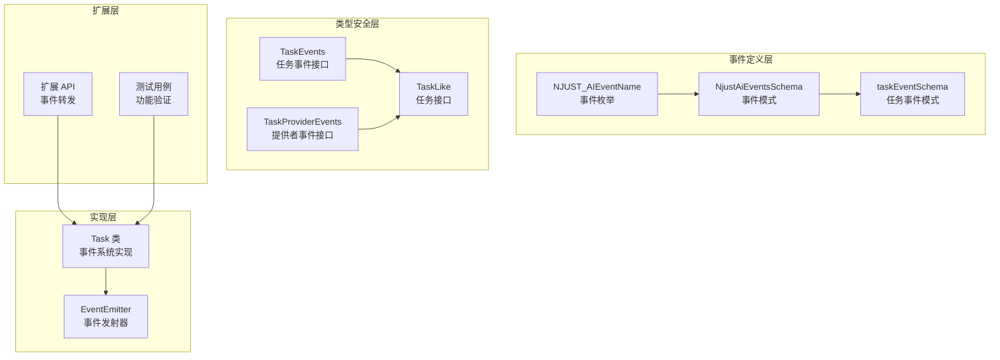

**图表来源**
- [events.ts:118-290](file://packages/types/src/events.ts#L118-L290)
- [task.ts:134-161](file://packages/types/src/task.ts#L134-L161)
- [Task.ts:176-180](file://src/core/task/Task.ts#L176-L180)

## 详细组件分析

### 事件系统实现

Task 类继承自 EventEmitter 并实现了类型安全的事件系统：

#### 事件注册机制

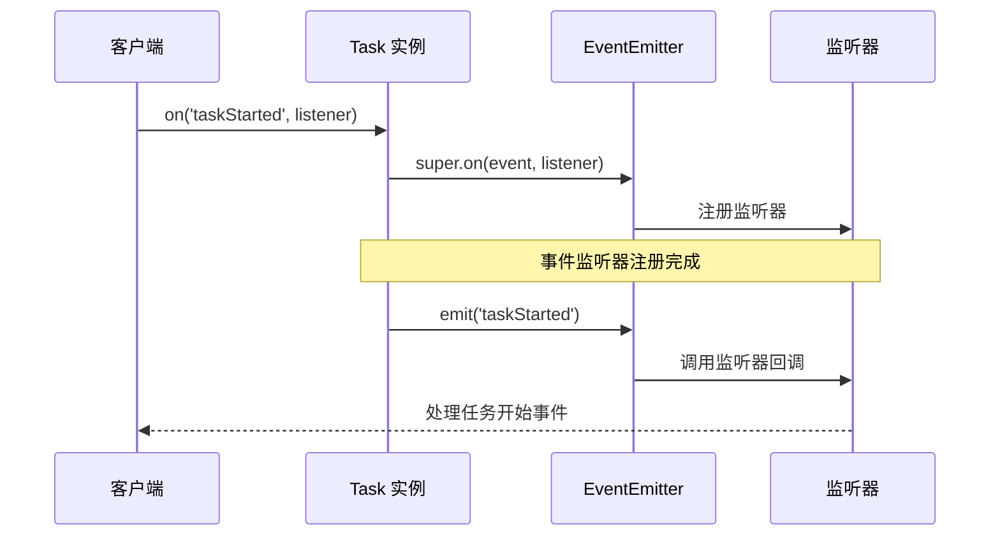

**图表来源**
- [Task.ts:532-538](file://src/core/task/Task.ts#L532-L538)
- [Task.ts:1917-1990](file://src/core/task/Task.ts#L1917-L1990)

#### 生命周期事件处理

任务生命周期事件按照严格的时序触发：

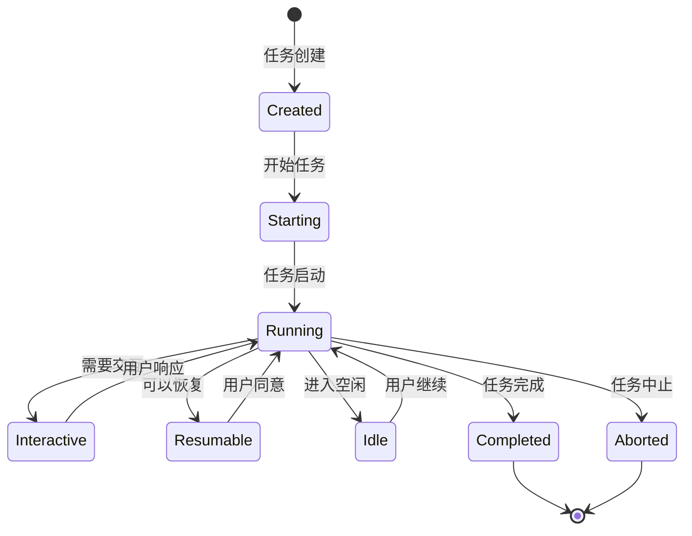

**图表来源**
- [Task.ts:1917-1990](file://src/core/task/Task.ts#L1917-L1990)
- [Task.ts:2248-2280](file://src/core/task/Task.ts#L2248-L2280)

### 关键事件处理机制

#### 任务启动事件 (TaskStarted)

任务启动时会触发多个相关事件：

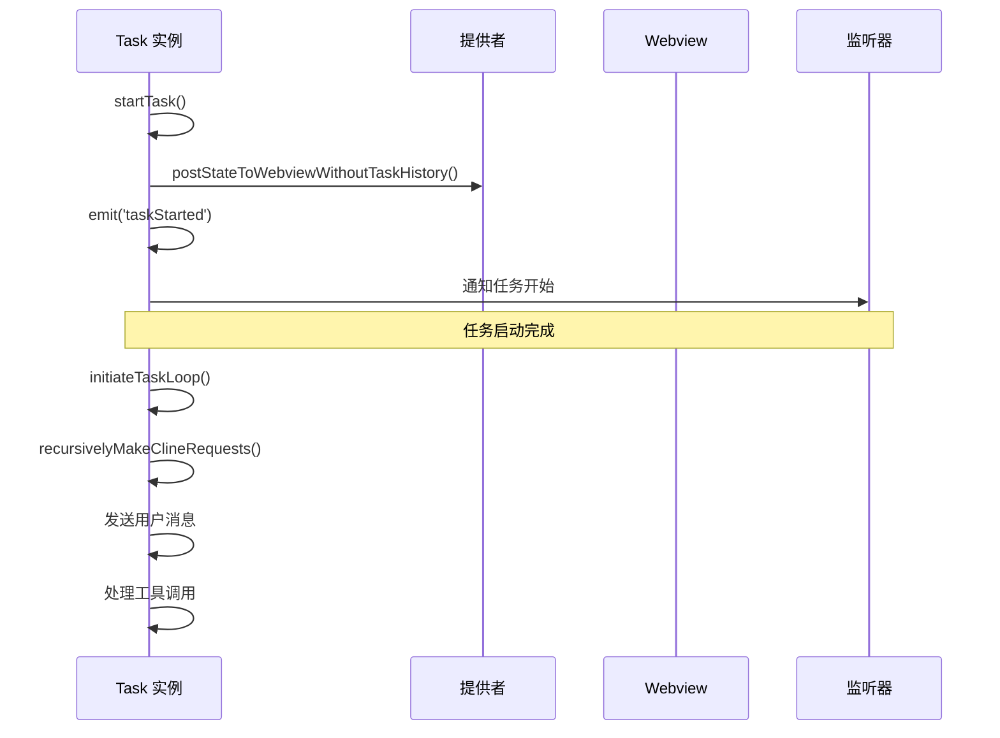

**图表来源**
- [Task.ts:1917-1990](file://src/core/task/Task.ts#L1917-L1990)
- [Task.ts:3077-3109](file://src/core/task/Task.ts#L3077-L3109)

#### 任务状态事件

系统支持多种任务状态事件，每种事件都有特定的触发条件：

| 事件类型 | 触发条件 | 参数说明 | 使用场景 |
|---------|----------|----------|----------|
| TaskActive | 任务从等待状态转为活跃 | taskId: 任务ID | 任务重新开始处理 |
| TaskInteractive | 需要用户交互的询问 | taskId: 任务ID | 工具调用审批、用户确认 |
| TaskResumable | 任务可以恢复 | taskId: 任务ID | 自动保存点、中断恢复 |
| TaskIdle | 任务进入空闲状态 | taskId: 任务ID | 等待用户输入、资源释放 |

**章节来源**
- [Task.ts:1373-1407](file://src/core/task/Task.ts#L1373-L1407)
- [Task.ts:1469-1477](file://src/core/task/Task.ts#L1469-L1477)

#### 子任务生命周期事件

子任务管理涉及复杂的事件传播机制：

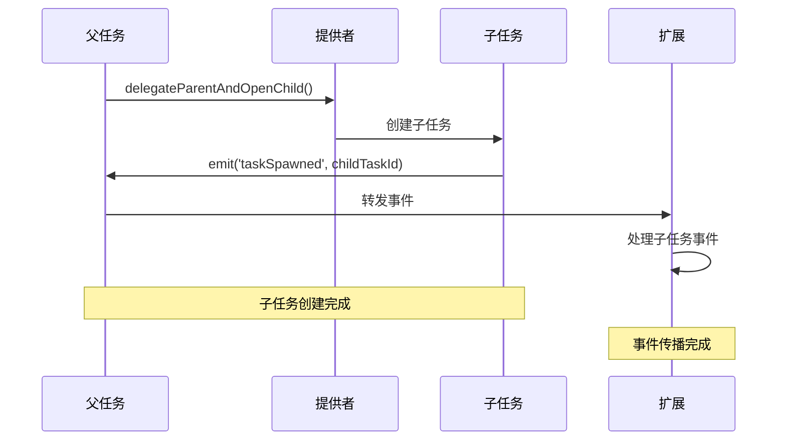

**图表来源**
- [Task.ts:2371-2385](file://src/core/task/Task.ts#L2371-L2385)
- [api.ts:369-375](file://src/extension/api.ts#L369-L375)

**章节来源**
- [Task.ts:2371-2459](file://src/core/task/Task.ts#L2371-L2459)
- [api.ts:335-375](file://src/extension/api.ts#L335-L375)

### 异步事件处理

系统采用异步事件处理机制，确保事件处理不会阻塞主线程：

#### 事件处理流程

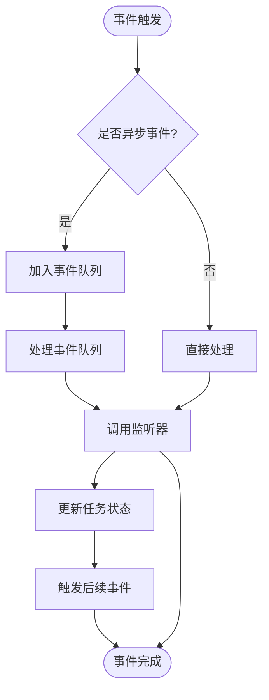

**图表来源**
- [Task.ts:532-538](file://src/core/task/Task.ts#L532-L538)
- [Task.ts:1215-1220](file://src/core/task/Task.ts#L1215-L1220)

#### 错误处理机制

系统提供完善的错误处理机制，确保事件处理的可靠性：

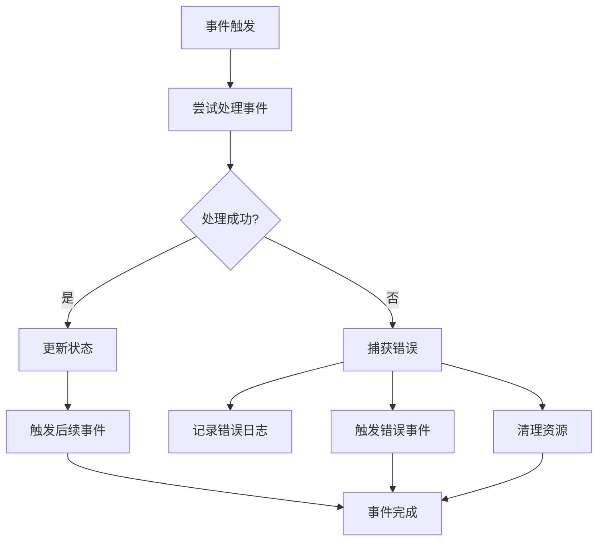

**图表来源**
- [Task.ts:2248-2280](file://src/core/task/Task.ts#L2248-L2280)
- [Task.ts:2282-2366](file://src/core/task/Task.ts#L2282-L2366)

**章节来源**
- [Task.ts:2248-2366](file://src/core/task/Task.ts#L2248-L2366)

### 事件参数传递

系统采用结构化的事件参数传递机制，确保数据的完整性和类型安全：

#### 事件参数结构

| 事件类型 | 参数结构 | 数据类型 | 描述 |
|---------|----------|----------|------|
| TaskCompleted | [taskId, tokenUsage, toolUsage, options] | string, TokenUsage, ToolUsage, object | 任务完成事件参数 |
| TaskInteractive | [taskId] | string | 交互式任务参数 |
| TaskResumable | [taskId] | string | 可恢复任务参数 |
| TaskTokenUsageUpdated | [taskId, tokenUsage, toolUsage] | string, TokenUsage, ToolUsage | 令牌使用量更新参数 |
| TaskSpawned | [taskId, childTaskId] | string, string | 子任务创建参数 |

**章节来源**
- [events.ts:64-113](file://packages/types/src/events.ts#L64-L113)
- [task.ts:134-161](file://packages/types/src/task.ts#L134-L161)

## 依赖关系分析

任务生命周期事件系统涉及多个模块间的复杂依赖关系：

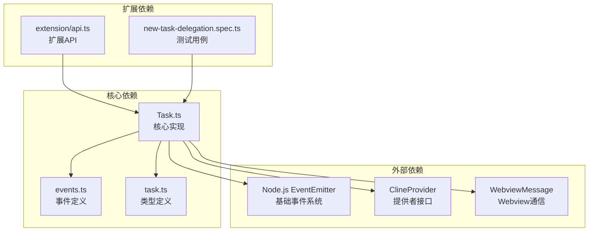

**图表来源**
- [Task.ts:1-50](file://src/core/task/Task.ts#L1-L50)
- [events.ts:1-50](file://packages/types/src/events.ts#L1-L50)
- [task.ts:1-50](file://packages/types/src/task.ts#L1-L50)

### 事件传播机制

系统采用多层事件传播机制，确保事件能够在不同组件间正确传递：

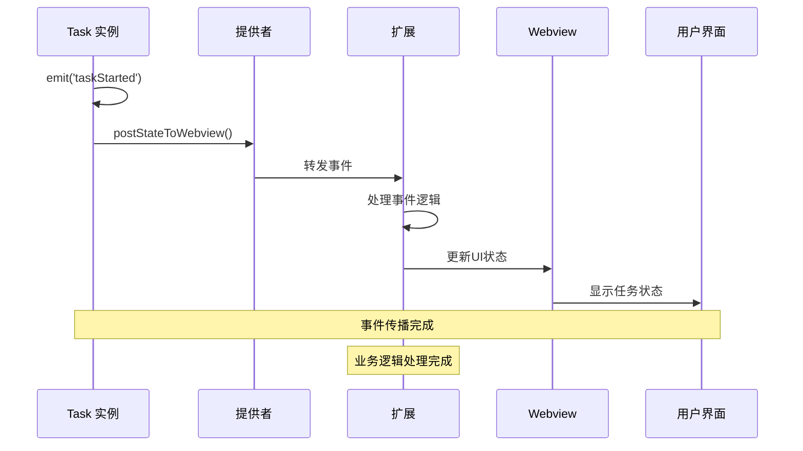

**图表来源**
- [Task.ts:1167-1172](file://src/core/task/Task.ts#L1167-L1172)
- [api.ts:335-375](file://src/extension/api.ts#L335-L375)

**章节来源**
- [api.ts:335-375](file://src/extension/api.ts#L335-L375)
- [Task.ts:1167-1172](file://src/core/task/Task.ts#L1167-L1172)

## 性能考虑

任务生命周期事件系统在设计时充分考虑了性能优化：

### 事件处理优化

1. **异步事件处理**: 所有事件处理都是异步的，避免阻塞主线程
2. **事件去重**: 系统自动去除重复的事件监听器
3. **内存管理**: 及时清理不再使用的事件监听器，防止内存泄漏
4. **批量处理**: 对于频繁的事件，采用批量处理机制

### 性能监控

系统提供令牌使用量监控功能，通过去抖动机制优化事件频率：

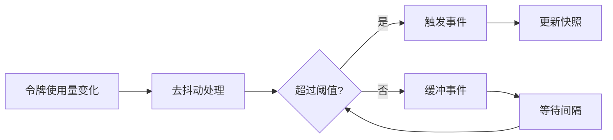

**图表来源**
- [Task.ts:558-573](file://src/core/task/Task.ts#L558-L573)
- [Task.ts:1215-1220](file://src/core/task/Task.ts#L1215-L1220)

**章节来源**
- [Task.ts:558-573](file://src/core/task/Task.ts#L558-L573)
- [Task.ts:1215-1220](file://src/core/task/Task.ts#L1215-L1220)

## 故障排除指南

### 常见问题及解决方案

#### 事件监听器未触发

**问题描述**: 事件监听器注册后不触发

**可能原因**:
1. 事件名称拼写错误
2. 监听器函数引用不正确
3. 事件在监听器注册前已经触发

**解决方案**:
```typescript
// 正确的事件监听器注册方式
task.on(NJUST_AIEventName.TaskStarted, (taskId) => {
    console.log('任务开始:', taskId);
});

// 确保事件监听器在事件触发前注册
const handleTaskStarted = (taskId) => {
    // 处理逻辑
};
task.on(NJUST_AIEventName.TaskStarted, handleTaskStarted);
```

#### 事件参数类型错误

**问题描述**: 事件参数类型与预期不符

**解决方案**:
```typescript
// 使用类型断言确保参数类型正确
task.on(NJUST_AIEventName.TaskCompleted, ([taskId, tokenUsage, toolUsage]) => {
    if (typeof taskId === 'string' && tokenUsage && toolUsage) {
        // 处理逻辑
    }
});
```

#### 内存泄漏问题

**问题描述**: 事件监听器导致内存泄漏

**解决方案**:
```typescript
// 及时移除不再需要的事件监听器
const listener = (taskId) => {
    // 处理逻辑
};
task.on(NJUST_AIEventName.TaskStarted, listener);

// 在适当的时候移除监听器
// task.off(NJUST_AIEventName.TaskStarted, listener);

// 或者使用一次性监听器
task.once(NJUST_AIEventName.TaskCompleted, () => {
    // 只执行一次的逻辑
});
```

**章节来源**
- [Task.ts:2282-2366](file://src/core/task/Task.ts#L2282-L2366)

### 调试技巧

1. **事件日志**: 启用详细的事件日志记录
2. **状态监控**: 监控任务状态变化
3. **内存分析**: 定期检查内存使用情况
4. **性能分析**: 分析事件处理性能

## 结论

任务生命周期事件系统是一个设计精良、类型安全、性能优化的事件驱动架构。通过 EventEmitter 基础设施和 TypeScript 类型系统，系统提供了完整的任务生命周期管理能力。

### 主要优势

1. **类型安全**: 全面的 TypeScript 类型定义确保事件参数的正确性
2. **异步处理**: 支持异步事件处理，不影响主线程性能
3. **事件传播**: 完善的事件传播机制，支持多层组件通信
4. **错误处理**: 健壮的错误处理机制，确保系统稳定性
5. **性能优化**: 采用去抖动、批量处理等优化技术

### 应用场景

该事件系统适用于以下场景：
- 任务状态监控和管理
- 任务生命周期事件追踪
- 多组件间的状态同步
- 任务异常处理和恢复
- 用户界面状态更新

### 未来发展方向

1. **事件持久化**: 支持事件历史记录和回放
2. **事件过滤**: 提供更精细的事件过滤机制
3. **性能监控**: 增强事件处理性能监控功能
4. **分布式事件**: 支持跨进程的事件通信

通过持续的优化和完善，任务生命周期事件系统将为 Njust-AI 平台提供更加稳定可靠的任务管理能力。