# 任务生命周期管理

<cite>
**本文档引用的文件**
- [Task.ts](file://src/core/task/Task.ts)
- [TaskHistoryStore.ts](file://src/core/task-persistence/TaskHistoryStore.ts)
- [apiMessages.ts](file://src/core/task-persistence/apiMessages.ts)
- [taskMessages.ts](file://src/core/task-persistence/taskMessages.ts)
- [taskMetadata.ts](file://src/core/task-persistence/taskMetadata.ts)
- [index.ts](file://src/core/task-persistence/index.ts)
- [api.ts](file://src/extension/api.ts)
- [agent-state.ts](file://apps/cli/src/agent/agent-state.ts)
- [AGENT_LOOP.md](file://apps/cli/docs/AGENT_LOOP.md)
</cite>

## 目录
1. [简介](#简介)
2. [项目结构](#项目结构)
3. [核心组件](#核心组件)
4. [架构概览](#架构概览)
5. [详细组件分析](#详细组件分析)
6. [依赖关系分析](#依赖关系分析)
7. [性能考虑](#性能考虑)
8. [故障排除指南](#故障排除指南)
9. [结论](#结论)

## 简介

本文档深入解析 Njust-AI 项目中的任务生命周期管理系统，重点分析 Task 类的核心架构和实现细节。该系统提供了完整的任务生命周期管理，包括任务创建、初始化、启动、执行、暂停、恢复、完成、销毁等各个阶段的状态转换机制。

系统采用事件驱动架构，通过 EventEmitter 实现任务状态的异步通知和回调处理。任务数据采用持久化存储策略，确保任务状态在进程重启后能够正确恢复。系统还集成了 MCP（Model Context Protocol）工具支持，提供丰富的工具调用和执行能力。

## 项目结构

任务生命周期管理相关的核心文件组织如下：

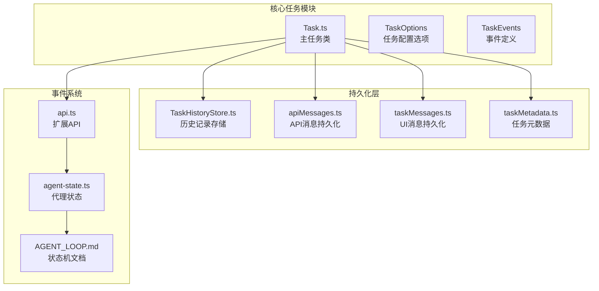

**图表来源**
- [Task.ts:176-587](file://src/core/task/Task.ts#L176-L587)
- [TaskHistoryStore.ts:44-100](file://src/core/task-persistence/TaskHistoryStore.ts#L44-L100)
- [apiMessages.ts:12-38](file://src/core/task-persistence/apiMessages.ts#L12-L38)
- [taskMessages.ts:12-56](file://src/core/task-persistence/taskMessages.ts#L12-L56)
- [taskMetadata.ts:15-118](file://src/core/task-persistence/taskMetadata.ts#L15-L118)

**章节来源**
- [Task.ts:1-100](file://src/core/task/Task.ts#L1-L100)
- [TaskHistoryStore.ts:1-50](file://src/core/task-persistence/TaskHistoryStore.ts#L1-L50)

## 核心组件

### Task 类架构

Task 类是整个任务生命周期管理的核心，继承自 EventEmitter，提供了完整的任务生命周期控制能力：

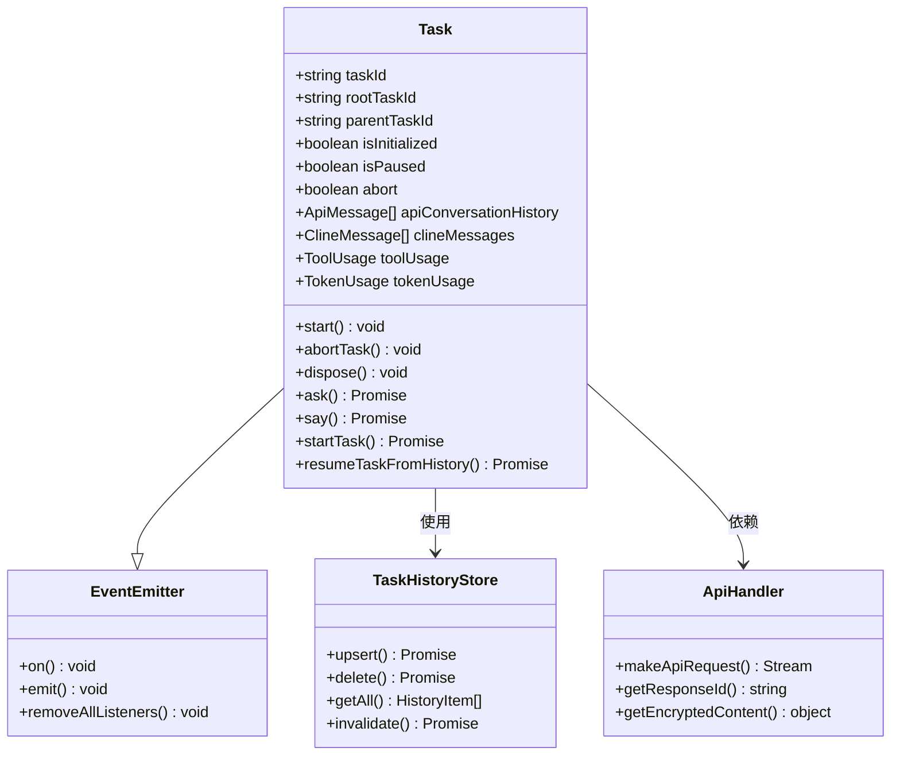

**图表来源**
- [Task.ts:176-587](file://src/core/task/Task.ts#L176-L587)
- [TaskHistoryStore.ts:44-100](file://src/core/task-persistence/TaskHistoryStore.ts#L44-L100)

### 任务状态管理

系统实现了完整的状态管理机制，包括任务模式、API 配置名称等关键状态：

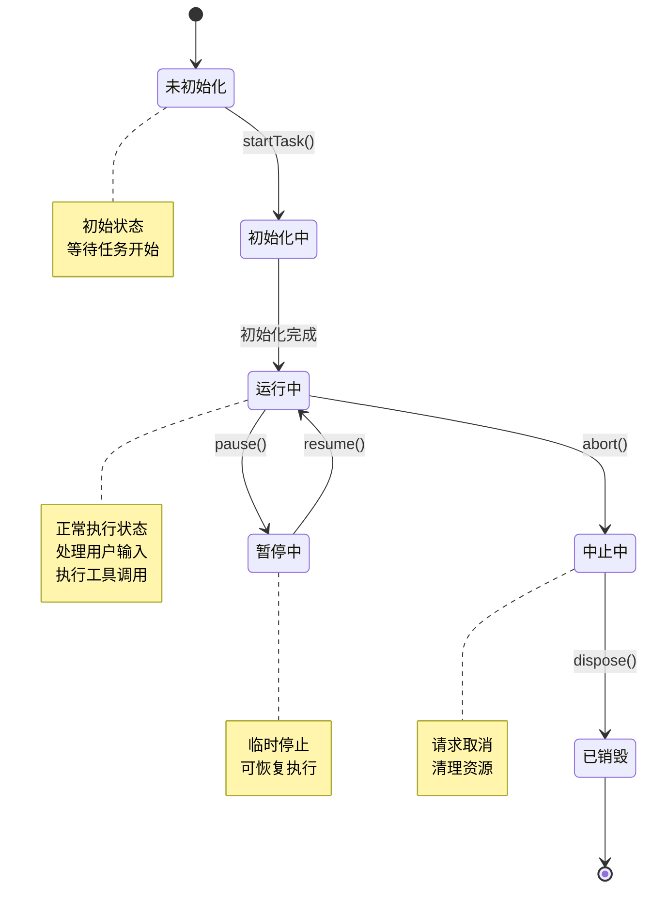

**图表来源**
- [Task.ts:1917-1990](file://src/core/task/Task.ts#L1917-L1990)
- [Task.ts:2248-2280](file://src/core/task/Task.ts#L2248-L2280)

**章节来源**
- [Task.ts:176-587](file://src/core/task/Task.ts#L176-L587)
- [Task.ts:1917-2280](file://src/core/task/Task.ts#L1917-L2280)

## 架构概览

### 系统架构图

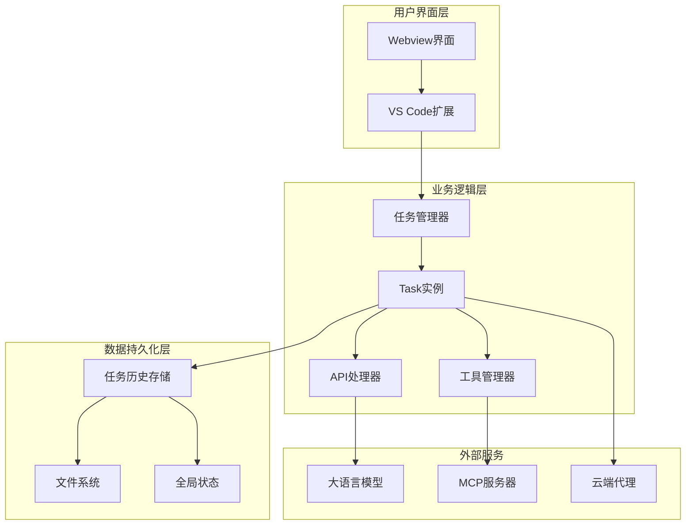

**图表来源**
- [Task.ts:431-587](file://src/core/task/Task.ts#L431-L587)
- [TaskHistoryStore.ts:67-100](file://src/core/task-persistence/TaskHistoryStore.ts#L67-L100)

### 事件驱动架构

系统采用事件驱动架构，通过 EventEmitter 实现松耦合的任务状态通知：

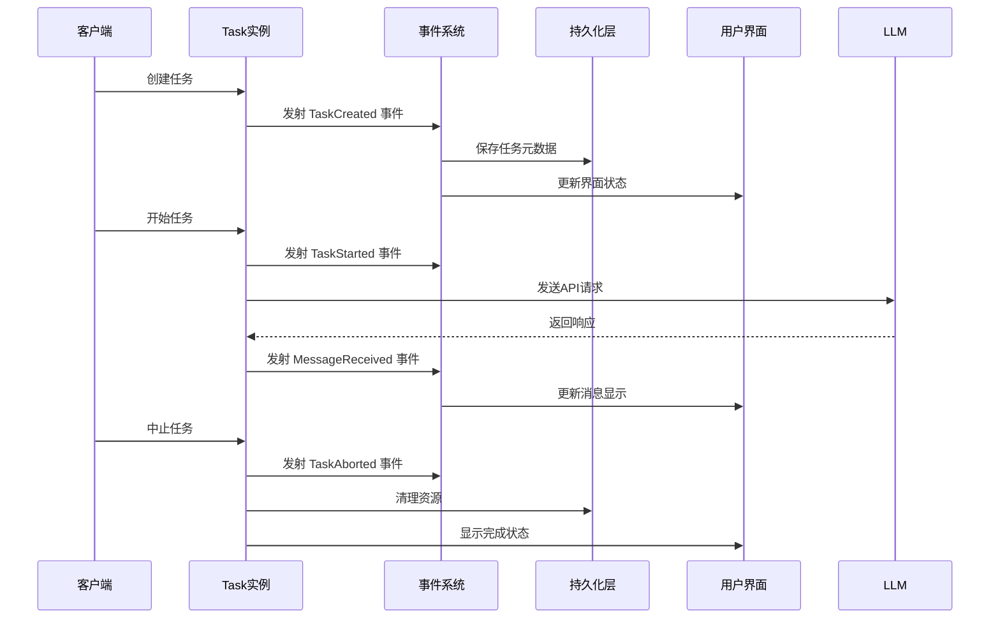

**图表来源**
- [Task.ts:1243-1478](file://src/core/task/Task.ts#L1243-L1478)
- [api.ts:335-375](file://src/extension/api.ts#L335-L375)

**章节来源**
- [Task.ts:1243-1478](file://src/core/task/Task.ts#L1243-L1478)
- [api.ts:335-375](file://src/extension/api.ts#L335-L375)

## 详细组件分析

### 任务创建与初始化

任务的创建过程包含多个关键步骤，确保任务状态的正确初始化：

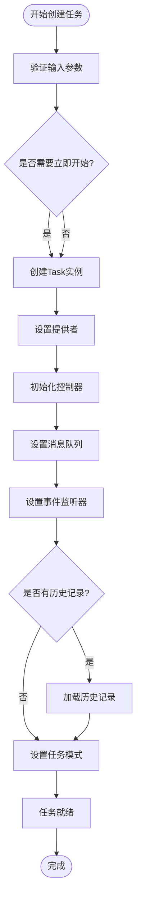

**图表来源**
- [Task.ts:431-587](file://src/core/task/Task.ts#L431-L587)
- [Task.ts:590-662](file://src/core/task/Task.ts#L590-L662)

#### 任务配置选项

TaskOptions 接口定义了任务创建时的所有配置选项：

| 配置项 | 类型 | 描述 | 默认值 |
|--------|------|------|--------|
| provider | ClineProvider | 提供者实例 | 必需 |
| apiConfiguration | ProviderSettings | API配置 | 必需 |
| startTask | boolean | 是否立即开始任务 | true |
| historyItem | HistoryItem | 历史记录项 | undefined |
| enableCheckpoints | boolean | 是否启用检查点 | true |
| checkpointTimeout | number | 检查点超时时间 | 30秒 |

**章节来源**
- [Task.ts:155-174](file://src/core/task/Task.ts#L155-L174)
- [Task.ts:431-587](file://src/core/task/Task.ts#L431-L587)

### 任务状态机实现

系统实现了复杂的状态机来管理任务的不同执行阶段：

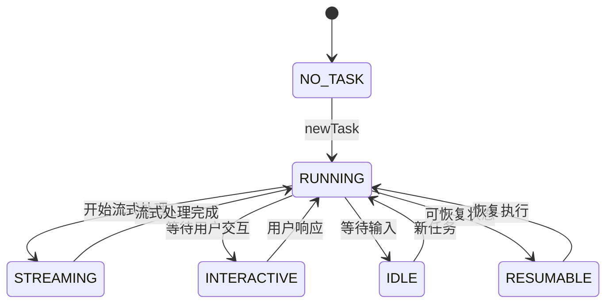

**图表来源**
- [agent-state.ts:18-53](file://apps/cli/src/agent/agent-state.ts#L18-L53)
- [AGENT_LOOP.md:116-142](file://apps/cli/docs/AGENT_LOOP.md#L116-L142)

#### 状态转换规则

每个状态转换都有明确的触发条件和处理逻辑：

| 状态 | 触发条件 | 处理逻辑 | 下一状态 |
|------|----------|----------|----------|
| NO_TASK | 任务创建 | 初始化任务状态 | RUNNING |
| RUNNING | 流式响应开始 | 设置流式标志 | STREAMING |
| STREAMING | 流式响应结束 | 清理流式状态 | RUNNING |
| INTERACTIVE | 需要用户输入 | 设置交互标志 | IDLE |
| IDLE | 用户输入到达 | 清理空闲状态 | RUNNING |
| RESUMABLE | 任务暂停 | 保存可恢复状态 | IDLE |

**章节来源**
- [agent-state.ts:18-53](file://apps/cli/src/agent/agent-state.ts#L18-L53)
- [Task.ts:1373-1407](file://src/core/task/Task.ts#L1373-L1407)

### 数据持久化策略

系统采用了多层次的数据持久化策略，确保任务状态的可靠存储：

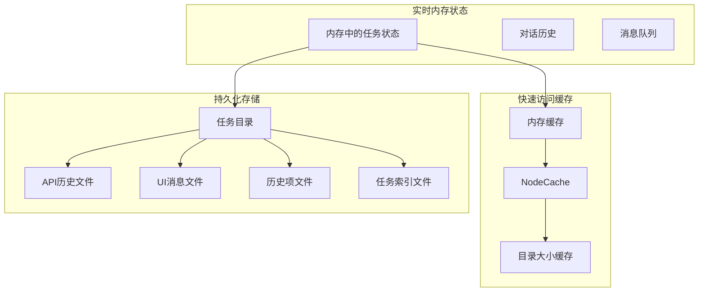

**图表来源**
- [Task.ts:1121-1157](file://src/core/task/Task.ts#L1121-L1157)
- [TaskHistoryStore.ts:44-100](file://src/core/task-persistence/TaskHistoryStore.ts#L44-L100)

#### API消息持久化

API消息持久化使用专门的数据结构来存储对话历史：

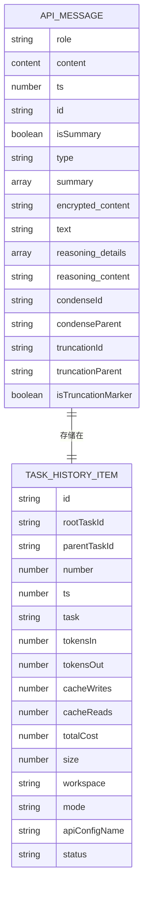

**图表来源**
- [apiMessages.ts:12-38](file://src/core/task-persistence/apiMessages.ts#L12-L38)
- [taskMetadata.ts:96-118](file://src/core/task-persistence/taskMetadata.ts#L96-L118)

**章节来源**
- [apiMessages.ts:12-122](file://src/core/task-persistence/apiMessages.ts#L12-L122)
- [taskMessages.ts:12-56](file://src/core/task-persistence/taskMessages.ts#L12-L56)
- [taskMetadata.ts:30-118](file://src/core/task-persistence/taskMetadata.ts#L30-L118)

### 事件系统与回调处理

系统通过 EventEmitter 实现了完整的事件驱动机制：

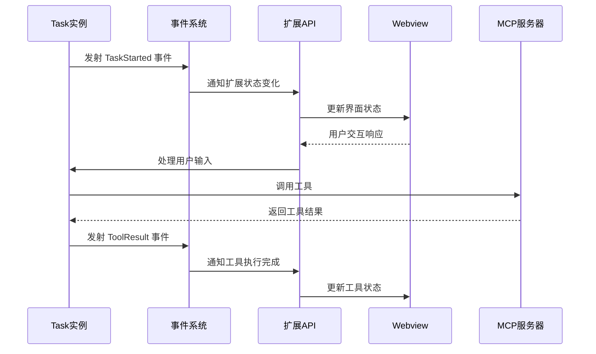

**图表来源**
- [Task.ts:1171-1172](file://src/core/task/Task.ts#L1171-L1172)
- [api.ts:335-375](file://src/extension/api.ts#L335-L375)

#### 事件类型定义

系统定义了多种事件类型来处理不同的任务状态变化：

| 事件类型 | 触发时机 | 参数 | 用途 |
|----------|----------|------|------|
| TaskStarted | 任务开始 | taskId | 初始化界面状态 |
| TaskAborted | 任务中止 | taskId | 清理资源 |
| Message | 消息创建 | action, message | 更新消息列表 |
| TaskTokenUsageUpdated | 令牌使用更新 | tokenUsage, toolUsage | 显示成本统计 |
| TaskInteractive | 交互状态 | taskId | 显示输入框 |
| TaskResumable | 可恢复状态 | taskId | 显示恢复按钮 |
| TaskIdle | 空闲状态 | taskId | 显示等待指示器 |

**章节来源**
- [Task.ts:1171-1227](file://src/core/task/Task.ts#L1171-L1227)
- [api.ts:335-375](file://src/extension/api.ts#L335-L375)

### 工具使用统计与监控

系统提供了完善的工具使用统计功能：

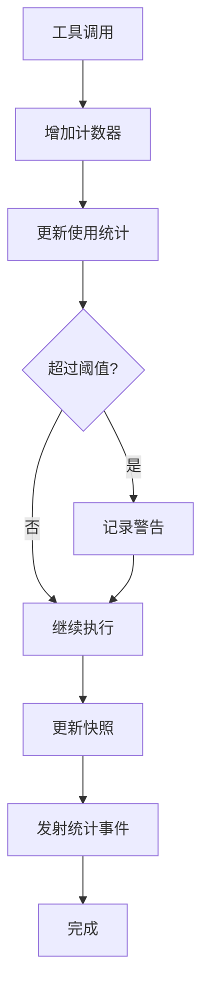

**图表来源**
- [Task.ts:334-340](file://src/core/task/Task.ts#L334-L340)
- [Task.ts:1215-1220](file://src/core/task/Task.ts#L1215-L1220)

#### 统计数据结构

工具使用统计采用增量更新的方式，避免频繁的磁盘I/O操作：

| 统计指标 | 数据类型 | 更新频率 | 存储位置 |
|----------|----------|----------|----------|
| consecutiveMistakeCount | number | 每次错误 | 内存 |
| toolUsage | ToolUsage | 每次工具调用 | 内存+快照 |
| tokenUsage | TokenUsage | 每次API调用 | 内存+快照 |
| consecutiveNoToolUseCount | number | 每次无工具使用 | 内存 |
| consecutiveNoAssistantMessagesCount | number | 每次无助手消息 | 内存 |

**章节来源**
- [Task.ts:334-340](file://src/core/task/Task.ts#L334-L340)
- [Task.ts:1215-1220](file://src/core/task/Task.ts#L1215-L1220)

## 依赖关系分析

### 核心依赖关系

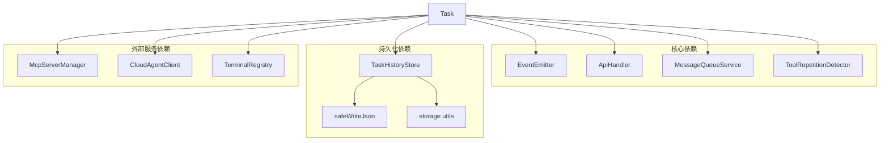

**图表来源**
- [Task.ts:1-150](file://src/core/task/Task.ts#L1-L150)
- [TaskHistoryStore.ts:1-50](file://src/core/task-persistence/TaskHistoryStore.ts#L1-L50)

### 循环依赖检测

系统通过弱引用和延迟初始化避免了循环依赖问题：

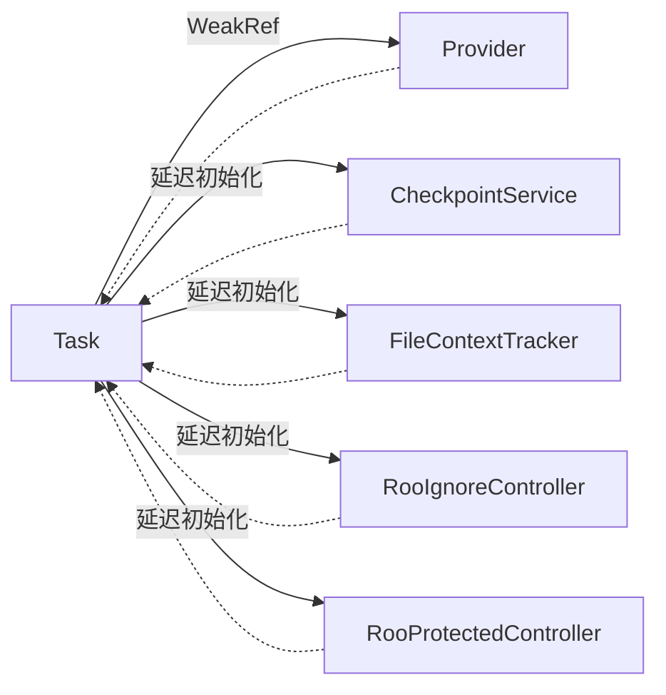

**图表来源**
- [Task.ts:280-284](file://src/core/task/Task.ts#L280-L284)
- [Task.ts:314-315](file://src/core/task/Task.ts#L314-L315)

**章节来源**
- [Task.ts:1-150](file://src/core/task/Task.ts#L1-L150)
- [Task.ts:280-315](file://src/core/task/Task.ts#L280-L315)

## 性能考虑

### 内存管理优化

系统采用了多项内存管理优化策略：

1. **弱引用模式**：对大型对象使用 WeakRef 避免内存泄漏
2. **增量更新**：统计数据采用增量更新减少磁盘I/O
3. **缓存机制**：使用 NodeCache 和内存缓存提高访问速度
4. **延迟初始化**：按需初始化昂贵的对象

### 并发控制

系统通过多种机制确保并发安全性：

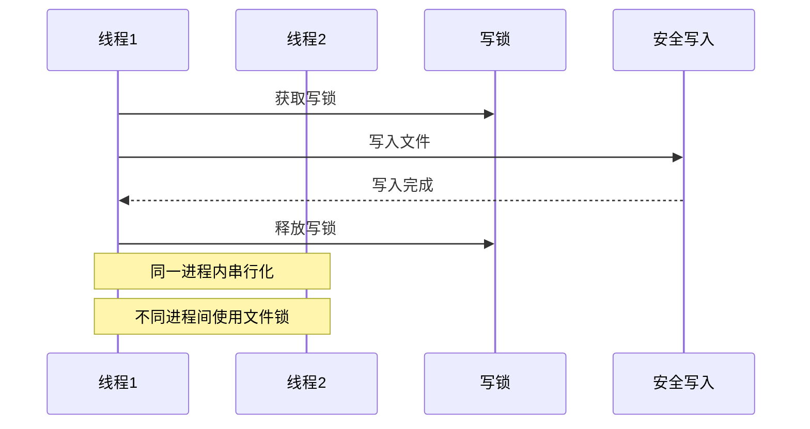

**图表来源**
- [TaskHistoryStore.ts:538-545](file://src/core/task-persistence/TaskHistoryStore.ts#L538-L545)

### 错误处理与恢复

系统实现了完善的错误处理机制：

| 错误类型 | 处理策略 | 恢复方式 |
|----------|----------|----------|
| 网络错误 | 重试机制 | 指数退避重试 |
| 文件系统错误 | 备份恢复 | 回滚到上次成功状态 |
| 内存不足 | 清理缓存 | 释放非关键资源 |
| 状态不一致 | 数据修复 | 自动修复历史记录 |

**章节来源**
- [Task.ts:1140-1157](file://src/core/task/Task.ts#L1140-L1157)
- [TaskHistoryStore.ts:538-545](file://src/core/task-persistence/TaskHistoryStore.ts#L538-L545)

## 故障排除指南

### 常见问题诊断

#### 任务无法启动

**症状**：任务创建后无法进入运行状态

**可能原因**：
1. API配置无效
2. 提供者状态异常
3. 任务模式初始化失败

**解决步骤**：
1. 检查API配置是否正确
2. 验证提供者状态获取
3. 查看任务模式初始化日志

#### 消息持久化失败

**症状**：任务历史无法保存或恢复

**可能原因**：
1. 文件权限问题
2. 磁盘空间不足
3. 文件锁定冲突

**解决步骤**：
1. 检查文件系统权限
2. 清理磁盘空间
3. 关闭其他可能访问任务文件的应用

#### 事件监听器失效

**症状**：界面状态不更新

**可能原因**：
1. 事件监听器被意外移除
2. 任务实例被提前销毁
3. 弱引用失效

**解决步骤**：
1. 检查事件监听器注册
2. 验证任务生命周期
3. 确认弱引用有效性

**章节来源**
- [Task.ts:2282-2366](file://src/core/task/Task.ts#L2282-L2366)
- [TaskHistoryStore.ts:80-100](file://src/core/task-persistence/TaskHistoryStore.ts#L80-L100)

### 调试技巧

1. **启用详细日志**：查看控制台输出的详细错误信息
2. **检查文件完整性**：验证任务目录下的所有文件是否存在且格式正确
3. **监控内存使用**：使用VS Code的内存分析工具检查内存泄漏
4. **测试事件流程**：手动触发各种事件验证事件系统的正确性

## 结论

Njust-AI 的任务生命周期管理系统展现了现代软件架构的最佳实践。通过事件驱动的设计、多层持久化策略和完善的错误处理机制，系统实现了高可靠性、高性能的任务管理能力。

系统的主要优势包括：

1. **模块化设计**：清晰的职责分离和接口定义
2. **事件驱动**：松耦合的组件通信机制
3. **持久化保障**：多层次的数据持久化策略
4. **性能优化**：内存管理和并发控制的综合考虑
5. **可扩展性**：MCP集成和工具系统的灵活扩展能力

该系统为类似的任务管理场景提供了优秀的参考实现，其设计理念和架构模式值得在其他项目中借鉴和应用。