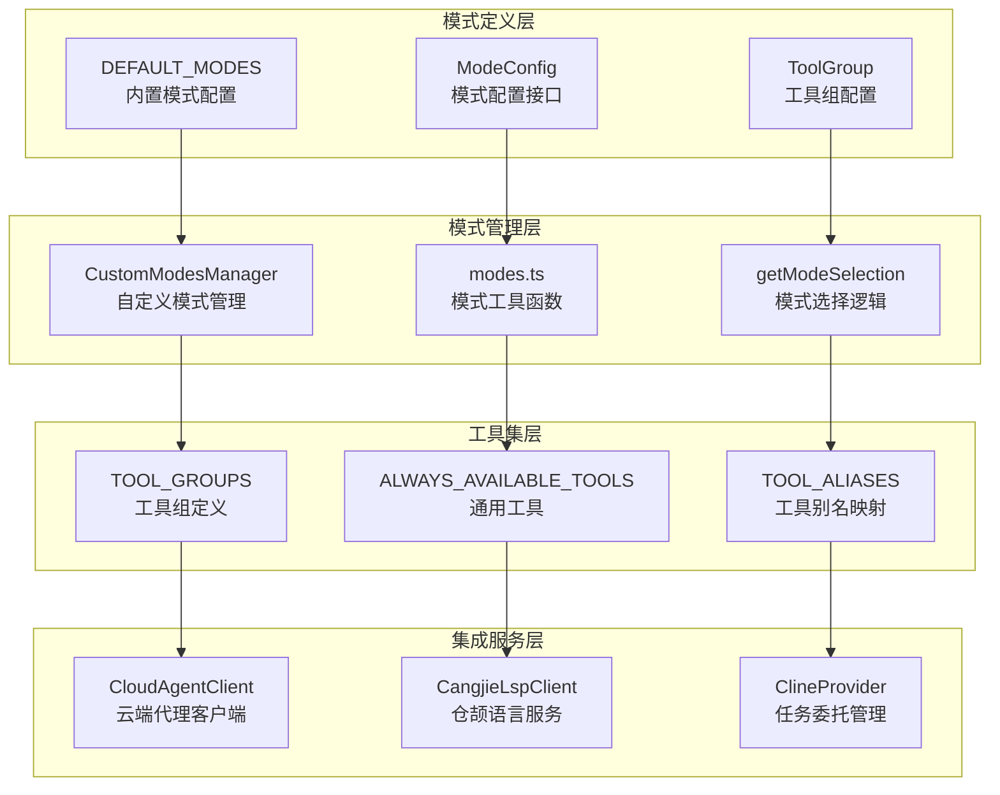
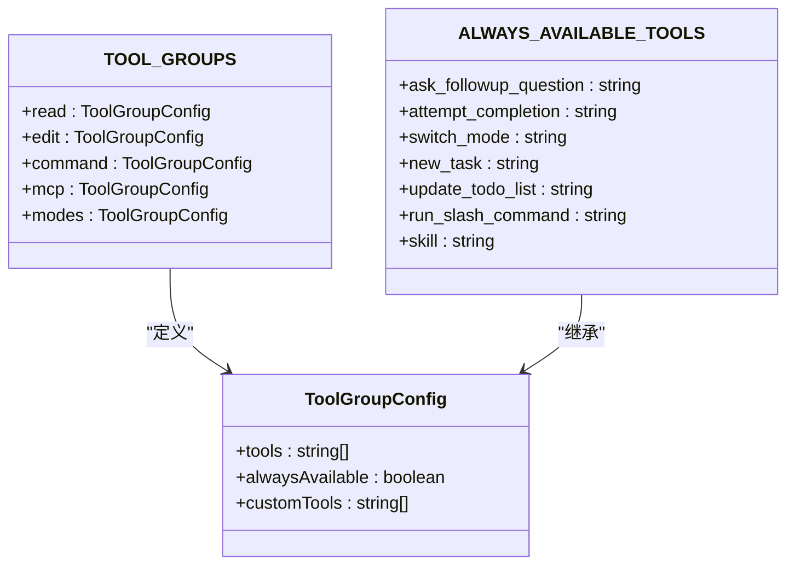
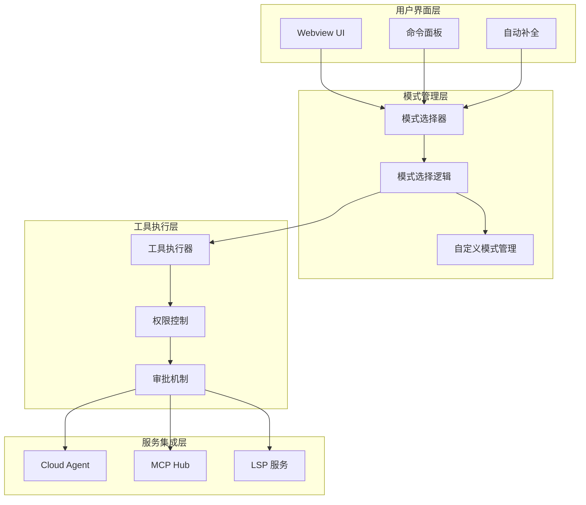
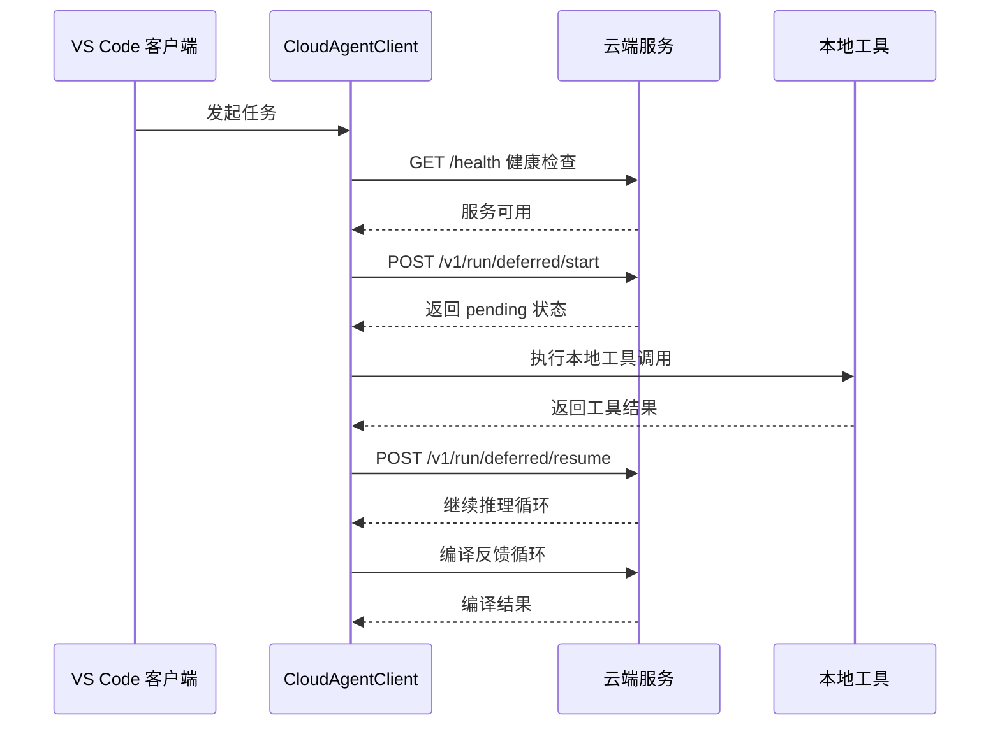
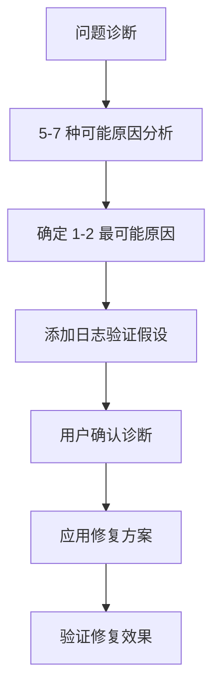
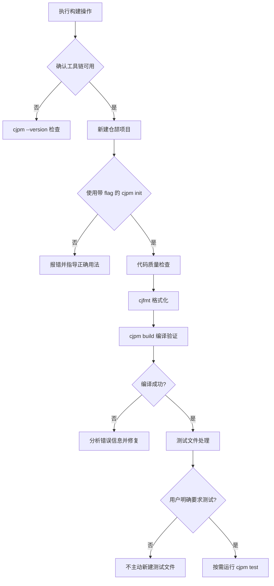
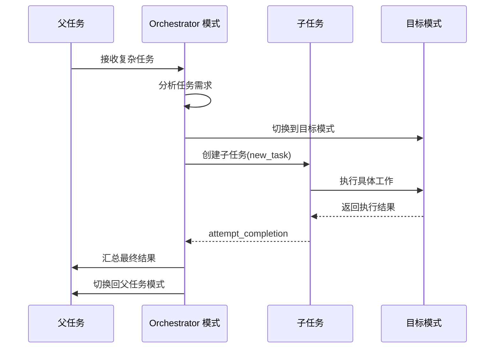
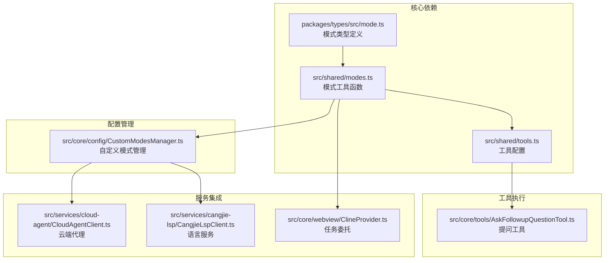
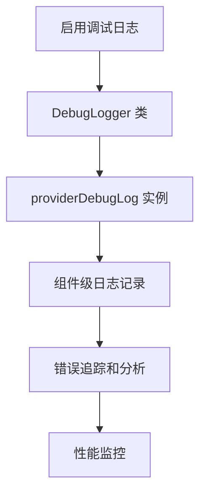

# 内置模式详解

<cite>
**本文档引用的文件**
- [packages/types/src/mode.ts](file://packages/types/src/mode.ts)
- [src/shared/modes.ts](file://src/shared/modes.ts)
- [src/shared/tools.ts](file://src/shared/tools.ts)
- [src/core/config/CustomModesManager.ts](file://src/core/config/CustomModesManager.ts)
- [src/services/cloud-agent/CloudAgentClient.ts](file://src/services/cloud-agent/CloudAgentClient.ts)
- [AGENTS.md](file://AGENTS.md)
- [src/core/webview/ClineProvider.ts](file://src/core/webview/ClineProvider.ts)
- [src/core/tools/AskFollowupQuestionTool.ts](file://src/core/tools/AskFollowupQuestionTool.ts)
- [src/services/cangjie-lsp/CangjieLspClient.ts](file://src/services/cangjie-lsp/CangjieLspClient.ts)
- [src/services/cangjie-lsp/CangjieTemplateLibrary.ts](file://src/services/cangjie-lsp/CangjieTemplateLibrary.ts)
- [packages/core/src/debug-log/index.ts](file://packages/core/src/debug-log/index.ts)
</cite>

## 目录
1. [简介](#简介)
2. [项目结构](#项目结构)
3. [核心组件](#核心组件)
4. [架构概览](#架构概览)
5. [详细组件分析](#详细组件分析)
6. [依赖关系分析](#依赖关系分析)
7. [性能考虑](#性能考虑)
8. [故障排除指南](#故障排除指南)
9. [结论](#结论)

## 简介

Njust-AI 项目内置了七个核心模式系统，每个模式都有其独特的设计目标和功能特性。这些模式构成了 AI 编程助手的核心能力框架，为用户提供从云端代理到架构设计、从代码生成到调试辅助的全方位编程体验。

内置模式系统采用模块化设计，支持自定义模式扩展和项目级配置覆盖。每个模式都定义了明确的角色定位、使用场景、工具集配置和权限控制机制。

## 项目结构

内置模式系统主要分布在以下核心模块中：



**图表来源**
- [packages/types/src/mode.ts:168-394](file://packages/types/src/mode.ts#L168-L394)
- [src/shared/modes.ts:45-91](file://src/shared/modes.ts#L45-L91)
- [src/shared/tools.ts:302-331](file://src/shared/tools.ts#L302-L331)

**章节来源**
- [packages/types/src/mode.ts:168-394](file://packages/types/src/mode.ts#L168-L394)
- [src/shared/modes.ts:1-258](file://src/shared/modes.ts#L1-L258)
- [src/shared/tools.ts:1-392](file://src/shared/tools.ts#L1-L392)

## 核心组件

### 模式配置系统

内置模式系统基于统一的配置接口，支持完整的模式生命周期管理：

| 模式属性 | 类型 | 描述 | 示例 |
|---------|------|------|------|
| slug | string | 模式唯一标识符 | "cloud-agent" |
| name | string | 模式显示名称 | "☁️ Cloud Agent" |
| roleDefinition | string | AI 角色定义 | 云端代理规划者 |
| whenToUse | string | 使用场景说明 | 默认模式 |
| description | string | 模式描述 | 云端代理驱动规划 |
| groups | GroupEntry[] | 工具组配置 | ["read", "edit", "command"] |
| customInstructions | string | 自定义指令 | 项目特定工作流 |

### 工具组配置

工具组系统提供了灵活的权限控制机制：



**图表来源**
- [src/shared/tools.ts:267-331](file://src/shared/tools.ts#L267-L331)

**章节来源**
- [src/shared/tools.ts:267-331](file://src/shared/tools.ts#L267-L331)

## 架构概览

内置模式系统采用分层架构设计，确保了高度的模块化和可扩展性：



**图表来源**
- [src/shared/modes.ts:111-132](file://src/shared/modes.ts#L111-L132)
- [src/core/config/CustomModesManager.ts:53-97](file://src/core/config/CustomModesManager.ts#L53-L97)

## 详细组件分析

### Cloud Agent 模式

Cloud Agent 模式是云端代理能力的核心实现，提供远程推理和本地工具执行的混合架构。

#### 设计目标
- 实现云端推理与本地执行的分离
- 支持延期协议的多轮交互循环
- 提供编译反馈循环机制

#### 工具集配置


**图表来源**
- [src/services/cloud-agent/CloudAgentClient.ts:263-301](file://src/services/cloud-agent/CloudAgentClient.ts#L263-L301)
- [AGENTS.md:9-13](file://AGENTS.md#L9-L13)

#### 权限控制
- API 密钥验证
- 工作区操作权限限制
- 工具调用审批机制

#### 特殊行为处理
- 延期协议循环（最多50轮）
- 编译错误自动修复循环
- 远程工作区操作确认

**章节来源**
- [src/services/cloud-agent/CloudAgentClient.ts:256-301](file://src/services/cloud-agent/CloudAgentClient.ts#L256-L301)
- [AGENTS.md:9-13](file://AGENTS.md#L9-L13)

### Architect 模式

Architect 模式专注于架构设计和规划能力，提供系统化的问题分解和解决方案设计。

#### 设计目标
- 提供技术领导者的视角
- 支持复杂的系统架构设计
- 实现规范驱动的工作流程

#### 工具集配置
Architect 模式采用受限的工具集配置，重点关注文档生成和规划：

| 工具组 | 工具列表 | 用途 |
|-------|----------|------|
| read | read_file, search_files, list_files, codebase_search, web_search | 信息收集和上下文获取 |
| edit | 仅限 Markdown 文件编辑 | 规范文档生成 |
| mcp | use_mcp_tool, access_mcp_resource | 外部工具集成 |

#### 规范驱动工作流程
Architect 模式实现了完整的 Spec Kit 工作流程：

```mermaid
flowchart TD
A[接收开发任务] --> B{检查 .specify/ 存在}
B --> |存在| C[使用 Spec Kit 结构]
B --> |不存在| D[使用 plans/ 结构]
C --> E[Phase 0: 环境检测]
D --> E
E --> F[Phase 1: 规范制定(spec.md)]
F --> G[Phase 2: 技术计划(plan.md)]
G --> H[Phase 3: 任务分解(tasks.md)]
H --> I[生成可执行清单]
I --> J[等待用户审核]
J --> K[切换到 Code 模式实现]
```

**图表来源**
- [packages/types/src/mode.ts:188-213](file://packages/types/src/mode.ts#L188-L213)

**章节来源**
- [packages/types/src/mode.ts:180-213](file://packages/types/src/mode.ts#L180-L213)

### Code 模式

Code 模式专注于代码生成和编辑能力，提供高效的编程辅助。

#### 设计目标
- 实现规范驱动的代码实现
- 支持算法和数据结构的正确性保证
- 提供主题式学习工作流

#### 工具集配置
Code 模式采用全面的工具集配置，支持完整的开发流程：

| 工具组 | 工具列表 | 用途 |
|-------|----------|------|
| read | read_file, search_files, list_files, codebase_search, web_search | 代码分析和上下文获取 |
| edit | write_to_file, apply_diff, generate_image, edit, search_replace, edit_file, apply_patch | 代码修改和生成 |
| command | execute_command, read_command_output | 命令执行和输出分析 |
| mcp | use_mcp_tool, access_mcp_resource | 外部工具集成 |

#### 算法与数据结构编写指南
Code 模式提供了详细的算法编写指导原则：

1. **正确性优先**：先理解问题，再写正确的暴力解
2. **复杂度意识**：选择合适的数据结构和算法
3. **代码清晰**：良好的变量命名和函数封装
4. **语言适配**：根据目标语言选择惯用 API

**章节来源**
- [packages/types/src/mode.ts:216-291](file://packages/types/src/mode.ts#L216-L291)
- [src/shared/tools.ts:302-320](file://src/shared/tools.ts#L302-L320)

### Ask 模式

Ask 模式专注于问答对话能力，提供知识获取和问题解答功能。

#### 设计目标
- 提供专业的技术助手能力
- 支持代码分析和概念解释
- 实现外部资源访问能力

#### 工具集配置
Ask 模式采用精简的工具集配置：

| 工具组 | 工具列表 | 用途 |
|-------|----------|------|
| read | read_file, search_files, list_files, codebase_search, web_search | 信息检索和分析 |
| mcp | use_mcp_tool, access_mcp_resource | 外部资源访问 |

#### 特殊行为处理
- 专注于回答技术问题
- 避免不必要的代码实现
- 提供 Mermaid 图表说明

**章节来源**
- [packages/types/src/mode.ts:293-303](file://packages/types/src/mode.ts#L293-L303)
- [src/shared/tools.ts:313-315](file://src/shared/tools.ts#L313-L315)

### Debug 模式

Debug 模式专注于调试辅助能力，提供系统化的故障诊断和解决方法。

#### 设计目标
- 实现系统化的调试流程
- 支持多角度问题分析
- 提供日志添加和验证机制

#### 工具集配置
Debug 模式采用全面的工具集配置：

| 工具组 | 工具列表 | 用途 |
|-------|----------|------|
| read | read_file, search_files, list_files, codebase_search, web_search | 问题分析和上下文获取 |
| edit | write_to_file, apply_diff, generate_image, edit, search_replace, edit_file, apply_patch | 代码修改和修复 |
| command | execute_command, read_command_output | 命令执行和输出分析 |
| mcp | use_mcp_tool, access_mcp_resource | 外部工具集成 |

#### 调试工作流程


**图表来源**
- [packages/types/src/mode.ts:313-315](file://packages/types/src/mode.ts#L313-L315)

**章节来源**
- [packages/types/src/mode.ts:305-315](file://packages/types/src/mode.ts#L305-L315)

### Cangjie Dev 模式

Cangjie Dev 模式专注于 Cangjie 语言开发能力，提供完整的仓颉语言工具链集成。

#### 设计目标
- 提供仓颉语言全栈开发支持
- 集成 cjpm 项目管理和构建工具
- 支持编译、运行、测试、调试全流程

#### 工具集配置
Cangjie Dev 模式采用专门的工具集配置：

| 工具组 | 工具列表 | 用途 |
|-------|----------|------|
| read | read_file, search_files, list_files, codebase_search, web_search | 代码分析和文档检索 |
| edit | 仅限 Cangjie 源文件和配置文件 | 代码修改和生成 |
| command | execute_command | 仓颉工具链命令执行 |

#### 仓颉语言核心规则
Cangjie Dev 模式强制执行以下核心规则：

1. **main 函数签名**：`main(): Int64`
2. **struct vs class**：struct 是值类型，class 是引用类型
3. **let/var/mut**：let 不可变，var 可变，mut 可修改
4. **match 穷尽**：必须覆盖所有分支
5. **spawn 捕获**：spawn 块内不能直接捕获外部变量

#### 工作流规则


**图表来源**
- [packages/types/src/mode.ts:329-379](file://packages/types/src/mode.ts#L329-L379)

**章节来源**
- [packages/types/src/mode.ts:317-379](file://packages/types/src/mode.ts#L317-L379)

### Orchestrator 模式

Orchestrator 模式专注于任务编排能力，协调复杂项目的多模式协作。

#### 设计目标
- 实现复杂任务的多模式协调
- 提供子任务委托和管理工作流
- 支持跨领域的专家协作

#### 工具集配置
Orchestrator 模式采用特殊的工具集配置，主要依赖模式切换和任务委托：

| 工具组 | 工具列表 | 用途 |
|-------|----------|------|
| modes | switch_mode, new_task | 模式切换和任务委托 |

#### 任务委托机制


**图表来源**
- [src/core/webview/ClineProvider.ts:3014-3078](file://src/core/webview/ClineProvider.ts#L3014-L3078)

#### 特殊行为处理
- 子任务的生命周期管理
- 委托元数据的持久化
- 父子任务状态同步

**章节来源**
- [src/core/webview/ClineProvider.ts:3014-3260](file://src/core/webview/ClineProvider.ts#L3014-L3260)
- [packages/types/src/mode.ts:382-392](file://packages/types/src/mode.ts#L382-L392)

## 依赖关系分析

内置模式系统具有清晰的依赖层次结构：



**图表来源**
- [packages/types/src/mode.ts:168-394](file://packages/types/src/mode.ts#L168-L394)
- [src/shared/modes.ts:45-91](file://src/shared/modes.ts#L45-L91)
- [src/core/config/CustomModesManager.ts:53-97](file://src/core/config/CustomModesManager.ts#L53-L97)

**章节来源**
- [packages/types/src/mode.ts:168-394](file://packages/types/src/mode.ts#L168-L394)
- [src/shared/modes.ts:1-258](file://src/shared/modes.ts#L1-L258)
- [src/core/config/CustomModesManager.ts:1-1021](file://src/core/config/CustomModesManager.ts#L1-L1021)

## 性能考虑

内置模式系统在设计时充分考虑了性能优化：

### 模式选择缓存
- 自定义模式管理器使用 10 秒 TTL 缓存机制
- 避免频繁的文件系统读取操作
- 支持写队列机制防止竞态条件

### 工具执行优化
- 工具参数类型化减少运行时错误
- 工具别名映射提高工具调用效率
- 通用工具预加载机制

### 内存管理
- 模式配置的冻结处理防止意外修改
- 工具组配置的只读保护
- 任务历史的增量更新策略

## 故障排除指南

### 常见问题诊断

#### 模式配置问题
- **症状**：自定义模式不生效
- **原因**：模式配置验证失败或缓存过期
- **解决方案**：检查模式配置格式，清理缓存，重新加载

#### 工具权限问题
- **症状**：某些工具调用被拒绝
- **原因**：工具组权限配置错误或文件路径限制
- **解决方案**：检查工具组配置，验证文件路径匹配规则

#### 云端代理问题
- **症状**：Cloud Agent 模式连接失败
- **原因**：API 密钥错误或网络连接问题
- **解决方案**：验证 API 配置，检查网络连通性

### 调试工具

内置模式系统提供了完善的调试支持：



**图表来源**
- [packages/core/src/debug-log/index.ts:68-107](file://packages/core/src/debug-log/index.ts#L68-L107)

**章节来源**
- [packages/core/src/debug-log/index.ts:42-107](file://packages/core/src/debug-log/index.ts#L42-L107)

## 结论

Njust-AI 的内置模式系统通过精心设计的架构和丰富的功能特性，为 AI 编程助手提供了强大的核心能力。每个模式都有明确的设计目标和使用场景，工具集配置和权限控制机制确保了安全性和可控性。

系统的主要优势包括：

1. **模块化设计**：清晰的分层架构支持独立开发和测试
2. **灵活扩展**：自定义模式管理和项目级配置覆盖
3. **安全控制**：严格的工具权限和文件路径限制
4. **性能优化**：智能缓存和异步处理机制
5. **调试支持**：完善的日志记录和错误追踪系统

内置模式系统为开发者提供了从云端代理到架构设计、从代码生成到调试辅助的完整编程体验，是 Njust-AI 项目的核心价值所在。