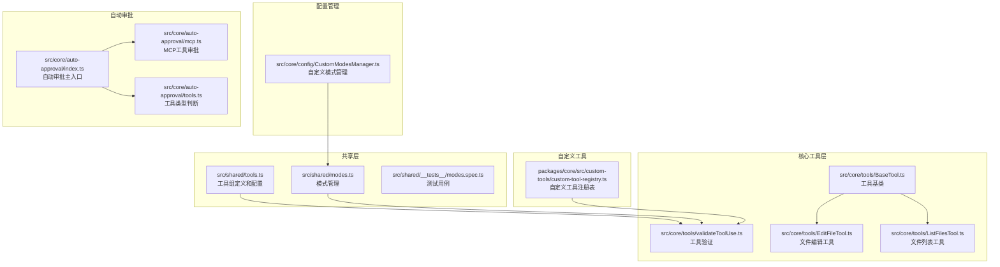
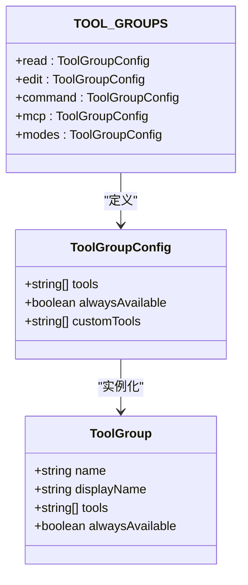
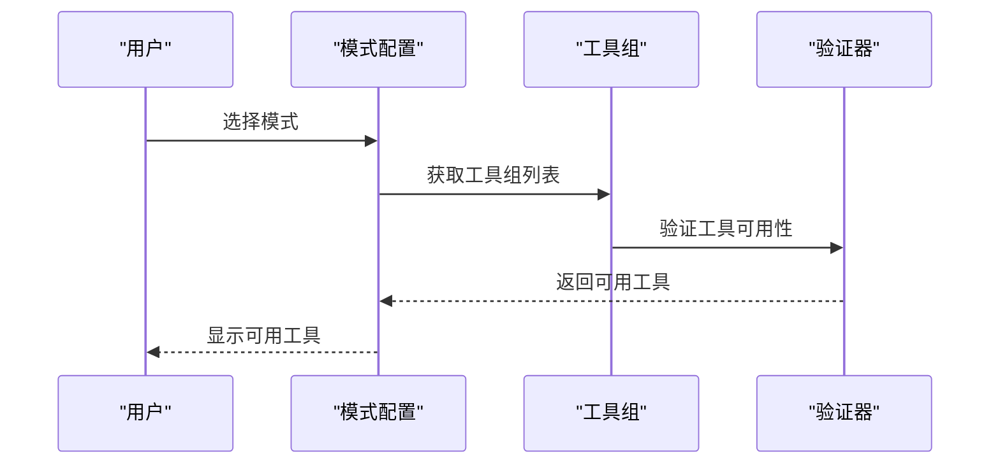
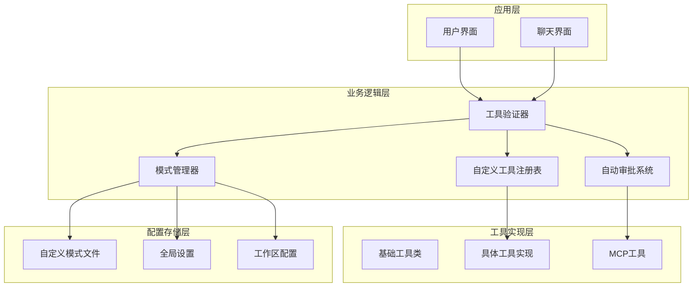
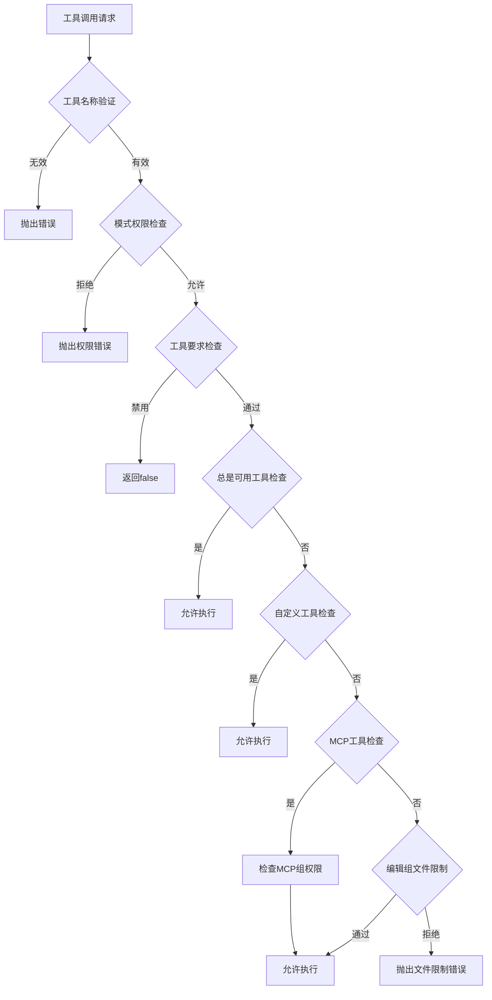
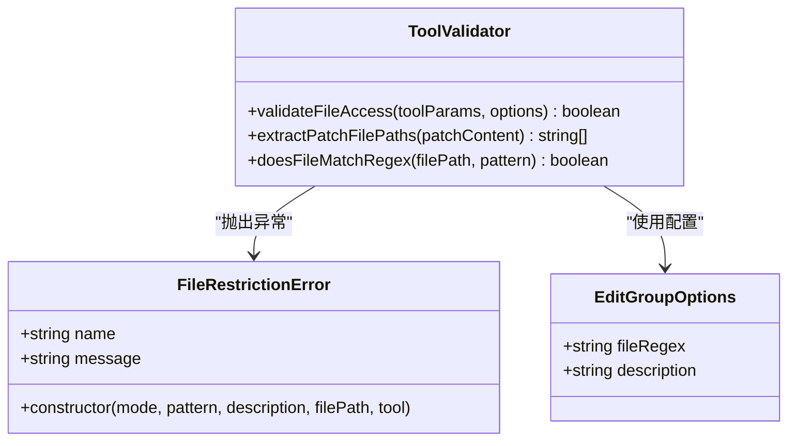
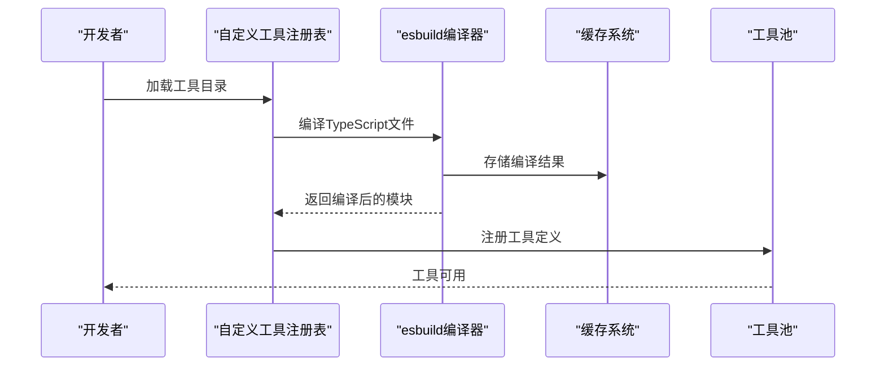
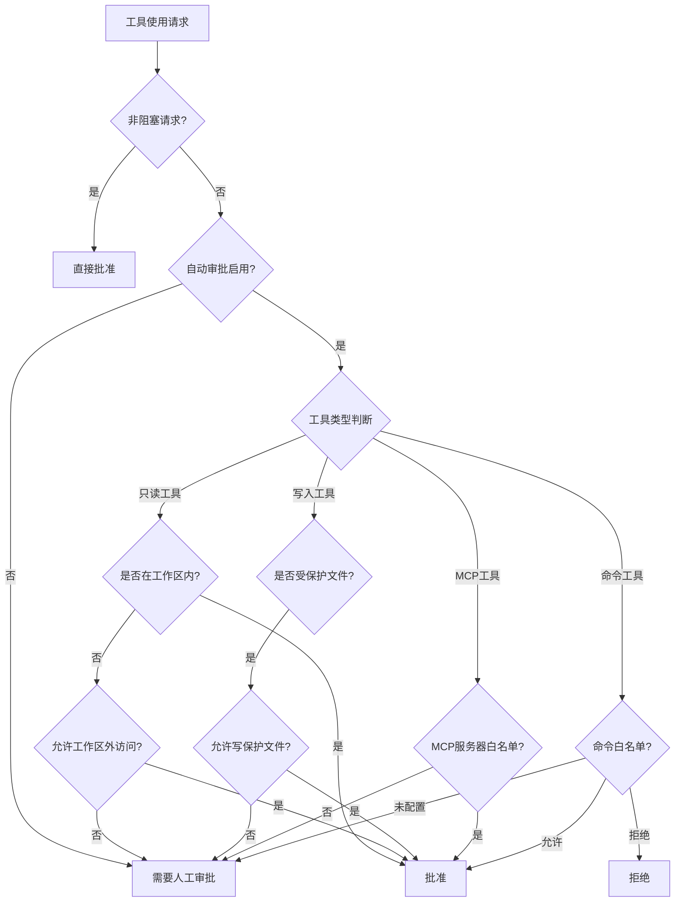
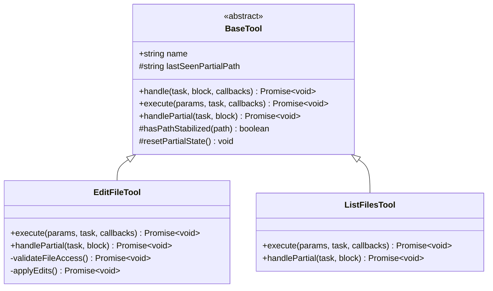

# 工具组管理

<cite>
**本文档引用的文件**
- [tools.ts](file://src/shared/tools.ts)
- [validateToolUse.ts](file://src/core/tools/validateToolUse.ts)
- [modes.ts](file://src/shared/modes.ts)
- [CustomModesManager.ts](file://src/core/config/CustomModesManager.ts)
- [BaseTool.ts](file://src/core/tools/BaseTool.ts)
- [EditFileTool.ts](file://src/core/tools/EditFileTool.ts)
- [ListFilesTool.ts](file://src/core/tools/ListFilesTool.ts)
- [custom-tool-registry.ts](file://packages/core/src/custom-tools/custom-tool-registry.ts)
- [index.ts](file://src/core/auto-approval/index.ts)
- [mcp.ts](file://src/core/auto-approval/mcp.ts)
- [tools.ts](file://src/core/auto-approval/tools.ts)
- [use-mcp-tool.test.ts](file://apps/vscode-e2e/src/suite/tools/use-mcp-tool.test.ts)
- [modes.spec.ts](file://src/shared/__tests__/modes.spec.ts)
</cite>

## 目录
1. [简介](#简介)
2. [项目结构](#项目结构)
3. [核心组件](#核心组件)
4. [架构概览](#架构概览)
5. [详细组件分析](#详细组件分析)
6. [依赖关系分析](#依赖关系分析)
7. [性能考虑](#性能考虑)
8. [故障排除指南](#故障排除指南)
9. [结论](#结论)

## 简介

工具组管理系统是Njust-AI平台的核心功能模块，负责管理和控制AI助手可以使用的各种工具。该系统提供了强大的工具权限控制、工具分类管理、工具可用性检查等功能，支持内置工具组的灵活组织和动态工具加载机制。

工具组系统的核心价值在于：
- **安全控制**：通过模式绑定确保工具使用符合安全策略
- **权限管理**：基于正则表达式的文件访问限制
- **动态加载**：支持TypeScript工具的实时编译和加载
- **可扩展性**：允许用户创建自定义工具组和工具

## 项目结构

工具组管理系统主要分布在以下目录中：



**图表来源**
- [tools.ts:302-321](file://src/shared/tools.ts#L302-L321)
- [validateToolUse.ts:145-264](file://src/core/tools/validateToolUse.ts#L145-L264)
- [CustomModesManager.ts:53-1021](file://src/core/config/CustomModesManager.ts#L53-L1021)

**章节来源**
- [tools.ts:1-392](file://src/shared/tools.ts#L1-L392)
- [modes.ts:1-258](file://src/shared/modes.ts#L1-L258)

## 核心组件

### 工具组定义系统

工具组系统通过`TOOL_GROUPS`常量定义了标准的工具分类：



**图表来源**
- [tools.ts:267-321](file://src/shared/tools.ts#L267-L321)

系统包含以下内置工具组：

| 工具组 | 工具数量 | 功能描述 | 可选工具 |
|--------|----------|----------|----------|
| read | 4个工具 | 文件读取、搜索、列出 | 无 |
| edit | 3个工具 | 文件编辑、写入、生成图片 | edit, search_replace, edit_file, apply_patch |
| command | 2个工具 | 命令执行、输出读取 | 无 |
| mcp | 2个工具 | MCP服务器工具调用 | 无 |
| modes | 2个工具 | 模式切换、任务管理 | 无 |

**章节来源**
- [tools.ts:302-321](file://src/shared/tools.ts#L302-L321)

### 模式管理系统

模式系统提供了工具组与模式的绑定关系：



**图表来源**
- [modes.ts:28-42](file://src/shared/modes.ts#L28-L42)
- [validateToolUse.ts:145-264](file://src/core/tools/validateToolUse.ts#L145-L264)

**章节来源**
- [modes.ts:45-91](file://src/shared/modes.ts#L45-L91)

## 架构概览

工具组管理系统的整体架构采用分层设计：



**图表来源**
- [validateToolUse.ts:57-88](file://src/core/tools/validateToolUse.ts#L57-L88)
- [CustomModesManager.ts:362-408](file://src/core/config/CustomModesManager.ts#L362-L408)

## 详细组件分析

### 工具权限控制系统

工具权限控制是系统的核心安全机制，通过多层验证确保工具使用的安全性：



**图表来源**
- [validateToolUse.ts:57-264](file://src/core/tools/validateToolUse.ts#L57-L264)

#### 文件访问限制机制

编辑组提供了强大的文件访问限制功能：



**图表来源**
- [validateToolUse.ts:135-258](file://src/core/tools/validateToolUse.ts#L135-L258)

**章节来源**
- [validateToolUse.ts:145-264](file://src/core/tools/validateToolUse.ts#L145-L264)

### 自定义工具加载系统

自定义工具系统支持TypeScript工具的动态加载和编译：



**图表来源**
- [custom-tool-registry.ts:53-93](file://packages/core/src/custom-tools/custom-tool-registry.ts#L53-L93)
- [custom-tool-registry.ts:274-340](file://packages/core/src/custom-tools/custom-tool-registry.ts#L274-L340)

#### 工具注册表功能特性

| 功能 | 描述 | 实现方式 |
|------|------|----------|
| 动态加载 | 支持.ts和.js文件 | 文件系统扫描 |
| 类型安全 | TypeScript编译验证 | esbuild编译 |
| 缓存优化 | 内存和磁盘缓存 | 多级缓存策略 |
| 版本管理 | 文件修改时间检测 | mtimeMs监控 |
| 错误处理 | 详细的错误信息 | 异常捕获和报告 |

**章节来源**
- [custom-tool-registry.ts:1-433](file://packages/core/src/custom-tools/custom-tool-registry.ts#L1-L433)

### 自动审批系统

自动审批系统提供了智能的工具使用审批机制：



**图表来源**
- [index.ts:47-183](file://src/core/auto-approval/index.ts#L47-L183)

**章节来源**
- [index.ts:1-186](file://src/core/auto-approval/index.ts#L1-L186)

### 工具基类系统

所有工具都继承自BaseTool基类，提供了统一的工具接口：



**图表来源**
- [BaseTool.ts:30-167](file://src/core/tools/BaseTool.ts#L30-L167)
- [EditFileTool.ts:135-531](file://src/core/tools/EditFileTool.ts#L135-L531)
- [ListFilesTool.ts:21-106](file://src/core/tools/ListFilesTool.ts#L21-L106)

**章节来源**
- [BaseTool.ts:1-167](file://src/core/tools/BaseTool.ts#L1-L167)

## 依赖关系分析

工具组管理系统的关键依赖关系如下：

```mermaid
graph TB
subgraph "外部依赖"
A[@njust-ai/types<br/>类型定义]
B[vscode<br/>VS Code API]
C[fs/promises<br/>文件系统]
D[path<br/>路径处理]
end
subgraph "内部模块"
E[shared/tools.ts<br/>工具配置]
F[core/tools/validateToolUse.ts<br/>工具验证]
G[shared/modes.ts<br/>模式管理]
H[core/config/CustomModesManager.ts<br/>模式管理器]
I[core/tools/BaseTool.ts<br/>工具基类]
J[packages/core/custom-tool-registry.ts<br/>工具注册表]
end
subgraph "测试模块"
K[shared/__tests__/modes.spec.ts<br/>模式测试]
L[vscode-e2e/tests/use-mcp-tool.test.ts<br/>MCP测试]
end
A --> E
A --> F
B --> H
C --> I
D --> I
E --> F
G --> F
H --> G
I --> F
J --> F
K --> F
L --> F
```

**图表来源**
- [tools.ts:1-10](file://src/shared/tools.ts#L1-L10)
- [validateToolUse.ts:1-8](file://src/core/tools/validateToolUse.ts#L1-L8)

**章节来源**
- [validateToolUse.ts:1-8](file://src/core/tools/validateToolUse.ts#L1-L8)
- [CustomModesManager.ts:1-24](file://src/core/config/CustomModesManager.ts#L1-L24)

## 性能考虑

工具组管理系统在性能方面采用了多种优化策略：

### 缓存机制
- **内存缓存**：工具注册表使用Map存储已加载的工具定义
- **磁盘缓存**：TypeScript编译结果缓存在临时目录中
- **模式缓存**：自定义模式文件内容缓存，避免重复读取

### 异步处理
- **批量加载**：支持多个工具目录的并行加载
- **延迟加载**：仅在需要时才加载工具定义
- **流式处理**：支持工具执行过程中的流式数据处理

### 内存管理
- **垃圾回收**：及时清理不再使用的工具实例
- **资源释放**：正确关闭文件句柄和网络连接
- **缓存清理**：定期清理过期的编译缓存

## 故障排除指南

### 常见问题及解决方案

#### 工具权限错误
**问题**：工具调用被拒绝
**原因**：工具不在当前模式的工具组中
**解决**：
1. 检查模式配置中的工具组设置
2. 确认工具名称是否正确
3. 验证工具要求配置

#### 文件访问限制错误
**问题**：编辑文件时抛出FileRestrictionError
**原因**：文件路径不匹配正则表达式
**解决**：
1. 检查编辑组的fileRegex配置
2. 验证目标文件路径
3. 调整文件匹配规则

#### 自定义工具加载失败
**问题**：自定义工具无法加载
**原因**：TypeScript编译错误或依赖缺失
**解决**：
1. 检查TypeScript语法错误
2. 确认依赖包安装完整
3. 清理编译缓存后重试

#### MCP工具调用失败
**问题**：MCP工具调用被拒绝
**原因**：MCP服务器未授权或工具不存在
**解决**：
1. 检查MCP服务器配置
2. 验证工具名称格式
3. 确认服务器白名单设置

**章节来源**
- [validateToolUse.ts:66-88](file://src/core/tools/validateToolUse.ts#L66-L88)
- [custom-tool-registry.ts:81-85](file://packages/core/src/custom-tools/custom-tool-registry.ts#L81-L85)

## 结论

工具组管理系统通过精心设计的架构和完善的机制，为Njust-AI平台提供了强大而灵活的工具管理能力。系统的主要优势包括：

1. **安全性**：多层权限控制确保工具使用的安全性
2. **灵活性**：支持自定义工具组和工具定义
3. **可扩展性**：模块化设计便于功能扩展
4. **易用性**：直观的配置界面和清晰的错误提示

该系统为AI助手提供了可靠的工具使用环境，既保证了安全性，又保持了足够的灵活性，能够满足不同场景下的工具管理需求。通过持续的优化和改进，工具组管理系统将继续为用户提供更好的工具使用体验。