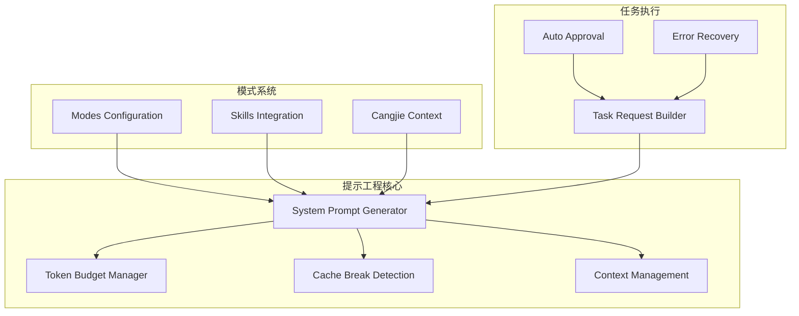
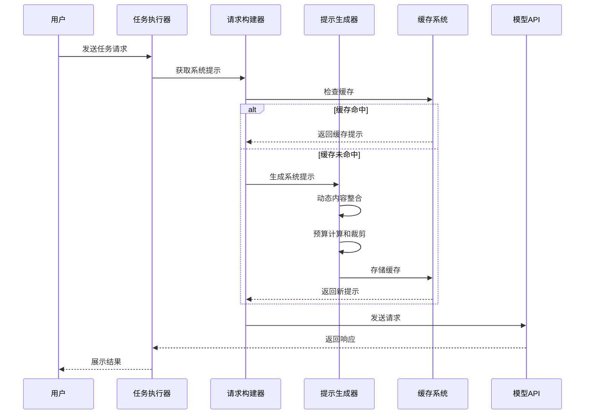
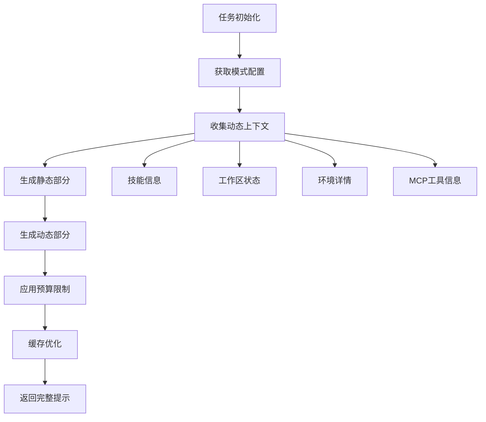
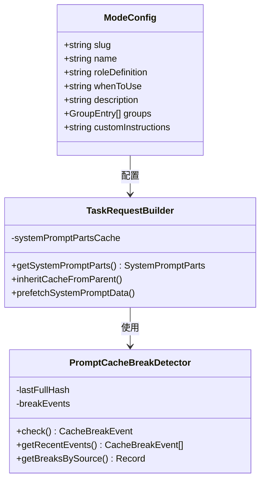
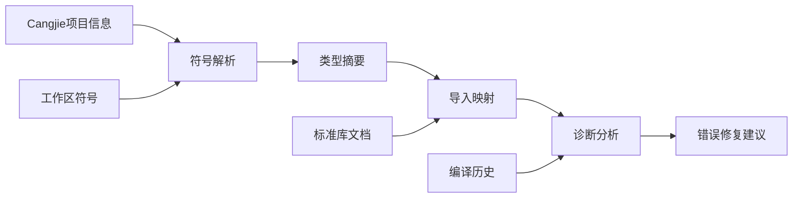
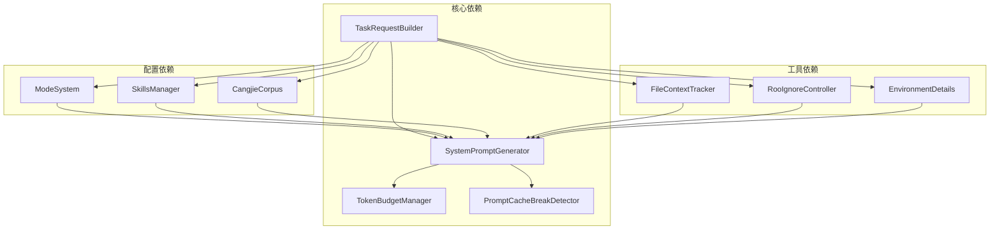

# 高级提示工程能力

<cite>
**本文档引用的文件**
- [README.md](file://README.md)
- [AGENTS.md](file://AGENTS.md)
- [src/core/prompts/system.ts](file://src/core/prompts/system.ts)
- [src/core/prompts/types.ts](file://src/core/prompts/types.ts)
- [src/core/prompts/tokenBudget.ts](file://src/core/prompts/tokenBudget.ts)
- [src/core/prompts/promptCacheBreakDetection.ts](file://src/core/prompts/promptCacheBreakDetection.ts)
- [src/core/prompts/sections/modes.ts](file://src/core/prompts/sections/modes.ts)
- [src/core/prompts/sections/skills.ts](file://src/core/prompts/sections/skills.ts)
- [src/core/prompts/sections/cangjie-context.ts](file://src/core/prompts/sections/cangjie-context.ts)
- [src/core/task/Task.ts](file://src/core/task/Task.ts)
- [src/core/task/TaskRequestBuilder.ts](file://src/core/task/TaskRequestBuilder.ts)
- [src/shared/modes.ts](file://src/shared/modes.ts)
- [packages/types/src/mode.ts](file://packages/types/src/mode.ts)
</cite>

## 目录
1. [简介](#简介)
2. [项目结构](#项目结构)
3. [核心组件](#核心组件)
4. [架构概览](#架构概览)
5. [详细组件分析](#详细组件分析)
6. [依赖分析](#依赖分析)
7. [性能考虑](#性能考虑)
8. [故障排除指南](#故障排除指南)
9. [结论](#结论)

## 简介

高级提示工程能力是NJU AI Cangjie项目的核心技术特色，该项目是一个基于VS Code的AI编程助手扩展，专注于提供智能化的代码开发体验。本文档深入分析了项目中的高级提示工程技术，包括系统提示生成、动态上下文管理、智能缓存机制和性能优化策略。

该项目基于上游NJUST_AI项目进行了定制化开发，移除了与账号、组织、市集浏览相关的云服务功能，保留并扩展了本地/自建服务对接能力。系统提示工程能力是整个AI助手的核心，负责将复杂的任务分解为可执行的指令序列。

## 项目结构

项目采用模块化的架构设计，核心提示工程功能主要集中在`src/core/prompts/`目录下：

**图表来源**
- [src/core/prompts/system.ts:1-353](file://src/core/prompts/system.ts#L1-L353)
- [src/core/task/TaskRequestBuilder.ts:1-378](file://src/core/task/TaskRequestBuilder.ts#L1-L378)

**章节来源**
- [README.md:185-293](file://README.md#L185-L293)

## 核心组件

### 系统提示生成器

系统提示生成器是高级提示工程的核心组件，负责动态构建和优化AI助手的系统提示。该组件具有以下关键特性：

- **动态内容整合**：能够根据当前工作环境、模式配置和技能状态动态调整提示内容
- **智能预算管理**：基于模型上下文窗口大小自动计算和分配token预算
- **缓存优化**：通过智能缓存机制最大化缓存命中率，减少重复计算

### 提示词预算管理

提示词预算管理系统负责优化提示词的token使用，确保在有限的上下文窗口内提供最有效的指令：

- **自适应预算分配**：根据模型能力动态调整静态和动态部分的token分配
- **优先级裁剪**：在预算不足时按照预定义优先级智能裁剪非关键内容
- **实时估算**：提供准确的token使用估算，避免超出模型限制

### 缓存破坏检测

缓存破坏检测机制监控系统提示的稳定性，最大化缓存有效性：

- **内容标准化**：消除时间戳、日期等频繁变化的内容，确保缓存稳定性
- **变更追踪**：精确追踪导致缓存失效的各种变更源
- **性能诊断**：提供详细的缓存失效统计和分析报告

**章节来源**
- [src/core/prompts/system.ts:85-353](file://src/core/prompts/system.ts#L85-L353)
- [src/core/prompts/tokenBudget.ts:1-94](file://src/core/prompts/tokenBudget.ts#L1-L94)
- [src/core/prompts/promptCacheBreakDetection.ts:1-253](file://src/core/prompts/promptCacheBreakDetection.ts#L1-L253)

## 架构概览

高级提示工程能力的整体架构体现了高度的模块化和可扩展性：

**图表来源**
- [src/core/task/TaskRequestBuilder.ts:74-189](file://src/core/task/TaskRequestBuilder.ts#L74-L189)
- [src/core/task/Task.ts:655-700](file://src/core/task/Task.ts#L655-L700)

## 详细组件分析

### 系统提示生成流程

系统提示生成是一个多层次的处理过程，涉及多个组件的协同工作：

**图表来源**
- [src/core/prompts/system.ts:102-265](file://src/core/prompts/system.ts#L102-L265)

#### 动态上下文管理

动态上下文管理是高级提示工程的关键特性，能够根据实时状态调整提示内容：

- **技能路由**：根据可用技能动态调整提示内容，确保技能相关的信息准确传达
- **工作区感知**：整合当前工作区的状态信息，包括文件结构、依赖关系等
- **环境适配**：根据运行环境动态调整提示策略和约束条件

#### 预算优化策略

预算优化策略确保在有限的token预算内提供最优的提示效果：

- **优先级分配**：为不同类型的内容分配不同的优先级权重
- **智能裁剪**：在预算紧张时按照预定义规则智能裁剪非关键内容
- **动态调整**：根据模型能力和任务复杂度动态调整预算分配

**章节来源**
- [src/core/prompts/system.ts:126-265](file://src/core/prompts/system.ts#L126-L265)
- [src/core/prompts/tokenBudget.ts:44-94](file://src/core/prompts/tokenBudget.ts#L44-L94)

### 模式系统集成

模式系统为高级提示工程提供了灵活的配置框架：

**图表来源**
- [packages/types/src/mode.ts:96-107](file://packages/types/src/mode.ts#L96-L107)
- [src/core/task/TaskRequestBuilder.ts:35-70](file://src/core/task/TaskRequestBuilder.ts#L35-L70)
- [src/core/prompts/promptCacheBreakDetection.ts:97-170](file://src/core/prompts/promptCacheBreakDetection.ts#L97-L170)

#### 模式配置管理

模式配置管理系统支持灵活的模式定义和定制：

- **内置模式**：提供多种预定义模式，涵盖不同的开发场景
- **自定义模式**：支持用户定义和扩展新的模式
- **模式继承**：支持模式间的继承和组合，提高代码复用性

#### 技能集成机制

技能集成机制为提示工程提供了丰富的上下文信息：

- **技能发现**：自动发现和加载可用的技能
- **技能路由**：根据任务需求智能选择合适的技能
- **上下文注入**：将技能相关信息动态注入到系统提示中

**章节来源**
- [src/shared/modes.ts:44-91](file://src/shared/modes.ts#L44-L91)
- [src/core/prompts/sections/skills.ts:42-129](file://src/core/prompts/sections/skills.ts#L42-L129)

### Cangjie语言特定优化

针对Cangjie语言的特殊优化体现了高级提示工程的专业化程度：

**图表来源**
- [src/core/prompts/sections/cangjie-context.ts:118-150](file://src/core/prompts/sections/cangjie-context.ts#L118-L150)

#### 符号解析优化

Cangjie语言的符号解析系统提供了深度的代码理解能力：

- **多文件符号聚合**：整合多个文件中的符号定义
- **类型信息提取**：自动提取和格式化类型信息
- **可见性过滤**：根据可见性级别过滤符号信息

#### 诊断智能分析

诊断智能分析系统能够提供准确的错误修复建议：

- **错误模式匹配**：识别常见的编译错误模式
- **修复策略生成**：为不同类型的错误生成相应的修复策略
- **学习机制**：通过机器学习不断改进修复建议的质量

**章节来源**
- [src/core/prompts/sections/cangjie-context.ts:315-505](file://src/core/prompts/sections/cangjie-context.ts#L315-L505)
- [src/core/prompts/sections/cangjie-context.ts:644-800](file://src/core/prompts/sections/cangjie-context.ts#L644-L800)

## 依赖分析

高级提示工程能力的依赖关系体现了系统的模块化设计：

**图表来源**
- [src/core/task/TaskRequestBuilder.ts:1-50](file://src/core/task/TaskRequestBuilder.ts#L1-L50)
- [src/core/prompts/system.ts:1-50](file://src/core/prompts/system.ts#L1-L50)

### 组件耦合度分析

系统采用了松耦合的设计原则，通过接口和事件机制降低组件间的依赖：

- **弱依赖关系**：核心组件之间通过接口通信，减少直接依赖
- **事件驱动**：通过事件机制实现组件间的异步通信
- **插件化架构**：支持功能模块的动态加载和卸载

### 循环依赖防护

系统通过合理的架构设计避免了潜在的循环依赖问题：

- **单向依赖链**：确保依赖关系形成清晰的单向链路
- **抽象层隔离**：通过抽象层隔离具体实现细节
- **接口契约**：严格的接口契约确保组件间的松耦合

**章节来源**
- [src/core/task/TaskRequestBuilder.ts:1-35](file://src/core/task/TaskRequestBuilder.ts#L1-L35)
- [src/core/prompts/system.ts:1-35](file://src/core/prompts/system.ts#L1-L35)

## 性能考虑

高级提示工程能力在性能优化方面采用了多项先进技术：

### 缓存策略优化

系统实现了多层次的缓存策略来提升性能：

- **智能缓存失效**：通过内容标准化和变更追踪减少不必要的缓存失效
- **预取机制**：提前加载和缓存可能需要的提示内容
- **内存管理**：合理的内存使用策略避免内存泄漏和过度占用

### 计算优化

提示生成过程经过精心优化以提升计算效率：

- **增量更新**：只更新发生变化的部分，避免全量重新计算
- **并行处理**：利用多核处理器并行处理不同的提示生成任务
- **资源池管理**：通过对象池减少频繁的对象创建和销毁

### 内存使用优化

系统采用了高效的内存使用策略：

- **LRU缓存**：使用LRU算法管理缓存内容，确保常用数据的快速访问
- **分页加载**：对于大型上下文信息采用分页加载策略
- **垃圾回收优化**：合理的对象生命周期管理减少垃圾回收压力

## 故障排除指南

### 常见问题诊断

针对高级提示工程能力的常见问题提供了系统的诊断方法：

#### 缓存失效问题

当遇到缓存失效频繁的问题时，可以采取以下诊断步骤：

1. **检查变更源**：使用缓存破坏检测器查看具体的变更原因
2. **分析日志**：查看系统日志了解缓存失效的具体时间和原因
3. **优化配置**：根据分析结果调整相关配置参数

#### 性能问题排查

当系统出现性能问题时，可以进行以下检查：

1. **监控指标**：检查CPU、内存、磁盘I/O等系统资源使用情况
2. **缓存命中率**：分析缓存命中率是否正常
3. **网络延迟**：检查外部API调用的响应时间

### 调试工具使用

系统提供了丰富的调试工具帮助开发者定位问题：

- **性能分析器**：用于分析提示生成过程的性能瓶颈
- **内存分析器**：帮助识别内存泄漏和内存使用异常
- **日志分析器**：提供详细的日志分析和可视化功能

**章节来源**
- [src/core/prompts/promptCacheBreakDetection.ts:175-207](file://src/core/prompts/promptCacheBreakDetection.ts#L175-L207)
- [src/core/task/TaskRequestBuilder.ts:317-357](file://src/core/task/TaskRequestBuilder.ts#L317-L357)

## 结论

高级提示工程能力是NJU AI Cangjie项目的核心技术优势，通过系统化的架构设计和先进的优化策略，实现了高效、智能的AI助手功能。该能力不仅提升了代码开发的效率和质量，还为未来的功能扩展和技术演进奠定了坚实的基础。

项目在以下方面表现突出：

- **技术创新性**：采用了多项前沿的提示工程技术，包括智能缓存、动态预算管理和上下文优化
- **架构合理性**：模块化的设计使得系统具有良好的可维护性和可扩展性
- **性能优化**：通过多层次的优化策略确保了系统的高性能运行
- **用户体验**：提供了流畅、智能的AI编程助手体验

未来的发展方向包括进一步优化提示工程算法、扩展支持的语言和框架、以及提升系统的智能化水平。这些努力将继续推动AI编程助手技术的发展，为开发者提供更好的技术支持。