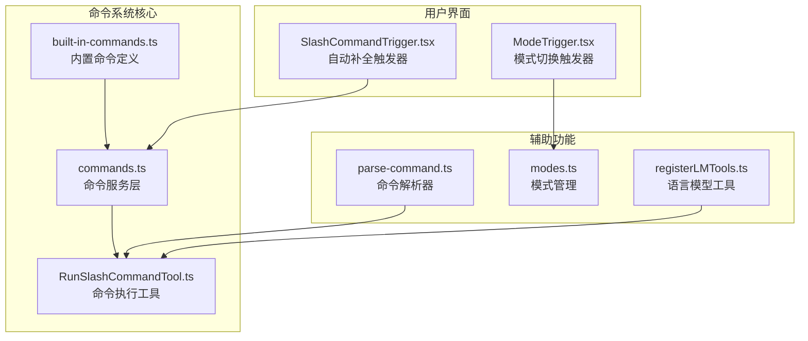
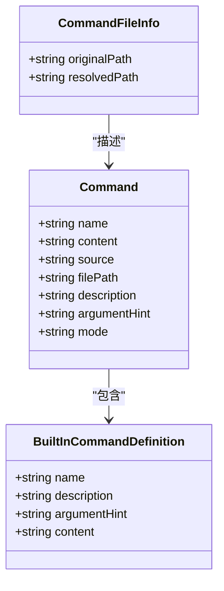
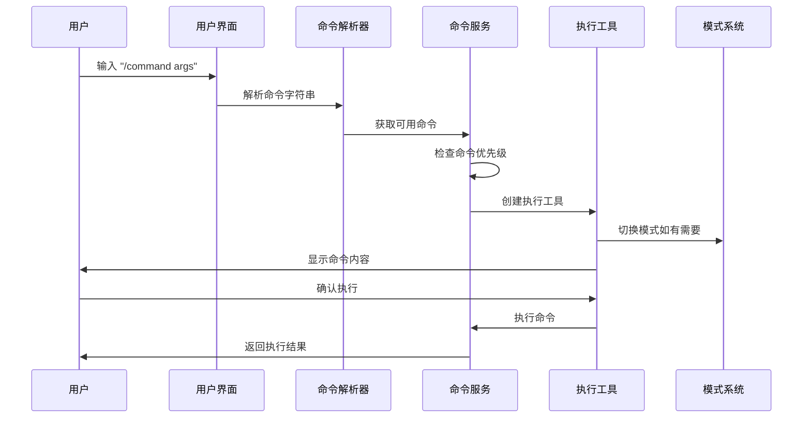
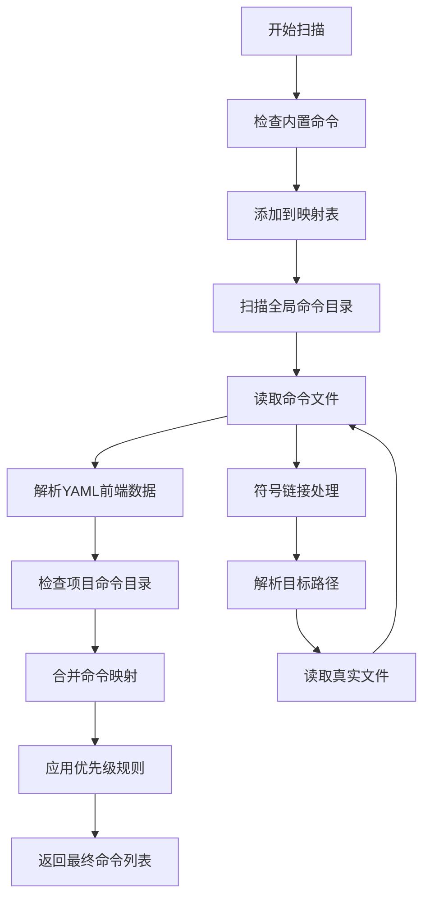
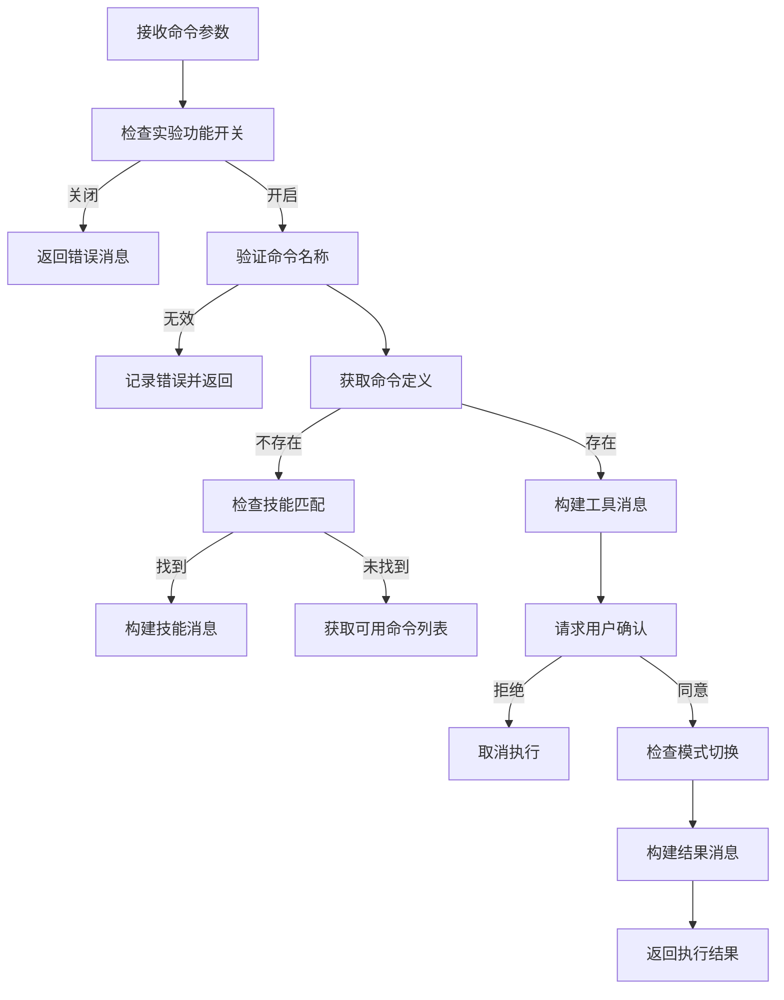
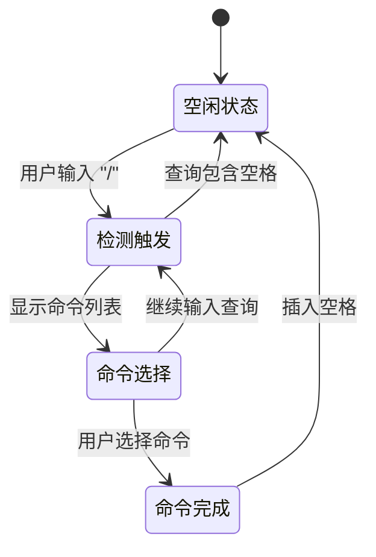
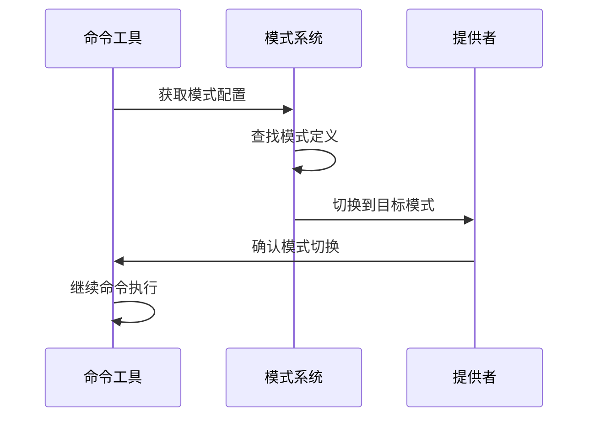
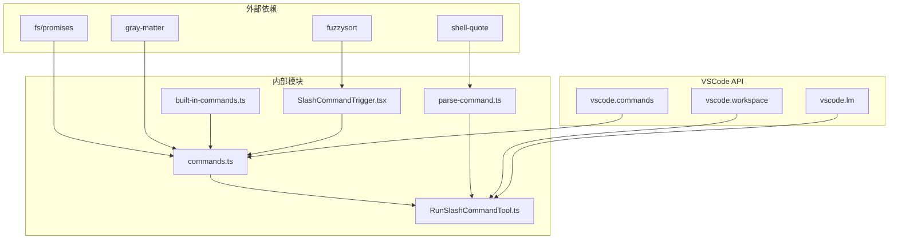

# 斜杠命令系统

<cite>
**本文档引用的文件**
- [built-in-commands.ts](file://src/services/command/built-in-commands.ts)
- [commands.ts](file://src/services/command/commands.ts)
- [parse-command.ts](file://src/shared/parse-command.ts)
- [RunSlashCommandTool.ts](file://src/core/tools/RunSlashCommandTool.ts)
- [SlashCommandTrigger.tsx](file://apps/cli/src/ui/components/autocomplete/triggers/SlashCommandTrigger.tsx)
- [SlashCommandTrigger.test.tsx](file://apps/cli/src/ui/components/autocomplete/triggers/__tests__/SlashCommandTrigger.test.tsx)
- [registerCommands.ts](file://src/activate/registerCommands.ts)
- [registerLMTools.ts](file://src/chat/registerLMTools.ts)
- [modes.ts](file://src/shared/modes.ts)
- [commands.spec.ts](file://src/__tests__/commands.spec.ts)
- [commands.ts（工具函数）](file://src/utils/commands.ts)
</cite>

## 目录
1. [简介](#简介)
2. [项目结构](#项目结构)
3. [核心组件](#核心组件)
4. [架构概览](#架构概览)
5. [详细组件分析](#详细组件分析)
6. [依赖关系分析](#依赖关系分析)
7. [性能考虑](#性能考虑)
8. [故障排除指南](#故障排除指南)
9. [结论](#结论)

## 简介

斜杠命令系统是Njust-AI项目中的一个核心功能模块，它允许用户通过简单的命令语法来执行各种操作。该系统提供了灵活的命令管理机制，支持内置命令、项目特定命令和全局命令，并且具有强大的自动补全功能。

系统的主要设计理念包括：
- **层次化命令优先级**：项目命令 > 全局命令 > 内置命令
- **Markdown命令格式**：使用YAML前端数据存储命令元信息
- **智能符号链接支持**：自动解析和处理符号链接
- **实验性功能控制**：通过实验设置启用高级功能
- **模式集成**：与AI助手模式系统无缝集成

## 项目结构

斜杠命令系统在项目中的组织结构如下：

**图表来源**
- [built-in-commands.ts:1-506](file://src/services/command/built-in-commands.ts#L1-L506)
- [commands.ts:1-368](file://src/services/command/commands.ts#L1-L368)
- [RunSlashCommandTool.ts:1-155](file://src/core/tools/RunSlashCommandTool.ts#L1-L155)

**章节来源**
- [built-in-commands.ts:1-506](file://src/services/command/built-in-commands.ts#L1-L506)
- [commands.ts:1-368](file://src/services/command/commands.ts#L1-L368)

## 核心组件

### 命令数据结构

命令系统的核心数据结构定义如下：

**图表来源**
- [commands.ts:13-31](file://src/services/command/commands.ts#L13-L31)
- [built-in-commands.ts:3-8](file://src/services/command/built-in-commands.ts#L3-L8)

### 命令优先级系统

命令系统采用三层优先级架构：

1. **内置命令**（最低优先级）
   - 预定义的标准命令
   - 包含在核心代码中

2. **全局命令**（中等优先级）
   - 用户全局配置目录中的命令
   - 适用于所有项目

3. **项目命令**（最高优先级）
   - 项目根目录下的命令
   - 最具针对性的命令

**章节来源**
- [commands.ts:127-170](file://src/services/command/commands.ts#L127-L170)

## 架构概览

斜杠命令系统的整体架构设计体现了清晰的分层结构：

**图表来源**
- [parse-command.ts:16-38](file://src/shared/parse-command.ts#L16-L38)
- [commands.ts:127-170](file://src/services/command/commands.ts#L127-L170)
- [RunSlashCommandTool.ts:23-138](file://src/core/tools/RunSlashCommandTool.ts#L23-L138)

## 详细组件分析

### 命令服务层

命令服务层是整个系统的核心，负责命令的发现、加载和管理：

#### 命令发现机制

**图表来源**
- [commands.ts:127-145](file://src/services/command/commands.ts#L127-L145)
- [commands.ts:269-350](file://src/services/command/commands.ts#L269-L350)

#### 符号链接支持

系统提供了完整的符号链接支持机制：

- **递归解析**：防止循环符号链接
- **路径解析**：正确处理相对和绝对路径
- **文件类型检测**：区分文件和目录
- **错误处理**：优雅处理无效符号链接

**章节来源**
- [commands.ts:36-121](file://src/services/command/commands.ts#L36-L121)

### 命令执行工具

RunSlashCommandTool是专门用于执行斜杠命令的工具类：

#### 执行流程

**图表来源**
- [RunSlashCommandTool.ts:23-138](file://src/core/tools/RunSlashCommandTool.ts#L23-L138)

#### 参数处理机制

命令工具支持多种参数处理方式：

- **必需参数**：命令名称（必须提供）
- **可选参数**：命令参数（可选）
- **参数验证**：自动错误检测和报告
- **部分执行**：支持流式参数处理

**章节来源**
- [RunSlashCommandTool.ts:15-18](file://src/core/tools/RunSlashCommandTool.ts#L15-L18)

### 自动补全系统

自动补全系统提供了智能的命令选择体验：

#### 触发器机制

**图表来源**
- [SlashCommandTrigger.tsx:39-59](file://apps/cli/src/ui/components/autocomplete/triggers/SlashCommandTrigger.tsx#L39-L59)

#### 搜索算法

系统使用fuzzysort库实现智能模糊搜索：

- **实时搜索**：输入时即时更新结果
- **权重计算**：基于匹配度排序
- **限制结果**：默认显示前20个结果
- **去重处理**：避免重复命令显示

**章节来源**
- [SlashCommandTrigger.tsx:61-77](file://apps/cli/src/ui/components/autocomplete/triggers/SlashCommandTrigger.tsx#L61-L77)

### 模式集成

命令系统与AI助手模式系统深度集成：

#### 模式切换机制

当命令包含模式信息时，系统会自动切换到指定模式：

**图表来源**
- [RunSlashCommandTool.ts:102-109](file://src/core/tools/RunSlashCommandTool.ts#L102-L109)
- [modes.ts:51-67](file://src/shared/modes.ts#L51-L67)

**章节来源**
- [modes.ts:1-258](file://src/shared/modes.ts#L1-L258)

## 依赖关系分析

斜杠命令系统的依赖关系体现了清晰的模块化设计：

**图表来源**
- [commands.ts:1-6](file://src/services/command/commands.ts#L1-L6)
- [SlashCommandTrigger.tsx:1-5](file://apps/cli/src/ui/components/autocomplete/triggers/SlashCommandTrigger.tsx#L1-L5)

### 关键依赖特性

1. **异步文件系统**：使用Promise API处理文件操作
2. **YAML解析**：通过gray-matter解析命令元数据
3. **模糊搜索**：fuzzysort提供高效的搜索算法
4. **命令解析**：shell-quote处理复杂的shell语法

**章节来源**
- [commands.ts:1-6](file://src/services/command/commands.ts#L1-L6)
- [SlashCommandTrigger.tsx:1-5](file://apps/cli/src/ui/components/autocomplete/triggers/SlashCommandTrigger.tsx#L1-L5)

## 性能考虑

斜杠命令系统在设计时充分考虑了性能优化：

### 缓存策略

- **命令映射缓存**：使用Map结构存储已解析的命令
- **符号链接解析缓存**：避免重复解析相同的符号链接
- **文件系统缓存**：减少频繁的文件系统访问

### 异步处理

- **并行文件读取**：使用Promise.all并行处理多个文件
- **延迟加载**：按需加载命令文件，避免启动时的性能开销
- **流式处理**：支持大文件的流式读取和处理

### 内存管理

- **垃圾回收友好**：及时释放不再使用的对象引用
- **字符串池化**：复用常用的字符串常量
- **弱引用**：对大型对象使用弱引用避免内存泄漏

## 故障排除指南

### 常见问题及解决方案

#### 命令无法找到

**症状**：执行 `/command` 时提示命令不存在

**可能原因**：
1. 命令文件不存在或路径错误
2. 文件权限问题
3. 符号链接损坏

**解决步骤**：
1. 检查命令文件是否存在于正确的目录
2. 验证文件权限设置
3. 重新创建符号链接

#### 命令执行失败

**症状**：命令被找到但执行失败

**可能原因**：
1. 实验功能未启用
2. 参数验证失败
3. 权限不足

**解决步骤**：
1. 在设置中启用相应的实验功能
2. 检查命令参数格式
3. 验证执行权限

#### 自动补全不工作

**症状**：输入 `/` 后没有出现命令建议

**可能原因**：
1. 命令服务未初始化
2. 文件监控失效
3. 缓存问题

**解决步骤**：
1. 重启VSCode扩展
2. 清除命令缓存
3. 检查文件监控设置

**章节来源**
- [RunSlashCommandTool.ts:35-42](file://src/core/tools/RunSlashCommandTool.ts#L35-L42)
- [commands.spec.ts:88-95](file://src/__tests__/commands.spec.ts#L88-L95)

### 调试技巧

1. **启用详细日志**：查看输出通道中的详细信息
2. **检查文件路径**：确认命令文件的实际位置
3. **验证YAML格式**：确保命令文件的前端数据格式正确
4. **测试符号链接**：验证符号链接的有效性

## 结论

斜杠命令系统展现了现代IDE扩展的强大功能，通过精心设计的架构实现了以下目标：

### 设计优势

1. **灵活性**：支持多层命令优先级和符号链接
2. **可扩展性**：模块化设计便于功能扩展
3. **用户体验**：智能自动补全和错误处理
4. **性能优化**：异步处理和缓存策略

### 技术亮点

- **层次化命令管理**：内置、全局、项目三级优先级
- **智能解析引擎**：支持复杂的shell语法和符号链接
- **实验性功能控制**：安全的渐进式功能发布
- **模式集成**：与AI助手生态系统无缝协作

### 未来发展

系统为未来的功能扩展奠定了坚实基础，包括：
- 更丰富的命令模板系统
- 增强的权限管理和安全控制
- 更智能的命令推荐算法
- 支持更多类型的命令执行环境

通过持续的优化和改进，斜杠命令系统将继续为用户提供高效、可靠的命令执行体验。