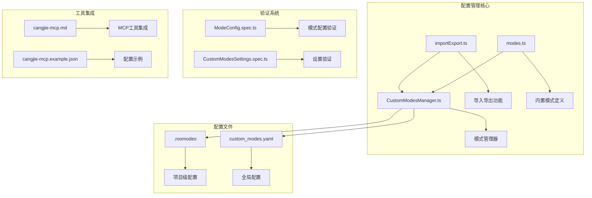
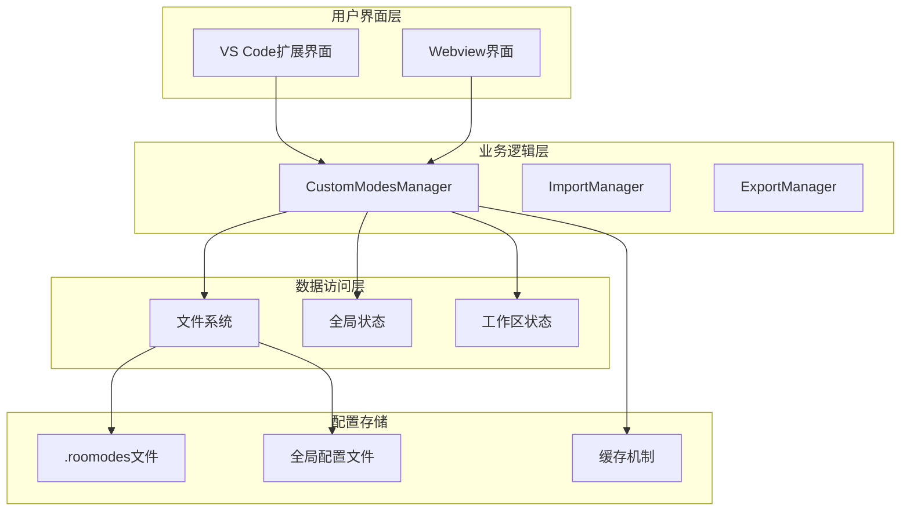
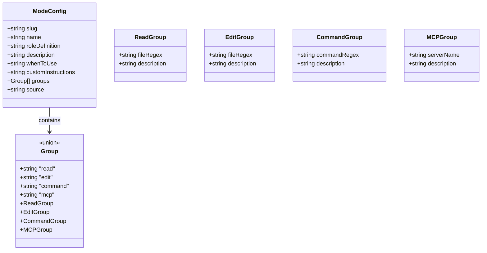
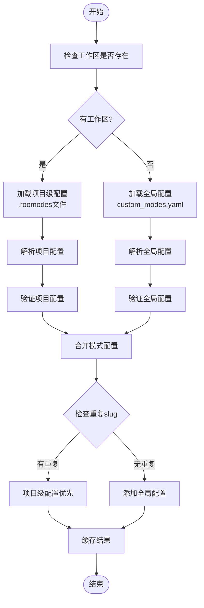
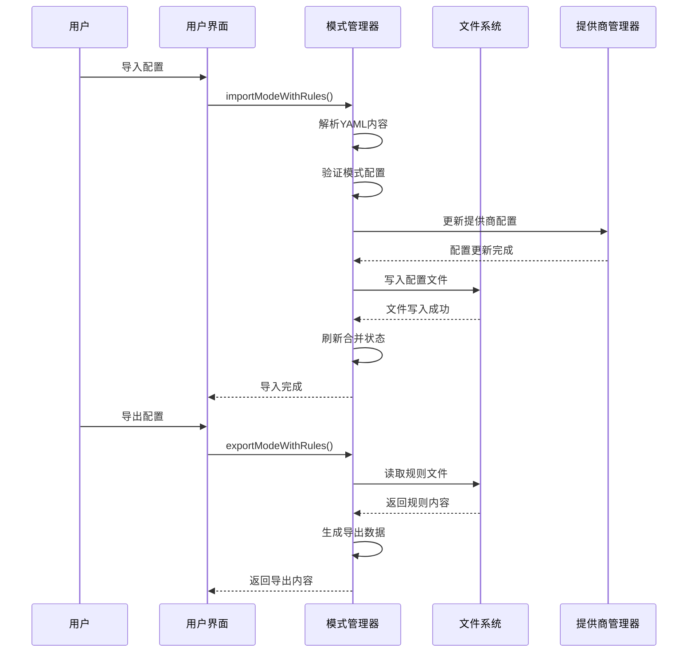
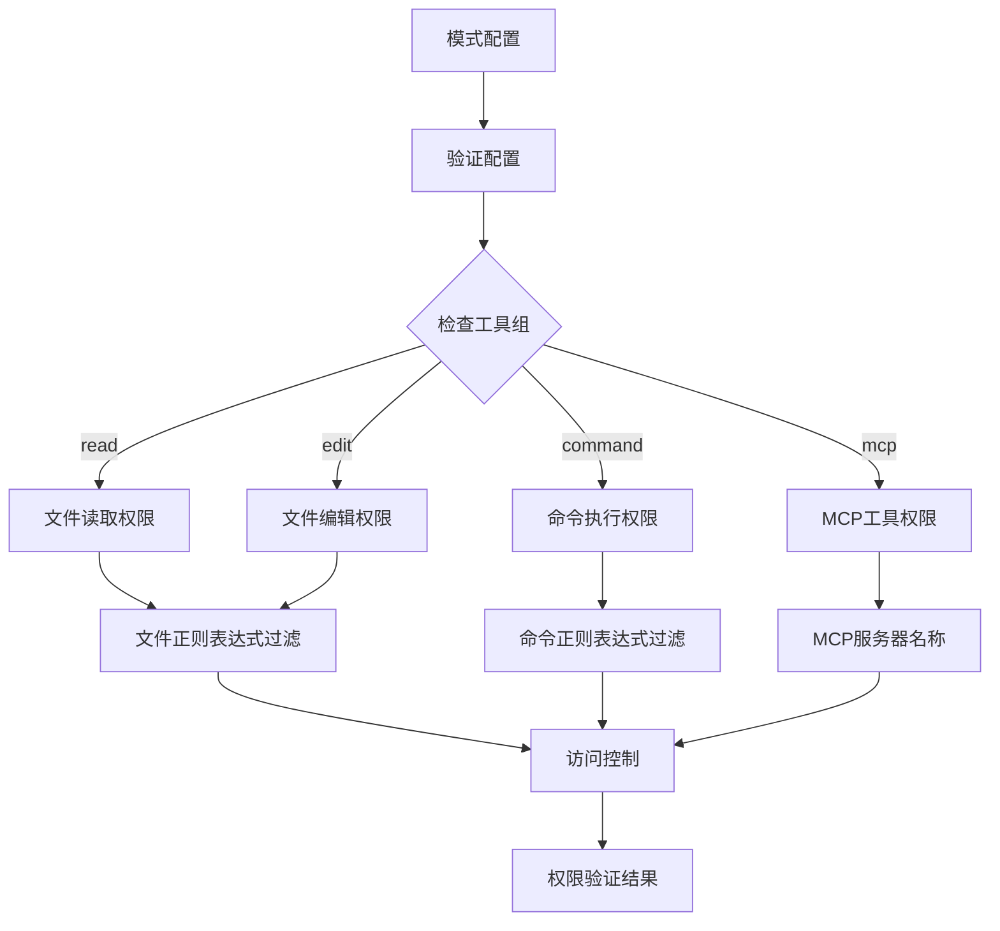
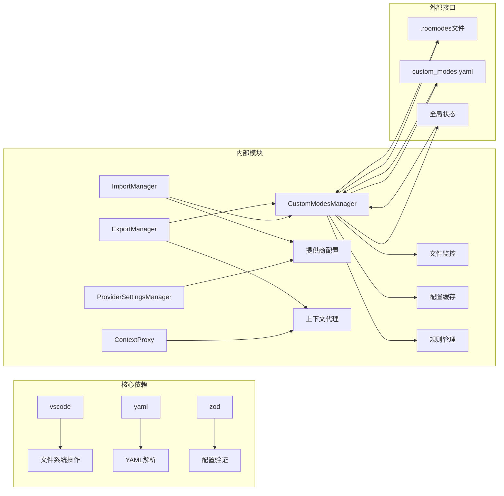

# 模式配置管理

<cite>
**本文档引用的文件**
- [CustomModesManager.ts](file://src/core/config/CustomModesManager.ts)
- [importExport.ts](file://src/core/config/importExport.ts)
- [CustomModesManager.spec.ts](file://src/core/config/__tests__/CustomModesManager.spec.ts)
- [ModeConfig.spec.ts](file://src/core/config/__tests__/ModeConfig.spec.ts)
- [CustomModesSettings.spec.ts](file://src/core/config/__tests__/CustomModesSettings.spec.ts)
- [modes.ts](file://src/shared/modes.ts)
- [cangjie-mcp.md](file://docs/cangjie-mcp.md)
- [cangjie-mcp.example.json](file://docs/examples/cangjie-mcp.example.json)
- [webviewMessageHandler.ts](file://src/core/webview/webviewMessageHandler.ts)
- [migrateSettings.ts](file://src/utils/migrateSettings.ts)
</cite>

## 目录
1. [简介](#简介)
2. [项目结构](#项目结构)
3. [核心组件](#核心组件)
4. [架构概览](#架构概览)
5. [详细组件分析](#详细组件分析)
6. [依赖关系分析](#依赖关系分析)
7. [性能考虑](#性能考虑)
8. [故障排除指南](#故障排除指南)
9. [结论](#结论)

## 简介

模式配置管理系统是Njust-AI项目中的核心功能模块，负责管理自定义模式的创建、配置、导入导出和权限控制。该系统支持两种级别的模式配置：项目级（.roomodes文件）和全局级（settings/custom_modes.yaml），并通过严格的验证机制确保配置的安全性和一致性。

系统的主要功能包括：
- 自定义模式的创建和管理
- 模式配置的导入导出机制
- 工具组权限设置和控制
- 配置验证和错误处理
- 模式优先级和继承机制
- 规则文件的关联管理

## 项目结构

模式配置管理系统主要分布在以下目录和文件中：

**图表来源**
- [CustomModesManager.ts:1-1021](file://src/core/config/CustomModesManager.ts#L1-L1021)
- [importExport.ts:1-342](file://src/core/config/importExport.ts#L1-L342)
- [modes.ts:46-257](file://src/shared/modes.ts#L46-L257)

**章节来源**
- [CustomModesManager.ts:1-1021](file://src/core/config/CustomModesManager.ts#L1-L1021)
- [importExport.ts:1-342](file://src/core/config/importExport.ts#L1-L342)

## 核心组件

### 模式管理器（CustomModesManager）

模式管理器是系统的核心组件，负责处理所有模式相关的操作。它提供了以下主要功能：

- **模式加载和缓存**：智能缓存机制，10秒TTL，避免频繁文件读取
- **文件监控**：实时监控配置文件变化，自动更新模式列表
- **模式合并**：处理项目级和全局级模式的优先级关系
- **导入导出**：支持完整的模式配置导入导出功能
- **规则文件管理**：关联和管理模式的规则文件

### 导入导出系统

导入导出系统提供了灵活的配置迁移功能：

- **设置导入**：支持从JSON文件导入完整的配置
- **设置导出**：将当前配置导出为可分享的JSON文件
- **模式同步**：自动同步模式配置到ProviderSettingsManager
- **兼容性处理**：智能处理过期或无效的配置项

### 验证系统

系统包含多层次的验证机制：

- **模式配置验证**：使用Zod schema验证模式字段的完整性和正确性
- **设置验证**：验证整个配置文件的结构完整性
- **权限验证**：确保导入的配置符合当前环境要求

**章节来源**
- [CustomModesManager.ts:53-1021](file://src/core/config/CustomModesManager.ts#L53-L1021)
- [importExport.ts:75-198](file://src/core/config/importExport.ts#L75-L198)

## 架构概览

模式配置管理系统的整体架构采用分层设计，确保了良好的可维护性和扩展性：

**图表来源**
- [CustomModesManager.ts:362-408](file://src/core/config/CustomModesManager.ts#L362-L408)
- [importExport.ts:246-285](file://src/core/config/importExport.ts#L246-L285)

系统采用事件驱动的设计模式，通过文件监控和状态更新实现配置的实时同步。模式管理器内部实现了智能缓存机制，避免频繁的文件I/O操作。

## 详细组件分析

### 模式定义和配置结构

模式配置采用严格的结构定义，确保配置的一致性和可验证性：

**图表来源**
- [ModeConfig.spec.ts:14-45](file://src/core/config/__tests__/ModeConfig.spec.ts#L14-L45)

### 模式优先级和继承机制

系统实现了清晰的模式优先级体系，确保配置的层次化管理：

**图表来源**
- [CustomModesManager.ts:232-253](file://src/core/config/CustomModesManager.ts#L232-L253)
- [CustomModesManager.ts:382-400](file://src/core/config/CustomModesManager.ts#L382-L400)

### 导入导出机制

导入导出功能提供了完整的配置迁移和分享能力：

**图表来源**
- [CustomModesManager.ts:932-1006](file://src/core/config/CustomModesManager.ts#L932-L1006)
- [importExport.ts:75-198](file://src/core/config/importExport.ts#L75-L198)

### 权限控制系统

系统实现了细粒度的权限控制机制，确保模式配置的安全性：

**图表来源**
- [ModeConfig.spec.ts:181-260](file://src/core/config/__tests__/ModeConfig.spec.ts#L181-L260)

**章节来源**
- [CustomModesManager.ts:932-1006](file://src/core/config/CustomModesManager.ts#L932-L1006)
- [ModeConfig.spec.ts:1-260](file://src/core/config/__tests__/ModeConfig.spec.ts#L1-L260)

## 依赖关系分析

模式配置管理系统与其他组件的依赖关系如下：

**图表来源**
- [CustomModesManager.ts:1-25](file://src/core/config/CustomModesManager.ts#L1-L25)
- [importExport.ts:17-21](file://src/core/config/importExport.ts#L17-L21)

系统采用了松耦合的设计原则，通过接口抽象和依赖注入实现了良好的模块隔离。每个组件都有明确的职责边界，便于独立测试和维护。

**章节来源**
- [CustomModesManager.ts:1-1021](file://src/core/config/CustomModesManager.ts#L1-L1021)
- [importExport.ts:1-342](file://src/core/config/importExport.ts#L1-L342)

## 性能考虑

系统在设计时充分考虑了性能优化：

### 缓存策略
- **智能缓存**：10秒TTL的内存缓存，减少文件I/O操作
- **增量更新**：只在配置变化时触发重新加载
- **并发控制**：写入队列机制，避免竞态条件

### 文件监控
- **实时响应**：使用VS Code文件系统监视器实现实时配置更新
- **错误恢复**：自动处理文件删除和损坏的情况
- **性能优化**：批量处理文件变更事件

### 内存管理
- **垃圾回收**：及时清理不再使用的缓存数据
- **资源释放**：正确管理文件句柄和监视器资源
- **内存泄漏防护**：实现dispose模式确保资源正确释放

## 故障排除指南

### 常见配置错误

#### YAML解析错误
**症状**：导入配置时出现YAML解析错误
**原因**：配置文件格式不正确或包含特殊字符
**解决方案**：
1. 检查YAML语法是否正确
2. 确保文件编码为UTF-8
3. 移除不可见字符和特殊符号

#### 模式验证失败
**症状**：更新模式时出现验证错误
**原因**：模式配置不符合schema要求
**解决方案**：
1. 检查必需字段是否完整
2. 验证slug格式（仅允许字母、数字和连字符）
3. 确保groups数组不包含重复项

#### 权限不足错误
**症状**：无法在项目级创建模式
**原因**：当前工作区不可用
**解决方案**：
1. 确保VS Code已打开工作区
2. 检查文件系统权限
3. 验证工作区根目录可写

### 调试技巧

#### 启用详细日志
系统提供了详细的错误日志记录，可以通过以下方式启用：
1. 在VS Code中打开开发者工具
2. 查看输出面板中的扩展日志
3. 关注"[CustomModesManager]"前缀的日志条目

#### 配置文件检查
定期检查以下配置文件的完整性：
- `.roomodes`：项目级模式配置
- `custom_modes.yaml`：全局模式配置
- `mcp_settings.json`：MCP服务器配置

**章节来源**
- [CustomModesManager.ts:222-230](file://src/core/config/CustomModesManager.ts#L222-L230)
- [CustomModesManager.ts:410-469](file://src/core/config/CustomModesManager.ts#L410-L469)

## 结论

模式配置管理系统通过精心设计的架构和严格的验证机制，为Njust-AI项目提供了强大而灵活的模式管理能力。系统的主要优势包括：

### 技术优势
- **层次化配置**：支持项目级和全局级配置的灵活组合
- **强类型验证**：使用Zod schema确保配置的完整性和正确性
- **实时同步**：通过文件监控实现配置的实时更新
- **安全可靠**：完善的错误处理和安全防护机制

### 扩展性特点
- **模块化设计**：清晰的组件分离便于功能扩展
- **插件架构**：支持第三方工具和服务的集成
- **配置迁移**：提供完整的配置迁移和备份功能

### 用户体验
- **直观界面**：简洁易用的配置管理界面
- **智能提示**：实时的配置验证和错误提示
- **快速响应**：高效的配置加载和更新机制

该系统为Njust-AI项目提供了坚实的基础，支持复杂场景下的模式管理和工具权限控制，是构建高级AI编程助手的重要基础设施。