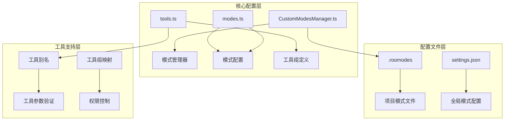
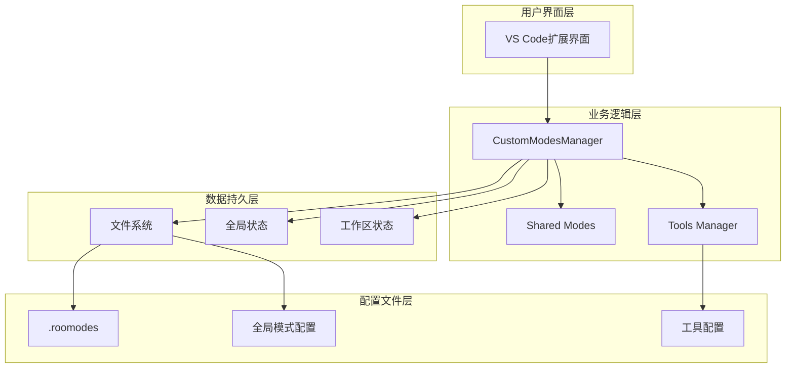
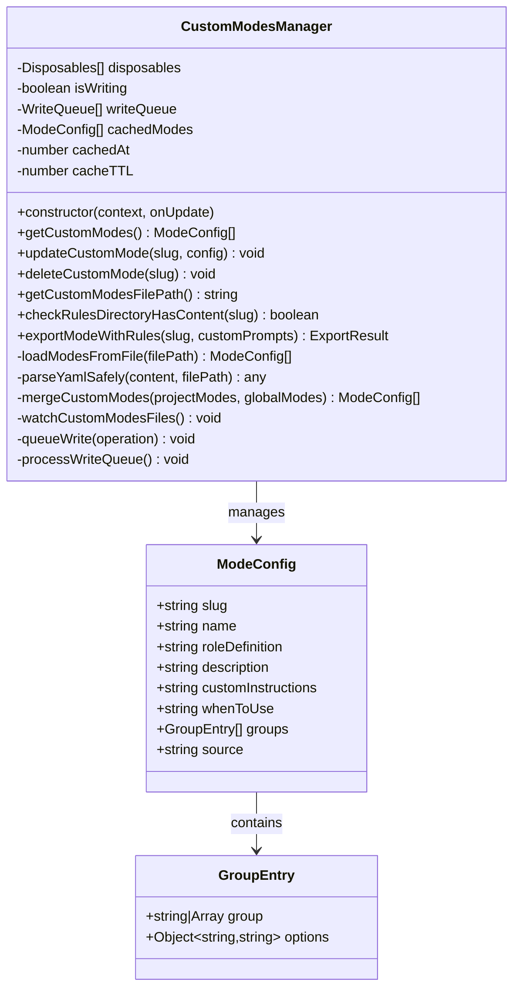
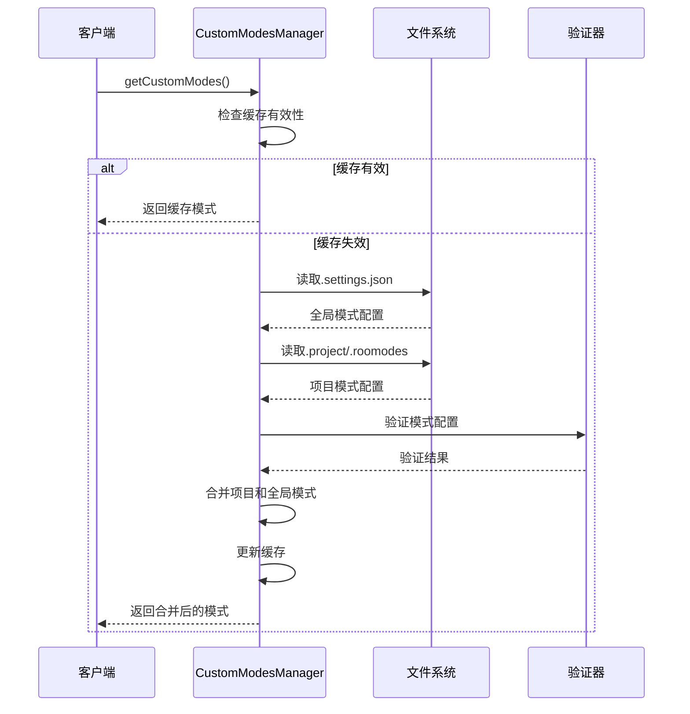
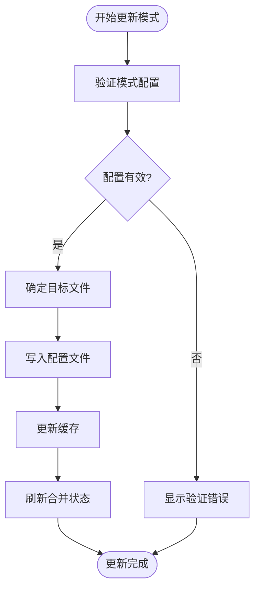
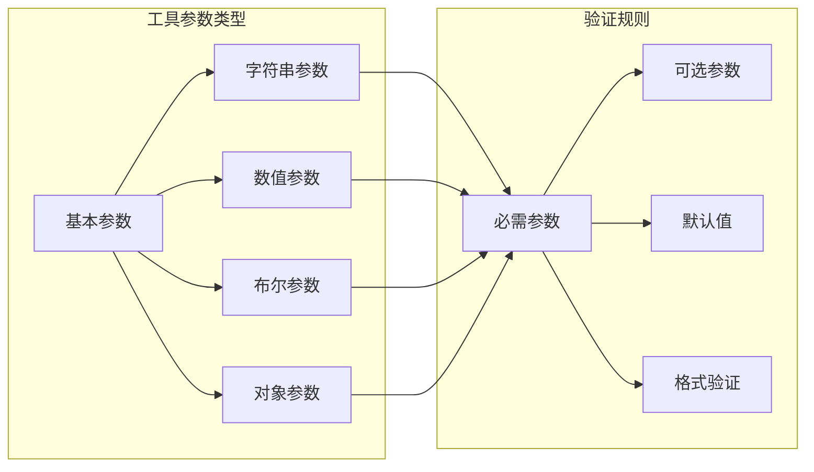
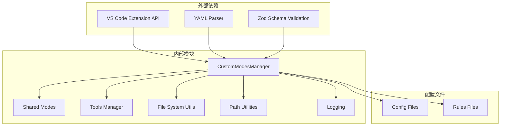
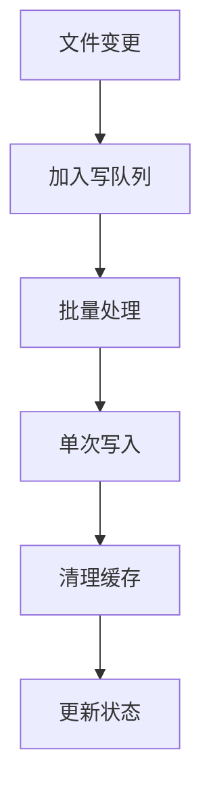

# 自定义模式开发

<cite>
**本文档引用的文件**
- [CustomModesManager.ts](file://src/core/config/CustomModesManager.ts)
- [modes.ts](file://src/shared/modes.ts)
- [tools.ts](file://src/shared/tools.ts)
- [ModeConfig.spec.ts](file://src/core/config/__tests__/ModeConfig.spec.ts)
- [CustomModesManager.spec.ts](file://src/core/config/__tests__/CustomModesManager.spec.ts)
- [CustomModesSettings.spec.ts](file://src/core/config/__tests__/CustomModesSettings.spec.ts)
- [.roomodes](file://.njust-ai/.roomodes)
- [GlobalFileNames.ts](file://src/shared/globalFileNames.ts)
- [fs.ts](file://src/utils/fs.ts)
- [path.ts](file://src/utils/path.ts)
- [njust-ai-config.ts](file://src/services/njust-ai-config/index.ts)
- [logging.ts](file://src/utils/logging.ts)
- [i18n.ts](file://src/i18n/index.ts)
</cite>

## 目录
1. [简介](#简介)
2. [项目结构](#项目结构)
3. [核心组件](#核心组件)
4. [架构概览](#架构概览)
5. [详细组件分析](#详细组件分析)
6. [依赖关系分析](#依赖关系分析)
7. [性能考虑](#性能考虑)
8. [故障排除指南](#故障排除指南)
9. [结论](#结论)
10. [附录](#附录)

## 简介

自定义模式开发是Njust-AI平台中的核心功能之一，允许开发者创建专业化的AI助手模式，为特定领域或工作流程提供定制化的智能服务。本文档提供了完整的自定义模式开发技术指南，涵盖从基础概念到高级应用的全方位内容。

自定义模式系统基于以下核心理念设计：
- **模块化架构**：支持全局和项目级两种模式管理模式
- **灵活配置**：通过YAML配置文件实现高度可定制的模式定义
- **工具集成**：内置丰富的工具组，支持第三方工具扩展
- **权限控制**：提供细粒度的文件访问和操作权限管理
- **版本管理**：支持模式的导入导出和版本控制

## 项目结构

自定义模式系统主要分布在以下核心目录中：

**图表来源**
- [CustomModesManager.ts:53-408](file://src/core/config/CustomModesManager.ts#L53-L408)
- [modes.ts:45-91](file://src/shared/modes.ts#L45-L91)
- [tools.ts:302-331](file://src/shared/tools.ts#L302-L331)

**章节来源**
- [CustomModesManager.ts:1-100](file://src/core/config/CustomModesManager.ts#L1-L100)
- [modes.ts:1-50](file://src/shared/modes.ts#L1-L50)
- [tools.ts:266-331](file://src/shared/tools.ts#L266-L331)

## 核心组件

### 模式管理器 (CustomModesManager)

模式管理器是自定义模式系统的核心组件，负责模式的加载、验证、存储和管理。其主要功能包括：

- **双文件管理模式**：同时支持`.roomodes`项目文件和全局设置文件
- **实时文件监控**：自动监听配置文件变更并实时更新模式状态
- **缓存机制**：提供10秒TTL的智能缓存，提升性能表现
- **数据验证**：使用Zod模式验证确保配置的完整性和正确性

### 模式配置系统

模式配置系统提供了灵活的模式定义能力：

- **工具组组织**：支持read、edit、command、mcp四种核心工具组
- **权限控制**：通过文件正则表达式限制工具使用的文件范围
- **继承机制**：支持模式间的继承和覆盖
- **提示词定制**：允许为不同模式定制专门的提示词模板

### 工具集成框架

工具集成框架提供了强大的工具扩展能力：

- **工具别名系统**：支持工具名称的别名映射
- **参数验证**：严格的工具参数类型验证
- **权限管理**：细粒度的工具使用权限控制
- **MCP协议支持**：原生支持Model Context Protocol工具调用

**章节来源**
- [CustomModesManager.ts:53-408](file://src/core/config/CustomModesManager.ts#L53-L408)
- [modes.ts:45-91](file://src/shared/modes.ts#L45-L91)
- [tools.ts:266-331](file://src/shared/tools.ts#L266-L331)

## 架构概览

自定义模式系统采用分层架构设计，确保了良好的可维护性和扩展性：

**图表来源**
- [CustomModesManager.ts:362-408](file://src/core/config/CustomModesManager.ts#L362-L408)
- [modes.ts:69-91](file://src/shared/modes.ts#L69-L91)
- [tools.ts:302-331](file://src/shared/tools.ts#L302-L331)

系统架构的关键特点：

1. **分层设计**：清晰分离用户界面、业务逻辑和数据持久层
2. **事件驱动**：通过文件监控和状态变化触发相应的处理逻辑
3. **缓存优化**：智能缓存机制减少重复的文件读取和解析操作
4. **配置独立**：支持项目级和全局级配置的独立管理

## 详细组件分析

### 模式管理器类分析

**图表来源**
- [CustomModesManager.ts:53-408](file://src/core/config/CustomModesManager.ts#L53-L408)
- [modes.ts:51-67](file://src/shared/modes.ts#L51-L67)

#### 核心功能实现

**模式加载流程**：

**图表来源**
- [CustomModesManager.ts:362-408](file://src/core/config/CustomModesManager.ts#L362-L408)
- [CustomModesManager.ts:189-230](file://src/core/config/CustomModesManager.ts#L189-L230)

**模式更新流程**：

**图表来源**
- [CustomModesManager.ts:410-469](file://src/core/config/CustomModesManager.ts#L410-L469)
- [CustomModesManager.ts:471-500](file://src/core/config/CustomModesManager.ts#L471-L500)

### 模式配置系统

模式配置系统提供了灵活的模式定义能力，支持多种配置选项：

#### 模式字段定义

| 字段名 | 类型 | 必需 | 描述 |
|--------|------|------|------|
| slug | string | 是 | 模式的唯一标识符，必须符合特定格式要求 |
| name | string | 是 | 模式的显示名称 |
| roleDefinition | string | 是 | AI助手的角色定义和职责说明 |
| description | string | 否 | 模式的详细描述信息 |
| customInstructions | string | 否 | 自定义的提示词指令 |
| whenToUse | string | 否 | 使用场景说明 |
| groups | GroupEntry[] | 是 | 工具组配置数组 |
| source | "project"\|"global" | 否 | 模式来源标识 |

#### 工具组配置

系统支持四种核心工具组：

1. **read组**：文件读取相关工具
   - read_file：读取文件内容
   - search_files：搜索文件
   - list_files：列出文件
   - codebase_search：代码库搜索
   - web_search：网络搜索

2. **edit组**：文件编辑相关工具
   - write_to_file：写入文件
   - apply_diff：应用差异
   - generate_image：生成图片

3. **command组**：命令执行工具
   - execute_command：执行命令
   - read_command_output：读取命令输出

4. **mcp组**：MCP协议工具
   - use_mcp_tool：使用MCP工具
   - access_mcp_resource：访问MCP资源

**章节来源**
- [modes.ts:45-91](file://src/shared/modes.ts#L45-L91)
- [tools.ts:302-331](file://src/shared/tools.ts#L302-L331)

### 工具集成框架

工具集成框架提供了强大的工具扩展能力，支持多种工具类型和协议：

#### 工具参数验证

系统为每个工具定义了严格的参数验证规则：

**图表来源**
- [tools.ts:26-88](file://src/shared/tools.ts#L26-L88)
- [tools.ts:96-125](file://src/shared/tools.ts#L96-L125)

#### 权限控制系统

系统提供了多层次的权限控制机制：

1. **文件访问权限**：通过正则表达式限制文件操作范围
2. **工具使用权限**：控制工具的可用性和使用频率
3. **操作审计**：记录所有工具使用操作用于审计和监控

**章节来源**
- [tools.ts:1-392](file://src/shared/tools.ts#L1-L392)

## 依赖关系分析

自定义模式系统涉及多个层次的依赖关系：

**图表来源**
- [CustomModesManager.ts:1-25](file://src/core/config/CustomModesManager.ts#L1-L25)
- [modes.ts:1-15](file://src/shared/modes.ts#L1-L15)

### 关键依赖关系

1. **VS Code扩展API**：提供文件系统监控和用户界面交互能力
2. **YAML解析器**：处理配置文件的读取和解析
3. **Zod验证库**：确保配置数据的完整性和正确性
4. **文件系统工具**：提供跨平台的文件操作能力

**章节来源**
- [CustomModesManager.ts:1-25](file://src/core/config/CustomModesManager.ts#L1-L25)
- [CustomModesManager.ts:255-265](file://src/core/config/CustomModesManager.ts#L255-L265)

## 性能考虑

自定义模式系统在设计时充分考虑了性能优化：

### 缓存策略

系统实现了智能缓存机制来提升性能：

- **TTL缓存**：10秒缓存有效期，平衡数据新鲜度和性能
- **懒加载**：按需加载配置文件，避免不必要的I/O操作
- **批量更新**：使用写队列机制批量处理配置更新

### 文件监控优化

**图表来源**
- [CustomModesManager.ts:71-97](file://src/core/config/CustomModesManager.ts#L71-L97)
- [CustomModesManager.ts:267-360](file://src/core/config/CustomModesManager.ts#L267-L360)

### 内存管理

系统采用了多项内存管理策略：

- **对象池**：复用模式对象减少垃圾回收压力
- **延迟初始化**：按需创建工具实例
- **弱引用**：对大型数据结构使用弱引用避免内存泄漏

## 故障排除指南

### 常见问题及解决方案

#### 模式配置错误

**问题**：模式配置文件解析失败
**原因**：YAML语法错误或配置格式不正确
**解决方法**：
1. 检查YAML缩进和语法
2. 验证必需字段完整性
3. 使用在线YAML验证工具

#### 权限不足错误

**问题**：工具调用被拒绝
**原因**：文件权限或工具权限配置不当
**解决方法**：
1. 检查文件访问权限配置
2. 验证工具组权限设置
3. 确认用户权限级别

#### 性能问题

**问题**：模式加载缓慢
**原因**：缓存失效或大量文件监控
**解决方法**：
1. 检查文件系统监控设置
2. 清理不必要的文件监听
3. 优化配置文件结构

**章节来源**
- [CustomModesManager.ts:153-187](file://src/core/config/CustomModesManager.ts#L153-L187)
- [CustomModesManager.ts:222-229](file://src/core/config/CustomModesManager.ts#L222-L229)

### 调试技巧

1. **启用详细日志**：使用调试模式查看详细的执行流程
2. **配置验证**：定期运行配置验证脚本
3. **性能监控**：监控缓存命中率和文件I/O性能
4. **错误追踪**：使用源码映射定位具体错误位置

## 结论

自定义模式开发系统为Njust-AI平台提供了强大而灵活的模式管理能力。通过模块化的设计、完善的验证机制和高效的性能优化，系统能够满足各种复杂的应用场景需求。

### 主要优势

1. **高度可定制**：支持全局和项目级双重管理模式
2. **强健的验证**：完整的配置验证和错误处理机制
3. **优秀的性能**：智能缓存和批量处理优化
4. **易于扩展**：清晰的架构设计便于功能扩展

### 发展方向

1. **增强AI集成**：进一步优化与AI模型的交互能力
2. **可视化配置**：提供图形化的模式配置界面
3. **模板系统**：建立标准的模式模板库
4. **社区生态**：构建模式分享和协作平台

## 附录

### 开发示例

#### 创建专业领域模式

1. **定义模式配置**：创建包含领域特定工具组的模式配置
2. **配置权限控制**：设置文件访问权限和操作限制
3. **定制提示词**：编写针对领域的专业提示词
4. **测试验证**：运行单元测试确保配置正确性

#### 集成第三方工具

1. **工具适配**：实现工具接口适配第三方API
2. **参数映射**：建立参数类型映射关系
3. **权限配置**：设置工具使用权限和限制
4. **测试集成**：验证工具调用的正确性和安全性

### 最佳实践

1. **配置管理**：使用版本控制系统管理模式配置
2. **文档规范**：为每个模式编写详细的使用文档
3. **测试覆盖**：确保关键功能有完整的测试用例
4. **性能监控**：持续监控模式的性能表现
5. **安全审计**：定期审查权限配置和操作日志

### 版本管理

系统支持完整的版本管理功能：

- **模式版本**：跟踪模式的版本历史
- **配置迁移**：自动处理配置格式升级
- **回滚机制**：支持配置的快速回滚
- **兼容性检查**：验证新旧版本的兼容性

通过遵循本文档提供的指导原则和最佳实践，开发者可以高效地创建高质量的自定义模式，为用户提供专业的AI辅助服务。