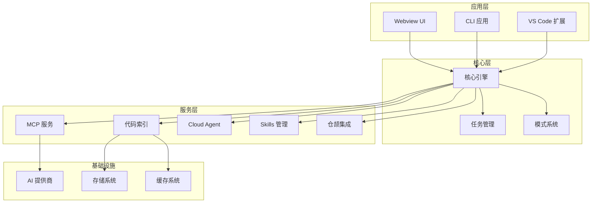
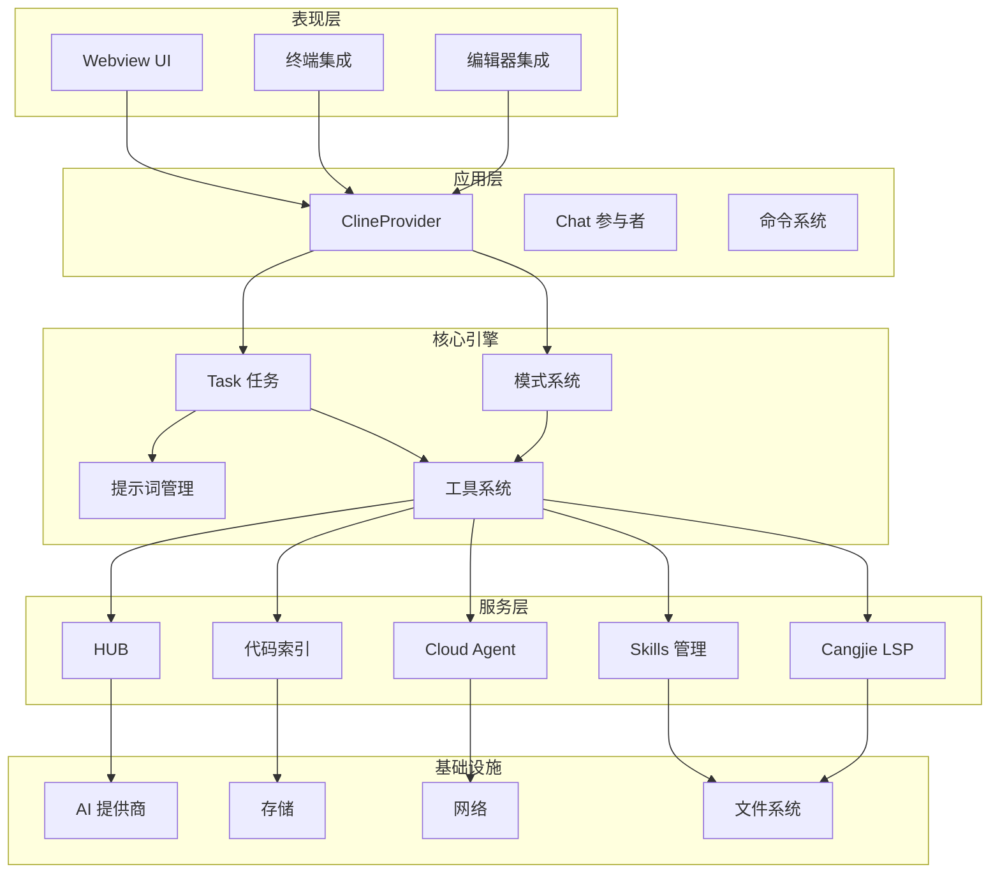
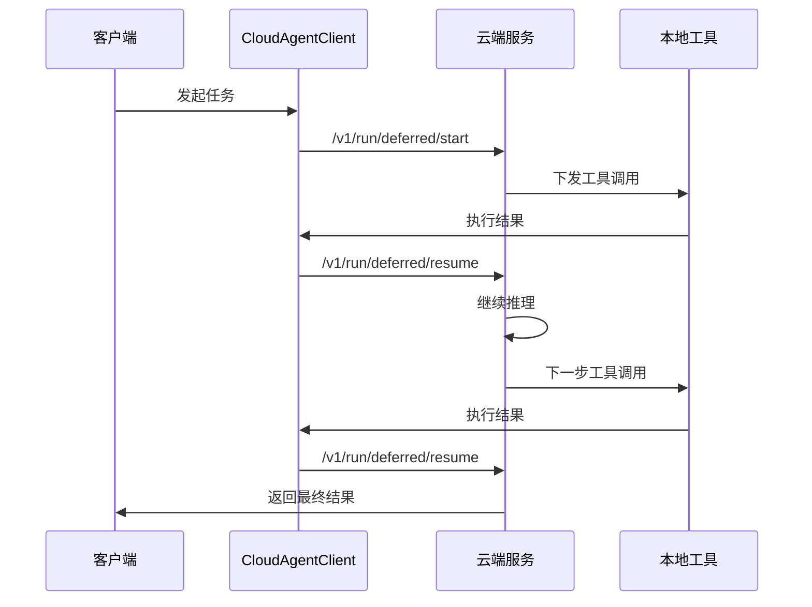
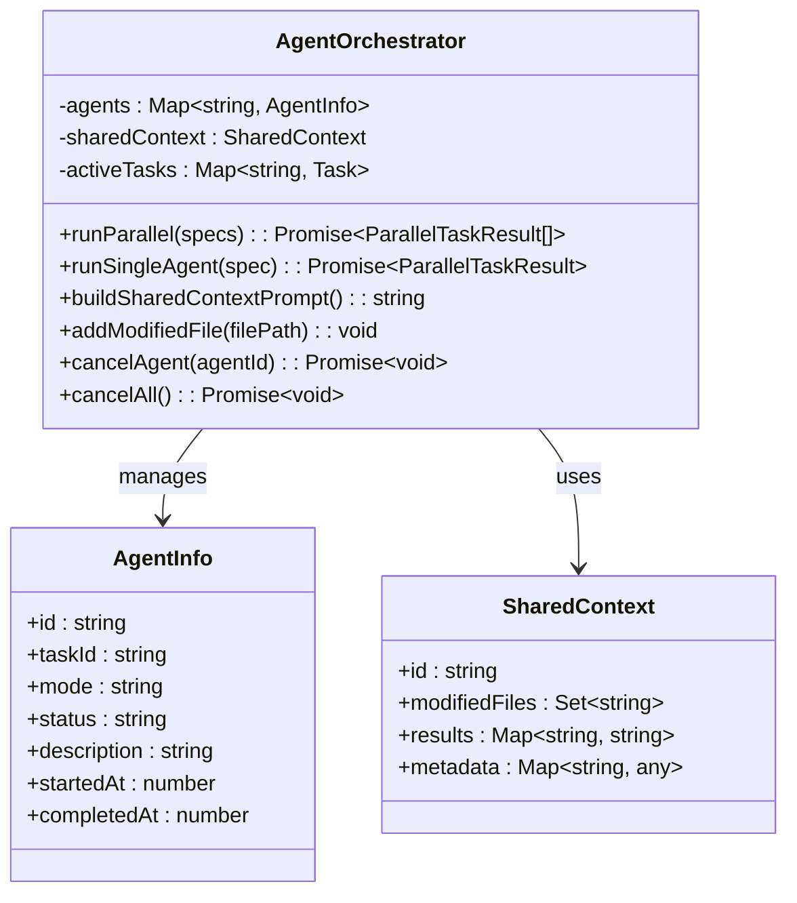
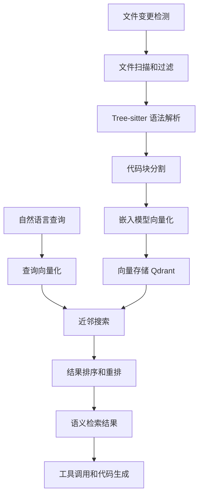
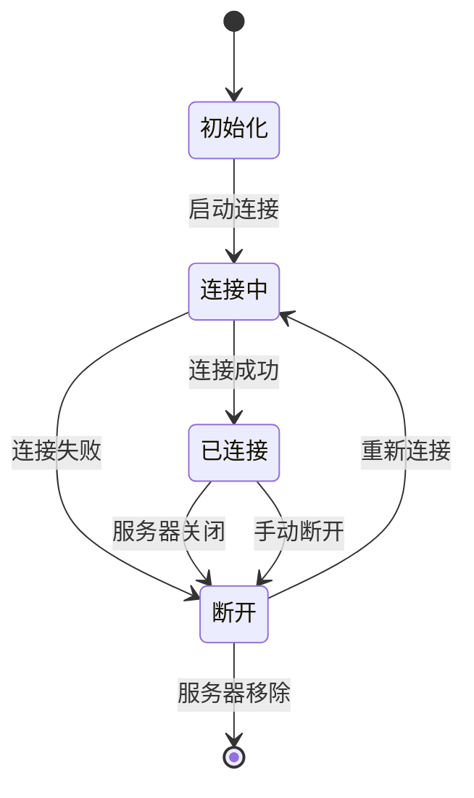
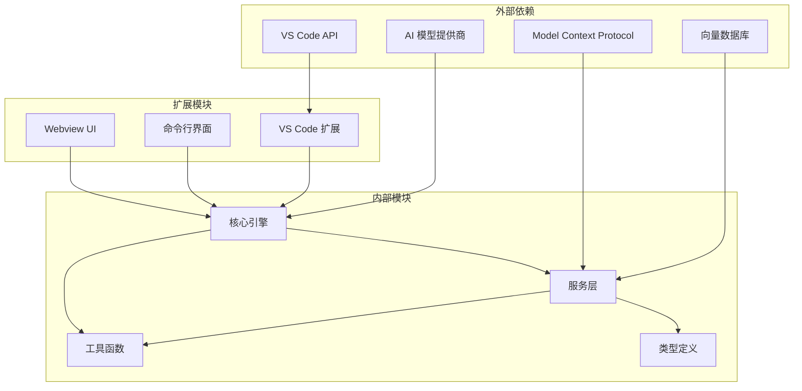

# 核心功能特性

<cite>
**本文档引用的文件**
- [README.md](file://README.md)
- [extension.ts](file://src/extension.ts)
- [Task.ts](file://src/core/task/Task.ts)
- [AgentOrchestrator.ts](file://src/core/agent/AgentOrchestrator.ts)
- [manager.ts](file://src/services/code-index/manager.ts)
- [McpHub.ts](file://src/services/mcp/McpHub.ts)
- [CloudAgentClient.ts](file://src/services/cloud-agent/CloudAgentClient.ts)
- [CangjieLspClient.ts](file://src/services/cangjie-lsp/CangjieLspClient.ts)
- [SkillsManager.ts](file://src/services/skills/SkillsManager.ts)
- [mode.ts](file://packages/types/src/mode.ts)
- [index.ts](file://packages/core/src/index.ts)
- [index.ts](file://apps/cli/src/index.ts)
</cite>

## 目录
1. [简介](#简介)
2. [项目结构](#项目结构)
3. [核心组件](#核心组件)
4. [架构概览](#架构概览)
5. [详细组件分析](#详细组件分析)
6. [依赖分析](#依赖分析)
7. [性能考虑](#性能考虑)
8. [故障排除指南](#故障排除指南)
9. [结论](#结论)

## 简介

Njust-AI 是一个基于 VS Code 的 AI 编程助手扩展，专为 NJUST 内部使用定制。该项目在上游 NJUST_AI 基础上进行了深度定制，移除了与账号、组织、市集浏览相关的云服务，保留并扩展了本地/自建服务对接能力。

### 主要特性概述

- **AI 编程助手**：提供智能代码生成、修改和优化能力
- **多模式工作流**：支持 Cloud Agent、Architect、Code、Ask、Debug、Cangjie Dev、Orchestrator 等七种工作模式
- **任务管理系统**：完整的任务生命周期管理，支持检查点和历史记录
- **代码索引系统**：基于语义的代码检索和索引功能
- **MCP 协议支持**：Model Context Protocol 的完整实现
- **仓颉语言集成**：深度集成 Cangjie 语言的 LSP、工具链和开发环境

## 项目结构

项目采用模块化的架构设计，主要分为以下几个核心层次：

**图表来源**
- [README.md:349-364](file://README.md#L349-L364)
- [extension.ts:95-542](file://src/extension.ts#L95-L542)

**章节来源**
- [README.md:1-369](file://README.md#L1-L369)
- [extension.ts:1-576](file://src/extension.ts#L1-L576)

## 核心组件

### AI 编程助手

AI 编程助手是整个系统的核心，负责处理用户输入、与 AI 模型交互、执行工具调用，并管理整个对话流程。

#### 核心价值
- **智能代码生成**：基于上下文理解生成高质量代码
- **多模态交互**：支持文本、图像等多种输入方式
- **工具集成**：无缝集成各种开发工具和命令

#### 技术实现要点
- **任务驱动架构**：每个用户请求都是一个独立的任务
- **流式响应**：支持实时的流式 AI 响应
- **自动批准机制**：减少重复的手动审批操作

**章节来源**
- [README.md:185-216](file://README.md#L185-L216)
- [Task.ts:176-587](file://src/core/task/Task.ts#L176-L587)

### 多模式工作流系统

系统提供了七种不同的工作模式，每种模式都有特定的用途和工具集。

#### 模式分类

| 模式 | 标识符 | 核心用途 | 工具组 |
|------|--------|----------|--------|
| Cloud Agent | cloud-agent | 云端 AI 代理，远程规划和执行 | read, edit, command, mcp |
| Architect | architect | 架构设计和规划 | read, edit(markdown), mcp |
| Code | code | 代码编写和修改 | read, edit, command, mcp |
| Ask | ask | 问答和解释 | read, mcp |
| Debug | debug | 问题诊断和调试 | read, edit, command, mcp |
| Cangjie Dev | cangjie | 仓颉语言开发 | read, edit(.cj/.toml/.md), command |
| Orchestrator | orchestrator | 工作流协调 | - |

#### 核心价值
- **专业化分工**：每种模式专注于特定的开发任务
- **灵活切换**：根据任务需求动态切换工作模式
- **工具权限控制**：精确控制每种模式可用的工具集

**章节来源**
- [mode.ts:168-393](file://packages/types/src/mode.ts#L168-L393)
- [README.md:204-210](file://README.md#L204-L210)

### 任务管理系统

任务管理系统负责管理 AI 编程助手的所有交互过程，从用户输入到最终结果输出的完整生命周期。

#### 核心特性
- **任务状态管理**：跟踪任务的创建、执行、暂停、恢复状态
- **检查点系统**：支持任务执行过程中的中间状态保存
- **历史记录**：持久化存储任务历史和结果
- **并发控制**：支持多个任务的并发执行和协调

#### 技术实现
- **事件驱动架构**：基于 EventEmitter 的异步事件处理
- **流式处理**：支持 AI 响应的流式处理和实时更新
- **错误恢复**：完善的错误处理和自动恢复机制

**章节来源**
- [Task.ts:176-800](file://src/core/task/Task.ts#L176-L800)
- [README.md:196-203](file://README.md#L196-L203)

### 代码索引系统

代码索引系统提供了强大的代码检索和语义分析能力，支持基于内容的智能搜索。

#### 核心价值
- **语义检索**：超越关键词匹配的智能代码搜索
- **增量索引**：实时跟踪代码变更并更新索引
- **多语言支持**：支持多种编程语言的语法分析

#### 技术实现
- **向量化搜索**：使用嵌入模型进行语义相似度计算
- **分布式存储**：基于 Qdrant 的高性能向量数据库
- **缓存优化**：智能缓存策略减少重复计算

**章节来源**
- [manager.ts:18-466](file://src/services/code-index/manager.ts#L18-L466)
- [README.md:237-243](file://README.md#L237-L243)

### MCP 协议支持

Model Context Protocol (MCP) 是一个开放标准，Njust-AI 提供了完整的 MCP 实现。

#### 核心价值
- **标准化接口**：统一的工具和服务访问接口
- **插件生态**：支持第三方 MCP 服务器和工具
- **安全控制**：细粒度的权限控制和访问管理

#### 技术实现
- **多传输协议**：支持 STDIO、SSE、Streamable HTTP 三种传输方式
- **配置管理**：灵活的服务器配置和动态更新
- **错误处理**：完善的连接管理和错误恢复机制

**章节来源**
- [McpHub.ts:151-800](file://src/services/mcp/McpHub.ts#L151-L800)
- [README.md:223-228](file://README.md#L223-L228)

### 仓颉语言集成

Njust-AI 提供了深度的 Cangjie 语言支持，包括完整的开发工具链集成。

#### 核心价值
- **IDE 功能**：完整的代码编辑、调试、测试功能
- **工具链集成**：cjpm、cjc、cjdb 等工具的无缝集成
- **语言特性**：支持仓颉语言的所有特性和最佳实践

#### 技术实现
- **LSP 支持**：完整的 Language Server Protocol 实现
- **智能感知**：代码补全、跳转、重构等智能功能
- **构建系统**：与 cjpm 的深度集成

**章节来源**
- [CangjieLspClient.ts:1-200](file://src/services/cangjie-lsp/CangjieLspClient.ts#L1-L200)
- [README.md:250-260](file://README.md#L250-L260)

### Skills 子系统

Skills 系统允许用户创建和管理自定义的 AI 工作流程和知识库。

#### 核心价值
- **知识复用**：将经验和最佳实践封装为可复用的技能
- **个性化定制**：支持团队和项目的个性化配置
- **动态加载**：支持技能的动态发现和加载

#### 技术实现
- **文件系统扫描**：自动发现和加载技能文件
- **元数据管理**：基于 YAML frontmatter 的技能元数据
- **模式绑定**：支持按模式分类的技能管理

**章节来源**
- [SkillsManager.ts:22-200](file://src/services/skills/SkillsManager.ts#L22-L200)
- [README.md:244-249](file://README.md#L244-L249)

## 架构概览

系统采用分层架构设计，确保各组件之间的松耦合和高内聚。

**图表来源**
- [README.md:37-68](file://README.md#L37-L68)
- [extension.ts:240-421](file://src/extension.ts#L240-L421)

**章节来源**
- [README.md:33-169](file://README.md#L33-L169)
- [extension.ts:95-542](file://src/extension.ts#L95-L542)

## 详细组件分析

### Cloud Agent 子系统

Cloud Agent 是 Njust-AI 的核心创新之一，实现了云端推理、本地执行的混合架构。

#### 核心价值
- **云端智能**：利用云端强大的 AI 能力进行复杂推理
- **本地安全**：敏感操作在本地执行，确保数据安全
- **协议标准化**：支持标准的 deferred 协议

#### 技术实现

**图表来源**
- [CloudAgentClient.ts:306-333](file://src/services/cloud-agent/CloudAgentClient.ts#L306-L333)

#### 关键特性
- **延期协议**：支持多轮的 deferred start/resume 循环
- **工作区操作**：支持远程工作区文件操作
- **编译反馈**：支持编译错误的自动修复循环

**章节来源**
- [CloudAgentClient.ts:43-339](file://src/services/cloud-agent/CloudAgentClient.ts#L43-L339)
- [README.md:229-236](file://README.md#L229-L236)

### AgentOrchestrator 协调器

AgentOrchestrator 提供了强大的并行任务执行和协调能力。

#### 核心价值
- **并行执行**：多个 Agent 可以同时执行不同的任务
- **上下文共享**：支持 Agent 间的文件和结果共享
- **依赖管理**：支持任务间的依赖关系和执行顺序

#### 技术实现

**图表来源**
- [AgentOrchestrator.ts:39-287](file://src/core/agent/AgentOrchestrator.ts#L39-L287)

**章节来源**
- [AgentOrchestrator.ts:39-288](file://src/core/agent/AgentOrchestrator.ts#L39-L288)

### 代码索引流水线

代码索引系统提供了完整的从文件到语义检索的处理流水线。

#### 核心价值
- **智能检索**：基于语义相似度的代码搜索
- **实时更新**：自动跟踪代码变更并更新索引
- **性能优化**：高效的向量存储和查询机制

#### 技术实现

**图表来源**
- [manager.ts:388-424](file://src/services/code-index/manager.ts#L388-L424)

**章节来源**
- [manager.ts:18-466](file://src/services/code-index/manager.ts#L18-L466)
- [README.md:127-142](file://README.md#L127-L142)

### MCP 服务器管理

MCP Hub 提供了完整的 MCP 服务器生命周期管理。

#### 核心价值
- **多服务器支持**：同时管理多个 MCP 服务器
- **动态配置**：支持运行时配置的动态更新
- **安全控制**：细粒度的权限和访问控制

#### 技术实现

**图表来源**
- [McpHub.ts:647-654](file://src/services/mcp/McpHub.ts#L647-L654)

**章节来源**
- [McpHub.ts:151-800](file://src/services/mcp/McpHub.ts#L151-L800)

## 依赖分析

系统采用了清晰的依赖层次结构，确保模块间的松耦合。

**图表来源**
- [extension.ts:30-61](file://src/extension.ts#L30-L61)
- [index.ts:1-5](file://packages/core/src/index.ts#L1-L5)

**章节来源**
- [extension.ts:1-576](file://src/extension.ts#L1-L576)
- [index.ts:1-5](file://packages/core/src/index.ts#L1-L5)

## 性能考虑

### 缓存策略
- **嵌入模型缓存**：避免重复的向量计算
- **工具调用缓存**：缓存频繁使用的工具结果
- **配置缓存**：减少配置文件的重复读取

### 并发优化
- **异步处理**：大量使用 Promise 和 async/await
- **流式处理**：支持实时的数据流处理
- **批量操作**：合并多个小操作为批量处理

### 内存管理
- **对象池**：重用频繁创建的对象
- **垃圾回收**：及时清理不再使用的资源
- **内存监控**：监控内存使用情况并优化

## 故障排除指南

### 常见问题

#### Cloud Agent 连接问题
- **症状**：无法连接到 Cloud Agent 服务器
- **解决方案**：检查服务器 URL、API Key 配置，确认网络连通性

#### 代码索引异常
- **症状**：代码搜索结果不准确或索引构建失败
- **解决方案**：检查嵌入模型配置，清理索引缓存，重新初始化索引

#### MCP 服务器问题
- **症状**：MCP 服务器无法启动或连接不稳定
- **解决方案**：检查服务器配置，确认端口可用性，查看服务器日志

#### 仓颉语言支持问题
- **症状**：Cangjie 语言功能异常
- **解决方案**：检查 CANGJIE_HOME 环境变量，确认工具链安装完整

**章节来源**
- [CloudAgentClient.ts:14-41](file://src/services/cloud-agent/CloudAgentClient.ts#L14-L41)
- [manager.ts:277-301](file://src/services/code-index/manager.ts#L277-L301)
- [McpHub.ts:281-284](file://src/services/mcp/McpHub.ts#L281-L284)

## 结论

Njust-AI 项目展现了现代 AI 编程助手的完整架构和实现。通过精心设计的模块化架构、强大的功能特性和优雅的技术实现，该项目为开发者提供了一个强大而灵活的 AI 编程辅助工具。

### 主要成就
- **架构完整性**：从表现层到基础设施的完整技术栈
- **功能丰富性**：涵盖 AI 编程、代码检索、工具集成等多个方面
- **技术创新性**：Cloud Agent、AgentOrchestrator 等创新功能
- **用户体验**：简洁直观的界面和流畅的交互体验

### 未来发展方向
- **性能优化**：进一步提升系统的响应速度和处理能力
- **功能扩展**：增加更多 AI 编程能力和工具集成
- **生态建设**：构建更加丰富的插件和技能生态系统
- **平台扩展**：支持更多的开发环境和工具链

Njust-AI 不仅是一个功能强大的 AI 编程助手，更是现代软件开发工具的重要创新，为未来的 AI 辅助编程奠定了坚实的基础。