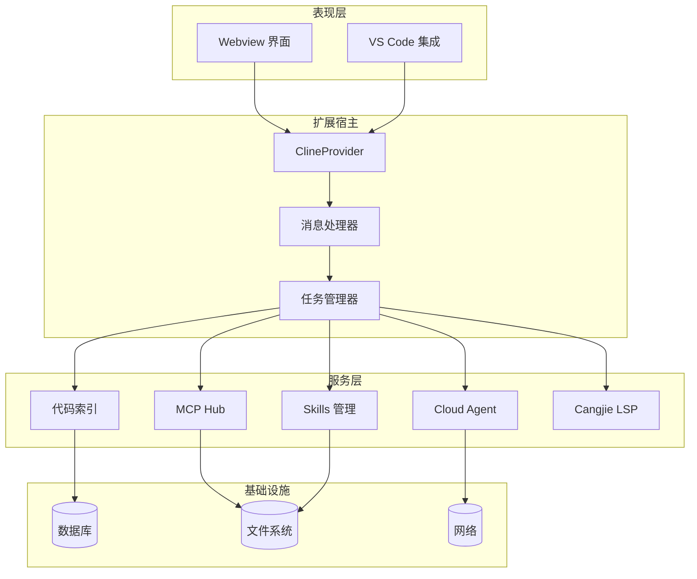
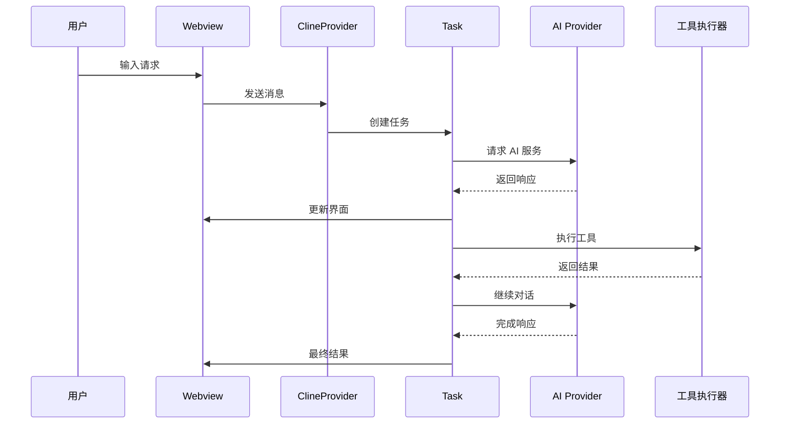
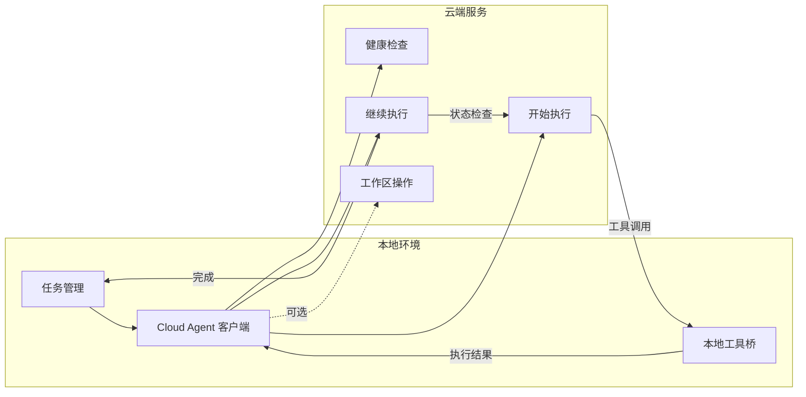

# 项目介绍与愿景

<cite>
**本文档引用的文件**
- [README.md](file://README.md)
- [package.json](file://package.json)
- [src/extension.ts](file://src/extension.ts)
- [AGENTS.md](file://AGENTS.md)
- [src/core/agent/AgentOrchestrator.ts](file://src/core/agent/AgentOrchestrator.ts)
- [src/services/code-index/manager.ts](file://src/services/code-index/manager.ts)
- [src/services/skills/SkillsManager.ts](file://src/services/skills/SkillsManager.ts)
- [src/core/config/ContextProxy.ts](file://src/core/config/ContextProxy.ts)
- [src/shared/modes.ts](file://src/shared/modes.ts)
- [src/services/mcp-server/RooToolsMcpServer.ts](file://src/services/mcp-server/RooToolsMcpServer.ts)
- [src/core/task/Task.ts](file://src/core/task/Task.ts)
- [locales/zh-CN/README.md](file://locales/zh-CN/README.md)
- [CONTRIBUTING.md](file://CONTRIBUTING.md)
</cite>

## 目录
1. [项目概述](#项目概述)
2. [核心使命与愿景](#核心使命与愿景)
3. [设计理念与架构原则](#设计理念与架构原则)
4. [与上游项目的关系](#与上游项目的关系)
5. [核心技术特色](#核心技术特色)
6. [创新点与竞争优势](#创新点与竞争优势)
7. [多模式工作流体系](#多模式工作流体系)
8. [技术架构概览](#技术架构概览)
9. [项目定制化改进方向](#项目定制化改进方向)
10. [总结](#总结)

## 项目概述

Njust-AI AI 编程助手是一个基于 VS Code 的 AI 驱动开发助手，专注于为开发者提供智能化的编程体验。该项目以 NJUST_AI 为基础，经过深度定制和优化，形成了独特的 AI 编程生态系统。

### 核心定位

Njust-AI 将 AI 助手无缝集成到开发者的日常工作中，提供从代码生成、智能编辑到多模式协作的全方位编程支持。项目采用"左对话、右代码"的经典工作布局，让开发者能够在同一界面中进行高效的代码协作。

### 主要特性

- **多模式工作流**：支持代码、架构师、提问、调试等多种专业模式
- **智能代码索引**：基于语义检索的代码理解和生成能力
- **MCP 服务器集成**：提供标准化的工具调用接口
- **仓颉语言支持**：深度集成 Cangjie 语言的开发工具链
- **云端代理协作**：支持本地推理与云端资源的混合工作模式

**章节来源**
- [README.md:1-369](file://README.md#L1-L369)
- [locales/zh-CN/README.md:47-68](file://locales/zh-CN/README.md#L47-L68)

## 核心使命与愿景

### 核心使命

Njust-AI 的核心使命是"将 AI 驱动的开发团队带到你的编辑器里"，为开发者提供一个智能、高效、可靠的编程助手。项目致力于：

- **提升开发效率**：通过 AI 助手减少重复性劳动，加速开发流程
- **降低学习成本**：提供直观易用的界面和多模式工作流
- **增强代码质量**：通过智能分析和建议提高代码质量和一致性
- **促进团队协作**：支持多人协作和知识共享的工作模式

### 长远愿景

项目致力于成为开发者最信赖的 AI 编程伙伴，推动软件开发方式的根本性变革。愿景包括：

- **智能化编程**：让 AI 成为开发者思维的延伸，提供前瞻性的代码建议
- **个性化体验**：根据每个开发者的工作习惯和项目特点提供定制化的支持
- **生态化发展**：构建开放的 AI 编程生态系统，支持各种工具和服务的集成
- **全球化普及**：支持多语言、多文化背景的开发者，促进全球软件开发的协作

**章节来源**
- [locales/zh-CN/README.md:14](file://locales/zh-CN/README.md#L14)
- [CONTRIBUTING.md:26-47](file://CONTRIBUTING.md#L26-L47)

## 设计理念与架构原则

### 设计理念

Njust-AI 采用"以开发者为中心"的设计理念，强调实用性、可靠性和易用性：

- **实用主义**：所有功能都围绕解决实际开发痛点而设计
- **渐进增强**：从基础功能开始，逐步提供更高级的 AI 能力
- **可扩展性**：架构设计支持功能的持续扩展和定制
- **可靠性**：确保核心功能的稳定性和可预测性

### 架构原则

项目遵循以下核心架构原则：

- **模块化设计**：采用清晰的功能模块划分，便于维护和扩展
- **松耦合**：各组件之间保持低耦合，支持独立演进
- **标准化接口**：通过标准化的接口实现组件间的通信
- **可测试性**：每个模块都具备良好的测试支持

**章节来源**
- [README.md:33-169](file://README.md#L33-L169)

## 与上游项目的关系

### 基于 NJUST_AI 的定制化

Njust-AI 是在 NJUST_AI 基础上的深度定制版本，主要区别包括：

#### 移除的功能
- **账号系统**：移除了与账号、组织相关的云服务功能
- **市场浏览**：取消了远程市场浏览和安装机制
- **遥测收集**：简化了遥测功能，减少数据收集

#### 保留和增强的功能
- **本地服务对接**：强化了本地和自建服务的支持
- **Cloud Agent**：保留并优化了云端代理能力
- **仓颉语言支持**：大幅增强了 Cangjie 语言的开发工具链
- **MCP 配置**：保持了 MCP 服务器的管理能力

### 关系意义

这种定制化策略使得 Njust-AI 更加专注于核心的编程辅助功能，同时保持了与上游项目的兼容性和技术传承。

**章节来源**
- [README.md:9](file://README.md#L9)
- [README.md:170-184](file://README.md#L170-L184)

## 核心技术特色

### 1. 多模式工作流系统

Njust-AI 提供了完整的多模式工作流体系，每种模式都有特定的专业用途：

- **代码模式**：日常编码、文件编辑和基本操作
- **架构师模式**：系统规划、架构设计和规范制定
- **提问模式**：快速问答、代码解释和技术咨询
- **调试模式**：问题诊断、错误追踪和解决方案
- **Cangjie 开发模式**：专门针对 Cangjie 语言的开发支持
- **Orchestrator 模式**：多模式编排和复杂任务协调

### 2. 智能代码索引

项目实现了先进的代码索引和语义检索系统：

- **向量化索引**：使用嵌入模型创建代码的语义表示
- **多语言支持**：支持多种编程语言的代码分析
- **实时检索**：提供快速的代码相关性搜索
- **上下文感知**：结合项目上下文提供精准的结果

### 3. MCP 服务器集成

通过 MCP (Model Context Protocol) 实现了标准化的工具调用：

- **标准化接口**：提供统一的工具调用协议
- **安全控制**：严格的权限管理和命令执行控制
- **扩展能力**：支持第三方工具和服务的集成

### 4. Cloud Agent 协作

实现了云端代理的混合工作模式：

- **本地推理**：在本地设备上进行智能推理
- **云端资源**：利用云端的强大计算资源
- **安全隔离**：确保敏感代码不会离开本地环境
- **编译反馈**：支持云端编译和错误反馈循环

**章节来源**
- [README.md:185-286](file://README.md#L185-L286)
- [src/services/code-index/manager.ts:18-466](file://src/services/code-index/manager.ts#L18-L466)
- [src/services/mcp-server/RooToolsMcpServer.ts:27-339](file://src/services/mcp-server/RooToolsMcpServer.ts#L27-L339)

## 创新点与竞争优势

### 技术创新

#### 1. 混合工作模式
- **Cloud Agent 协议**：实现了本地推理与云端资源的最佳平衡
- **延迟执行协议**：支持复杂的多轮交互和条件执行
- **编译反馈循环**：提供持续改进的开发体验

#### 2. 智能上下文管理
- **动态上下文压缩**：自动管理对话历史的长度和相关性
- **文件上下文跟踪**：精确跟踪代码文件的修改和变化
- **智能提示组装**：根据上下文动态生成个性化的提示

#### 3. 多模态交互
- **自然语言处理**：支持复杂的自然语言指令
- **图像识别**：能够处理和分析代码截图
- **多模态输出**：支持文本、代码、图像等多种输出格式

### 商业优势

#### 1. 成本效益
- **本地部署**：减少对云端服务的依赖，降低运营成本
- **开源生态**：基于开源技术，减少许可费用
- **可扩展性**：支持从小型项目到大型企业的各种规模

#### 2. 安全保障
- **数据隐私**：敏感代码保留在本地，符合企业安全要求
- **访问控制**：细粒度的权限管理和访问控制
- **审计跟踪**：完整的操作记录和审计功能

#### 3. 技术领先
- **AI 集成**：深度整合最新的 AI 模型和技术
- **工具生态**：丰富的第三方工具和服务集成
- **持续创新**：活跃的开发社区和持续的功能更新

**章节来源**
- [AGENTS.md:1-22](file://AGENTS.md#L1-L22)
- [README.md:99-125](file://README.md#L99-L125)

## 多模式工作流体系

### 模式定义与用途

Njust-AI 的多模式工作流体系是其核心特色之一，每种模式都针对特定的开发场景：

#### 代码模式 (Code Mode)
- **适用场景**：日常编码、文件编辑、代码修改
- **核心功能**：代码生成、语法检查、格式化
- **工具集**：文件操作、代码搜索、批量编辑

#### 架构师模式 (Architect Mode)
- **适用场景**：系统设计、架构规划、技术决策
- **核心功能**：需求分析、架构设计、技术选型
- **工具集**：文档生成、规范制定、设计模式

#### 提问模式 (Ask Mode)
- **适用场景**：快速问答、技术咨询、学习指导
- **核心功能**：知识检索、问题解答、概念解释
- **工具集**：文档搜索、示例代码、最佳实践

#### 调试模式 (Debug Mode)
- **适用场景**：错误排查、性能分析、问题定位
- **核心功能**：日志分析、错误追踪、性能监控
- **工具集**：调试工具、监控仪表板、分析报告

#### Cangjie 开发模式 (Cangjie Dev Mode)
- **适用场景**：Cangjie 语言开发、仓颉工具链使用
- **核心功能**：语言支持、工具集成、开发环境
- **工具集**：LSP 支持、编译器、调试器

### 模式切换与管理

系统提供了灵活的模式切换和管理机制：

- **动态切换**：无需重启即可在不同模式间切换
- **配置继承**：模式间的配置和设置可以继承和共享
- **权限控制**：不同模式具有不同的操作权限和限制
- **状态保存**：模式切换时的状态和进度可以保存和恢复

**章节来源**
- [src/shared/modes.ts:44-91](file://src/shared/modes.ts#L44-L91)
- [README.md:204-210](file://README.md#L204-L210)

## 技术架构概览

### 整体架构设计

Njust-AI 采用了分层架构设计，确保系统的可维护性和可扩展性：

**图表来源**
- [README.md:37-68](file://README.md#L37-L68)

### 核心组件交互

#### 任务执行流程

**图表来源**
- [README.md:74-97](file://README.md#L74-L97)

#### Cloud Agent 工作流程

**图表来源**
- [README.md:99-125](file://README.md#L99-L125)

### 数据流管理

系统实现了复杂的数据流管理机制：

- **消息路由**：通过 ClineProvider 统一管理消息传递
- **状态同步**：确保各组件间的状态一致性
- **缓存策略**：智能缓存机制提升性能
- **错误处理**：完善的错误捕获和恢复机制

**章节来源**
- [src/core/task/Task.ts:176-800](file://src/core/task/Task.ts#L176-L800)
- [src/core/config/ContextProxy.ts:40-589](file://src/core/config/ContextProxy.ts#L40-L589)

## 项目定制化改进方向

### 当前定制化成果

基于上游 NJUST_AI，Njust-AI 在以下几个方面进行了深度定制：

#### 1. 功能精简与聚焦
- **移除云服务依赖**：完全移除了账号、组织、市场的云服务功能
- **简化配置管理**：减少了复杂的配置选项，提供更简洁的用户体验
- **专注核心功能**：将注意力集中在编程辅助这一核心领域

#### 2. 技术栈优化
- **增强仓颉支持**：大幅改善了 Cangjie 语言的开发体验
- **优化性能表现**：提升了系统的响应速度和稳定性
- **改进安全性**：加强了本地数据保护和访问控制

#### 3. 用户体验提升
- **界面现代化**：采用了更现代的 UI 设计
- **操作流程简化**：减少了不必要的操作步骤
- **文档完善**：提供了更详细的使用指南和技术文档

### 未来改进方向

#### 1. AI 能力增强
- **多模态 AI 集成**：支持更多类型的 AI 模型和能力
- **个性化推荐**：基于开发者历史和偏好提供个性化建议
- **智能代码补全**：提供更准确和上下文相关的代码补全

#### 2. 生态系统建设
- **插件扩展**：支持第三方插件和扩展的开发
- **工具集成**：与更多开发工具和服务的集成
- **社区建设**：建立活跃的开发者社区和贡献者生态

#### 3. 企业级功能
- **团队协作**：增强团队协作和项目管理功能
- **权限管理**：完善的企业级权限和访问控制
- **审计日志**：详细的使用记录和合规性支持

**章节来源**
- [README.md:170-184](file://README.md#L170-L184)
- [CONTRIBUTING.md:26-47](file://CONTRIBUTING.md#L26-L47)

## 总结

Njust-AI AI 编程助手项目代表了 AI 辅助编程领域的最新进展。通过在 NJUST_AI 基础上的深度定制，项目成功地将复杂的 AI 技术转化为实用、可靠的编程工具。

### 核心价值

- **开发者效率**：显著提升编程效率和质量
- **学习友好**：提供直观易用的界面和丰富的学习资源
- **技术先进**：采用最新的 AI 技术和最佳实践
- **生态开放**：构建开放的工具生态系统

### 技术优势

- **架构稳健**：采用成熟的分层架构设计
- **性能优异**：优化的性能表现和资源利用率
- **扩展性强**：灵活的架构支持持续的功能扩展
- **安全可靠**：严格的安全措施和数据保护

### 发展前景

Njust-AI 项目展现了 AI 编程助手的巨大潜力和发展前景。随着 AI 技术的不断进步和开发者需求的持续增长，项目有望成为开发者不可或缺的智能编程伙伴。

通过持续的技术创新和社区建设，Njust-AI 将继续推动软件开发方式的变革，为全球开发者提供更好的编程体验。