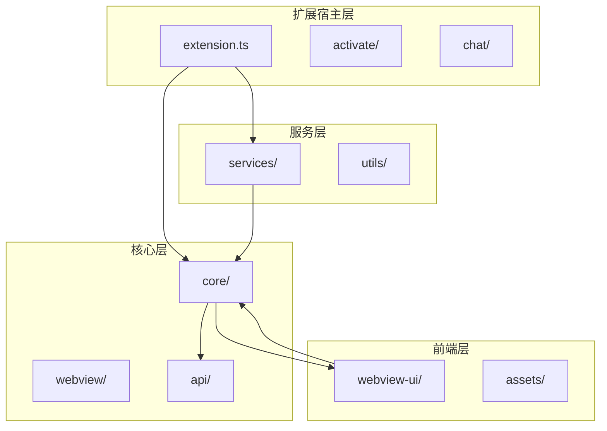
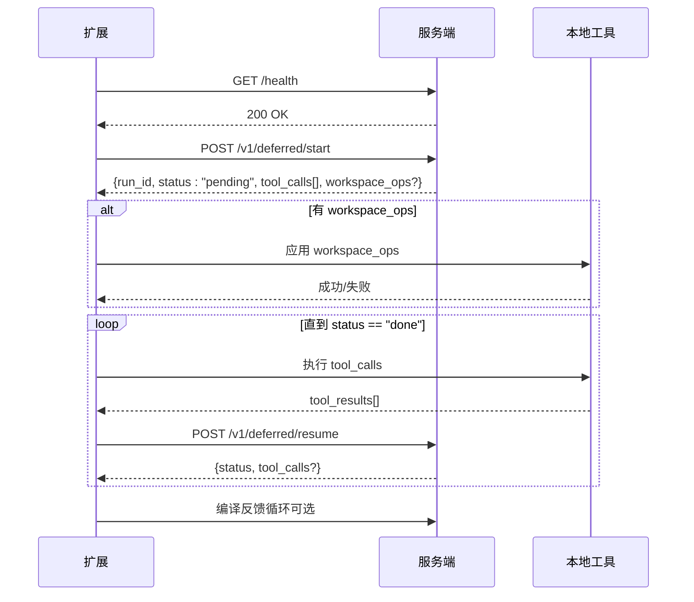
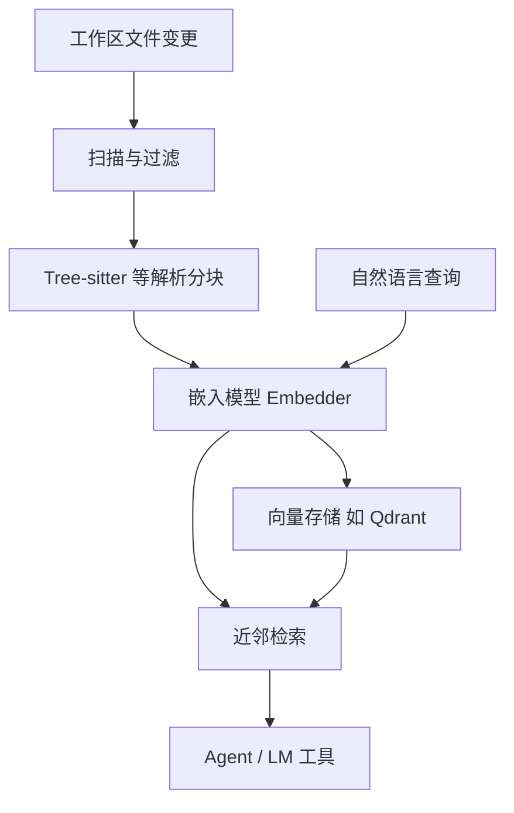
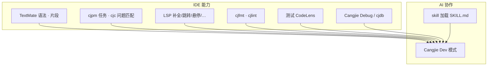
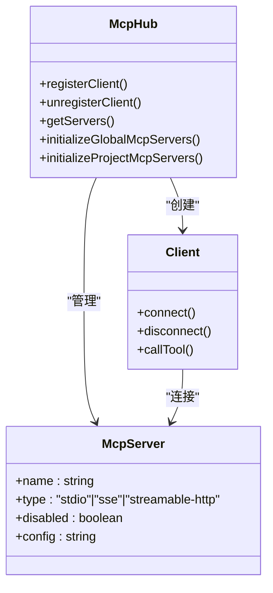
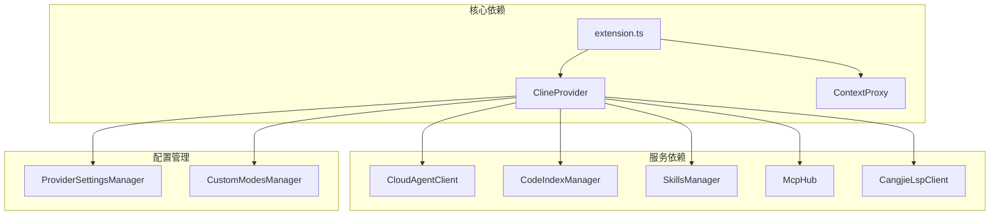

# 项目概述

<cite>
**本文档引用的文件**
- [README.md](file://README.md)
- [package.json](file://package.json)
- [src/extension.ts](file://src/extension.ts)
- [docs/cloud-agent-integration.md](file://docs/cloud-agent-integration.md)
- [docs/cangjie-mcp.md](file://docs/cangjie-mcp.md)
- [AGENTS.md](file://AGENTS.md)
- [src/core/config/ContextProxy.ts](file://src/core/config/ContextProxy.ts)
- [src/services/cloud-agent/CloudAgentClient.ts](file://src/services/cloud-agent/CloudAgentClient.ts)
- [src/services/mcp/McpHub.ts](file://src/services/mcp/McpHub.ts)
- [src/services/code-index/manager.ts](file://src/services/code-index/manager.ts)
- [src/core/webview/ClineProvider.ts](file://src/core/webview/ClineProvider.ts)
- [src/services/skills/SkillsManager.ts](file://src/services/skills/SkillsManager.ts)
- [src/services/cangjie-lsp/CangjieLspClient.ts](file://src/services/cangjie-lsp/CangjieLspClient.ts)
</cite>

## 目录
1. [简介](#简介)
2. [项目结构](#项目结构)
3. [核心组件](#核心组件)
4. [架构总览](#架构总览)
5. [详细组件分析](#详细组件分析)
6. [依赖关系分析](#依赖关系分析)
7. [性能考虑](#性能考虑)
8. [故障排查指南](#故障排查指南)
9. [结论](#结论)

## 简介

Njust-AI AI 编程助手是一个运行在 VS Code / Cursor 中的 AI 编程助手扩展，面向 NJUST 内部使用。项目基于上游 NJUST_AI 进行定制，移除了与账号、组织、市集浏览相关的云服务与 Marketplace 流程，保留并扩展了本地/自建服务对接能力。核心目标是通过侧栏 Webview 与可选的编辑器标签页进行对话，理解工作区代码、生成与修改文件、在集成终端执行命令，并支持多种工作模式与模型提供商。

项目的关键特性包括：
- **Cloud Agent 云代理集成**：通过可配置的 REST 服务端运行代理任务，支持健康检查、/v1/run 或延期协议下的 deferred/start 与 deferred/resume，以及可选的 workspace_ops 工作区操作
- **仓颉（Cangjie）语言深度集成**：提供 LSP、cjpm 任务、调试与静态检查等完整的 IDE 能力，支持 Cangjie Dev 模式
- **多模式工作流支持**：内置 Cloud Agent、Architect、Code、Ask、Debug、Cangjie Dev、Orchestrator 等模式
- **代码索引与语义搜索**：基于向量数据库的代码索引与检索
- **MCP（Model Context Protocol）工具系统**：支持外部 MCP 服务接入和内置 MCP 服务端

## 项目结构

项目采用模块化的分层架构，主要分为以下几个层次：



**图表来源**
- [README.md:346-364](file://README.md#L346-L364)
- [package.json:1-68](file://package.json#L1-L68)

**章节来源**
- [README.md:346-364](file://README.md#L346-L364)
- [package.json:1-68](file://package.json#L1-L68)

## 核心组件

### 1. 扩展入口与激活

扩展通过 `src/extension.ts` 作为入口点，负责初始化所有核心服务和注册各种命令、提供者和监听器。

关键初始化流程：
- 环境变量加载与网络代理配置
- 设置迁移与国际化初始化
- 终端注册表初始化
- Cloud Agent 设备令牌生成与同步
- 代码索引管理器初始化
- 仓颉 LSP 客户端初始化
- MCP Hub 初始化
- VS Code Chat 参与者注册
- Diff 视图内容提供者注册

**章节来源**
- [src/extension.ts:95-542](file://src/extension.ts#L95-L542)

### 2. 任务核心与消息管线

`ClineProvider` 作为 Webview 宿主、全局状态与 Task 的粘合层，负责：
- 维护当前任务栈和历史记录
- 处理 Webview 消息与状态同步
- 协调各种服务组件
- 管理模式切换与工具执行

任务生命周期包括：初始化、多轮对话、工具执行、检查点管理、持久化存储等阶段。

**章节来源**
- [src/core/webview/ClineProvider.ts:126-200](file://src/core/webview/ClineProvider.ts#L126-L200)

### 3. Cloud Agent 子系统

Cloud Agent 提供云端推理与本地工具执行的混合模式：
- 支持 deferred 协议（默认）和 legacy 协议
- 自动健康检查与错误处理
- workspace_ops 结构化写盘操作
- 编译反馈循环（compileLoop）

协议特点：
- 默认使用 deferred/start 和 deferred/resume 循环
- 支持最多 50 次迭代
- workspace_ops 支持 write_file 和 apply_diff 操作
- 可选的编译反馈循环

**章节来源**
- [docs/cloud-agent-integration.md:13-227](file://docs/cloud-agent-integration.md#L13-L227)
- [src/services/cloud-agent/CloudAgentClient.ts:43-339](file://src/services/cloud-agent/CloudAgentClient.ts#L43-L339)

### 4. 仓颉（Cangjie）语言支持

提供完整的仓颉语言 IDE 能力：
- LSP 服务：补全、跳转、悬停、重命名、折叠、文档符号等
- cjpm 任务系统：构建、运行、测试、清理等命令
- 调试支持：cjdb 调试适配器
- 格式化与诊断：cjfmt、cjlint 集成
- 代码动作与宏支持

**章节来源**
- [README.md:250-259](file://README.md#L250-L259)
- [src/services/cangjie-lsp/CangjieLspClient.ts:131-200](file://src/services/cangjie-lsp/CangjieLspClient.ts#L131-L200)

### 5. 代码索引与语义搜索

基于向量数据库的代码索引系统：
- Tree-sitter 解析与文件扫描
- 嵌入模型生成向量表示
- Qdrant 等向量存储
- 近邻检索与语义搜索
- 缓存管理与增量更新

**章节来源**
- [src/services/code-index/manager.ts:18-466](file://src/services/code-index/manager.ts#L18-L466)

### 6. MCP 子系统

Model Context Protocol 工具系统：
- 外部 MCP 服务客户端（stdio、SSE、HTTP）
- 内置 MCP 服务端（RooToolsMcpServer）
- 项目级与全局级 MCP 配置
- 工具执行与结果处理

**章节来源**
- [src/services/mcp/McpHub.ts:151-800](file://src/services/mcp/McpHub.ts#L151-L800)

### 7. Skills 子系统

技能管理系统：
- 全局与项目级技能发现
- SKILL.md 前言元数据解析
- 技能覆盖与优先级规则
- 模式特定技能支持

**章节来源**
- [src/services/skills/SkillsManager.ts:22-200](file://src/services/skills/SkillsManager.ts#L22-L200)

## 架构总览

项目采用分层架构设计，从进程边界看，Webview 与扩展宿主分离；宿主内 ClineProvider/Task 串联 UI、模型与各类服务：

```mermaid
flowchart TB
subgraph "呈现层"
WV["webview-uiReact"]
VSC["VS Code：编辑器·终端·内置 Chat"]
end
subgraph "扩展宿主 Extension Host"
CP["ClineProvider"]
TH["webviewMessageHandler"]
TK["Task"]
PR["api/providers"]
end
subgraph "服务层 services/"
MCP["McpHub · RooToolsMcpServer"]
IDX["code-index · tree-sitter"]
CA["cloud-agent"]
SK["SkillsManager"]
CJ["cangjie-lsp · cjpm · debug"]
OTH["checkpoints · run-code · web-search"]
end
WV < --> |"postMessage"| CP
CP --> TH
TH --> TK
TK --> PR
TK --> MCP
TK --> IDX
TK --> CA
TK --> SK
TK --> CJ
TK --> OTH
VSC --> |"LM Tools / Participant"| TK
```

**图表来源**
- [README.md:37-68](file://README.md#L37-L68)

## 详细组件分析

### Cloud Agent 服务端对接规范

Cloud Agent 提供了完整的 REST API 规范，支持两种协议模式：

#### Deferred 执行协议（推荐，默认）



**图表来源**
- [docs/cloud-agent-integration.md:183-207](file://docs/cloud-agent-integration.md#L183-L207)

#### Legacy 协议

传统的单次请求响应模式，适用于简单的云端推理场景。

**章节来源**
- [docs/cloud-agent-integration.md:13-227](file://docs/cloud-agent-integration.md#L13-L227)

### 代码索引与语义检索

代码索引系统采用向量化搜索架构：



**图表来源**
- [README.md:127-141](file://README.md#L127-L141)

**章节来源**
- [README.md:237-242](file://README.md#L237-L242)
- [src/services/code-index/manager.ts:348-424](file://src/services/code-index/manager.ts#L348-L424)

### 仓颉语言与 AI 模式的集成



**图表来源**
- [README.md:147-168](file://README.md#L147-L168)

**章节来源**
- [README.md:143-168](file://README.md#L143-L168)

### MCP 工具系统

MCP 子系统支持多种传输协议和配置方式：



**图表来源**
- [src/services/mcp/McpHub.ts:151-200](file://src/services/mcp/McpHub.ts#L151-L200)

**章节来源**
- [src/services/mcp/McpHub.ts:151-800](file://src/services/mcp/McpHub.ts#L151-L800)

## 依赖关系分析

项目采用模块化设计，各组件之间通过清晰的接口进行交互：



**图表来源**
- [src/extension.ts:20-61](file://src/extension.ts#L20-L61)
- [src/core/webview/ClineProvider.ts:91-96](file://src/core/webview/ClineProvider.ts#L91-L96)

**章节来源**
- [src/extension.ts:20-61](file://src/extension.ts#L20-L61)
- [src/core/webview/ClineProvider.ts:91-96](file://src/core/webview/ClineProvider.ts#L91-L96)

## 性能考虑

项目在多个层面进行了性能优化：

### 1. 异步与并发处理
- 所有网络请求使用异步模式，避免阻塞主线程
- 文件系统监控使用 chokidar 进行高效监听
- 代码索引初始化在后台异步进行

### 2. 缓存策略
- Cloud Agent 客户端支持请求超时与中止机制
- 代码索引使用缓存管理器减少重复计算
- ContextProxy 提供内存缓存与持久化存储

### 3. 资源管理
- 所有服务组件实现 dispose 方法进行资源清理
- MCP Hub 支持连接池与重连机制
- 任务执行支持中断与恢复

### 4. 网络优化
- 支持 HTTP/HTTPS 代理配置
- Cloud Agent 客户端支持超时与错误重试
- LSP 服务使用中间件进行请求去抖

## 故障排查指南

### 1. Cloud Agent 连接问题

常见问题与解决方案：
- **健康检查失败**：检查服务端 URL 配置和网络连通性
- **认证失败**：确认 API Key 配置正确
- **超时问题**：调整请求超时时间配置
- **workspace_ops 无效**：检查操作数量和大小限制

**章节来源**
- [docs/cloud-agent-integration.md:38-87](file://docs/cloud-agent-integration.md#L38-L87)
- [src/services/cloud-agent/CloudAgentClient.ts:118-141](file://src/services/cloud-agent/CloudAgentClient.ts#L118-L141)

### 2. 仓颉 LSP 启动问题

- **LSP 二进制缺失**：检查 CANGJIE_HOME 环境变量或 serverPath 配置
- **诊断信息异常**：确认 cjpm.toml 文件存在且格式正确
- **包名推断失败**：检查 package 声明与实际文件内容一致性

**章节来源**
- [AGENTS.md:15-21](file://AGENTS.md#L15-L21)
- [src/services/cangjie-lsp/CangjieLspClient.ts:131-200](file://src/services/cangjie-lsp/CangjieLspClient.ts#L131-L200)

### 3. MCP 服务连接问题

- **stdio 服务无法启动**：检查命令路径和权限设置
- **SSE/HTTP 服务连接失败**：验证 URL 和认证头配置
- **工具调用失败**：检查工具名称匹配和参数格式

**章节来源**
- [src/services/mcp/McpHub.ts:656-800](file://src/services/mcp/McpHub.ts#L656-L800)

### 4. 代码索引问题

- **索引进度停滞**：检查磁盘空间和文件权限
- **搜索结果不准确**：调整嵌入模型配置或重新训练
- **性能问题**：优化向量存储配置或增加硬件资源

**章节来源**
- [src/services/code-index/manager.ts:277-301](file://src/services/code-index/manager.ts#L277-L301)

## 结论

Njust-AI AI 编程助手项目展现了现代 AI 编程助手的完整架构设计，通过 VS Code 扩展提供了强大的 AI 编程辅助能力。项目的主要优势包括：

### 核心价值主张
- **混合执行模式**：Cloud Agent 支持云端推理与本地工具执行的灵活组合
- **深度语言集成**：仓颉语言提供完整的 IDE 能力与 AI 协作
- **开放生态系统**：MCP 协议支持第三方工具和服务的无缝集成
- **智能化索引**：基于向量数据库的代码理解和语义搜索

### 技术架构亮点
- **模块化设计**：清晰的分层架构和组件边界
- **异步处理**：充分利用现代 JavaScript 的异步特性
- **配置驱动**：丰富的配置选项支持不同使用场景
- **可观测性**：完善的日志记录和错误处理机制

### 项目愿景
Njust-AI 旨在成为 NJUST 内部开发者的智能编程伙伴，通过 AI 技术提升开发效率，降低编程门槛，同时保持对本地开发环境的完全控制。项目的设计充分考虑了企业级应用的需求，提供了稳定、可靠、可扩展的 AI 编程助手解决方案。