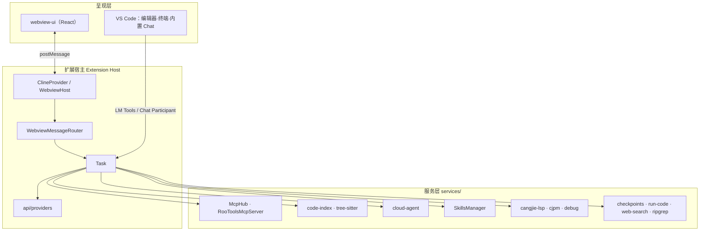
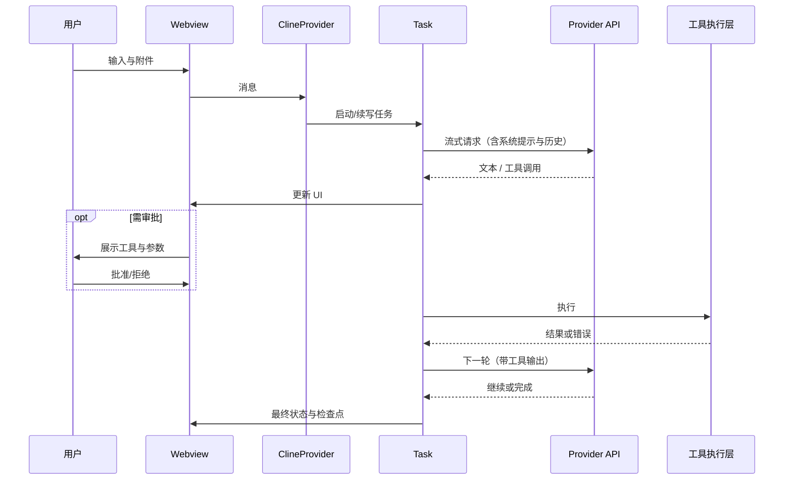
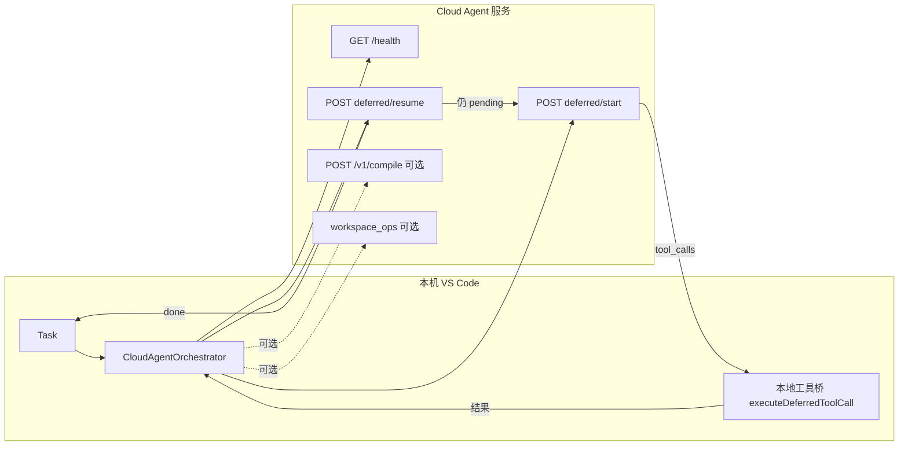
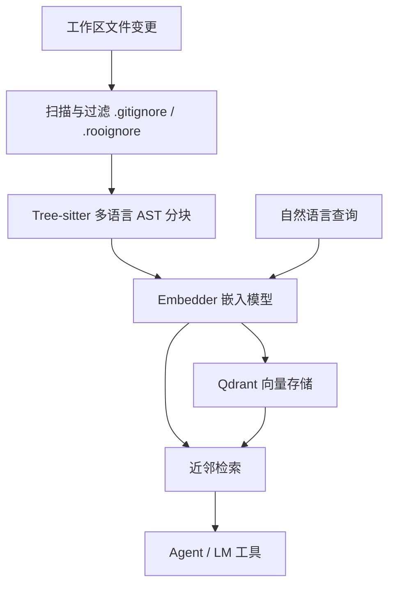
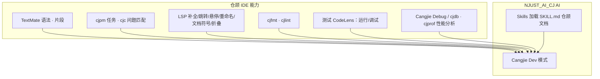
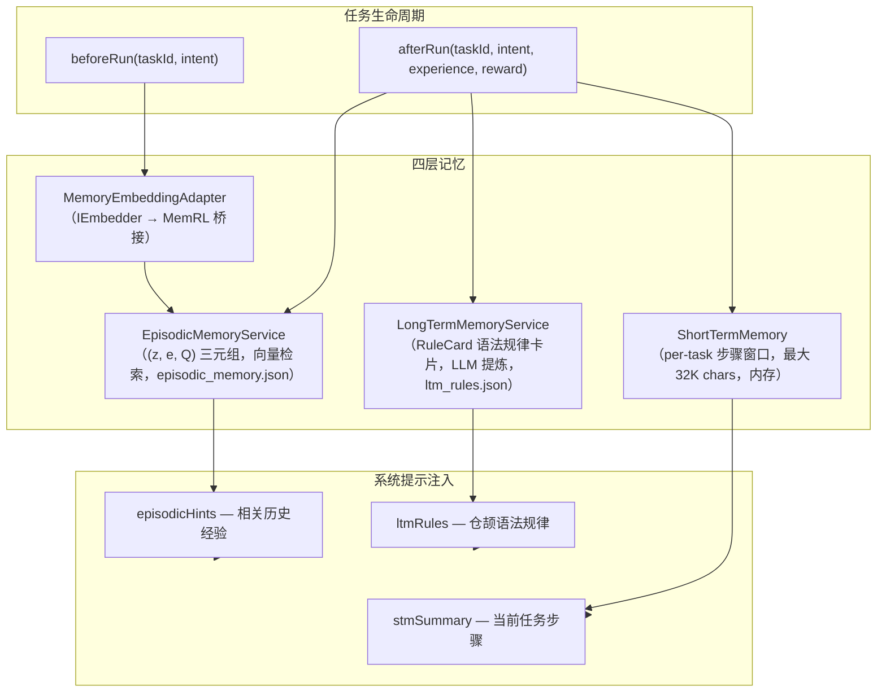

# NJUST_AI_CJ
[![zread](https://img.shields.io/badge/Ask_Zread-_.svg?style=plastic&color=00b0aa&labelColor=000000&logo=data%3Aimage%2Fsvg%2Bxml%3Bbase64%2CPHN2ZyB3aWR0aD0iMTYiIGhlaWdodD0iMTYiIHZpZXdCb3g9IjAgMCAxNiAxNiIgZmlsbD0ibm9uZSIgeG1sbnM9Imh0dHA6Ly93d3cudzMub3JnLzIwMDAvc3ZnIj4KPHBhdGggZD0iTTQuOTYxNTYgMS42MDAxSDIuMjQxNTZDMS44ODgxIDEuNjAwMSAxLjYwMTU2IDEuODg2NjQgMS42MDE1NiAyLjI0MDFWNC45NjAxQzEuNjAxNTYgNS4zMTM1NiAxLjg4ODEgNS42MDAxIDIuMjQxNTYgNS42MDAxSDQuOTYxNTZDNS4zMTUwMiA1LjYwMDEgNS42MDE1NiA1LjMxMzU2IDUuNjAxNTYgNC45NjAxVjIuMjQwMUM1LjYwMTU2IDEuODg2NjQgNS4zMTUwMiAxLjYwMDEgNC45NjE1NiAxLjYwMDFaIiBmaWxsPSIjZmZmIi8%2BCjxwYXRoIGQ9Ik00Ljk2MTU2IDEwLjM5OTlIMi4yNDE1NkMxLjg4ODEgMTAuMzk5OSAxLjYwMTU2IDEwLjY4NjQgMS42MDE1NiAxMS4wMzk5VjEzLjc1OTlDMS42MDE1NiAxNC4xMTM0IDEuODg4MSAxNC4zOTk5IDIuMjQxNTYgMTQuMzk5OUg0Ljk2MTU2QzUuMzE1MDIgMTQuMzk5OSA1LjYwMTU2IDE0LjExMzQgNS42MDE1NiAxMy43NTk5VjExLjAzOTlDNS42MDE1NiAxMC42ODY0IDUuMzE1MDIgMTAuMzk5OSA0Ljk2MTU2IDEwLjMzk5WiIgZmlsbD0iI2ZmZiIvPgo8cGF0aCBkPSJNMTMuNzU4NCAxLjYwMDFIMTEuMDM4NEMxMC42ODUgMS42MDAxIDEwLjM5ODQgMS44ODY2NCAxMC4zOTg0IDIuMjQwMVY0Ljk2MDFDMTAuMzk4NCA1LjMxMzU2IDEwLjY4NSA1LjYwMDEgMTEuMDM4NCA1LjYwMDFIMTMuNzU4NEMxNC4xMTE5IDUuNjAwMSAxNC4zOTg0IDUuMzEzNTYgMTQuMzk4NCA0Ljk2MDFWMi4yNDAxQzE0LjM5ODQgMS44ODY2NCAxNC4xMTE5IDEuNjAwMSAxMy43NTg0IDEuNjAwMVoiIGZpbGw9IiNmZmYiLz4KPHBhdGggZD0iTTQgMTJMMTIgNEw0IDEyWiIgZmlsbD0iI2ZmZiIvPgo8cGF0aCBkPSJNNCAxMkwxMiA0IiBzdHJva2U9IiNmZmYiIHN0cm9rZS13aWR0aD0iMS41IiBzdHJva2UtbGluZWNhcD0icm91bmQiLz4KPC9zdmc%2BCg&logoColor=ffffff)](https://zread.ai/JunjieChen0/NJUST)

> 基于 [NJUST_AI_CJ](https://github.com/NJUST-AI/NJUST_AI_CJ) 定制的 AI 编程助手 VS Code 扩展，面向 NJUST 内部使用。

## 项目概述

NJUST_AI_CJ 是一个运行在 VS Code / Cursor 中的 AI 编程助手扩展。它在活动栏提供 Webview 侧栏界面（也可弹出为编辑器标签页），通过消息管道与 **Extension Host** 进程通信，实现多轮 AI 对话、工作区文件读写、终端命令执行、语义代码检索等功能。扩展内建**仓颉（Cangjie）编程语言**的全栈工具链（LSP、`cjpm` 任务、调试器、格式化/静态检查、测试 CodeLens 等），支持 **Cloud Agent** 远程推理协议与 **MCP**（Model Context Protocol）工具生态。

本项目基于 NJUST_AI_CJ 上游定制：**移除了**与账号、组织、市集浏览相关的上游云服务与 Marketplace 流程；**保留并扩展**了本地/自建服务对接能力——其中 **Cloud Agent** 通过可配置的 REST 服务端运行代理任务，是一套独立的远程推理协议，与"登录云账号、同步到商业云产品"无关。

## 架构与交互图示

下列示意图用于与文字说明对照阅读。GitHub、VS Code 内置 Markdown 预览及多数文档站点支持 **Mermaid** 渲染；若阅读器不渲染图表，可对照图中节点名称在仓库中搜索对应模块。

### 界面布局（侧栏 + 编辑区）

扩展主界面挂在活动栏，与编辑器、终端、问题面板等并列，形成"左对话、右代码"的常见工作布局：

```
┌──────────────────────────────────────────────────────────────────────┐
│  VS Code / Cursor 窗口                                                │
│  ┌──┐ ┌────────────────────────────────┬─────────────────────────────┐ │
│  │≡ │ │  资源管理器 / 搜索 / …          │  编辑器（源码、Diff）        │ │
│  │█ │ │                                │                             │ │
│  │… │ │                                │  终端 / 调试 / 问题         │ │
│  └──┘ ├────────────────────────────────┴─────────────────────────────┤ │
│       │  NJUST_AI_CJ：对话 · 模式 · 工具审批 · 历史 · 设置（Webview）   │ │
│       └──────────────────────────────────────────────────────────────┘ │
└──────────────────────────────────────────────────────────────────────┘
        █ = 本扩展活动栏入口；侧栏可「在编辑器中打开」变为独立标签页
```

### 运行时逻辑分层

从进程边界看，**Webview 与 Extension Host 分离**；Host 内 **ClineProvider → Task** 串联 UI、模型与各类服务：



### 本地模型模式：一轮对话与工具闭环

用户输入经 Webview 进入 **Task**，模型返回工具调用时在 UI 上审批（若未自动批准），执行结果再作为消息喂回模型，直至结束或中断：



### Cloud Agent：延期协议循环

开启 `deferredProtocol` 时，**推理在服务端**，**读写与命令在本地**；多轮 `start` / `resume` 直到状态为完成或达迭代上限（默认 50 轮），可选 compile 反馈闭环：



### 代码索引流水线

文件变更触发扫描 → tree-sitter 解析分块 → 嵌入模型向量化 → 写入 Qdrant；自然语言查询经相同嵌入模型向量化后近邻检索，供 **codebase_search** 与 **roo_codebaseSearch** 使用：



### 仓颉语言支持与 AI 协同

**.cj 文件**由语言包与 LSP 提供传统 IDE 能力；**Cangjie Dev 模式**约束 Agent 工具范围与提示词，可与 **Skills** 中的仓颉语料联动，LSP 状态栏提供连接状态与 SDK 版本信息：



## 与上游 NJUST_AI_CJ 的主要差异

| 模块 | 状态 | 说明 |
| --- | --- | --- |
| 上游账号/组织/市集云 | 已移除 | 登录、组织管理、市集安装 MCP/Mode 等外部闭环 |
| Marketplace | 已移除 | 远程市集浏览与安装；MCP 改由界面与配置本地管理 |
| Telemetry | 已简化 | 保留类型与结构，弱化或去除远程上报逻辑 |
| Cloud Agent（REST） | 保留并增强 | 连接自建或内网服务；`njust-ai-cj.cloudAgent.*` 配置服务端 URL、API Key、延期协议（deferred/start → resume 循环 + compile 反馈闭环）、远程 workspace 写操作等 |
| 仓颉语言与工具链 | 定制增强 | 语法/片段、`cjpm` 任务、`cjc` 问题匹配、LSP、cjfmt/cjlint 格式化与诊断、测试 CodeLens、cjdb 调试适配、cjprof 性能分析、SDK 安装引导、Learned Fixes 经验修复系统 |
| MCP 子系统 | 保留并增强 | `McpHub` 管理多服务器（stdio / SSE / streamable HTTP 三种传输）、内置 `RooToolsMcpServer`（HTTP 暴露本地工具）、并发连接管理、资源同步 |
| Modes 系统 | 保留并扩展 | 7 个内置模式：**Cloud Agent**（远程推理+本地工具）、**Architect**（规划/规格/任务拆解，含 Spec-Driven Workflow）、**Code**（编码含算法/数据结构专项指导）、**Ask**（问答/分析）、**Debug**（系统诊断）、**Cangjie Dev**（仓颉全栈含 cjpm/cjc 工作流与语料检索）、**Orchestrator**（子任务编排跨模式协调）；支持 `.roomodes` 自定义覆盖 |
| Skills | 保留 | 从工作区（`.njust_ai/skills` 等）与全局目录发现 `SKILL.md`，支持 frontmatter 元数据、模式路由（`skills-{mode}/`）、同名优先级覆盖 |
| 代码索引 | 保留并增强 | 多工作区单例管理，tree-sitter 35+ 语言 AST 分块，嵌入管道 + Qdrant 向量存储，增量更新与缓存管理 |
| Checkpoints | 保留 | 影子副本快照与回滚，支持 `.rooignore` 排除规则 |
| MemRL 记忆系统 | 全新增加 | 四层记忆架构（STM / Episodic / LTM / 嵌入适配层），持久化存储于 `.njust_ai/memories/`，向量检索 + Q 值更新 + LLM 提炼仓颉语法规律卡片，跨任务累积经验 |

## 插件功能模块详解

以下按运行时架构说明各模块实现细节。实现分布在 `src/core/`、`src/services/`、`webview-ui/`；共享类型在 `packages/types/`。

### 1. UI 与交互（Webview）

- **WebviewHost**（`src/core/webview/WebviewHost.ts`）：Webview 生命周期管理入口，负责 `resolveWebviewView`、面板状态与消息路由委托。
- **WebviewMessageRouter**（`src/core/webview/WebviewMessageRouter.ts`）：将来自 UI 的大量消息按类型分发到对应 handler，替代早期巨型 switch-case。
- **ClineProvider**（`src/core/webview/ClineProvider.ts`）：Webview 宿主与全局状态粘合层。注册命令、维护当前 Task 引用、初始化 MCP/Skills 等服务，提供 `postMessageToWebview` 等 UI 通知方法。
- **WebviewLifecycleManager**：管理 Webview 面板的创建、销毁、可见性变化与状态恢复。
- **前端工程**：`webview-ui/` 为 React + Vite 应用，使用 Radix UI 原语与 Tailwind CSS。通过 `postMessage` 与 Extension Host 双向通信。组件按功能分层：`components/chat/`（对话流、消息渲染、工具审批）、`components/settings/`（Provider 配置、MCP、索引等设置页）、`components/modes/`（模式选择与编辑）、`components/history/`（任务历史列表与恢复）。
- **ContextProxy**（`src/core/config/ContextProxy.ts`）：扩展内设置的单一可信来源，封装 `vscode.workspace.getConfiguration('njust-ai-cj')` 的读写，与 VS Code `settings.json` 协同。
- **ConfigurationSyncService**（`src/core/webview/ConfigurationSyncService.ts`）：双向同步 Webview UI 设置缓存与 ContextProxy。

### 2. 任务核心与消息管线

任务系统已完成初步模块化拆分，Task 目录下含 27 个文件，核心类包括：

- **Task**（`src/core/task/Task.ts`）：任务主入口与协调器，持有 `TaskExecutor`、`ToolExecutionOrchestrator`、`TaskMessageManager` 等子模块引用。负责组装系统提示、管理消息历史、调度 API 请求循环。
- **TaskExecutor**（`src/core/task/TaskExecutor.ts`）：LLM 对话循环与流式响应处理。包含 `recursivelyMakeClineRequests`（主循环）、`attemptApiRequest`（单次请求）、`presentAssistantMessage`（解析模型输出为文本/推理/工具调用块）。
- **TaskLifecycleManager**（`src/core/task/TaskLifecycleManager.ts`）：任务状态机管理——初始化、启动、暂停、恢复、中止、销毁（含 `dispose()` 资源清理）。
- **TaskLifecycle**（`src/core/task/TaskLifecycle.ts`）：状态枚举（CREATED → INITIALIZING → RUNNING → PAUSED → RESUMING → ABORTING → COMPLETED → ERRORED）与历史消息清理工具函数（`cleanHistoryForResumption`）。
- **TaskMessageManager**（`src/core/task/TaskMessageManager.ts`）：消息历史的增删、合并、去重、上下文窗口预算管理。
- **TaskToolHandler**（`src/core/task/TaskToolHandler.ts`）：工具调用的参数解析、审批流程编排、结果回写消息历史。
- **ToolExecutionOrchestrator**（`src/core/task/ToolExecutionOrchestrator.ts`）：工具执行编排器，负责并发控制、依赖图调度、流式提前执行（eager streaming execution）等。
- **TaskMetrics**（`src/core/task/TaskMetrics.ts`）：Token 用量、成本、工具调用次数等指标收集。
- **TaskStreamProcessor**（`src/core/task/TaskStreamProcessor.ts`）：处理流式响应的增量解析与 UI 增量更新。
- **TaskRequestBuilder**（`src/core/task/TaskRequestBuilder.ts`）：组装 API 请求体（消息列表、系统提示、模型参数）。
- **TaskStateMachine**（`src/core/task/TaskStateMachine.ts`）：形式化状态迁移验证。
- **TaskCenter**（`src/core/task/TaskCenter.ts`）：多任务管理中心，维护活跃任务映射、任务创建/切换/中止。
- **CloudAgentOrchestrator**（`src/core/task/CloudAgentOrchestrator.ts`）：Cloud Agent 模式的完整编排器。通过 `ICloudAgentHost` 接口与 Task 解耦，管理 deferred 延期协议的全部循环（health check → start → tool execution → resume → … → done/abort）、compile 反馈闭环、workspace_ops 应用。
- **ApiRequestHandler**（`src/core/task/ApiRequestHandler.ts`）：API 请求的构造、发送、错误分类与重试策略。
- **ModelFallback**（`src/core/task/ModelFallback.ts`）：模型回退机制——主模型失败时自动尝试备用模型。
- **ErrorRecoveryHandler**（`src/core/task/ErrorRecoveryHandler.ts`）：任务级错误恢复策略（上下文过长自动压缩、连续错误计数与熔断等）。
- **SubTaskContextBuilder**（`src/core/task/SubTaskContextBuilder.ts`）与 **TaskResultAggregator**：Orchestrator 模式下子任务的上下文构建与结果汇总。
- **CangjieRuntimePolicy**（`src/core/task/CangjieRuntimePolicy.ts`）：Cangjie Dev 模式专项策略（工程检测、编译流程等）。
- **PersistentRetry**（`src/core/task/PersistentRetry.ts`）：持久化重试配置管理。
- **TaskBoard**（`src/core/task/TaskBoard.ts`）：任务看板功能（任务创建、列表、状态更新）。

### 3. 模式（Modes）与提示词

- **内置模式定义**（`packages/types/src/mode.ts` 中 `DEFAULT_MODES`）：
  - **☁️ Cloud Agent**（`cloud-agent`）：默认模式。远程推理 + 本地工具执行，通过 CloudAgentOrchestrator 驱动。
  - **🏗️ Architect**（`architect`）：技术规划与任务拆解，含 Spec-Driven Workflow（Phase 0 环境检测 → Phase 1 规格 → Phase 2 技术方案 → Phase 3 任务清单），支持 `.specify/` 与 `/plans/` 两种输出目录。
  - **💻 Code**（`code`）：编码实现，含算法/数据结构专项指导（范式归类 → 思路与不变量 → 边界清单 → 代码 → 验证建议 → 自检三问）、Spec-Driven Implementation 工作流、主题式学习工作流等。
  - **❓ Ask**（`ask`）：技术问答与代码分析，只读 + MCP 工具集。
  - **🪲 Debug**（`debug`）：系统化诊断——提出 5-7 种可能原因 → 沉淀 1-2 种 → 加日志验证 → 确认后再修复。
  - **🦎 Cangjie Dev**（`cangjie`）：仓颉全栈开发。强制 `cjpm init` 参数规范、写后即验（`cjfmt` → `cjpm build` 循环）、内置 CangjieCorpus 语料检索、Learned Fixes 经验驱动修复。
  - **🪃 Orchestrator**（`orchestrator`）：复杂任务拆解为子任务，通过 `new_task` 工具委托到不同模式执行。
- **工具组（Tool Groups）**（`src/shared/tools.ts` 中 `TOOL_GROUPS`）：`read`（读文件/搜索/列表）、`edit`（写文件/打补丁/编辑）、`command`（终端执行）、`mcp`（MCP 工具）、`browser`（浏览器相关）。每种模式绑定不同组。
- **自定义模式**：用户可通过 `njust-ai-cj.customModes` 设置或项目根目录 `.roomodes`（YAML）定义新模式或覆盖内置模式。
- **提示词引擎**（`src/core/prompts/`）：`SYSTEM_PROMPT()` 为单一入口，按优先级分层（0-4）组装：角色定义 → 工具说明 → 模式指令 → 用户/工作区规则 → 环境上下文。支持 6 种规则来源（`AGENTS.md`、`.njust_ai/rules-*`、`.cursorrules` 等）。
- **仓颉提示词**（`src/core/prompts/sections/cangjie-context.ts`）：动态注入仓颉语法速查、CangjieCorpus 绝对路径、Learned Fixes 经验修复记录、运行时诊断映射。
- **上下文压缩**（`src/core/condense/`）：5 层上下文压缩策略，自动检测并压缩超长对话历史。
- **提示词缓存破裂检测**（`src/core/prompts/promptCacheBreakDetection.ts`）：监控 Anthropic prompt cache 命中率并在破裂时告警。

### 4. AI 模型接入（Providers）

- **统一接口**：`ApiHandler` 接口（`src/api/interfaces/`）定义 `createMessage()` 返回 `ApiStream`（AsyncGenerator），所有 Provider 实现此接口。
- **Provider 工厂**：`buildApiHandler()`（`src/api/index.ts`）根据 `apiProvider` 字段实例化对应 handler。支持 40+ 提供商。
- **注册表**（`src/api/registry/`）：`ProviderRegistry` 管理所有已注册 Provider 的元数据、模型列表与能力声明。
- **流处理**：`ApiStream` 为统一的 AsyncGenerator 流，各 Provider 的 `src/api/transform/` 下格式转换器（如 `anthropic-format.ts`、`openai-format.ts`、`gemini-format.ts` 等）将原生响应转为统一流事件。
- **已实现 Provider**：Anthropic（含 Vertex）、OpenAI（原生 + Responses API）、Google Gemini、AWS Bedrock、DeepSeek、Mistral、Ollama、LM Studio、OpenRouter、Fireworks、xAI、SambaNova、Vertex AI、Baseten、Moonshot、LiteLLM、Requesty、Unbound、VSCode LM API、Vercel AI Gateway、Z.AI、Minimax、Qwen / Qwen Code、豆包（Doubao）、GLM（智谱）、OpenAI Codex。
- **重试机制**（`src/api/retry/`）：指数退避重试框架，专门处理 429 速率限制（解析 `Retry-After` 头）。
- **模型回退**（`src/api/index.ts` 中 `FallbackApiHandler`）：主模型失败时自动尝试备用模型列表。
- **索引嵌入独立 Provider**：代码索引模块使用独立的嵌入模型与端点配置（`src/services/code-index/embedders/`），可与对话模型完全分离。
- **Token 计数**：默认使用 tiktoken，部分 Provider 提供原生 token 计数实现（`src/shared/cost.ts` 等）。

### 5. 工具系统

- **ToolRegistry**（`src/core/tools/ToolRegistry.ts`）：集中式工具注册表，基于 Map 实现。支持别名解析（从 `TOOL_ALIASES` 常量 + 各工具自定义别名）、条件注册（`registerConditional`，按运行时条件决定可用性）、缓存查询（并发安全工具集、检查点工具集等）。
- **BaseTool**（`src/core/tools/BaseTool.ts`）：所有工具的抽象基类，定义 `name`、`aliases`、`schema`、`handle()`、`isConcurrencySafe()`、`isCheckpoint()` 等标准接口。
- **ToolDependencyGraph**（`src/core/tools/ToolDependencyGraph.ts`）：工具依赖图，支持传递中止——当某个工具失败时自动中止依赖它的后续工具。
- **AdaptiveConcurrencyController**（`src/core/tools/AdaptiveConcurrencyController.ts`）：自适应并发控制，根据系统资源与历史执行时间动态调整并发数。
- **StreamingToolExecutor**（`src/core/tools/StreamingToolExecutor.ts`）：流式工具提前执行（eager streaming execution），对自动批准的并发安全工具在流未结束时即开始执行。
- **ConcurrentToolExecutor**（`src/core/tools/ConcurrentToolExecutor.ts`）：工具批量并发执行器。
- **ToolHookManager**（`src/core/tools/ToolHookManager.ts`）：工具前后置钩子（pre/post hooks）。
- **ToolRepetitionDetector**（`src/core/tools/ToolRepetitionDetector.ts`）：检测模型是否陷入工具调用死循环。
- **参数验证**：`toolParamValidator.ts` 与 `DualSchemaAdapter.ts` 提供统一的 Zod Schema 参数校验。
- **工具列表（60+ 个工具文件）**：
  - **文件操作**：`ReadFileTool`、`WriteToFileTool`、`EditFileTool`、`EditTool`（search/replace）、`SearchAndReplaceTool`、`ApplyDiffTool`、`ApplyPatchTool`、`ListFilesTool`、`GlobTool`
  - **搜索**：`GrepTool`（ripgrep 正则搜索）、`SearchFilesTool`（含语义搜索参数）、`CodebaseSearchTool`（向量语义搜索）、`ToolSearchTool`（工具描述检索）
  - **终端**：`ExecuteCommandTool`（含超时、allowed/denied 命令白名单黑名单）、`PowerShellTool`、`ReadCommandOutputTool`
  - **任务管理**：`TaskCreateTool`、`TaskGetTool`、`TaskUpdateTool`、`TaskListTool`、`TaskOutputTool`、`TaskStopTool`、`NewTaskTool`（子任务委派）
  - **Web**：`WebFetchTool`（抓取网页转 markdown）、`WebSearchTool`（Tavily API 联网搜索）、`GenerateImageTool`
  - **交互**：`AskFollowupQuestionTool`、`AttemptCompletionTool`、`SwitchModeTool`、`SendMessageTool`
  - **MCP 与 Agent**：`UseMcpToolTool`、`accessMcpResourceTool`、`AgentTool`
  - **Skill**：`SkillTool`（按名称加载 SKILL.md 到上下文）
  - **杂项**：`LSPTool`（LSP 查询）、`RunSlashCommandTool`、`BriefTool`、`SleepTool`、`ConfigTool`、`NotebookEditTool`、`WorktreeTool`、`UpdateTodoListTool`
- **权限系统**（`src/core/tools/permissions/`）：分层规则引擎 + 可插拔分类器链，支持 `allow` / `deny` / `ask` / `bypass` 四种模式。
- **自动批准**（`src/core/auto-approval/`）：`njust-ai-cj.autoApproval.*` 设置控制哪些工具可跳过审批，快捷键 `Ctrl+Alt+A`（macOS `Cmd+Alt+A`）快速切换策略。

### 6. MCP 子系统

- **McpHub**（`src/services/mcp/McpHub.ts`）：MCP 子系统核心。管理多服务器配置的完整生命周期：配置解析（`mcp_servers` 全局 + 项目级合并）、三种传输协议建立（stdio 子进程、SSE、Streamable HTTP）、连接状态监听与自动重连、工具/资源/提示同步、错误处理与 UI 回调通知。
- **McpServerManager**（`src/services/mcp/McpServerManager.ts`）：单个 MCP 服务器的连接管理、工具列表同步、资源订阅。
- **McpServiceIntegration**（`src/core/webview/McpServiceIntegration.ts`）：连接 McpHub 与 ClineProvider 的桥梁，管理 UI 状态同步。
- **内置 MCP Tools Server**（`src/services/mcp-server/`）：扩展内嵌的 HTTP MCP 服务（默认 `127.0.0.1:3100`），将本地工具能力（read_file、write_file、execute_command、search_files、list_files、codebase_search 等）以 MCP 协议暴露给外部 Agent 或 Cloud Agent 服务端调用。支持 Bearer token 认证与 `0.0.0.0` 远程绑定。

### 7. Cloud Agent 子系统

- **CloudAgentClient**（`src/services/cloud-agent/CloudAgentClient.ts`）：HTTP 客户端，封装 `GET /health`、`POST /v1/run`、`POST /v1/run/deferred/start`、`POST /v1/run/deferred/resume`、`POST /v1/run/deferred/abort`、`POST /v1/run/compile`。
- **CloudAgentOrchestrator**（`src/core/task/CloudAgentOrchestrator.ts`）：编排器。通过 `ICloudAgentHost` 接口与 Task 解耦，管理完整的 deferred 延期协议循环（start → 解析 pending_tools → 本地执行 → resume → 循环直到 done，最多 50 轮，见 `deferredConstants.ts`）。
- **executeDeferredToolCall**（`src/services/cloud-agent/executeDeferredToolCall.ts`）：本地工具桥接。将服务端下发的 MCP 式工具调用名（如 `read_file`、`write_file`、`apply_diff`、`list_files`、`search_files`、`execute_command`）映射到扩展内真实实现。
- **Workspace 操作**：`parseWorkspaceOps` / `applyCloudWorkspaceOps` 解析响应中的 `workspace_ops`（`write_file` / `apply_diff`）。`applyRemoteWorkspaceOps` 控制是否应用（默认 `true`），`confirmRemoteWorkspaceOps` 控制是否需要逐条人工确认（默认 `true`）。
- **Compile 反馈闭环**：可选 `POST /v1/compile` 让服务端编译；若失败则将编译错误作为消息喂给 Agent 迭代修复，受 `compileLoop.maxRetries`（默认 3）控制。
- **鉴权**：支持 device token（首次激活自动生成写入全局状态）和 X-API-Key（`cloudAgent.apiKey` 或环境变量 `CLOUD_AGENT_MOCK_API_KEY` / `NJUST_CLOUD_AGENT_API_KEY`）。
- **本地 Mock**：`src/test-cloud-agent-mock.mjs` 提供完整的本地测试服务。

### 8. 代码索引与语义搜索

- **CodeIndexManager**（`src/services/code-index/manager.ts`）：多工作区单例管理，按工作区文件夹维护独立索引实例（`Map<workspacePath, CodeIndexManager>`）。
- **CodeIndexOrchestrator**（`src/services/code-index/orchestrator.ts`）：协调扫描、解析、嵌入、存储的全流程。
- **扫描与过滤**：遍历工作区文件，遵循 `.gitignore`、`.rooignore` 规则，`maximumIndexedFilesForFileSearch` 限制文件数（默认 10000）。
- **Tree-sitter 解析**（`src/services/tree-sitter/`）：使用 `web-tree-sitter` + WASM 解析 35+ 语言，AST 级别提取有意义块（函数、类、方法等），支持 Tree-sitter queries 自定义。
- **嵌入**（`src/services/code-index/embedders/`）：可配置独立嵌入模型端点，支持批量嵌入（`embeddingBatchSize` 默认 60）。
- **向量存储**（`src/services/code-index/vector-store/qdrant-client.ts`）：使用 Qdrant 向量数据库存储与检索，支持增量更新。
- **搜索服务**（`src/services/code-index/search-service.ts`）：自然语言查询 → 向量化 → Qdrant 近邻检索 → 返回匹配块。
- **缓存管理**（`src/services/code-index/cache-manager.ts`）：减少重复嵌入与重建成本。
- **Tool 接入**：Agent 通过 `codebase_search` 工具调用；VS Code 内置模型通过 `roo_codebaseSearch` LM Tool。

### 9. Skills 子系统

- **SkillsManager**（`src/services/skills/SkillsManager.ts`）：在全局目录（`~/.njust_ai/skills/`）和项目目录（`.njust_ai/skills/`）扫描 `SKILL.md` 文件。支持一般技能目录 `skills/` 和按模式分类的子目录 `skills-{mode}/`（如 `skills-cangjie/`）。支持符号链接。
- **前端解析**：`gray-matter` 解析 YAML frontmatter（`name`、`description`、`modeSlugs`、`version` 等元数据）。
- **去重策略**：同名 Skill 按来源优先级覆盖（项目优先于全局），`modeSlugs` 过滤仅匹配当前模式。
- **文件监听**：使用 `chokidar` 监听技能目录变更，自动重新发现。
- **运行时**：模型通过 `skill` 工具按名称加载正文注入对话上下文，用于仓颉文档、算法模板等长参考内容按需载入。
- **内置 Skill**（`src/bundled-skills/skills-cangjie/`）：扩展打包的仓颉技能文档。

### 10. 仓颉（Cangjie）语言工作台

- **语言注册**（`src/package.json` `contributes.languages`）：注册 `cangjie` 语言 ID，别名 "仓颉"、"cj"，扩展名 `.cj`。
- **TextMate 语法**（`src/syntaxes/cangjie.tmLanguage.json`）：完整的仓颉语言语法高亮。
- **代码片段**（`src/snippets/cangjie.json`）：常用代码模板。
- **cjpm 任务**（`src/package.json` `contributes.taskDefinitions`）：定义 `cjpm` 任务类型，支持 build/run/test/bench/clean/check/init/update/tree 子命令。通过 `CjpmTaskProvider` 集成到 VS Code Tasks 系统。
- **cjc 问题匹配**：解析编译器输出格式 `error/warning: ... ==> file:line:col:`，映射到 Problems 面板。
- **LSP 客户端**（`src/services/cangjie-lsp/`）：
  - `CangjieLspClient`：管理语言服务进程生命周期，支持 `CANGJIE_HOME` 环境变量与 `cangjieLsp.serverPath` 配置两种发现方式。延时启动策略（无 `.cj` 文件时推迟连接）。
  - 功能：补全（含自动导入开关 `disableAutoImport`）、跳转定义/类型定义/实现、查找引用、重命名、悬停类型信息、文档符号、代码折叠、文档高亮。
  - 状态栏：显示 "仓颉 LSP" 连接状态（idle/running/error）、SDK 版本（从 `cjc --version` 或宏展开获取）。
  - 编译守卫：`suppressLspErrorsAfterCjpmSuccessMs`——`cjpm build` 成功后短暂压制 LSP 重发的过期错误诊断。
- **格式化与诊断**：
  - `cjfmt`：保存时自动格式化（`cjfmt -f file.cj`），路径可由 `cangjieTools.cjfmtPath` 指定。
  - `cjlint`：保存时自动静态检查，路径可由 `cangjieTools.cjlintPath` 指定；`runLintAfterBuild` 控制构建后即运行诊断。
- **测试 CodeLens**（`CangjieTestCodeLensProvider`）：在 `@Test` / `@TestCase` 标注的测试函数上提供 **Run Test** / **Debug Test** CodeLens。
- **调试适配器**（`CangjieDebugAdapterFactory`）：对接 `cjdb`，提供 `cangjie` 调试类型。启动配置含 `preLaunchTask: cjpm: build`，支持 `hotReload` 选项（`.cj` 保存后自动重编译并发送 DAP hotReload）。
- **性能分析**：`cjprof` 集成（命令 `Cangjie: Profile`）。
- **代码动作**（Code Actions）：`CangjieExtractFunction`（提取函数）、`CangjieMoveFile`（移动文件）、`CangjieInsertTemplate`（插入模板）。
- **经验修复**（Learned Fixes）：`CangjieViewLearnedFixes` / `CangjieManageLearnedFixes` 管理 `.njust_ai/learned-fixes.json` 中的编译错误 → 修复映射，跨会话复用。
- **符号索引**：`CangjieSymbolIndex` 提供文件级定义引用（作为 LSP 的 fallback），可选 `useCjcAstForIndex` 使用 `cjc --dump-ast` 增强精度。
- **测试文件生成**：`CangjieGenerateTestFile` / `CangjieCleanGeneratedTests` 自动生成与清理测试骨架。
- **SDK 验证**：`CangjieSdkSetup` / `CangjieVerifySdk` 引导 SDK 安装与版本检查。
- **MATLAB 支持**：语言注册（`.m`、`.mlx` 扩展名）与 Octave/MATLAB 可执行文件自动检测执行。

### 11. 编辑器与 Diff 集成

- **上下文菜单**：编辑器右键 **加入上下文**（`Ctrl+K Ctrl+A`）、**解释代码**、**改进代码**、**修复代码**；终端右键 **加入上下文**、**修复命令**、**解释命令**。
- **Diff 视图**：使用 `DIFF_VIEW_URI_SCHEME` 专用 URI 方案，`DiffViewProvider`（`src/integrations/editor/DiffViewProvider.ts`）管理逐块接受/拒绝交互。支持多种 diff 策略（`src/core/diff/strategies/`）。
- **Code Actions**：与 VS Code 灯泡菜单集成，注册 `CangjieExtractFunction` 等代码动作。

### 12. 终端子系统

- **TerminalRegistry**（`src/integrations/terminal/TerminalRegistry.ts`）：统一管理 Agent 使用的 `RooTerminalProcess` 实例，避免与用户终端冲突。
- **OutputInterceptor**（`src/integrations/terminal/OutputInterceptor.ts`）：拦截终端输出，提取退出码与完整输出流。
- **命令安全**：`njust-ai-cj.allowedCommands`（默认含 `git log`、`git diff`、`git show`）、`njust-ai-cj.deniedCommands`、`commandExecutionTimeout`（默认 0 不限制）与 `commandTimeoutAllowlist`。
- **Shell 适配**：消息管线中可配置 PowerShell/Zsh 等行为（提示符设置、延迟配置等），减少输出解析误判。

### 13. Checkpoints（检查点）

- **RepoPerTaskCheckpointService**（`src/services/checkpoints/`）：在工具执行关键步骤创建文件影子副本。
- **ShadowCheckpointService**（`src/core/checkpoints/`）：底层影子文件管理，支持 diff 对比与回滚。
- **规则过滤**：遵循 `.gitignore` 与 `.rooignore` 排除规则，避免索引目录或构建产物被误备份。
- **Checkpoint UI**（`webview-ui/src/components/chat/checkpoints/`）：在对话中展示检查点，支持差异对比与一键回滚。

### 14. 联网搜索

- **WebSearchProvider**（`src/services/web-search/`）：集成 **Tavily** 搜索 API，`enableWebSearch` 开关 + `webSearchApiKey` 配置。
- **工具调用**：Agent 通过 `web_search` 工具发起搜索，获取网页摘要（title + snippet + URL），适合查询最新文档或 API 变更。

### 15. VS Code 内置 AI 集成（Chat / LM API）

- **Chat Participant**（`src/chat/ChatParticipantHandler.ts`）：注册 `@roo` 参与者，子命令 `code`、`architect`、`ask`、`debug`、`plan`，与 VS Code 内置 Chat UI 协作。支持 `disambiguation` 自动路由。
- **LM Tools**（`src/chat/registerLMTools.ts`）：注册 6 个 LM Tool——`roo_readFile`、`roo_editFile`、`roo_executeCommand`、`roo_searchFiles`、`roo_listFiles`、`roo_codebaseSearch`——供支持工具调用的内置模型使用。
- **ChatStateSync**（`src/chat/ChatStateSync.ts`）：在适当时机将 Chat 侧状态与扩展侧状态对齐，避免双轨配置脱节。

### 16. 代码补全（Inline Completion）

- **InlineCompletionProvider**（`src/services/inline-completion/`）：编辑器行内补全功能，`alt+\` 手动触发或自动延迟触发（`triggerDelayMs` 默认 300ms）。支持仓颉增强补全（`enableCangjieEnhanced`，结合 LSP + 语法规则）。

### 17. 配置、迁移与国际化

- **ContextProxy**（`src/core/config/ContextProxy.ts`）：扩展内配置的单一可信来源，封装 `njust-ai-cj.*` 全部设置项的读写。
- **迁移**：`migrateSettings` / `importSettings` 命令兼容旧键名与团队配置分发；`autoImportSettingsPath` 支持自动导入外部配置文件。
- **自定义存储路径**：`customStoragePath` 可将任务/状态数据存放到用户指定目录。
- **i18n**（`src/i18n/`）：基于 `i18next`，仅维护 **English（en）**、**简体中文（zh-CN）**、**繁體中文（zh-TW）** 三种语言。其他 VS Code 显示语言回退为英文。翻译文件按模块分拆：`common.json`、`tools.json`、`mcp.json`、`skills.json`、`embeddings.json`、`marketplace.json`。Webview UI 端（`webview-ui/src/i18n/`）独立维护同步的翻译文件。

### 18. 对外 API 与杂项

- **Programmatic API**（`src/extension/api.ts`）：暴露 `NJUST_AI_CJAPI` 接口——`startNewTask()`、`resumeTask()`、`sendMessage()`、`cancelCurrentTask()` 等。支持 `NJUST_AI_CJAPI` 事件（taskStarted、taskCompleted、taskFailed 等）。
- **IPC 服务**（`packages/ipc/`）：基于 `node-ipc` 的 Unix Socket / Windows Named Pipe 跨进程通信，供外部进程集成。
- **运行代码**（`src/services/run-code/runCode.ts`）：`Ctrl+F5`（macOS `Cmd+F5`）按当前文件类型选择运行方式，侧栏与编辑器标题栏均有按钮入口。
- **URI 回调**：`handleUri` 处理 `vscode://` 协议 OAuth 回调（OpenRouter、Requesty 等）。
- **开发期网络**：调试模式下可初始化 HTTP(S) 代理（`initializeNetworkProxy`），适合企业环境抓包。
- **环境变量**：扩展安装目录下可选 `.env`，在 `activate` 阶段由 `dotenvx` 加载。
- **LaTeX 编译**：`LatexCompileService`（`src/services/latex/`）集成 `latexmk` / `pdflatex`，编辑器标题栏按钮入口，成功后自动打开 PDF。

### 19. 安全机制

- **命令安全**：`allowedCommands` / `deniedCommands` 白名单黑名单、超时防护、超时白名单、`saveAllBeforeExecuteCommand`。
- **文件保护**：`RooProtectedController`（`src/core/protect/`）保护关键配置文件不被误修改。
- **路径约束**：Cloud Agent workspace_ops 路径被约束在当前工作区内。
- **工具权限**：分层规则引擎，`bypass` 模式可跳过（需配合自动批准策略）。
- **MCP 认证**：内置 MCP Tools Server 支持 Bearer token，远程绑定时强制要求认证。

### 20. MemRL 记忆系统

基于 [MemRL（arxiv:2601.03192）](https://arxiv.org/abs/2601.03192) 设计的四层跨任务记忆架构，持久化存储于 `.njust_ai/memories/`，让 Agent 在多次任务中积累仓颉编程经验。

#### 架构概览



#### 四层说明

- **ShortTermMemory**（`src/services/memory/ShortTermMemory.ts`）：任务内步骤滑动窗口，记录 `(label, content, ok, ts)` 步骤列表；超出 `maxChars`（默认 32 000）时从最旧步骤截断，当前任务结束后丢弃。
- **EpisodicMemoryService**（`src/services/memory/EpisodicMemoryService.ts`）：基于 MemRL §4 的 `(z, e, Q)` 三元组持久化存储（`episodic_memory.json`）。检索分两阶段：Phase A 用余弦相似度筛出 TopK1 候选，Phase B 用 `(1−λ)·sim + λ·Q` 复合评分取 TopK2；Q 值采用 Monte Carlo 更新 `Q_new = Q_old + α(r − Q_old)`；条目超限时按 `updatedAt` LRU 淘汰。
- **LongTermMemoryService**（`src/services/memory/LongTermMemoryService.ts`）：每隔 `distillInterval` 次写入，从高 Q 值 Episode 中调用 LLM（仓颉专家 system prompt）提炼 3–8 条 `RuleCard`（`{topic, rule, examples, confidence}`），按 `confidence × log(useCount+1)` 排序注入系统提示，持久化至 `ltm_rules.json`。
- **MemoryEmbeddingAdapter**（`src/services/memory/MemoryEmbeddingAdapter.ts`）：将代码索引的 `IEmbedder` 接口适配为 MemRL 的向量化接口，提供 `embed(text)` 方法；无嵌入模型时降级为零向量。

#### 生命周期接口（MemoryManager）

```typescript
// 任务开始前调用，返回注入系统提示的三段文本
const { episodicHints, ltmRules, stmSummary } = await memoryManager.beforeRun(taskId, intentText)

// 任务执行中记录步骤
memoryManager.getTaskSTM(taskId).addStep(label, content, ok)

// 任务结束后调用（reward: 1.0 = 编译/测试通过, 0.0 = 失败）
await memoryManager.afterRun(taskId, intentText, experienceText, reward)
```

#### 存储路径

| 文件 | 内容 |
| --- | --- |
| `.njust_ai/memories/episodic_memory.json` | 全部 EpisodicEntry，含 id / z（向量）/ e（经验文本）/ Q / useCount |
| `.njust_ai/memories/ltm_rules.json` | RuleCard 列表，含 topic / rule / examples / confidence |

> **提示词注入位置**：`src/core/prompts/sections/memrl-memory.ts` 负责将三段记忆文本格式化后插入系统提示；`MemoryManager` 由 `Task` 实例化，在 `TaskRequestBuilder` 组装 API 请求时触发 `beforeRun`。

## 本地开发

### 环境要求

- Node.js 20.19.2
- pnpm 10.8.1

### 安装与运行

1. 克隆仓库：

```sh
git clone <repo-url>
cd NJUST_AI_CJ
```

2. 安装依赖：

```sh
pnpm install
```

3. 启动开发模式：

在 VS Code 中按 `F5` 启动调试，会打开一个加载了 NJUST_AI_CJ 扩展的新窗口。Webview 和核心扩展的修改都会自动热重载。

### 构建 VSIX

```sh
pnpm vsix
```

生成的 `.vsix` 文件位于 `bin/` 目录下，可通过以下命令安装：

```sh
code --install-extension bin/njust-ai-cj-<version>.vsix
```

或使用自动化安装脚本：

```sh
pnpm install:vsix
```

## 项目结构

```
├── src/                                # VS Code 扩展主体（src/package.json 为扩展清单）
│   ├── activate/                       # 扩展激活入口（onStartupFinished）
│   ├── api/                            # AI 模型接入层
│   │   ├── interfaces/                 # ApiHandler 统一接口
│   │   ├── providers/                  # 40+ Provider 实现（Anthropic、OpenAI、Gemini 等）
│   │   ├── registry/                   # Provider 注册表
│   │   ├── retry/                      # 指数退避重试框架
│   │   └── transform/                  # 各 Provider 响应格式统一转换
│   ├── chat/                           # VS Code Chat Participant（@roo）与 LM Tools
│   ├── core/                           # 核心逻辑
│   │   ├── agent/                      # Agent 编排
│   │   ├── assistant-message/          # 模型输出解析（文本/推理/工具调用）
│   │   ├── auto-approval/              # 工具自动批准策略
│   │   ├── checkpoints/                # 影子检查点服务
│   │   ├── condense/                   # 5 层上下文压缩
│   │   ├── config/                     # ContextProxy 配置代理
│   │   ├── context/                    # 上下文窗口管理与策略
│   │   ├── di/                         # 依赖注入
│   │   ├── diff/                       # Diff 策略（search/replace、unified、apply-patch）
│   │   ├── hooks/                      # 钩子系统
│   │   ├── ignore/                     # RooIgnoreController
│   │   ├── mentions/                   # @mentions 支持
│   │   ├── message-manager/            # 消息管理
│   │   ├── prefetch/                   # 预取优化
│   │   ├── prompts/                    # 系统提示词引擎（分层组装、工具定义、缓存检测）
│   │   ├── protect/                    # 工作区文件保护
│   │   ├── security/                   # 安全检查
│   │   ├── task/                       # 任务系统（27 个模块：Task、TaskExecutor、TaskLifecycle、
│   │   │                               #   ToolExecutionOrchestrator、CloudAgentOrchestrator 等）
│   │   ├── tools/                      # 工具系统（60+ 工具：ToolRegistry、BaseTool、并发控制等）
│   │   └── webview/                    # Webview 宿主与消息路由（ClineProvider、WebviewHost、
│   │                                   #   WebviewMessageRouter、ModeConfigService 等）
│   ├── extension/                      # 对外 API（NJUST_AI_CJAPI）、环境变量加载
│   ├── i18n/                           # 国际化（en / zh-CN / zh-TW），i18next 驱动
│   ├── integrations/                   # VS Code 集成（编辑器 Diff、终端、诊断、主题、工作区）
│   ├── languages/                      # 语言配置（仓颉、MATLAB）
│   ├── services/                       # 后端服务
│   │   ├── cangjie-corpus/             # 仓颉内置语料搜索
│   │   ├── cangjie-lsp/                # 仓颉 LSP 客户端（CangjieLspClient）
│   │   ├── checkpoints/                # 检查点服务（RepoPerTaskCheckpointService）
│   │   ├── cloud-agent/                # Cloud Agent REST 客户端与工具桥接
│   │   ├── code-index/                 # 代码索引（Manager → Orchestrator → Embedder → Qdrant）
│   │   ├── command/                    # 斜杠命令服务
│   │   ├── glob/                       # Glob 模式匹配
│   │   ├── inline-completion/          # 行内代码补全
│   │   ├── latex/                      # LaTeX 编译服务
│   │   ├── marketplace/                # 市集服务（已简化）
│   │   ├── matlab/                     # MATLAB/Octave 集成
│   │   ├── mcp/                        # McpHub（MCP 服务器管理中枢）
│   │   ├── mcp-server/                 # 内置 MCP Tools Server（HTTP）
│   │   ├── ripgrep/                    # ripgrep 搜索服务
│   │   ├── roo-config/                 # 配置目录工具
│   │   ├── run-code/                   # 代码运行服务
│   │   ├── search/                     # 搜索服务
│   │   ├── skills/                     # SkillsManager（SKILL.md 发现与加载）
│   │   ├── tree-sitter/                # Tree-sitter WASM 多语言解析（35+ 语言）
│   │   └── web-search/                 # Tavily 联网搜索
│   ├── shared/                         # 扩展内共享工具（modes、tools、cost、WebviewMessage 等）
│   ├── snippets/                       # 仓颉代码片段
│   ├── syntaxes/                       # 仓颉 TextMate 语法
│   └── utils/                          # 通用工具函数（路径、存储、token 计数、缓存度量等）
├── webview-ui/                         # React + Vite Webview 前端
│   └── src/
│       ├── components/                 # UI 组件
│       │   ├── chat/                   # 对话流、消息渲染、工具审批、检查点
│       │   ├── settings/               # Provider/MCP/索引/外观等设置
│       │   ├── modes/                  # 模式选择与自定义编辑
│       │   ├── history/                # 任务历史列表
│       │   ├── mcp/                    # MCP 服务器配置
│       │   └── common/                 # 通用 UI 原语
│       ├── context/                    # React Context 状态管理
│       └── i18n/                       # 前端国际化（en / zh-CN / zh-TW）
├── packages/                           # Monorepo 共享包
│   ├── types/                          # @njust-ai-cj/types — 共享类型定义
│   │   └── src/
│   │       ├── mode.ts                 # Mode 系统（DEFAULT_MODES、ModeConfig、Zod Schema）
│   │       ├── api.ts                  # NJUST_AI_CJAPI / NJUST_AI_CJIpcServer 接口
│   │       ├── cloud.ts                # Cloud Agent 类型（deferred protocol、workspace_ops）
│   │       ├── mcp.ts                  # MCP 协议类型
│   │       ├── tool.ts                 # 工具组与权限类型
│   │       ├── message.ts              # 消息类型（ClineMessage、ClineSay、ClineAsk）
│   │       ├── model.ts                # 模型信息与提供商枚举
│   │       ├── providers/              # 各 Provider 专属类型（30+ 文件）
│   │       ├── skills.ts              # Skill 元数据类型
│   │       └── ...                     # 更多类型文件
│   ├── core/                           # @njust-ai-cj/core — 平台无关核心逻辑
│   │   └── src/
│   │       ├── custom-tools/           # 自定义工具注册与序列化
│   │       ├── message-utils/          # 消息合并、指令序列合并、Token 统计
│   │       ├── task-history/           # 任务持久化历史管理
│   │       └── debug-log/              # 调试日志
│   ├── ipc/                            # @njust-ai-cj/ipc — node-ipc 跨进程通信
│   ├── telemetry/                      # @njust-ai-cj/telemetry — OpenTelemetry 集成（已简化）
│   ├── build/                          # @njust-ai-cj/build — ESBuild 构建工具
│   ├── vscode-shim/                    # @njust-ai-cj/vscode-shim — VS Code API 垫片
│   ├── evals/                          # @njust-ai-cj/evals — 评估框架（Drizzle + PostgreSQL）
│   ├── config-eslint/                  # 共享 ESLint 配置
│   └── config-typescript/              # 共享 TypeScript 配置
├── apps/                               # 应用程序
│   ├── cli/                            # @njust-ai-cj/cli — 命令行工具（roo 二进制）
│   ├── vscode-e2e/                     # VS Code 端到端测试
│   ├── vscode-nightly/                 # Nightly 发布打包
│   ├── web-evals/                      # Web 评估界面（Next.js）
│   └── web-roo-code/                   # 公共网站（Next.js）
├── AGENTS.md                           # Cloud Agent 协议详细文档与开发约定
├── ARCHITECTURE_REVIEW.md              # 架构评审报告（75 KB）
└── LICENSE
```

## 许可证

[Apache 2.0](./LICENSE)
